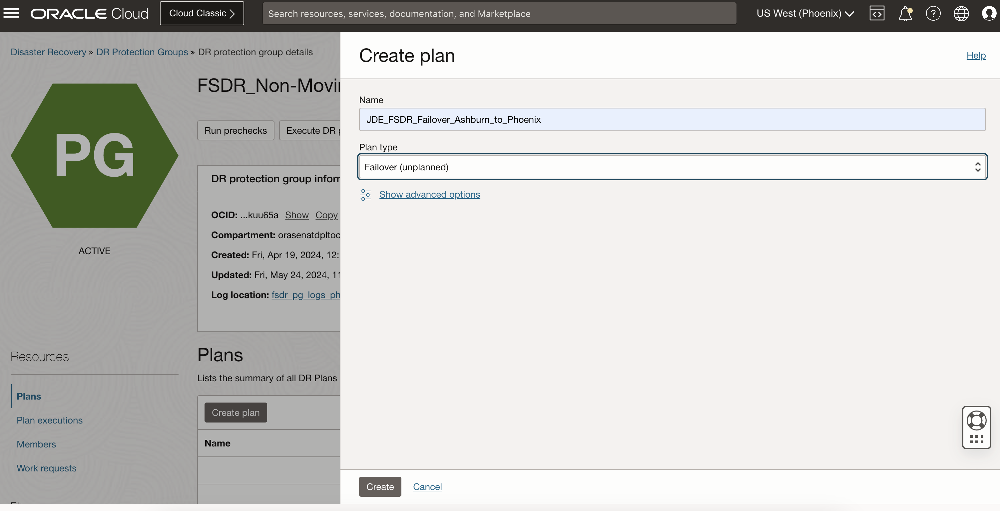
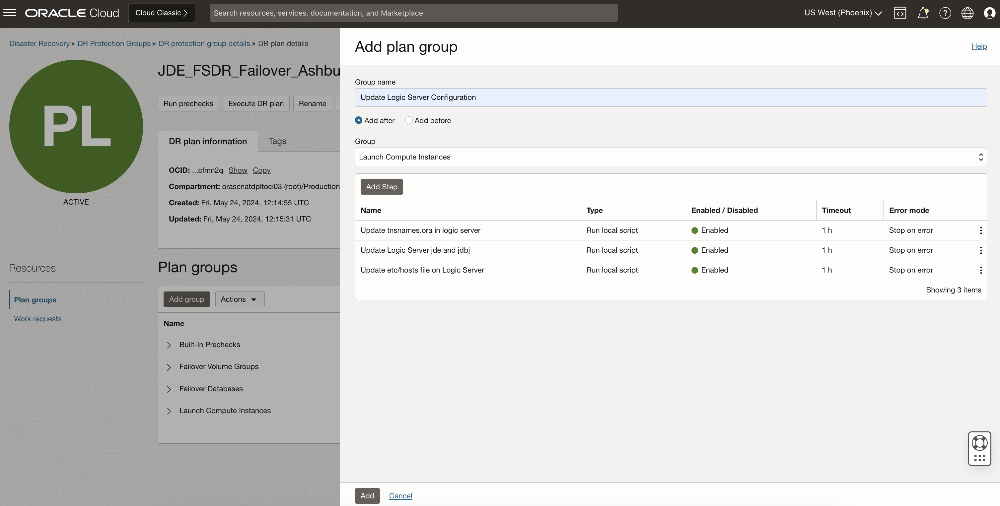
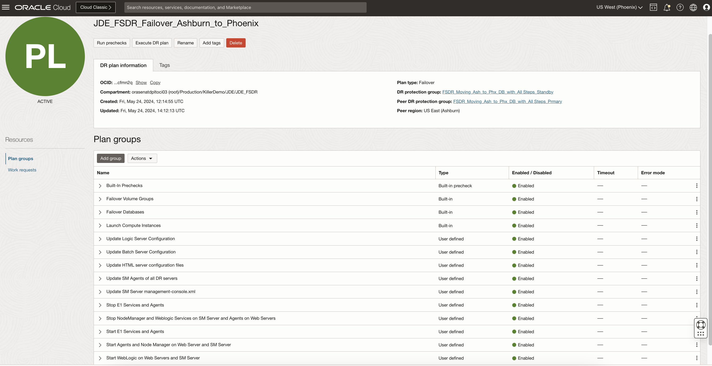

# Create and Customize the DR Failover Plan

## Introduction

In this lab, we will create a DR Failover plan and customize the plan with the additional steps. Ashburn is the primary region and Phoenix is the standby region.

**DR Plan *must* be created in the standby region (Phoenix)**. It is because, in the case of the worst-case scenario, the entire primary region might not be accessible from the outside world.

Estimated Time: 60 Minutes

### Objectives

- Create a Failover plan
- Customize the Failover plan - Update Logic Server Configuration
- Customize the Failover plan - Add updates for all other servers similar to Lab 1.2

## Task 1: Create a Failover plan

*Note:* Check if you have all the members present in the DRPG. If not, follow Lab 1.1 and add all the members to the DR Protection Groups before proceeding with the plan creation. 

1. Login into OCI Console. Select region as **Phoenix**.

   

2. Select Migration and Disaster Recovery from the Hamburger menu, then **Disaster Recovery** -> **DR Protection Groups**. Verify the region is **Phoenix**

    

3. You will land on the Disaster Recovery Protection group home page; make sure you have selected the Phoenix region. **DR Plans always be created in the Standby DRPG (Phoenix region)**

    

4. Select the **FSDR\_Moving\_Ash\_to\_Phx\_DB\_with\_All Steps\_Standby** DRPG and navigate to Plans under the resources section. Click on Create Plan.

  

  Provide a name for the Failover Plan.

  Select Plan type as **Failover (unplanned)**.

  

  Refresh the DR Plan page if required. You can monitor the request's status in the **Work requests** section under Resources. Within few minutes, the plan will get created, and it should be in *active* State.

  

  Select the **JDE\_FSDR\_Failover\_Ashburn\_to\_Phoenix** plan, and you should be able to see the built-in plan groups.

  

  Based on the members we added in both primary and standby DRPG, FSDR created these built-in plans.
  
  

  - **Built-in Prechecks** - These are the prechecks for the plan with all servers and database. Expand to see all steps and details.

  - **Failover Volume Groups** - Restore volume group failover.

  - **Failover Databases** - Database Failover to standby using dataguard.

  - **Launch Compute Instances** - Launch the compute instances at the standby region as a part of moving instance.

  *Note:* To create a DR Plan using CLI, please follow the link [Automate FSDR with CLI](https://docs.oracle.com/en/learn/full-stack-dr-oci-cli-command/#introduction)

## Task 2: Customize the Failover plan - Add a group to update Logic Server configuration

We need to add the custom update groups after the "**Launch Compute Instances**" pre-built group so that the scripts will run in the newly launched instances.

  1. Click on **Add group**.

    
      In "Add plan group" page, enter a suitable **Group name**

      Select the **Add after** button to add the group after a particular group.
      
      Select the **Group** after which you want to add this custom group.

      Click **Add step** to add the scripts parameters. 

    
      In "Add plan group step" page, enter a suitable **Step name**

      Select the **primary region** from the **Region** drop down to run the scripts in the standby after instance launch. *This is intentional as we do not have the instance available in the stand-by region for a movable instance setup*.

      Select the **Run local script** button.

      Select the logic server as **Target instance** from the drop down.

      Add below parameters in the **Script parameters**. This is based on where you have your script and the configuration file present.

      Enter the user with which you want to run the script in the **Run as user** field. 

      Select **Stop on error** on the **Error mode**

      Keep default 3600 as the **Timeout in seconds** and tick the **Enable step** option.

      Click **Add Step** to proceed. 

  2. Click **Add Step** to add another step in the group. 
    
    In "Add plan group step" page, enter a suitable **Step name**

      Select the **primary region** from the **Region** drop down to run the scripts in the standby after instance launch.

      Select the **Run local script** button.

      Select the logic server as **Target instance** from the drop down.

      Add below parameters in the **Script parameters**. This is based on where you have your script and the configuration file present. Refer to the Pre-requisites Setup section for details.

      Enter the user with which you want to run the script in the **Run as user** field.

      Select **Stop on error** on the **Error mode**

      Keep default 3600 as the **Timeout in seconds** and tick the **Enable step** option.

      Click **Add Step** to proceed.

  3. Click **Add Step** to add another step in the group. 
    
    In "Add plan group step" page, enter a suitable **Step name**

      Select the **primary region** from the **Region** drop down to run the scripts in the standby after instance launch.

      Select the **Run local script** button.

      Select the logic server as **Target instance** from the drop down.

      Add below parameters in the **Script parameters**. This is based on where you have your script and the configuration file present. Refer to the Pre-requisites Setup section for details.

      Enter the user with which you want to run the script in the **Run as user** field.

      Select **Stop on error** on the **Error mode**

      Keep default 3600 as the **Timeout in seconds** and tick the **Enable step** option.

      Click **Add Step** to proceed.

  4. Validate that all three steps are added and click **Add** to proceed.
  

## Task 3: Customize the Failover plan - Create the remaining groups and steps
  
  1. Create the same groups and steps for all other servers in the Failover Plan **JDE\_FSDR\_Failover\_Ashburn\_to\_Phoenix** following similar steps from Task-3 to task-11 in Lab 1.2.

  2. Validate that all the groups and steps are added in the plan following the tasks from lab 1.2

  
      
  You may now **proceed to the next lab**.

## Acknowledgements

- **Author:** Tarani Meher, Senior JDE Specialist
- **Last Updated By/Date:** Tarani Meher, Senior JDE Specialist, 03/2024