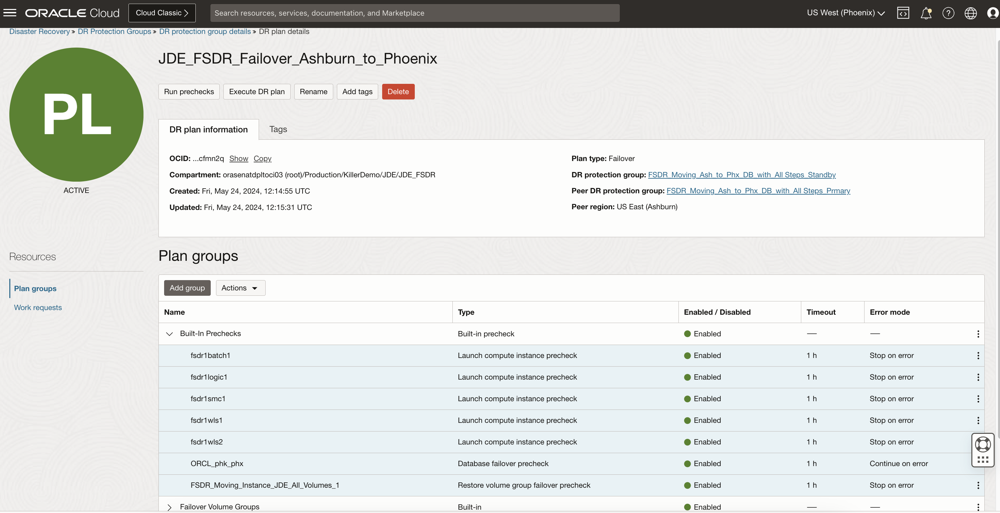

# Create and Customize the DR Failover Plan

## Introduction

In this lab, we will create a DR Failover plan and customize the plan with the additional steps. Ashburn is the primary region and Phoenix is the standby region. 

**DR Plan *must* be created in the standby region (Phoenix)**. It is because, in the case of the worst-case scenario, the entire primary region might not be accessible.

Estimated Time: 60 Minutes

### Objectives

- Create a Failover plan
- Customize the Failover plan

## Task 1: Create a Failover plan

*Note:* Check if you have the members present in the DRPG. If not, follow Lab 2.1 and add all the same members to the DR Protection Groups before proceeding with the failover plan creation.

1. Login into OCI Console. Select region as **Phoenix**.

   

2. Select Migration and Disaster Recovery from the Hamburger menu, then **Disaster Recovery** -> **DR Protection Groups**. Verify the region is **Phoenix**

    

3. You will land on the Disaster Recovery Protection group home page; make sure you have selected the Phoenix region. **DR Plans always be created in the Standby DRPG (Phoenix region)**

    

4. Select the **FSDR\_Non-Moving\_Ash\_to\_Phx\_DB\_with\_All Steps** DRPG and navigate to Plans under the resources section. Click on Create Plan.

  

  Provide a name for the Failover Plan.

  Select Plan type as **Failover (unplanned)**.

  

  Refresh the DR Plan page if required. You can monitor the request's status in the **Work requests** section under Resources. Within few minutes, the plan will get created, and it should be in *active* State.

  

  Select the **JDE\_FSDR\_Failover\_Ashburn\_to\_Phoenix** plan, and you should be able to see the built-in plan groups.

  

  Based on the members we added in both primary and standby DRPG, FSDR created these built-in plans.
  
  

  - **Built-in Prechecks** - These are the prechecks for the plan with all servers and database. Expand to see all steps and details.

  - **Failover Volume Groups** - Restore volume group failover.

  - **Failover Databases** - Database Failover to standby using dataguard.

  - **Launch Compute Instances** - Launch the compute instances at the standby region as a part of moving instance.

  *Note:* To create a DR Plan using CLI, please follow the link [Automate FSDR with CLI](https://docs.oracle.com/en/learn/full-stack-dr-oci-cli-command/#introduction)

## Task 2: Customize the Failover plan

  1. Follow Task 2 and Task 3 in Lab 2.2 and create the groups and steps similarly for this failover plan. 
      
You may now **proceed to the next lab**.

## Acknowledgements

- **Author:** Tarani Meher, Senior JDE Specialist
- **Last Updated By/Date:** Tarani Meher, Senior JDE Specialist, 03/2024