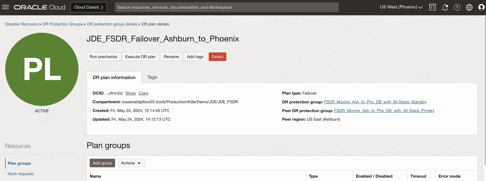
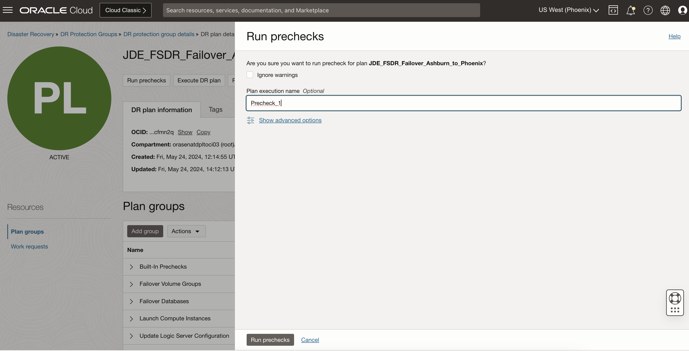
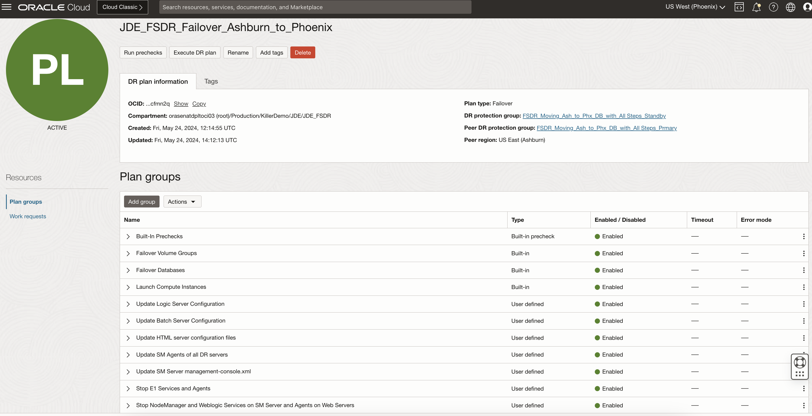

# Perform pre-checks for the DR Failover plan and Execute

## Introduction

In this lab, we will execute **Run Prechecks** for the **JDE\_FSDR\_Failover\_Ashburn\_to\_Phoenix** Failover plan, which we have created in earlier lab. We will also execute the Failover plan after successfully running the pre-check.

Execute **Run Prechecks**  will perform only the *pre-checks* and not the actual execution. Having the pre-checks completed successfully is essential as a pre-requisite for running the actual Failover plan.

Estimated Time: 25 Minutes

### Objectives

- Perform Run prechecks for the Failover plan
- Monitor the executed prechecks plan
- Verify JDE application status in Ashburn
- Execute the Failover Plan
- Monitor the executed Failover plan

## Task 1: Perform Run prechecks for the Failover plan

1. Login into OCI Console. Select region as **Phoenix**.

  

2. Select Migration and Disaster Recovery from the Hamburger menu, then **Disaster Recovery** -> **DR Protection Groups**. Verify the region is **Phoenix**

  

3. You will land on the Disaster Recovery Protection group home page; make sure you have selected the Phoenix region and the role of your DRPG is standby. 

  

4. Select the **FSDR\_Non-Moving\_Ash\_to\_Phx\_DB\_with\_All Steps** DRPG and select **JDE\_FSDR\_Failover\_Ashburn\_to\_Phoenix** plan

  

5. Click on **Run prechecks** section, which will be right below the **JDE\_FSDR\_Failover\_Ashburn\_to\_Phoenix** plan

  

6. In the **Run prechecks** window, provide the a plan execution name and hit **Run prechecks**

  

## Task 2: Monitor the executed prechecks plan

1. Navigate to **Plan executions** section under **Resources** and select the **JDE\_FSDR\_Failover\_Ashburn\_to\_Phoenix** plan execution.Initially, it will show all the **Built-in Prechecks** as *queued or in-progress*

  

2. After 2-3 mins, **Built-in Prechecks**  will be completed successfully. You can verify the duration of each step, status, duration of entire prechecks, etc. Note that it might fail if the primary instance is down as it will not be able to communicate.

      

## Task 3: Verify JDE application status in Ashburn
      
  As the JDE VMs are on private subnet, the links will not be directly accessible from public internet. You need to login to the bastion host on the Ashburn region and access the links. Or you can configure SSH tunneling via bastion host to access the links from your local machine. 

1. Login to JDE application and see if its successful. 

    

2. Run a sample report in JDE running in Ashburn region and make sure that its completed successfully running on the required server.

    

3. Login to the JDE Orchestrator and see if its successful.

     

## Task 4: Execute the Failover Plan

1. Login into OCI Console. Select region as **Phoenix**.
 
    

2. Select Migration and Disaster Recovery from the Hamburger menu, then **Disaster Recovery** -> **DR Protection Groups**. Verify the region is **Phoenix**

    

3. You will land on the Disaster Recovery Protection group home page; make sure you have selected the Phoenix region.

  

4. Select the **FSDR\_Non-Moving\_Ash\_to\_Phx\_DB\_with\_All Steps** DRPG and select plan **JDE\_FSDR\_Failover\_Ashburn\_to\_Phoenix**

  

5. Navigate to the **Execute DR plan** section, which will be right below the **JDE\_FSDR\_SwitchOver\_Ashburn\_to\_Phoenix** plan, and select

    

6. In the **Execute DR plan** window

- Provide a name for the Plan execution like **Execution_1**
- You can choose to uncheck the **Enable prechecks**  (Prechecks were executed successfully in earlier step)
- Leave the **Ignore warnings** as it is
- Verify and hit **Execute DR Plan**

    

## Task 5: Monitor the executed Failover plan

1. Navigate to **Plan executions** section under **Resources** and select the **JDE\_FSDR\_Failover\_Ashburn\_to\_Phoenix** plan execution. Initially, it will show all the **Built-in Prechecks** as *queued or in-progress*

  

2. After 2-3 mins, **Built-in Prechecks**  will be completed successfully. You can verify the duration of each step, status, duration of entire prechecks, etc. Note that it might fail if the primary instance is down as it will not be able to communicate.

      

   You may now **proceed to the next lab**.

## Acknowledgements

- **Author:** Tarani Meher, Principal Cloud Architect
- **Last Updated By/Date:** Tarani Meher, Principal Cloud Architect, 03/2024
