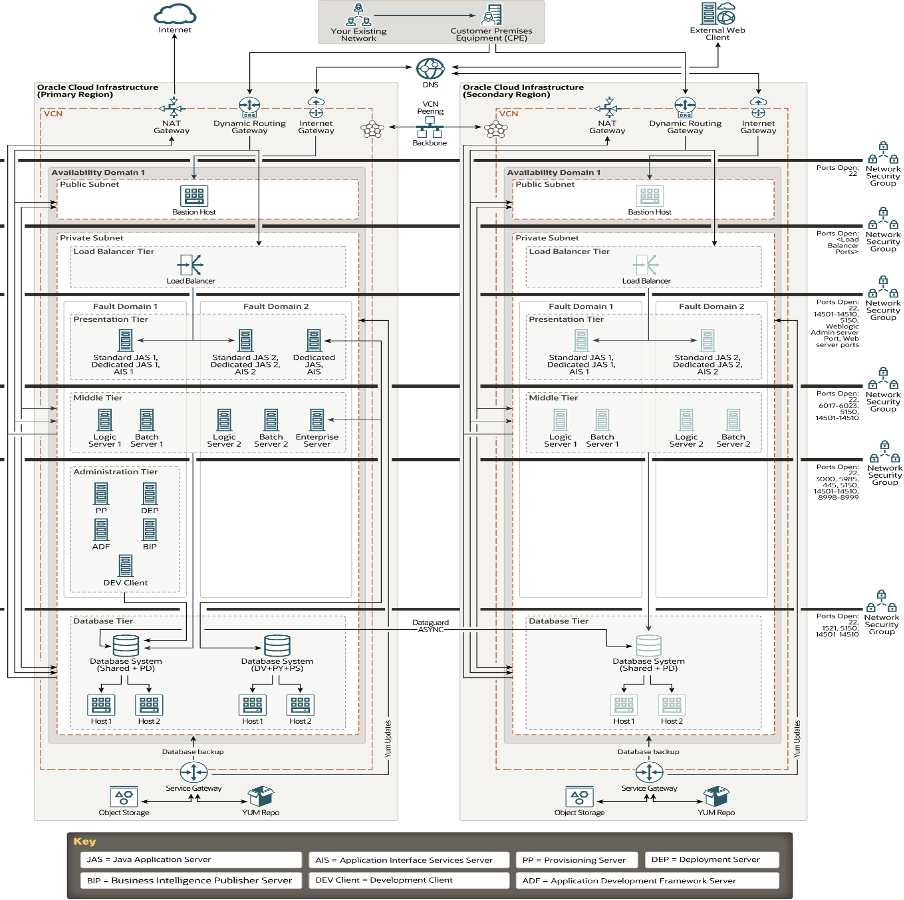

# Introduction
Protect your JD Edwards EnterpriseOne Application using Oracle Full Stack Disaster Recovery

## About this Workshop

This workshop will show how Full Stack DR can help to orchestrate DR Switchover and Failover operations for a JDE Application deployed in Oracle Cloud Infrastructure (OCI) across two regions using both Moving and Non-moving instance approach.

Moving and Non-moving instances are terminologies used with Full Sack DR for the Compute instances (VMs), and those VMs are deployed depending on the application and business requirements.
 
**Moving instances**- In general terminologies, moving instances are called Cold VM / Pilot light DR topology. Application VMs are deployed only in the Primary region. During DR runtime, VMs will be created at the standby region.
 
**Non-moving instances** - In general terminologies, non-moving instances are called a Warm Standby topology. Application VMs are deployed in both primary and standby regions.

Estimated Workshop Time: Approximately 6 hours

### Workshop Objectives

In this workshop, you will learn to leverage Full Stack DR and implement Disaster Recovery for JDEdwards EnterpriseOne.
* How to create a Movable Compute instance for cold VM DR or Pilot light setup.
* How to create a Non-Movable Compute instance for Hot Standby or Active/Passive setup. 
* How to Switchover and Test the JDE E1 application for a Planned DR Testing.
* How to Failover and test the JDE E1 application for an actual DR scenario.
* How to Rollback the JDE E1 application after a DR Switchover or Failover.

### Prerequisites

For Moving instance -
* An active copy of the Database at the standby region.
* DataGuard setup and enabled between the primary and stand-by Databases.
* Custom script to update configuration files in JDE Servers.
* Custom scripts to update hostnames in JDE Servers.
* Custom scripts to start and stop JDE Application Server, Web Server and Management Agents.
* A backup of the tnsnames.ora, JDE.INI and jdbj.ini files in the primary instances with the standby database and VCN details.
* A backup of the agent.properties file in the Server Manager VM with the standby VCN details.
* Basic understanding of JDE Administration is required. 
* Basic understanding of OCI Networking is expected. 

For Non-Moving instance -
* An active JDE Setup installed using JDE One-Click Provisioning with Disaster Recovery.
* DataGuard setup and enabled between the primary and stand-by Databases.
* Custom script to update configuration files in JDE Servers.
* Custom scripts to update hostnames in JDE Servers.
* Custom scripts to start and stop JDE Application Server, Web Server and Management Agents.
* A backup of the tnsnames.ora, JDE.INI and jdbj.ini files in the primary instances with the standby database and VCN details. 
* A backup of the agent.properties file in the Server Manager VM with the standby VCN details.
* Basic understanding of JDE Administration is required. 
* Basic understanding of OCI Networking is expected. 

## Overview of OCI Full Stack Disaster Recovery
Full Stack DR is an Oracle Cloud Infrastructure (OCI) disaster recovery orchestration and management service that provides comprehensive disaster recovery capabilities for all layers of an application stack, including infrastructure, middleware, database and application.

* Full Stack Disaster Recovery assures comprehensive business continuity from a variety of data centre outages. Using a Disaster Recovery Service for disaster recovery ensures that organizations are minimally impacted if there is a region-wide outage or Availability Domain outage.
* Full Stack Disaster Recovery provides fully automated, end-to-end disaster recovery for the entire Oracle stack, including the infrastructure, databases, engineered systems, virtual infrastructure, storage, and full-stack applications in OCI. It integrates with underlying replication mechanisms that synchronize primary and standby environments and protects mission-critical data.
* Full Stack Disaster Recovery is flexible and integrates with various Oracle platforms and non-Oracle applications and infrastructure. It generates, runs, and monitors disaster recovery plans for services and applications deployed in your tenancy. Disaster recovery operations are at the service level, so there is no impact on running other services in your tenancy. You can customize the disaster recovery plans generated by Full Stack Disaster Recovery based on your specific needs.
* You can actively monitor the progress of Full Stack DR operations and take corrective actions if there are errors during an operation.
* You can also validate and monitor business continuity readiness and compliance by periodically running Full Stack DR Prechecks.

Full Stack Disaster Recovery Service currently supports disaster recovery for the following OCI resource types:
* Compute Instances
* Boot and Block Volumes (Volume Groups)
* Oracle Exadata Database Service
* Oracle Enterprise Database Service
* Oracle Autonomous Database on Shared Exadata Infrastructure
* OCI Load Balancer
* OCI Network Load Balancer
* OCI File Storage

Below are some of the critical functionalities of Full Stack Disaster Recovery Service
* Create and automate DR run books and make them more flexible.
* Manage DR operations (Switchover and Failover) using a single pane of glass.
* Provide comprehensive logs with error management and recovery.
* Perform pre-checks before the DR execution plan.
* Provide a framework to customize DR operations.

## Benefits of OCI Full Stack Disaster Recovery

Full Stack Disaster Recovery provides multiple benefits in the area of business continuity.
* Provides comprehensive disaster protection for the entire Application( Oracle/Non-Oracle) stack, including databases, Compute Instances, attached block volumes and applications across different OCI regions.
* Minimizes Recovery Time Objectives (RTO).
* Automates disaster recovery operations.
* Eliminates the need for domain specialists and dedicated administrators for disaster recovery.
* Provides highly flexible and customized disaster recovery plans. You can integrate your custom automation into the DR workflow.
* Provides a comprehensive dashboard for monitoring disaster recovery readiness and launching DR workflows.
* Executes scalable and reliable complete stack switchover and failover operations with a button.
* Operates at the service level instead of requiring the customer to manually failover VMs, databases, middleware, applications, storage, and load balancers.

## JDE E1 Architecture with Disaster Recovery

Below is the architecture of JD Edwards EnterpriseOne environment running on Oracle Cloud Infrastructure(OCI) which will be used in this workshop.

- **Ashburn** is the Primary region and **Phoenix** is the Standby region.
* **JD Edwards E1 Application Release** - 9.2 Release 23
* **Tools Release** - 9.2.7.3
* **Database** - Oracle 19.19.0.0.0
* **Oracle WebLogic Server** - 14.1.1.0.0

## Before You Begin

* It is highly recommended that you review the extensive collateral information at the below mentioned sites:
    * [Oracle Cloud Infrastructure](https://www.oracle.com/cloud/)
    * [LearnJDE](https://docs.oracle.com/cd/E84502_01/learnjde/cloud_overview.html)
    * [Full Stack DR Overview](https://docs.oracle.com/en-us/iaas/disaster-recovery/index.html)

## Disclaimer

The following is intended to outline our general product direction. It is intended for information purposes only and may not be incorporated into any contract. It is not a commitment to deliver any material, code, or functionality, and should not be relied upon in making purchasing decisions. The development, release, and timing of any features or functionality described for Oracle’s products remains at the sole discretion of Oracle.

## Acknowledgements

* **Author:** Tarani Meher, Principal Cloud Architect
* **Last Updated By/Date:** Tarani Meher, Principal Cloud Architect, May-2024
