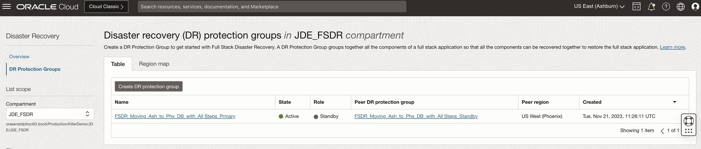
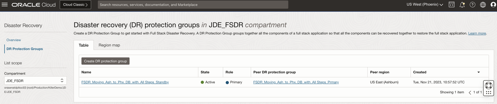

# Verify the DR Protection group status and JDE Application post failover

## Introduction

We will verify the DR Protection Group (DRPG) status and JDE Application post failover.

Estimated Time: 15 Minutes

### Objectives

- Verify the DRPG status
- Access the JDE Application from the phoenix region
- Verify DNS domain record and JDE Process Instances

## Task 1: Verify the DRPG status

1. Go to the **DR Protection Groups** page for both primary and standby regions, notice that the *Role* of DRPG at Ashburn has changed to *standby*, and the new *primary* region is Phoenix. 

  

  

## Task 2: Access the Server Manager from Phoenix region

1. Open the link to the WebLogic Admin Console for the Server Manager at the standby region. The links are only accessible from public internet via SSH tunneling using the bastion host, please configure the same before accessing the links.
  
     

  Start the SMC Management Console from the WebLogic server, then open the link for the Server Manager console. 

     

## Task 3: Verify login to JDE application from Phoenix region

1. Access the JDE application from the browser after doing the required changes for bastion host tunnelling. You should be able to see that the application is working as expected from the Phoenix region.

      
     **JDE is now accessible from the new primary region (Phoenix)**

2. Enter the JDE credentials and validate the login is successful, submit a report to validate the batch server is running fine.

     

     

3. Open the link for the Orchestrator Studio and make sure its accessible. 

     

We have now achieved the switching over of the JDE application and Database from Ashburn region to Phoenix region using Full Stack DR.

## Acknowledgements

- **Author** -  Vinay Shivanna, Principal Cloud Architect
- **Last Updated By/Date** -  Vinay Shivanna, Principal Cloud Architect, April 2023
