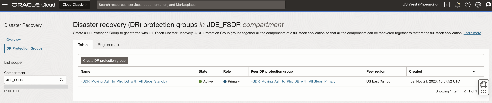
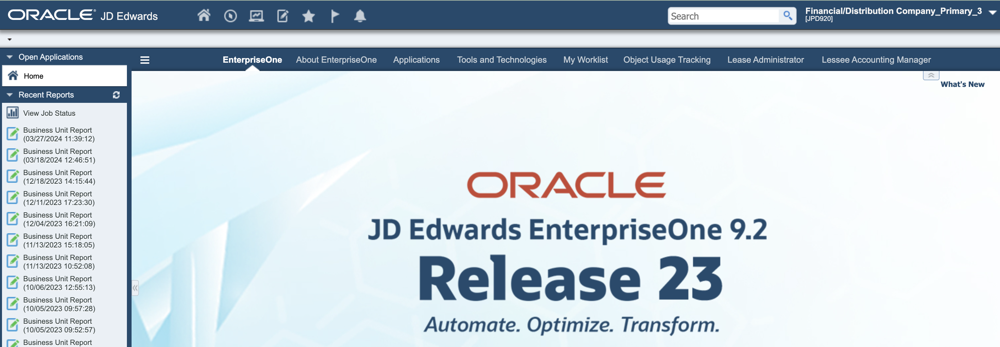

# Verify the DR Protection group status and JDE application post Switchover

## Introduction

We will verify the DR Protection Group (DRPG) status and JDE application post switchover.

Estimated Time: 15 Minutes

### Objectives

- Verify the DRPG status
- Access the Server Manager from Phoenix region
- Verify login to JDE application from Phoenix region

## Task 1: Verify the DRPG status

1. Go to the **DR Protection Groups** page for both primary and standby regions, notice that the *Role* of DRPG at Ashburn has changed to *standby*, and the new *primary* region is Phoenix. 

  

  

## Task 2: Access the Server Manager from Phoenix region

1. Open the link to the WebLogic Admin Console for the Server Manager at the standby region. The links are only accessible from public internet via SSH tunneling using the bastion host, please configure the same before accessing the links.
  
     

  Start the SMC Management Console from the WebLogic server, then open the link for the Server Manager console. 

     

## Task 3: Verify login to JDE application from Phoenix region

1. Access the JDE application from the browser after doing the required changes for bastion host tunnelling. You should be able to see that the application is working as expected from the Phoenix region.

      
     **JDE is now accessible from the new primary region (Phoenix)**

2. Enter the JDE credentials and validate the login is successful, submit a report to validate the batch server is running fine.

     

     

3. Open the link for the Orchestrator Studio and make sure its accessible. 

     

We have now achieved the switching over of the JDE application (Full Stack) from Ashburn region to Phoenix region with using FSDR Moving Instance approach.

*Note:* For rolling back to the Ashburn region after the DR situation is over, setup the pre-requisites in the current primary region (Phoenix) following the Pre-requisite Setup section and then execute the tasks in Lab 1 to 1.5 considering Phoenix as primary and Ashburn as the standby.

You may now **proceed to the next lab** for the Non-Moving instance approach.

## Acknowledgements

* **Author:** Tarani Meher, Principal Cloud Architect
* **Last Updated By/Date:** Tarani Meher, Principal Cloud Architect, May-2024
