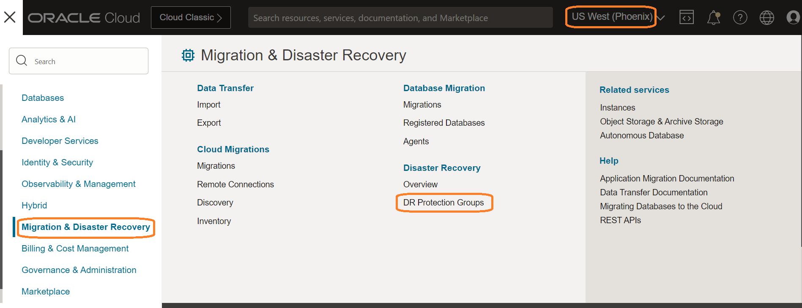
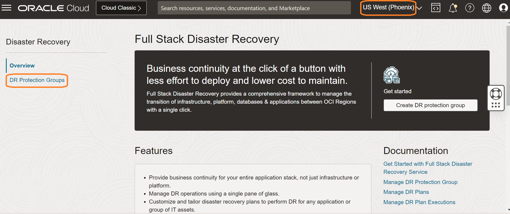
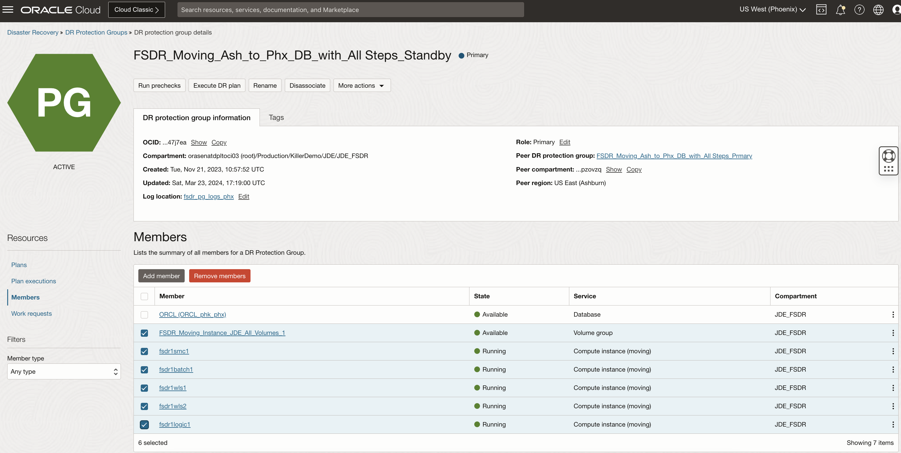
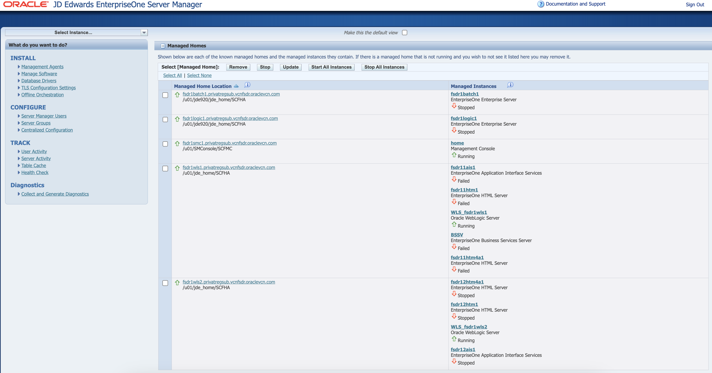
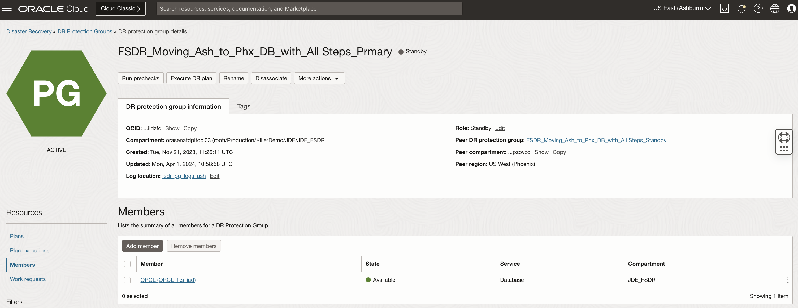
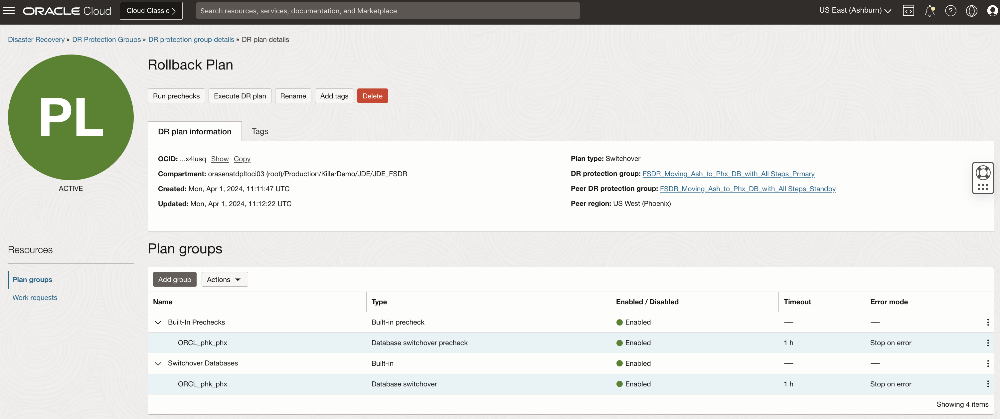
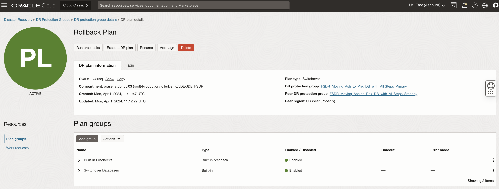
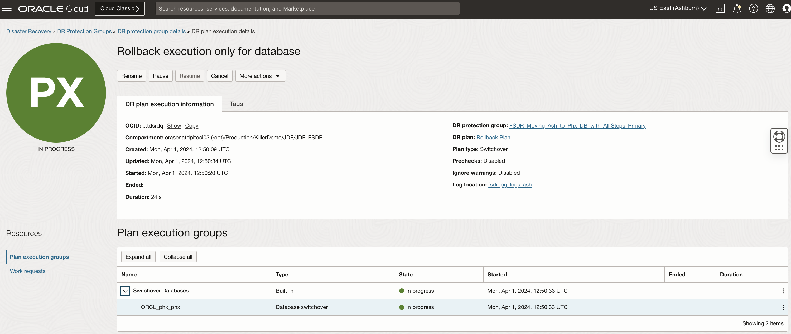
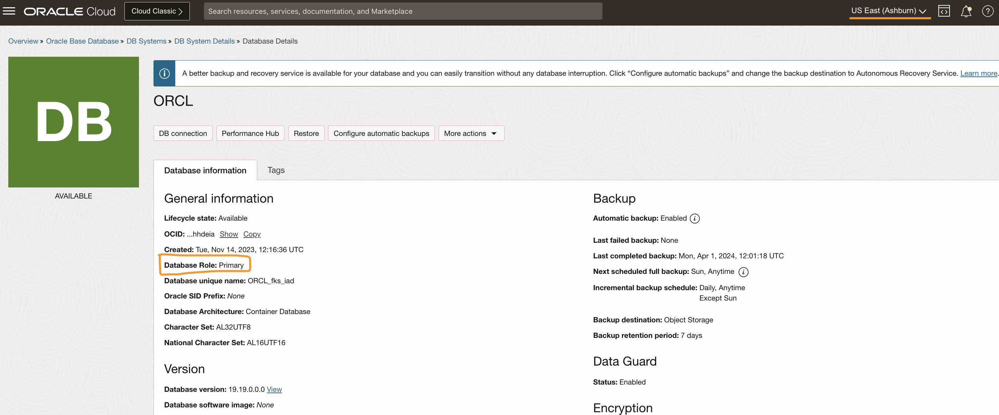
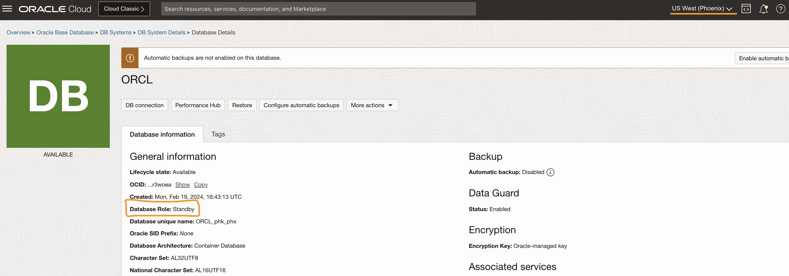

# Create a DR Switchover Plan (Rollback) from Phoenix to Ashburn region

## Introduction

In our previous lab, we have switched over JDE application from *Ashburn* to *Phoenix* region.

In this lab, we will create a DR Switchover (Rollback) plan (from *Phoenix* to *Ashburn*) once the primary region is up and ready. We just need to switchover the database server using DataGuard and use all other JDE servers from the Ashburn region itself. Standby is created for business continuity during DR where we are not doing any application/tools upgrade or patching that needs to be switched back to the primary region. Any local files saved in the standby JDE servers will be lost, all the required JDE data are present in the database. 
Please note that *Phoenix* is the primary region and *Ashburn* is the standby region as of now.  

**DR Plan *must* be created in the standby region (Ashburn)**. 

Estimated Time: 20 Minutes

### Objectives

- Prepare DRPG for Database Rollback
- Prepare primary and standby servers for the rollback
- Create the default Switchover plan
- Run Precheck for the Rollback plan from Ashburn region
- Execute Switchover for the Rollback plan from Ashburn region

## Task 1: Prepare DRPG for Database Rollback

1. Login into OCI Console. Select region as **Phoenix**.

   

2. Select Migration and Disaster Recovery from the Hamburger menu, then **Disaster Recovery** -> **DR Protection Groups**. Verify the region is **Phoenix**

    

3. You will land on the Disaster Recovery Protection group home page; make sure you have selected the Phoenix region. **DR Plans always be created in the Standby DRPG (Phoenix region)**

    

4. Select the **FSDR\_Moving\_Ash\_to\_Phx\_DB\_with\_All Steps\_Standby** DRPG and navigate to Members under Resources. 

    

5. Remove all the members keeping only database in the Phoenix region. Validate that the database is only there as a member. 

    

## Task 2: Prepare primary and standby servers for the rollback

1. Make sure that the JDE applications (all web servers and enterprise servers) at the Phoenix region (current primary) are down to have a clean rollback of the database. 
    
    

2. Validate the JDE server on the ashburn region (current standby) are available and in stopped status.  

    

3. Clear the logs from all the JDE servers at Ashburn region and make sure sufficient space is available.

## Task 3: Create the default Switchover plan
    
1. Change the region to Ashburn in OCI Console and go to the DRPG **FSDR\_Moving\_Ash\_to\_Phx\_DB\_with\_All Steps\_Standby**. 
   Validate that the Ashburn region also has only the database as its member. 

    

2. Go to Plans and click on **Create plan** button. 

    

3. Select the newly created DR plan and see that it has created the default switchover steps for the database. 

    

    

## Task 4: Run Precheck for the Rollback plan from Ashburn region

As part of this task, we will only switchover the Database from Phoenix back to Ashburn as we already have our JDE servers available after the disaster period is over. 

1. Perform pre-check for the new default plan from the plan details page. Click the **Run prechecks** available beside the plan status. 

    

2. Provide a suitable name to the precheck execution and click **Run prechecks**. Leave the Ignore warnings option unselected. 

    

3. Check the precheck is completed successfully without any error. 

    

## Task 5: Execute Switchover for the Rollback plan from Ashburn region

1. Go back to 'DR protection group details' page and then to 'Plan executions' under 'Resources'. 

    

2. Click the **Execute DR plan** button to start the switchover. The status of the plan will set to ACTIVE then it will move to IN PROGRESS in few seconds. 

    

3. Check that the plan execution completed successfully. 

    

4. Validate that the database role for the Ashburn region database is changed to Primary and the phoenix region's database role is standby.

    
     

   You may now **proceed to the next lab**.

## Acknowledgements

- **Author:** Tarani Meher, Senior JDE Specialist
- **Last Updated By/Date:** Tarani Meher, Senior JDE Specialist, 02/2024
