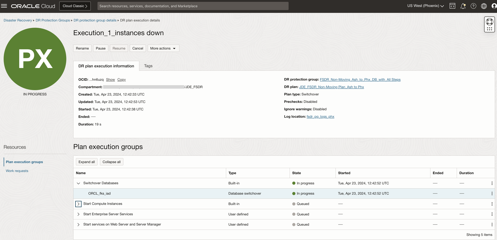

# Execute DR Switchover Plan

## Introduction

In this lab, we will execute the actual switchover plan **FSDR\_Non-Moving\_Ash\_to\_Phx\_DB\_with\_All Steps**. The switchover plan will execute the series of steps as per the order.

Estimated Time: 20 Minutes

### Objectives

- Verify JDE application status in Ashburn
- Execute the switchover plan
- Monitor the executed switchover plan

## Task 1: Verify JDE application status in Ashburn

As the JDE VMs are on private subnet, the links will not be directly accessible from public internet. You need to login to the bastion host on the Ashburn region and access the links. Or you can configure SSH tunneling via bastion host to access the links from your local machine. 

1. Login to JDE application and see if its successful. 

    

2. Run a sample report in JDE running in Ashburn region and make sure that its completed successfully running on the required server.

    

3. Login to the JDE Orchestrator and see if its successful.

     

## Task 2: Execute the switchover plan

1. Login into OCI Console. Select region as **Phoenix**.
 
    

2. Select Migration and Disaster Recovery from the Hamburger menu and go to the DR Protection groups. Select the **FSDR\_Non-Moving\_Ash\_to\_Phx\_DB\_with\_All Steps** DRPG and select plan **JDE\_FSDR\_Non-Moving Plan\_Ash to Phx**

  

3. Navigate to and click the **Execute DR plan** section, which will be right below the **JDE\_FSDR\_Non-Moving Plan\_Ash to Phx** plan. 

    

    In the **Execute DR plan** window

    - Provide a suitable name for the plan execution.
    - You can choose to uncheck the **Enable prechecks**
    - Leave the **Ignore warnings** as it is
    - Verify and hit **Execute DR Plan**

## Task 3: Monitor the executed switchover Plan

1. Navigate to **Plan executions** section under **Resources** and select execution plan **Execution\_1\_instances down**. Initially, it will show all the steps as *Queued*.

    

  Refresh the page; within a few seconds, the **State** will change from *Queued* to *In Progress*.

    

2. All the *plan groups* will run serially, but steps inside each *plan group* will be parallel. Monitor the various plan group and steps which are running. Navigate to the three dots section for the respective plan group step and click. You can view or download the log. If the step is in *Failed* status, you will have the option to **Retry** or **Skip** the step to proceed with other steps.

     

3. Keep monitoring the rest of the groups and steps; each step will complete depending on the actual task and you should see a SUCCESS status for the execution plan. Few groups where you have skipped or ignored any step will show as *Partially Succeeded*. 

    You may now **proceed to the next lab**.

## Acknowledgements

* **Author:** Tarani Meher, Principal Cloud Architect
* **Last Updated By/Date:** Tarani Meher, Principal Cloud Architect, May-2024

