# Create and Customize the DR Switchover Plan

## Introduction

In this lab, we will create a DR Switchover plan and customize the plan with the additional steps. Ashburn is the primary region and Phoenix is the standby region. FSDR provides two types of plan

- Switchover (Maintenance/Planned Disaster Recovery)
- Failover   (Actual Disaster Recovery/Unplanned)
- Start drill (Validating DR affectiveness by creating a replica)
- Stop drill (Removing the replica created by start drill)

This lab will focus on how to create a Switchover plan and customize the plan as per the JDE application requirements. 

**DR Plan *must* be created in the standby region (Phoenix)**. It is because, in the case of the worst-case scenario, the entire primary region outside the FSDR will not be accessible from the primary region.

Estimated Time: 180 Minutes

### Objectives

- Create a Switchover plan
- Customize the Switchover plan - Update Logic Server Configuration
- Customize the Switchover plan - Update Batch Server Configuration
- Customize the Switchover plan - Update HTML server configuration files
- Customize the Switchover plan - Update SM Agents of all DR servers
- Customize the Switchover plan - Update SM Server management-console.xml
- Customize the Switchover plan - Stop E1 Services and Agents
- Customize the Switchover plan - Stop NodeManager and WebLogic Services on SM Server and Agents on Web Servers
- Customize the Switchover plan - Start E1 Services and Agents
- Customize the Switchover plan - Start Agents and Node Manager on Web Server and SM Server
- Customize the Switchover plan - Start WebLogic on Web Servers and SM Server

## Task 1: Create a Switchover plan

1. Login into OCI Console. Select region as **Phoenix**.

   

2. Select Migration and Disaster Recovery from the Hamburger menu, then **Disaster Recovery** -> **DR Protection Groups**. Verify the region is **Phoenix**

    

3. You will land on the Disaster Recovery Protection group home page; make sure you have selected the Phoenix region. **DR Plans always be created in the Standby DRPG (Phoenix region)**

    

4. Select the **FSDR\_Moving\_Ash\_to\_Phx\_DB\_with\_All Steps\_Standby** DRPG and navigate to Plans under the resources section. Click on Create Plan.

  

  Provide a name for the Switchover Plan.

  Select Plan type as **Switchover (planned)**.

  

  Refresh the DR Plan page if required. You can monitor the request's status in the **Work requests** section under Resources. Within few minutes, the plan will get created, and it should be in *active* State.

  

  Select the **JDE\_FSDR\_Switchover\_Ashburn\_to\_Phoenix** plan, and you should be able to see the built-in plan groups.

  

  Based on the members we added in both primary and standby DRPG, FSDR created these built-in plans.
  
  

  - **Built-in Prechecks** - These are the prechecks for the plan with all servers and database. Expand to see all steps and details.

  - **Stop Compute Instances** - Stopping all the instances in the primary as a part of moving instance.

  - **Switchover Volume Groups** - Restore volume group switchover.

  - **Switchover Databases** - Database switchover to standby using dataguard.

  - **Launch Compute Instances** - Launch the compute instances at the standby region as a part of moving instance.

  - **Reverse Volume Groups' Replication** - Reverse volume group.

  - **Terminate Compute Instances** - Terminate compute instances at primary, this is disabled by default.

  - **Remove Compute Instances from DR Protection Group** - Remove Compute Instances from DR Protection Group.

  - **Terminate Compute Instances** - Terminate compute instances at primary, this is disabled by default.

  - **Terminate Volume Groups** - Terminate volume group.

  - **StepsRemove Volume Groups from DR Protection Group** - StepsRemove Volume Groups from DR Protection Group.

  *Note:* To create a DR Plan using CLI, please follow the link [Automate FSDR with CLI](https://docs.oracle.com/en/learn/full-stack-dr-oci-cli-command/#introduction)

## Task 2: Customize the Switchover plan - Add a group to update Logic Server configuration

We need to add the custom update groups after the "**Launch Compute Instances**" pre-built group so that the scripts will run in the newly launched instances.

  1. Click on **Add group**.

    
      In "Add plan group" page, enter a suitable **Group name**

      Select the **Add after** button to add the group after a particular group.
      
      Select the **Group** after which you want to add this custom group.

      Click **Add step** to add the scripts parameters. 

    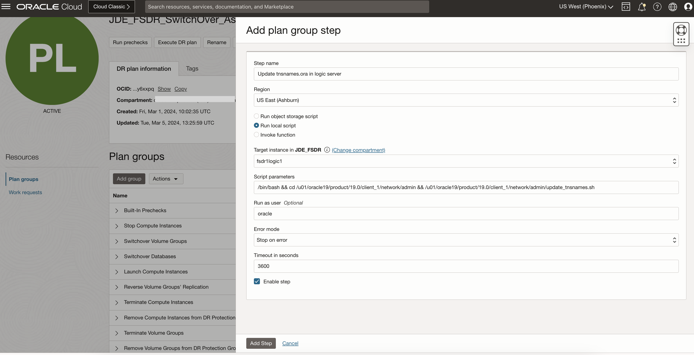
      In "Add plan group step" page, enter a suitable **Step name**

      Select the **primary region** from the **Region** drop down to run the scripts in the standby after instance launch. *This is intentional as we do not have the instance available in the stand-by region for a movable instance setup*.

      Select the **Run local script** button.

      Select the logic server as **Target instance** from the drop down.

      Add below parameters in the **Script parameters**. This is based on where you have your script and the configuration file present.

      Enter the user with which you want to run the script in the **Run as user** field. 

      Select **Stop on error** on the **Error mode**

      Keep default 3600 as the **Timeout in seconds** and tick the **Enable step** option.

      Click **Add Step** to proceed. 

  2. Click **Add Step** to add another step in the group. 
    
    In "Add plan group step" page, enter a suitable **Step name**

      Select the **primary region** from the **Region** drop down to run the scripts in the standby after instance launch.

      Select the **Run local script** button.

      Select the logic server as **Target instance** from the drop down.

      Add below parameters in the **Script parameters**. This is based on where you have your script and the configuration file present. Refer to the Pre-requisites Setup section for details.

      Enter the user with which you want to run the script in the **Run as user** field.

      Select **Stop on error** on the **Error mode**

      Keep default 3600 as the **Timeout in seconds** and tick the **Enable step** option.

      Click **Add Step** to proceed.

  3. Click **Add Step** to add another step in the group. 
    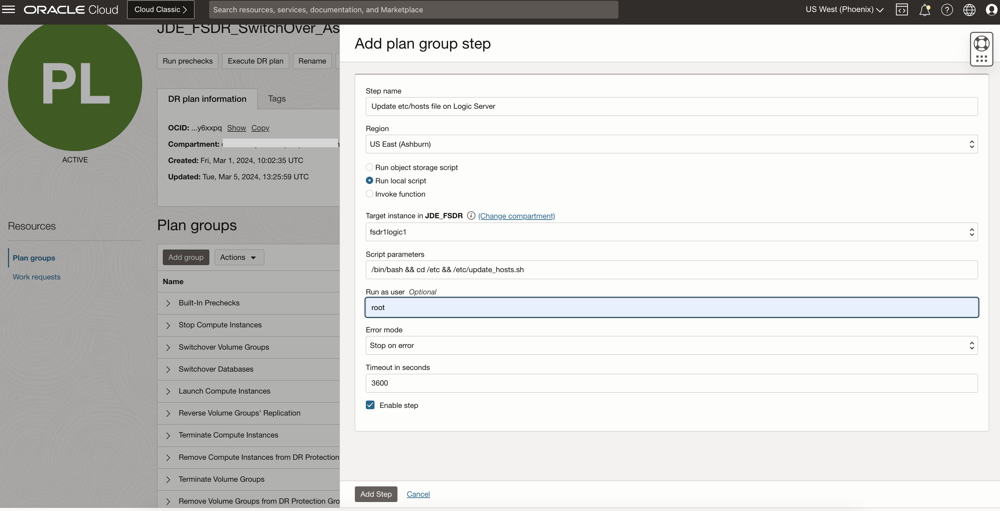
    In "Add plan group step" page, enter a suitable **Step name**

      Select the **primary region** from the **Region** drop down to run the scripts in the standby after instance launch.

      Select the **Run local script** button.

      Select the logic server as **Target instance** from the drop down.

      Add below parameters in the **Script parameters**. This is based on where you have your script and the configuration file present. Refer to the Pre-requisites Setup section for details.

      Enter the user with which you want to run the script in the **Run as user** field.

      Select **Stop on error** on the **Error mode**

      Keep default 3600 as the **Timeout in seconds** and tick the **Enable step** option.

      Click **Add Step** to proceed.

  4. Validate that all three steps are added and click **Add** to proceed.
  

## Task 3: Customize the Switchover plan - Add a group to update Batch Server configuration

Add this custom update group after the "**Update Logic Server Configuration**" group to maintain a sequence.

  1. Click on **Add group**.

    
      In "Add plan group" page, enter a suitable **Group name**

      Select the **Add after** button to add the group after a particular group.
      
      Select the **Group** after which you want to add this custom group.

      Click **Add step** to add the scripts parameters. 

    
      In "Add plan group step" page, enter a suitable **Step name**

      Select the **primary region** from the **Region** drop down to run the scripts in the standby after instance launch.

      Select the **Run local script** button.

      Select the logic server as **Target instance** from the drop down.

      Add below parameters in the **Script parameters**. This is based on where you have your script and the configuration file present.

      Enter the user with which you want to run the script in the **Run as user** field. 

      Select **Stop on error** on the **Error mode**

      Keep default 3600 as the **Timeout in seconds** and tick the **Enable step** option.

      Click **Add Step** to proceed. 

  2. Click **Add Step** to add another step in the group. 
    
    In "Add plan group step" page, enter a suitable **Step name**

      Select the **primary region** from the **Region** drop down to run the scripts in the standby after instance launch.

      Select the **Run local script** button.

      Select the logic server as **Target instance** from the drop down.

      Add below parameters in the **Script parameters**. This is based on where you have your script and the configuration file present. Refer to the Pre-requisites Setup section for details.

      Enter the user with which you want to run the script in the **Run as user** field.

      Select **Stop on error** on the **Error mode**

      Keep default 3600 as the **Timeout in seconds** and tick the **Enable step** option.

      Click **Add Step** to proceed.

  3. Click **Add Step** to add another step in the group. 
    
    In "Add plan group step" page, enter a suitable **Step name**

      Select the **primary region** from the **Region** drop down to run the scripts in the standby after instance launch.

      Select the **Run local script** button.

      Select the batch server as **Target instance** from the drop down.

      Add below parameters in the **Script parameters**. This is based on where you have your script and the configuration file present. Refer to the Pre-requisites Setup section for details.

      Enter the user with which you want to run the script in the **Run as user** field.

      Select **Stop on error** on the **Error mode**

      Keep default 3600 as the **Timeout in seconds** and tick the **Enable step** option.

      Click **Add Step** to proceed.

  4. Validate that all three steps are added and click **Add** to proceed.
  

## Task 4: Customize the Switchover plan - Add a group to update HTML Server configuration files

Add this custom update group after the "**Update Batch Server Configuration**" group to maintain a sequence.

  1. Click on **Add group**.

    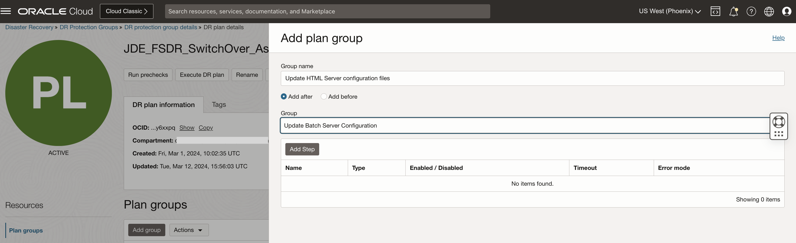
      In "Add plan group" page, enter a suitable **Group name**

      Select the **Add after** button to add the group after a particular group.
      
      Select the **Group** after which you want to add this custom group.

      Click **Add step** to add the scripts parameters. 

    
      In "Add plan group step" page, enter a suitable **Step name**

      Select the **primary region** from the **Region** drop down to run the scripts in the standby after instance launch.

      Select the **Run local script** button.

      Select the wls1 server as **Target instance** from the drop down.

      Add below parameters in the **Script parameters**. This is based on where you have your script and the configuration file present.

      Enter the user with which you want to run the script in the **Run as user** field. 

      Select **Stop on error** on the **Error mode**

      Keep default 3600 as the **Timeout in seconds** and tick the **Enable step** option.

      Click **Add Step** to proceed. 

  2. Click **Add Step** to add another step in the group. 
    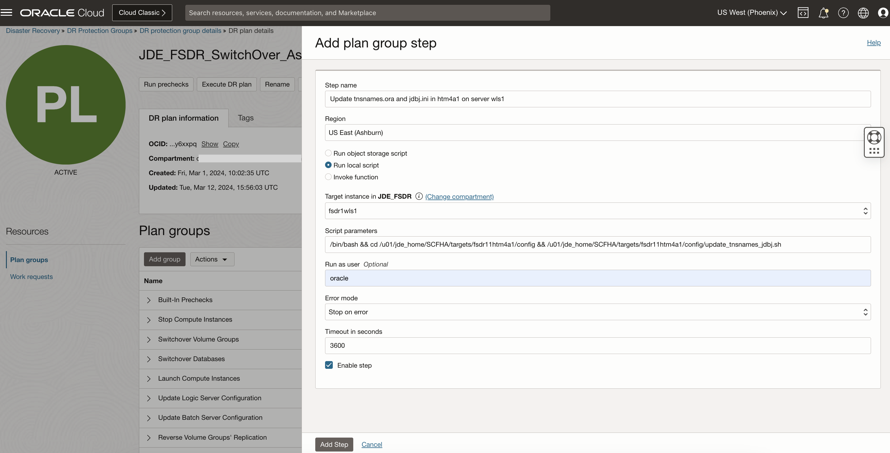
    In "Add plan group step" page, enter a suitable **Step name**

      Select the **primary region** from the **Region** drop down to run the scripts in the standby after instance launch.

      Select the **Run local script** button.

      Select the wls1 server as **Target instance** from the drop down.

      Add below parameters in the **Script parameters**. This is based on where you have your script and the configuration file present. Refer to the Pre-requisites Setup section for details.

      Enter the user with which you want to run the script in the **Run as user** field.

      Select **Stop on error** on the **Error mode**

      Keep default 3600 as the **Timeout in seconds** and tick the **Enable step** option.

      Click **Add Step** to proceed.

  3. Click **Add Step** to add another step in the group. 
    
    In "Add plan group step" page, enter a suitable **Step name**

      Select the **primary region** from the **Region** drop down to run the scripts in the standby after instance launch.

      Select the **Run local script** button.

      Select the wls2 server as **Target instance** from the drop down.

      Add below parameters in the **Script parameters**. This is based on where you have your script and the configuration file present. Refer to the Pre-requisites Setup section for details.

      Enter the user with which you want to run the script in the **Run as user** field.

      Select **Stop on error** on the **Error mode**

      Keep default 3600 as the **Timeout in seconds** and tick the **Enable step** option.

      Click **Add Step** to proceed.

  4. Click **Add Step** to add another step in the group. 
    
    In "Add plan group step" page, enter a suitable **Step name**

      Select the **primary region** from the **Region** drop down to run the scripts in the standby after instance launch.

      Select the **Run local script** button.

      Select the wls2 server as **Target instance** from the drop down.

      Add below parameters in the **Script parameters**. This is based on where you have your script and the configuration file present. Refer to the Pre-requisites Setup section for details.

      Enter the user with which you want to run the script in the **Run as user** field.

      Select **Stop on error** on the **Error mode**

      Keep default 3600 as the **Timeout in seconds** and tick the **Enable step** option.

      Click **Add Step** to proceed.

  5. Click **Add Step** to add another step in the group. 
    
    In "Add plan group step" page, enter a suitable **Step name**

      Select the **primary region** from the **Region** drop down to run the scripts in the standby after instance launch.

      Select the **Run local script** button.

      Select the wls1 server as **Target instance** from the drop down.

      Add below parameters in the **Script parameters**. This is based on where you have your script and the configuration file present. Refer to the Pre-requisites Setup section for details.

      Enter the user with which you want to run the script in the **Run as user** field.

      Select **Stop on error** on the **Error mode**

      Keep default 3600 as the **Timeout in seconds** and tick the **Enable step** option.

      Click **Add Step** to proceed.

  6. Click **Add Step** to add another step in the group. 
    
    In "Add plan group step" page, enter a suitable **Step name**

      Select the **primary region** from the **Region** drop down to run the scripts in the standby after instance launch.

      Select the **Run local script** button.

      Select the wls2 server as **Target instance** from the drop down.

      Add below parameters in the **Script parameters**. This is based on where you have your script and the configuration file present. Refer to the Pre-requisites Setup section for details.

      Enter the user with which you want to run the script in the **Run as user** field.

      Select **Stop on error** on the **Error mode**

      Keep default 3600 as the **Timeout in seconds** and tick the **Enable step** option.

      Click **Add Step** to proceed.

  7. After clicking **Add** you should be able to see all the steps listed under the new group.
    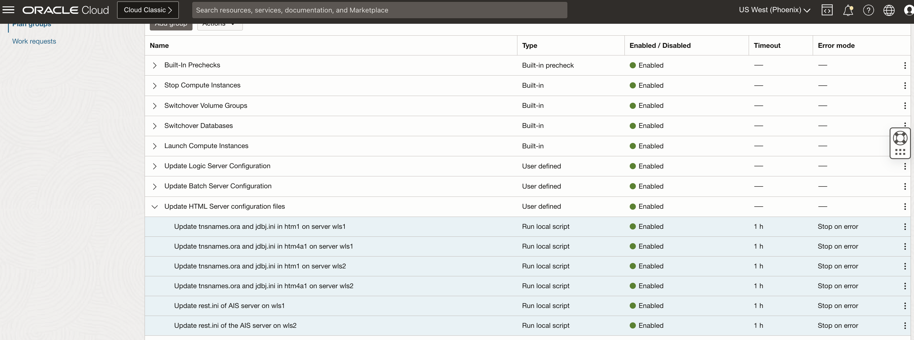

## Task 5: Customize the Switchover plan - Add a group to update SM Agents of all DR servers

Add this custom update group after the "**Update HTML Server configuration files**" group to maintain a sequence.

  1. Click on **Add group**.

    
      In "Add plan group" page, enter a suitable **Group name**

      Select the **Add after** button to add the group after a particular group.
      
      Select the **Group** after which you want to add this custom group.

      Click **Add step** to add the scripts parameters. 

    
      In "Add plan group step" page, enter a suitable **Step name**

      Select the **primary region** from the **Region** drop down to run the scripts in the standby after instance launch.

      Select the **Run local script** button.

      Select the wls1 server as **Target instance** from the drop down.

      Add below parameters in the **Script parameters**. This is based on where you have your script and the configuration file present.

      Enter the user with which you want to run the script in the **Run as user** field. 

      Select **Stop on error** on the **Error mode**

      Keep default 3600 as the **Timeout in seconds** and tick the **Enable step** option.

      Click **Add Step** to proceed. 

  2. Click **Add Step** to add another step in the group. 
    
    In "Add plan group step" page, enter a suitable **Step name**

      Select the **primary region** from the **Region** drop down to run the scripts in the standby after instance launch.

      Select the **Run local script** button.

      Select the wls2 server as **Target instance** from the drop down.

      Add below parameters in the **Script parameters**. This is based on where you have your script and the configuration file present. Refer to the Pre-requisites Setup section for details.

      Enter the user with which you want to run the script in the **Run as user** field.

      Select **Stop on error** on the **Error mode**

      Keep default 3600 as the **Timeout in seconds** and tick the **Enable step** option.

      Click **Add Step** to proceed.

  3. Click **Add Step** to add another step in the group. 
    
    In "Add plan group step" page, enter a suitable **Step name**

      Select the **primary region** from the **Region** drop down to run the scripts in the standby after instance launch.

      Select the **Run local script** button.

      Select the logic1 server as **Target instance** from the drop down.

      Add below parameters in the **Script parameters**. This is based on where you have your script and the configuration file present. Refer to the Pre-requisites Setup section for details.

      Enter the user with which you want to run the script in the **Run as user** field.

      Select **Stop on error** on the **Error mode**

      Keep default 3600 as the **Timeout in seconds** and tick the **Enable step** option.

      Click **Add Step** to proceed.

  4. Click **Add Step** to add another step in the group. 
    
    In "Add plan group step" page, enter a suitable **Step name**

      Select the **primary region** from the **Region** drop down to run the scripts in the standby after instance launch.

      Select the **Run local script** button.

      Select the batch1 server as **Target instance** from the drop down.

      Add below parameters in the **Script parameters**. This is based on where you have your script and the configuration file present. Refer to the Pre-requisites Setup section for details.

      Enter the user with which you want to run the script in the **Run as user** field.

      Select **Stop on error** on the **Error mode**

      Keep default 3600 as the **Timeout in seconds** and tick the **Enable step** option.

      Click **Add Step** to proceed.

  5. Validate that all the steps are added and click **Add** to continue.
    

## Task 6: Customize the Switchover plan - Add a group to update SM Server management-console.xml

Add this custom update group after the "**Update SM agents of all DR Servers**" group to maintain a sequence.

  1. Click on **Add group**.

    
      In "Add plan group" page, enter a suitable **Group name**

      Select the **Add after** button to add the group after a particular group.
      
      Select the **Group** after which you want to add this custom group.

      Click **Add step** to add the scripts parameters. 

    
      In "Add plan group step" page, enter a suitable **Step name**

      Select the **primary region** from the **Region** drop down to run the scripts in the standby after instance launch.

      Select the **Run local script** button.

      Select the wls1 server as **Target instance** from the drop down.

      Add below parameters in the **Script parameters**. This is based on where you have your script and the configuration file present.

      Enter the user with which you want to run the script in the **Run as user** field. 

      Select **Stop on error** on the **Error mode**

      Keep default 3600 as the **Timeout in seconds** and tick the **Enable step** option.

      Click **Add Step** to proceed. 

  2. Validate that all the steps are added and click **Add** to continue.
    

## Task 7: Customize the Switchover plan - Add a group to Stop E1 Services and Agents
  
  Add this custom update group after the "**Update SM Server management-console.xml**" group to maintain a sequence.

  1. Click on **Add group**.

    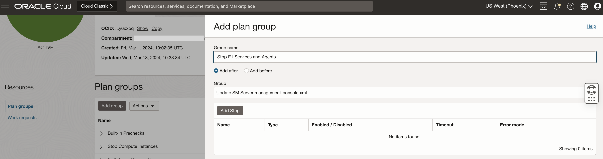
      In "Add plan group" page, enter a suitable **Group name**

      Select the **Add after** button to add the group after a particular group.
      
      Select the **Group** after which you want to add this custom group.

      Click **Add step** to add the scripts parameters. 

    
      In "Add plan group step" page, enter a suitable **Step name**

      Select the **primary region** from the **Region** drop down to run the scripts in the standby after instance launch.

      Select the **Run local script** button.

      Select the logic1 server as **Target instance** from the drop down.

      Add below parameters in the **Script parameters**. This is based on where you have your script and the configuration file present.

      Enter the user with which you want to run the script in the **Run as user** field. 

      Select **Stop on error** on the **Error mode**

      Keep default 3600 as the **Timeout in seconds** and tick the **Enable step** option.

      Click **Add Step** to proceed. 

  2. Click **Add Step** to add another step in the group. 
    
    In "Add plan group step" page, enter a suitable **Step name**

      Select the **primary region** from the **Region** drop down to run the scripts in the standby after instance launch.

      Select the **Run local script** button.

      Select the logic1 server as **Target instance** from the drop down.

      Add below parameters in the **Script parameters**. This is based on where you have your script and the configuration file present. Refer to the Pre-requisites Setup section for details.

      Enter the user with which you want to run the script in the **Run as user** field.

      Select **Stop on error** on the **Error mode**

      Keep default 3600 as the **Timeout in seconds** and tick the **Enable step** option.

      Click **Add Step** to proceed.

  3. Click **Add Step** to add another step in the group. 
    
    In "Add plan group step" page, enter a suitable **Step name**

      Select the **primary region** from the **Region** drop down to run the scripts in the standby after instance launch.

      Select the **Run local script** button.

      Select the batch1 server as **Target instance** from the drop down.

      Add below parameters in the **Script parameters**. This is based on where you have your script and the configuration file present. Refer to the Pre-requisites Setup section for details.

      Enter the user with which you want to run the script in the **Run as user** field.

      Select **Stop on error** on the **Error mode**

      Keep default 3600 as the **Timeout in seconds** and tick the **Enable step** option.

      Click **Add Step** to proceed.

  4. Click **Add Step** to add another step in the group. 
    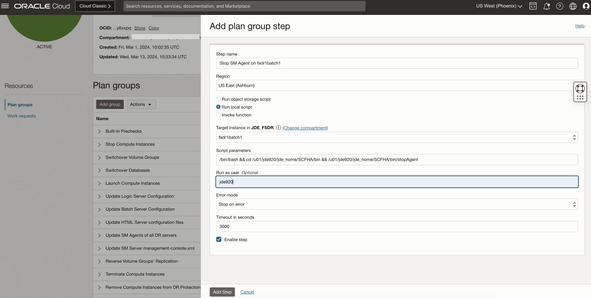
    In "Add plan group step" page, enter a suitable **Step name**

      Select the **primary region** from the **Region** drop down to run the scripts in the standby after instance launch.

      Select the **Run local script** button.

      Select the batch1 server as **Target instance** from the drop down.

      Add below parameters in the **Script parameters**. This is based on where you have your script and the configuration file present. Refer to the Pre-requisites Setup section for details.

      Enter the user with which you want to run the script in the **Run as user** field.

      Select **Stop on error** on the **Error mode**

      Keep default 3600 as the **Timeout in seconds** and tick the **Enable step** option.

      Click **Add Step** to proceed.

  5. Validate that all the steps are added and click **Add** to continue.
    

## Task 8: Customize the Switchover plan - Add a group to Stop NodeManager and WebLogic Services on SM Server and Agents on Web Servers

Add this custom update group after the "**Stop E1 Services and Agents**" group to maintain a sequence.

  1. Click on **Add group**.

    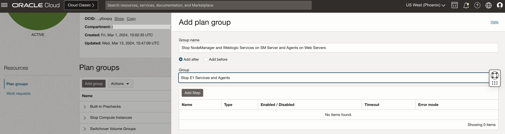
      In "Add plan group" page, enter a suitable **Group name**

      Select the **Add after** button to add the group after a particular group.
      
      Select the **Group** after which you want to add this custom group.

      Click **Add step** to add the scripts parameters. 

    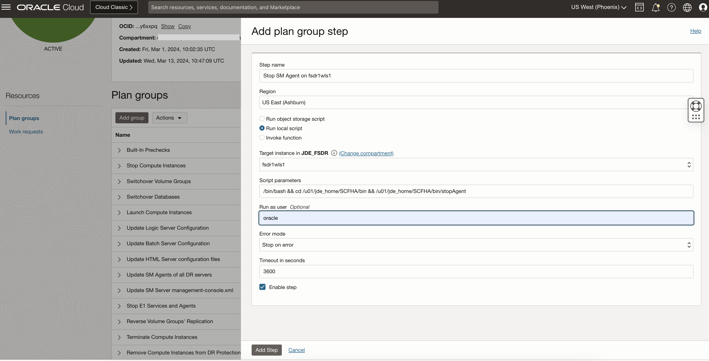
      In "Add plan group step" page, enter a suitable **Step name**

      Select the **primary region** from the **Region** drop down to run the scripts in the standby after instance launch.

      Select the **Run local script** button.

      Select the wls1 server as **Target instance** from the drop down.

      Add below parameters in the **Script parameters**. This is based on where you have your script and the configuration file present.

      Enter the user with which you want to run the script in the **Run as user** field. 

      Select **Stop on error** on the **Error mode**

      Keep default 3600 as the **Timeout in seconds** and tick the **Enable step** option.

      Click **Add Step** to proceed. 

  2. Click **Add Step** to add another step in the group. 
    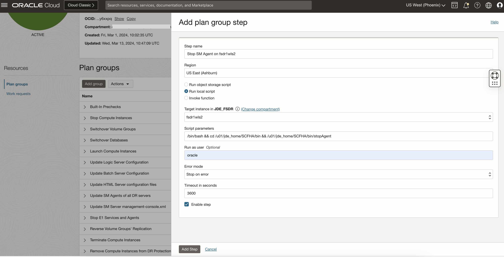
    In "Add plan group step" page, enter a suitable **Step name**

      Select the **primary region** from the **Region** drop down to run the scripts in the standby after instance launch.

      Select the **Run local script** button.

      Select the wls2 server as **Target instance** from the drop down.

      Add below parameters in the **Script parameters**. This is based on where you have your script and the configuration file present. Refer to the Pre-requisites Setup section for details.

      Enter the user with which you want to run the script in the **Run as user** field.

      Select **Stop on error** on the **Error mode**

      Keep default 3600 as the **Timeout in seconds** and tick the **Enable step** option.

      Click **Add Step** to proceed.

  3. Click **Add Step** to add another step in the group. 
    
    In "Add plan group step" page, enter a suitable **Step name**

      Select the **primary region** from the **Region** drop down to run the scripts in the standby after instance launch.

      Select the **Run local script** button.

      Select the wls1 server as **Target instance** from the drop down.

      Add below parameters in the **Script parameters**. This is based on where you have your script and the configuration file present. Refer to the Pre-requisites Setup section for details.

      Enter the user with which you want to run the script in the **Run as user** field.

      Select **Stop on error** on the **Error mode**

      Keep default 3600 as the **Timeout in seconds** and tick the **Enable step** option.

      Click **Add Step** to proceed.

  4. Click **Add Step** to add another step in the group. 
    
    In "Add plan group step" page, enter a suitable **Step name**

      Select the **primary region** from the **Region** drop down to run the scripts in the standby after instance launch.

      Select the **Run local script** button.

      Select the wls2 server as **Target instance** from the drop down.

      Add below parameters in the **Script parameters**. This is based on where you have your script and the configuration file present. Refer to the Pre-requisites Setup section for details.

      Enter the user with which you want to run the script in the **Run as user** field.

      Select **Stop on error** on the **Error mode**

      Keep default 3600 as the **Timeout in seconds** and tick the **Enable step** option.

      Click **Add Step** to proceed.

  5. Click **Add Step** to add another step in the group. 
    
    In "Add plan group step" page, enter a suitable **Step name**

      Select the **primary region** from the **Region** drop down to run the scripts in the standby after instance launch.

      Select the **Run local script** button.

      Select the smc1 server as **Target instance** from the drop down.

      Add below parameters in the **Script parameters**. This is based on where you have your script and the configuration file present. Refer to the Pre-requisites Setup section for details.

      Enter the user with which you want to run the script in the **Run as user** field.

      Select **Stop on error** on the **Error mode**

      Keep default 3600 as the **Timeout in seconds** and tick the **Enable step** option.

      Click **Add Step** to proceed.

  6. Click **Add Step** to add another step in the group. 
    
    In "Add plan group step" page, enter a suitable **Step name**

      Select the **primary region** from the **Region** drop down to run the scripts in the standby after instance launch.

      Select the **Run local script** button.

      Select the wls1 server as **Target instance** from the drop down.

      Add below parameters in the **Script parameters**. This is based on where you have your script and the configuration file present. Refer to the Pre-requisites Setup section for details.

      Enter the user with which you want to run the script in the **Run as user** field.

      Select **Stop on error** on the **Error mode**

      Keep default 3600 as the **Timeout in seconds** and tick the **Enable step** option.

      Click **Add Step** to proceed.

  7. Click **Add Step** to add another step in the group. 
    
    In "Add plan group step" page, enter a suitable **Step name**

      Select the **primary region** from the **Region** drop down to run the scripts in the standby after instance launch.

      Select the **Run local script** button.

      Select the wls2 server as **Target instance** from the drop down.

      Add below parameters in the **Script parameters**. This is based on where you have your script and the configuration file present. Refer to the Pre-requisites Setup section for details.

      Enter the user with which you want to run the script in the **Run as user** field.

      Select **Stop on error** on the **Error mode**

      Keep default 3600 as the **Timeout in seconds** and tick the **Enable step** option.

      Click **Add Step** to proceed.

  8. Click **Add Step** to add another step in the group. 
    
    In "Add plan group step" page, enter a suitable **Step name**

      Select the **primary region** from the **Region** drop down to run the scripts in the standby after instance launch.

      Select the **Run local script** button.

      Select the smc1 server as **Target instance** from the drop down.

      Add below parameters in the **Script parameters**. This is based on where you have your script and the configuration file present. Refer to the Pre-requisites Setup section for details.

      Enter the user with which you want to run the script in the **Run as user** field.

      Select **Stop on error** on the **Error mode**

      Keep default 3600 as the **Timeout in seconds** and tick the **Enable step** option.

      Click **Add Step** to proceed.

  9. Validate that all the steps are added and click **Add** to continue.
    

## Task 9: Customize the Switchover plan - Add a group to Start E1 Services and Agents

 Add this custom update group after the "**Stop NodeManager and WebLogic Services on SM Server and Agents on Web Servers**" group to maintain a sequence.

  1. Click on **Add group**.

    
      In "Add plan group" page, enter a suitable **Group name**

      Select the **Add after** button to add the group after a particular group.
      
      Select the **Group** after which you want to add this custom group.

      Click **Add step** to add the scripts parameters. 

    
      In "Add plan group step" page, enter a suitable **Step name**

      Select the **primary region** from the **Region** drop down to run the scripts in the standby after instance launch.

      Select the **Run local script** button.

      Select the logic1 server as **Target instance** from the drop down.

      Add below parameters in the **Script parameters**. This is based on where you have your script and the configuration file present.

      Enter the user with which you want to run the script in the **Run as user** field. 

      Select **Stop on error** on the **Error mode**

      Keep default 3600 as the **Timeout in seconds** and tick the **Enable step** option.

      Click **Add Step** to proceed. 

  2. Click **Add Step** to add another step in the group. 
    
    In "Add plan group step" page, enter a suitable **Step name**

      Select the **primary region** from the **Region** drop down to run the scripts in the standby after instance launch.

      Select the **Run local script** button.

      Select the batch1 server as **Target instance** from the drop down.

      Add below parameters in the **Script parameters**. This is based on where you have your script and the configuration file present. Refer to the Pre-requisites Setup section for details.

      Enter the user with which you want to run the script in the **Run as user** field.

      Select **Stop on error** on the **Error mode**

      Keep default 3600 as the **Timeout in seconds** and tick the **Enable step** option.

      Click **Add Step** to proceed.

  3. Click **Add Step** to add another step in the group. 
    
    In "Add plan group step" page, enter a suitable **Step name**

      Select the **primary region** from the **Region** drop down to run the scripts in the standby after instance launch.

      Select the **Run local script** button.

      Select the logic1 server as **Target instance** from the drop down.

      Add below parameters in the **Script parameters**. This is based on where you have your script and the configuration file present. Refer to the Pre-requisites Setup section for details.

      Enter the user with which you want to run the script in the **Run as user** field.

      Select **Stop on error** on the **Error mode**

      Keep default 3600 as the **Timeout in seconds** and tick the **Enable step** option.

      Click **Add Step** to proceed.

  4. Click **Add Step** to add another step in the group. 
    
    In "Add plan group step" page, enter a suitable **Step name**

      Select the **primary region** from the **Region** drop down to run the scripts in the standby after instance launch.

      Select the **Run local script** button.

      Select the batch1 server as **Target instance** from the drop down.

      Add below parameters in the **Script parameters**. This is based on where you have your script and the configuration file present. Refer to the Pre-requisites Setup section for details.

      Enter the user with which you want to run the script in the **Run as user** field.

      Select **Stop on error** on the **Error mode**

      Keep default 3600 as the **Timeout in seconds** and tick the **Enable step** option.

      Click **Add Step** to proceed.

  5. Validate that all the steps are added and click **Add** to continue.

## Task 10: Customize the Switchover plan - Add a group to Start Agents and Node Manager on Web Server and SM Server

  Add this custom update group after the "**Stop E1 Services and Agents**" group to maintain a sequence.

  1. Click on **Add group**.

    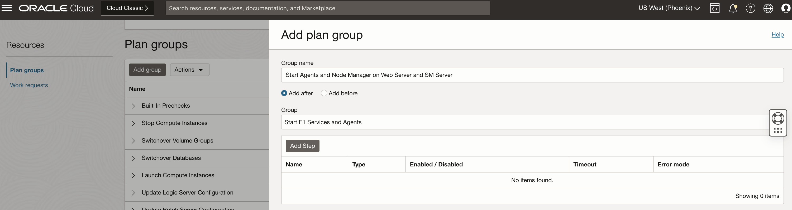
      In "Add plan group" page, enter a suitable **Group name**

      Select the **Add after** button to add the group after a particular group.
      
      Select the **Group** after which you want to add this custom group.

      Click **Add step** to add the scripts parameters. 

    
      In "Add plan group step" page, enter a suitable **Step name**

      Select the **primary region** from the **Region** drop down to run the scripts in the standby after instance launch.

      Select the **Run local script** button.

      Select the wls1 server as **Target instance** from the drop down.

      Add below parameters in the **Script parameters**. This is based on where you have your script and the configuration file present.

      Enter the user with which you want to run the script in the **Run as user** field. 

      Select **Stop on error** on the **Error mode**

      Keep default 3600 as the **Timeout in seconds** and tick the **Enable step** option.

      Click **Add Step** to proceed. 

  2. Click **Add Step** to add another step in the group. 
    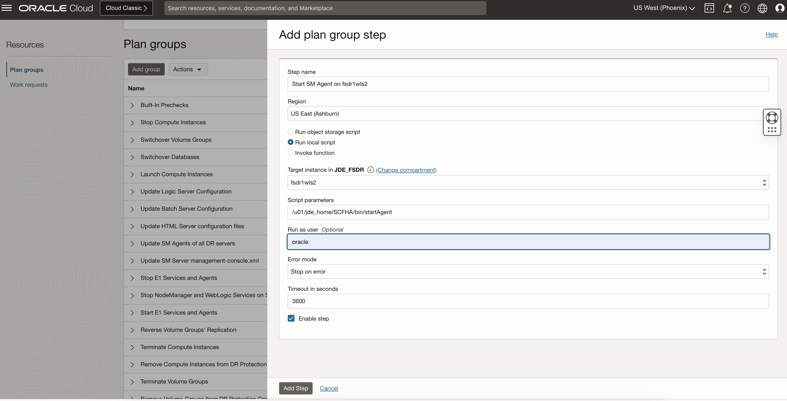
    In "Add plan group step" page, enter a suitable **Step name**

      Select the **primary region** from the **Region** drop down to run the scripts in the standby after instance launch.

      Select the **Run local script** button.

      Select the wls2 server as **Target instance** from the drop down.

      Add below parameters in the **Script parameters**. This is based on where you have your script and the configuration file present. Refer to the Pre-requisites Setup section for details.

      Enter the user with which you want to run the script in the **Run as user** field.

      Select **Stop on error** on the **Error mode**

      Keep default 3600 as the **Timeout in seconds** and tick the **Enable step** option.

      Click **Add Step** to proceed.

  3. Click **Add Step** to add another step in the group. 
    
    In "Add plan group step" page, enter a suitable **Step name**

      Select the **primary region** from the **Region** drop down to run the scripts in the standby after instance launch.

      Select the **Run local script** button.

      Select the wls1 server as **Target instance** from the drop down.

      Add below parameters in the **Script parameters**. This is based on where you have your script and the configuration file present. Refer to the Pre-requisites Setup section for details.

      Enter the user with which you want to run the script in the **Run as user** field.

      Select **Stop on error** on the **Error mode**

      Keep default 3600 as the **Timeout in seconds** and tick the **Enable step** option.

      Click **Add Step** to proceed.

  4. Click **Add Step** to add another step in the group. 
    
    In "Add plan group step" page, enter a suitable **Step name**

      Select the **primary region** from the **Region** drop down to run the scripts in the standby after instance launch.

      Select the **Run local script** button.

      Select the wls2 server as **Target instance** from the drop down.

      Add below parameters in the **Script parameters**. This is based on where you have your script and the configuration file present. Refer to the Pre-requisites Setup section for details.

      Enter the user with which you want to run the script in the **Run as user** field.

      Select **Stop on error** on the **Error mode**

      Keep default 3600 as the **Timeout in seconds** and tick the **Enable step** option.

      Click **Add Step** to proceed.

  5. Click **Add Step** to add another step in the group. 
    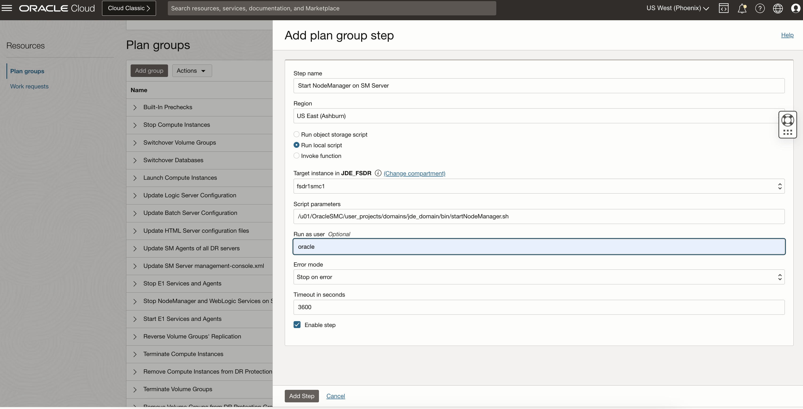
    In "Add plan group step" page, enter a suitable **Step name**

      Select the **primary region** from the **Region** drop down to run the scripts in the standby after instance launch.

      Select the **Run local script** button.

      Select the smc1 server as **Target instance** from the drop down.

      Add below parameters in the **Script parameters**. This is based on where you have your script and the configuration file present. Refer to the Pre-requisites Setup section for details.

      Enter the user with which you want to run the script in the **Run as user** field.

      Select **Stop on error** on the **Error mode**

      Keep default 3600 as the **Timeout in seconds** and tick the **Enable step** option.

      Click **Add Step** to proceed.

  6. Validate that all the steps are added and click **Add** to continue.
    

## Task 11: Customize the Switchover plan - Add a group to Start WebLogic on Web Servers and SM Server

  Add this custom update group after the "**Start Agents and Node Manager on Web Server and SM Server**" group to maintain a sequence.

  1. Click on **Add group**.

    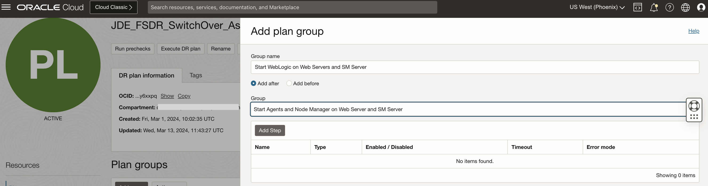
      In "Add plan group" page, enter a suitable **Group name**

      Select the **Add after** button to add the group after a particular group.
      
      Select the **Group** after which you want to add this custom group.

      Click **Add step** to add the scripts parameters. 

    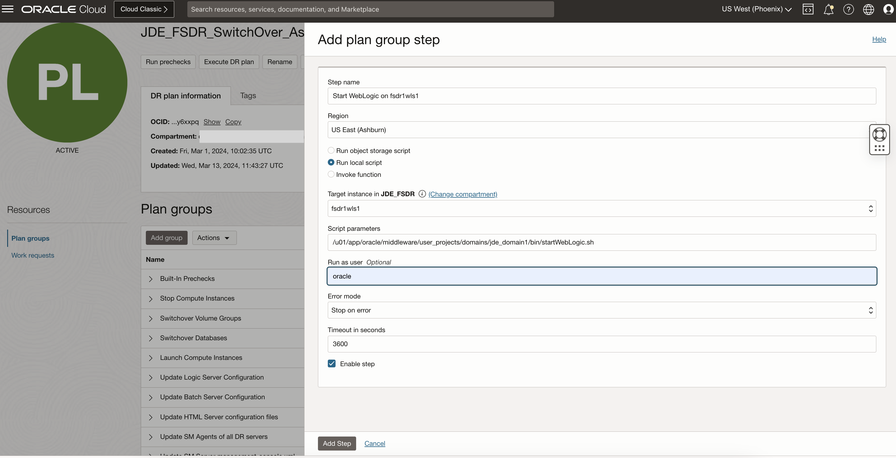
      In "Add plan group step" page, enter a suitable **Step name**

      Select the **primary region** from the **Region** drop down to run the scripts in the standby after instance launch.

      Select the **Run local script** button.

      Select the wls1 server as **Target instance** from the drop down.

      Add below parameters in the **Script parameters**. This is based on where you have your script and the configuration file present.

      Enter the user with which you want to run the script in the **Run as user** field. 

      Select **Stop on error** on the **Error mode**

      Keep default 3600 as the **Timeout in seconds** and tick the **Enable step** option.

      Click **Add Step** to proceed. 

  2. Click **Add Step** to add another step in the group. 
    
    In "Add plan group step" page, enter a suitable **Step name**

      Select the **primary region** from the **Region** drop down to run the scripts in the standby after instance launch.

      Select the **Run local script** button.

      Select the wls2 server as **Target instance** from the drop down.

      Add below parameters in the **Script parameters**. This is based on where you have your script and the configuration file present. Refer to the Pre-requisites Setup section for details.

      Enter the user with which you want to run the script in the **Run as user** field.

      Select **Stop on error** on the **Error mode**

      Keep default 3600 as the **Timeout in seconds** and tick the **Enable step** option.

      Click **Add Step** to proceed.

  3. Click **Add Step** to add another step in the group. 
    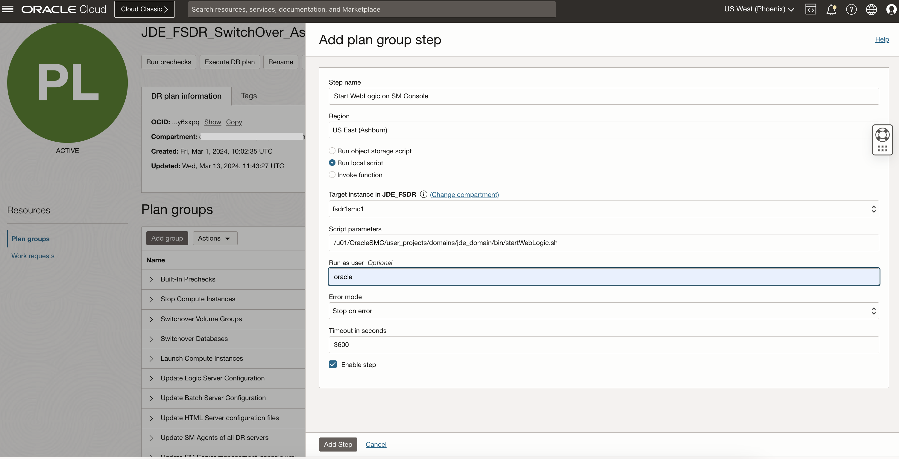
    In "Add plan group step" page, enter a suitable **Step name**

      Select the **primary region** from the **Region** drop down to run the scripts in the standby after instance launch.

      Select the **Run local script** button.

      Select the smc1 server as **Target instance** from the drop down.

      Add below parameters in the **Script parameters**. This is based on where you have your script and the configuration file present. Refer to the Pre-requisites Setup section for details.

      Enter the user with which you want to run the script in the **Run as user** field.

      Select **Stop on error** on the **Error mode**

      Keep default 3600 as the **Timeout in seconds** and tick the **Enable step** option.

      Click **Add Step** to proceed.

  4. Validate that all the steps are added and click **Add** to continue.
    
  
    You may now **proceed to the next lab**.

## Acknowledgements

- **Author:** Tarani Meher, Senior JDE Specialist
- **Last Updated By/Date:** Tarani Meher, Senior JDE Specialist, 02/2024
