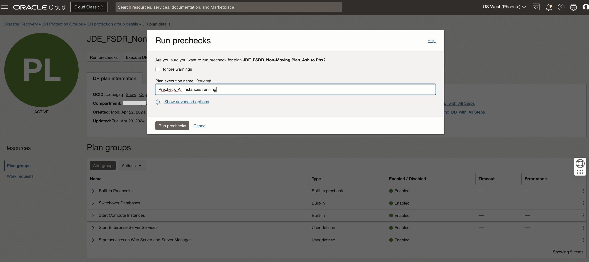

# Perform pre-checks for the DR Switchover Plan

## Introduction

In this lab, we will execute **Run Prechecks** for the **FSDR\_Non-Moving\_Ash\_to\_Phx\_DB\_with\_All Steps** switchover plan.

Execute **Run Prechecks**  will perform only the *pre-checks* and not the actual execution. Having the pre-checks completed successfully is essential as a pre-requisite for running the actual switchover plan.

*Note:* If the instances are not already running at the standby, the pre-checks with fail for running the scripts as it will not be able to connect to the instances to validate. But it will work fine during the actual execution as it will first start the instances and then go to next step for running the scripts. 

Estimated Time: 15 Minutes

### Objectives

- Perform Run prechecks for the plan
- Monitor and Verify the executed prechecks

## Task 1: Perform Run prechecks for the Switchover plan

1. Login into OCI Console. Select region as **Pheonix**.

  

2. Select Migration and Disaster Recovery from the Hamburger menu, then **Disaster Recovery** -> **DR Protection Groups**. Verify the region is **Phoenix**

  

3. You will land on the Disaster Recovery Protection group home page; make sure you have selected the Phoenix region.

  

4. Select the **FSDR\_Non-Moving\_Ash\_to\_Phx\_DB\_with\_All Steps** DRPG and select plan **JDE\_FSDR\_Non-Moving Plan\_Ash to Phx**

  

5. Click on **Run prechecks** section, which will be right below the **JDE\_FSDR\_Non-Moving Plan\_Ash to Phx** plan. In the **Run prechecks** window, provide the Plan execution name as and hit **Run prechecks**

  

## Task 2: Monitor and Verify the executed prechecks plan

1. Navigate to **Plan executions** section under **Resources** and select the **Precheck\_All Instances Running** plan execution. Initially, it will show the status as **ACTIVE** with all steps as *Queued*. After few seconds, the status should change to **IN PROGRESS** including the steps in the group.  

  

2. In few minutes, the status should change to **SUCCEEDED** including the steps and the groups. You can verify the duration and status of each step.

   You may now **proceed to the next lab**.

## Acknowledgements

* **Author:** Tarani Meher, Principal Cloud Architect
* **Last Updated By/Date:** Tarani Meher, Principal Cloud Architect, May-2024
