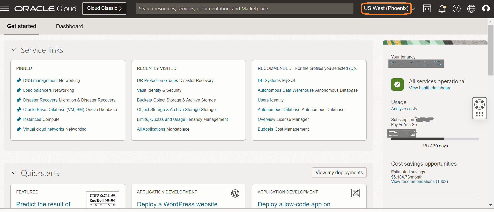
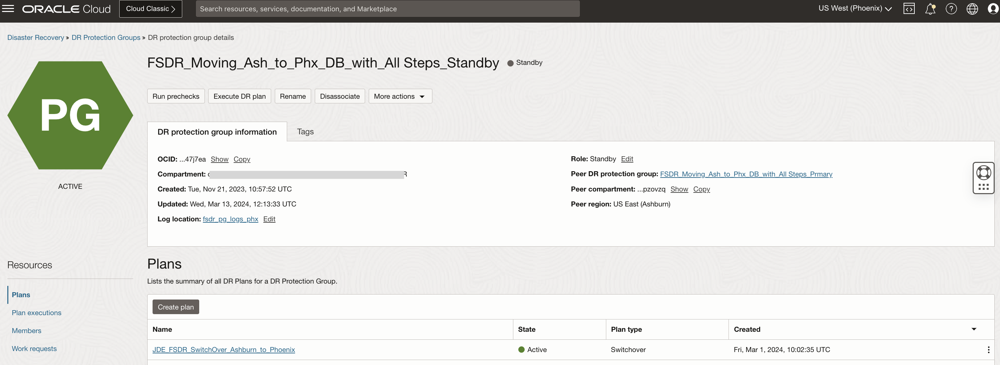
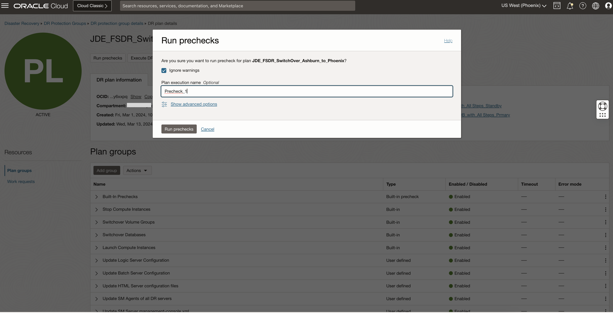

# Perform pre-checks for the DR Switchover Plan

## Introduction

In this lab, we will execute **Run Prechecks** for the **FSDR_Moving\_Ash\_to\_Phx\_DB\_with\_All Steps\_Standby** switchover plan, which we have created in lab 1.2.

Execute **Run Prechecks**  will perform only the *pre-checks* and not the actual execution. Having the pre-checks completed successfully is essential as a pre-requisite for running the actual switchover plan.

Estimated Time: 15 Minutes

### Objectives

- Perform Run prechecks for the FSDR_Moving\_Ash\_to\_Phx\_DB\_with\_All Steps\_Standby plan
- Monitor the executed prechecks plan
- Verify the executed prechecks plan

## Task 1: Perform Run prechecks for the Switchover plan

1. Login into OCI Console. Select region as **Pheonix**.

  

2. Select Migration and Disaster Recovery from the Hamburger menu, then **Disaster Recovery** -> **DR Protection Groups**. Verify the region is **Phoenix**

  

3. You will land on the Disaster Recovery Protection group home page; make sure you have selected the Phoenix region.

  

4. 4. Select the **FSDR_Moving\_Ash\_to\_Phx\_DB\_with\_All Steps\_Standby** DRPG and select plan **JDE\_FSDR\_SwitchOver\_Ashburn\_to\_Phoenix**

  

5. Click on **Run prechecks** section, which will be right below the **JDE\_FSDR\_SwitchOver\_Ashburn\_to\_Phoenix** plan

  

6. In the **Run prechecks** window, provide the Plan execution name as **Precheck_1** and hit **Run prechecks**

  

## Task 2: Monitor the executed prechecks plan

1. Navigate to **Plan executions** section under **Resources** and select the **Precheck_1** plan execution. Initially, it will show the status as **ACTIVE** all the **Built-in Prechecks** as *Queued*

  

2. After few seconds, the status should change to **IN PROGRESS** including the steps in the group.  

      

3. In few minutes, the status should change to **SUCCEEDED** including the steps and the groups. You can verify the duration of each step and status.  
 
      

   You may now **proceed to the next lab**.

## Acknowledgements

- **Author:** Tarani Meher, Senior JDE Specialist
- **Last Updated By/Date:** Tarani Meher, Senior JDE Specialist, 02/2024
