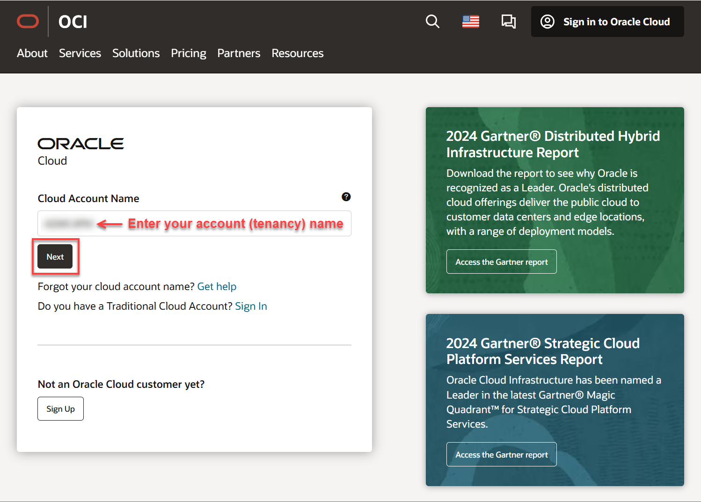
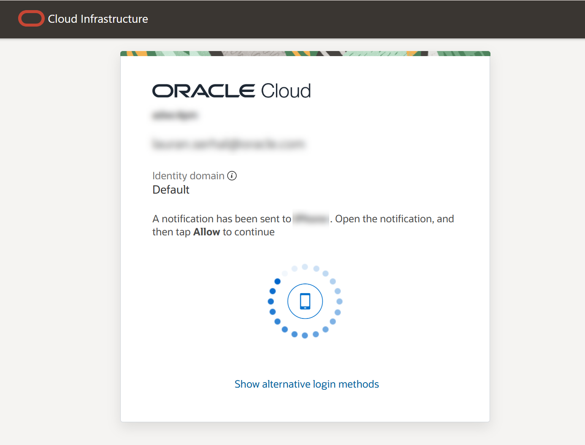

# Get started - Cloud login

## Introduction

Oracle Cloud is the industry's broadest and most integrated cloud provider, with deployment options ranging from the public cloud to your data center. Oracle Cloud offers best-in-class services across Software as a Service (SaaS), Platform as a Service (PaaS), and Infrastructure as a Service (IaaS).

Estimated Time: 5 minutes

### Types of Cloud Accounts

We offer two types of Cloud Accounts:

*Free Tier Accounts*:  After you sign up for the free [Oracle Cloud promotion](https://signup.cloud.oracle.com) or sign up for a paid account, you’ll get a welcome email. The email provides you with your cloud account details and sign in credentials.

*Oracle Cloud Paid Accounts*:  When your tenancy is provisioned, Oracle sends an email to the default administrator at your company with the sign-in credentials and URL. This administrator can then create a user for each person who needs access to the Oracle Cloud. Check your email or contact your administrator for your credentials and account name.

### Objectives

- Learn how to log in to your Oracle Cloud Account

### Prerequisites
- Cloud Account Name - This is the name of your tenancy (supplied by the administrator or in your Oracle Cloud welcome email)
- Username
- Password

## Task 1:  Log in to Oracle Cloud
If you've signed out of the Oracle Cloud, use these steps to sign back in.

1. Go to [cloud.oracle.com](https://cloud.oracle.com) and enter your **Cloud Account Name** (tenancy name), and then click **Next**. This is the name you chose while creating your account in the previous section. _It's NOT your email address_. If you've forgotten the name, review the confirmation email.

    

2. Click the **Sign in with an identity domain** drop-down list and select an **Identity Domain** such as **Default**, and then click **Next**.

    

    

3. On the **Oracle Cloud Account Sign In** page, enter your Cloud Account credentials, and then click **Sign In**. Your username is your email address. The password is what you chose when you signed up for an account.

    

4. Based on the Multi-factor authentication setup for your account, provide authentication to sign into the account. For example, click **Allow** on the app (or enter your **authentication code** and click **Verify**) based on the authentication setup. For more details, refer the [Managing Multifactor Authentication documentation](https://docs.oracle.com/en-us/iaas/Content/Identity/Tasks/usingmfa.htm)

    

5. The **Oracle Cloud Console** home page is displayed.

    

You may now **proceed to the next lab**.

## Acknowledgements
- **Created By/Date** - Kay Malcolm, Database Product Management, March 2020
- **Contributors** - John Peach, Kamryn Vinson, Rene Fontcha, Madhusudhan Rao, Ramona Magadan, Lauran K. Serhal
- **Last Updated By** - Lauran K. Serhal, June 2025