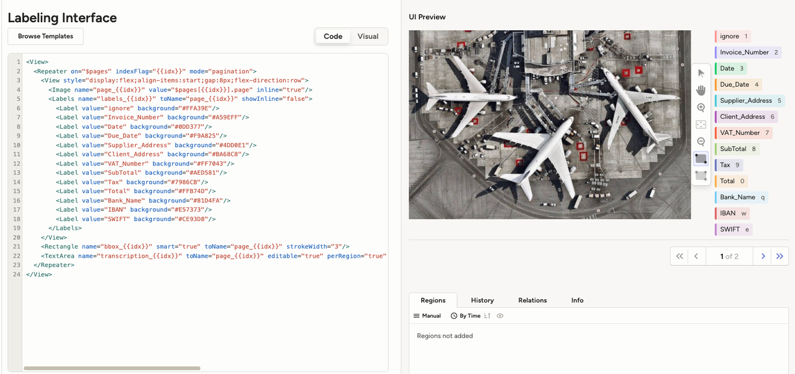

# Setup Label Studio

## Introduction

This Lab will guide you through the process of setting up and runinng Label Studio on your machine.

***Estimated Lab Time*** 20 minutes


### Objectives:

In this lab, you will:
* Enable Local file serving and start Label Studio.
* Create and configure a labelling project.

### Prerequisites (Optional)

This lab assumes you have:
* All previous labs successfully completed.
* Basic scripting skills in Python and Bash


## Task 1: Enable local file serving
Since your files are stored locally, you need to export the following environment variables as instructed to enable Label Studio to access and annotate them. 
</br>
Reference link: https://labelstud.io/guide/start#Set-environment-variables 

1. Run the following commands in your terminal to enable local file serving **on Mac**:

    ```
    <copy>
    export LABEL_STUDIO_LOCAL_FILES_SERVING_ENABLED=true 
    export LABEL_STUDIO_LOCAL_FILES_DOCUMENT_ROOT= absolute path to the parent directory of folder where your documents are stored.

    ```

2. Run the following commands in your terminal to enable local file serving **on Windows**

    ```
    <copy>
    set LABEL_STUDIO_LOCAL_FILES_SERVING_ENABLED=true 
    set LABEL_STUDIO_LOCAL_FILES_DOCUMENT_ROOT= absolute path to the parent directory of folder where your documents are stored.

    ```

## Task 2: Start Label Studio and create an account


  1. **Start Label Studio**
    - By default, Label Studio runs on port 8080. If that port is already in use or if you want to specify a different port, start Label Studio with  the following command:
      
      ```
      label-studio start --port <port> 
      ```

  2. **Create an account**
    - When you first start Label Studio, you see the sign-up screen. 
    - Create an account with your email address and a password. 
    - Log in to Label Studio. 


## Task 3: Project creation and configuration

1. **Create New Project**
    Reference: https://labelstud.io/guide/setup_project 

    
    


2. **Add source data storage**
    - Add your local source storage by clicking on settings in the top right corner
        
    - Navigate to Cloud Storage 
        
    - Add source storage
        
    - Add link to input pdfs in source storage 
        
    - Repeat the same steps to add another source storage - the output images file. So your Source Cloud storage 
      are structured as follows
        

    Reference: https://labelstud.io/guide/storage.html#Local-storage 
    </br>
    Add both the *`input_pdf`* folder and *`output_images`* folder in the source storage.

3.  **Setup labelling config**

    - Next, navigate to labelling interface 
      

    - Navigate to the code template within the labelling interface
      

    - Copy and paste the following labelling configuration into the code template
      
        ```
          <View>
            <Repeater on="$pages" indexFlag="{{idx}}" mode="pagination">
              <View style="display:flex;align-items:start;gap:8px;flex-direction:row">
                <Image name="page_{{idx}}" value="$pages[{{idx}}].page" inline="true"/>
                  <Labels name="labels_{{idx}}" toName="page_{{idx}}" showInline="false">
                    <Label value="ignore" background="#FFA39E"/>
                    <Label value="Invoice_Number" background="#A59EFF"/>
                    <Label value="Date" background="#0DD377"/>
                    <Label value="Due_Date" background="#F9A825"/>
                    <Label value="Supplier_Address" background="#4DD0E1"/>
                    <Label value="Client_Address" background="#BA68C8"/>
                    <Label value="VAT_Number" background="#FF7043"/>
                    <Label value="SubTotal" background="#AED581"/>
                    <Label value="Tax" background="#7986CB"/>
                    <Label value="Total" background="#FFB74D"/>
                    <Label value="Bank_Name" background="#81D4FA"/>
                    <Label value="IBAN" background="#E57373"/>
                    <Label value="SWIFT" background="#CE93D8"/>
                  </Labels>
              </View>
              <Rectangle name="bbox_{{idx}}" smart="true" toName="page_{{idx}}" strokeWidth="3"/>
              <TextArea name="transcription_{{idx}}" toName="page_{{idx}}" editable="true" perRegion="true" required="true" maxSubmissions="1" rows="5" placeholder="Recognized Text" displayMode="region-list"/>
            </Repeater>
          </View> 
          
        ```

    - Click on save to update the configuration
      

## Task 4: Enable interactive pre-annotation (call the OCI OCR model)

**Connect to the OCI OCR model**

  1. Navigate to the "model" sub section in the settings tab 
  2. Click on connect model 
    
    
  3. Copy and paste the URL of the server that the OCI model is running on and use it to fill in the required fields in the create model pop up window 
    

  Once connected, Label Studio will automatically send each uploaded document to the OCI OCR service and display the predicted bounding boxes as   pre-annotations (refer to Lab0).
  </br>
  Annotators can review, modify, or accept the pre-annotated results interactively. 

</br>
You may now **proceed to the next lab**

## Acknowledgements
* **Authors** 
    - Cristina Granes, AI Cloud Services Black Belt
    - David Attia, AI Cloud Services Black Belt
* **Last Updated By/Date** 
    - David Attia - AI Cloud Services Black Belt, August 2025
