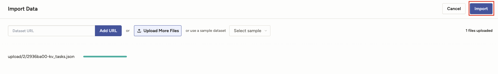
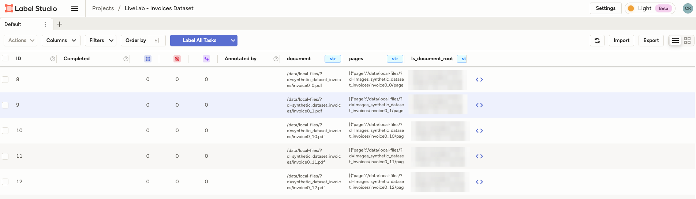

# Label your dataset

## Introduction

In this session we will import the data into Label Studio and start labelling it.

***Estimated Lab Time*** 60 minutes

### Objectives:

In this lab, you will:
* Import the tasks for annotation 
* Label the dataset

### Prerequisites

This lab assumes you have:
* All previous labs successfully completed.
* Basic scripting skills in Python and Bash

## Task 1: Import the Data for annotation

1. 
Import the generated `tasks.json` file for fresh annotation by clicking import inside the project:

2. Upload the only JSON file to import.

3. Once imported, the bar should look green as below, and then click on the _Import_ button on the top right.

  
You should see the project folder full of tasks like in the following image:

## Task 2: Create the annotations
Reference : https://labelstud.io/guide/setup
 
Open the labelling interface, you will notice the automatic text recognition has been done by the OCI backend OCR (Optical Character Recognition). Label the text by matching it to the labels you defined earlier seen on the right hand side of the page.

When opening one task, you will see the following tagging interface after loading and producing the OCR using the OCI backend OCR:

  
Do not edit the rectangles (bounding boxes), since they have a prepared structure for OCI Document Understanding, and editting them would change the format.
Each rectangle will be assigned, by default, to the label "ignore". When you click at one rectangle (bounding box) you can then select which is the label for that rectangle, as in the following steps:

1. Click on the rectangle you want to tag, to select it.

2. Click on the corresponding label on the right, to add a label to the rectangle (bounding box).

Once you have tagged all the bounding boxes, click on _Submit_ button to save the labelled document.

_**Tip:** You can use ctrl (or command for Mac) to select multiple rectagles and tag them at the same time._
  
### **This is an example of a fully tagged document:**

 
You may now **proceed to the next lab**

## Acknowledgements
* **Authors** 
    - Cristina Granes, AI Cloud Services Black Belt
    - David Attia, AI Cloud Services Black Belt
* **Last Updated By/Date** 
    - Cristina Granes - AI Cloud Services Black Belt, August 2025
