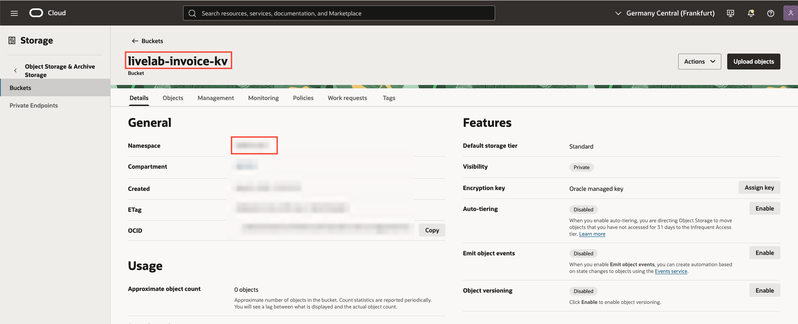
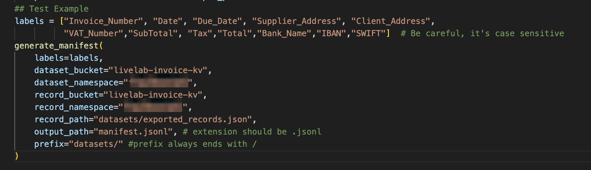
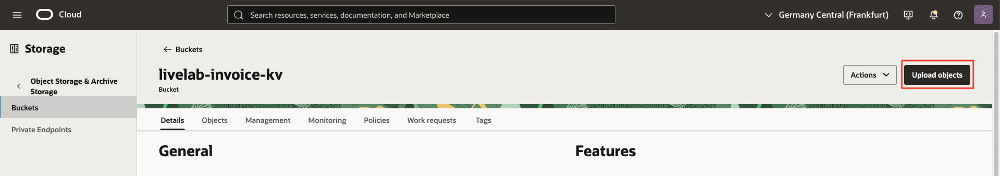
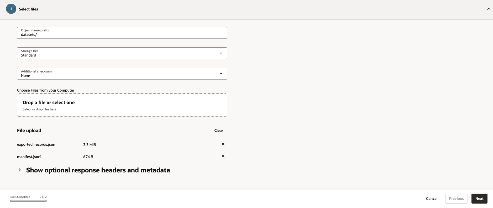

# Export dataset from Label Studio to OCI Object Storage

## Introduction

Now that you finished creating your dataset, you can prepare it for OCI Document Understanding.

The main objective is to prepare the dataset in OCI for it to be fed into Document Understanding in the next Lab (Lab6).

***Estimated Lab Time*** 10 minutes

### Objectives:

In this lab, you will:
* Export the labels in JSON format from Label Studio
* Create an OCI Object Storage Bucket
* Generate the manifest script
* Upload the JSON and files into the Cloud

### Prerequisites

This lab assumes you have:
* All previous labs successfully completed.
* Basic scripting skills in Python and Bash

## Task 1: Create an OCI Bucket for Object Storage

We will start this Lab by creating a Bucket in the Cloud.
1. Select one region between the ones where Document Understanding is available. (You can check for the available regions in the [official documentation](https://docs.oracle.com/en-us/iaas/Content/document-understanding/using/getting_started.htm))

2. Go to Storage &rarr; Buckets

3. Create a Bucket

4. Copy the following variables that will be used in task 2: _namespace_ and _bucket name_

  

## Task 2: Export Annotations from Label Studio

To export the annotations:

1. Click on the export button 
    

2. Export the labels into JSON-MIN format as shown below
    

3. Move the exported json file to the dataset folder and rename it to `exported_records.json` (i.e. into datasets/exported_records.json)
  

## Task 3: Generate manifest file for Custom Key-Value extraction model
   
1. Download [this Python code](code/generate_manifest_kv.py) and open it in a code editor of your choice (i.e. VSCode)

2. Reassign the variables towards the end to match your data (paths and buckets)
    - (optional) `labels`: the code should contain the same labels you used during tagging. ONLY change this variable if you added more apart from the ones in this LiveLab.
    - `dataset_bucket`: the bucket name of the one you created in Task 1
    - `dataset_namespace`: the namespace of the bucket you created in Task 1
    - `record_bucket`: same as `dataset_bucket`
    - `record_namespace`: same as `dataset_namespace`
    - `record_path`: path to the json file you exported from Label Studio (i.e. datasets/exported_records.json)
    - (optional) `output_path`: you can change the folder and name of the manifest jsonl that will be created by this python code
    - `prefix`: document root directory**, ending with `/`
    

3. Run the code, it will produce the manifest jsonl file named `output_path`

> ** **Note:** The local `document_root` directory maps to `bucket_name/prefix` on the Cloud. Maintain the same folder structure as in the local storage. The training pipeline expects this structure and relies on it to find the files correctly.

  

## Task 4: Upload dataset to the bucket
Upload the manifest file, record file and pdf documents inside a folder to the bucket and path defined in the manifest.
Make sure to maintain the same structure of the folders.

1. To update files, click on the following button in the OCI Bucket that you created:

2. Upload the json files with the prefix `datasets/`

3. Upload the pdfs with the prefix `datasets/synthetic_dataset_invoices/`

In the end, you should have the following structure in the bucket:

 
You may now **proceed to the next lab**

## Acknowledgements
* **Authors** 
    - Cristina Granes, AI Cloud Services Black Belt
    - David Attia, AI Cloud Services Black Belt
* **Last Updated By/Date** 
    - Cristina Granes - AI Cloud Services Black Belt, August 2025
