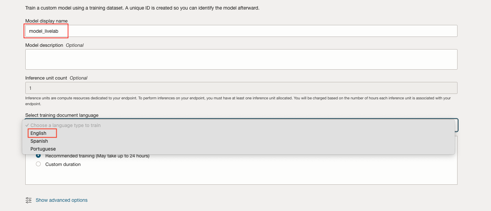

# Use the dataset to train a custom Document Understanding model

## Introduction

In this part of the LiveLab you will train a custom Key-Value model using a dataset uploaded in an OCI Bucket.

***Estimated Lab Time*** 5 minutes (45min training the model)


### Objectives:

In this lab, you will:
* Create the necessary policies for Document Understanding
* Create a project in Document Understanding
* Train a custom model
* Test the trained custom model with some examples

### Prerequisites

This lab assumes you have:
* All previous labs successfully completed.

## Task 1: Policies
These policies may be needed for users to access Document Understanding APIs. By default, only the users in the Administrators group have access to all Document Understanding resources.
- Policy to grant users access to Document Understanding APIs:

``` 
<copy> 
allow group group_in_tenancy to manage ai-service-document-family in tenancy 
<copy>
```

- Policy to access Object Storage:
``` 
<copy> 
allow group group_in_tenancy to manage object-family in tenancy
<copy>
```

- Policy to store results in Object Storage:
``` 
<copy> 
allow group group_in_tenancy to manage object-family in compartment output_bucket_located_object_storage_compartment
<copy>
```

Look at [the policies](https://docs.oracle.com/en-us/iaas/Content/document-understanding/using/about_document-understanding_policies.htm) for more information.
<br><br>

## Task 2: Train custom model for Key-Value extraction

1. Create a Project in Document Understanding

2. Create a key-value extraction model

3. Select your bucket and ```manifest.json``` file

4. Select a desired name for the model and _English_ as language. Leaving the recommended training time is enough.

5. Check the settings and train the model

<br><br>
The training might take between 45 and 60 minutes. Once the training has finished, the state will change to "Succeeded" as below:

<br><br>

## Task 3: Test the trained model
For testing, you can download the [following examples](test_dataset/test_dataset.zip).

1. Click on the model you want to test, inside the Project:

<br>
2. Select a bucket to save the results and test the model via one of the following methods (for Object Storage, the file needs to be uploaded inside an Object Storage first):


<br>
The model we trained in this Lab is able to extract fields that the pretrained model is not able to: IBAN, SWIFT and Bank Name.


In some cases, it can work partially (or completely) for invoices with similar layouts which can be extrapolated from the layouts in the training dataset, like the following example:

</br>
</br>
You may now **proceed to the next lab**


## Acknowledgements
* **Authors** 
    - Cristina Granes, AI Cloud Services Black Belt
    - David Attia, AI Cloud Services Black Belt
* **Last Updated By/Date** 
    - Cristina Granes - AI Cloud Services Black Belt, September 2025
