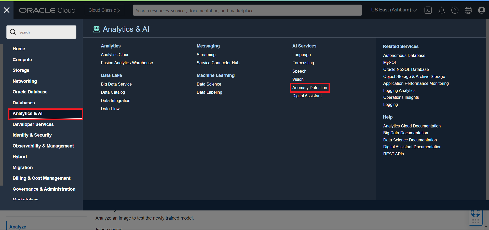
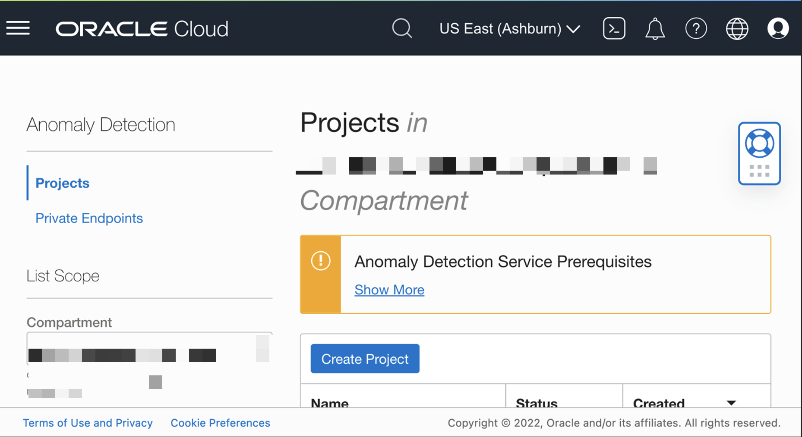

# Evaluate yield, equipment OEE using OCI anomaly detection

## Introduction

Anomaly Detection is the identification of rare items, events, or observations in data that differ significantly from the expectation. This can be used for several scenarios like asset monitoring, maintenance, and prognostic surveillance in industries such as manufacturing ,utility, aviation and transportation.

The core algorithm of our Anomaly Detection service is an Oracle-patented multivariate time-series anomaly detection algorithm originally developed by Oracle Labs and had been successfully used in several industries for prognosis analysis.

The Oracle Cloud Infrastructure Anomaly Detection will create customized Machine Learning models by taking the data uploaded by users, using the core algorithm to train the model, and hosted in the cloud to be ready for detection. Users can then send new data to the detection endpoints to get detected anomaly results.

In this section of the demonstration, we will be showcasing how AI ADS service can be used to identify the Anomalies in the functional electrical test parameters for a Chip Wafer lot inspection by performing a multivariate analysis.

###Anomaly Detection Process
At a high level, here are the process of completing a full cycle of using anomaly detection service.

* Create a project. A project is used to include and organize different assets, models and private endpoints for ATP or InfluxDB data connection in the same workspace.
* Create a data asset. Data asset is an abstracted data representation for a data source. Currently it supports Oracle object storage, Oracle Autonomous Transaction Processing, InfluxDB.
* Train a model. After specifying a data asset and the training parameters, you can train an anomaly detection model. It will take 5 minutes or longer depending on the data size and target parameter FAP. Once a model is trained successfully, it is deployed automatically with an endpoint ready to take any new incoming testing data.
* Detection with new data. User can send newer data with same attributes of the training data to the deployment endpoint or upload to the deployment UI to get detection result.

Note that one project can have multiple data assets and multiple models.

Estimated Lab Time: 30 minutes

### Objectives

In this lab, you will Learn:
* About OCI Anomaly Detection service
* How to create data asset
* How to train model for anomaly detection

### Prerequisites

This lab assumes you have:
* An Oracle Cloud Account
* Additional prerequisites (cloud services) are mentioned per lab
* Familiar with OCI Policy.
* Familiar with Python programming for SDK usage is recommended.
* Request access to OCI Vision + review policy requirements
* Understand basic model terminology FAP - False Alarm Probability

## Task 1: Understand and Download AD test datasets

Download the data sets below from given link.

* The data set - uci-secom.csv contains around 5 functional test parameters which we need to Analyse to perform a multivariate analysis using provided data sets.
* Train-secom.csv – Train a Custom ADS model.
* Tests- ogsub.csv – Test the ADS model.
* Download the [uci-secom](files/uci-secom.csv).
* Download the [train-secom](files/train-secom.csv).
* Download the [testts-ogsub](files/testts-ogsub.csv).

## Task 2: Upload Data to Object Store
Object Storage supports uploading individual files up to 10 TiB. Because memory capacity and browser capability can impact uploading objects using the Console, use the CLI, SDK, or API for larger files. See Developer Tools and Resources.

To upload files to your bucket using the Console:

1. From the Object Storage **Buckets** screen, click the bucket name to view its details.
2. Click **Upload**.
3. In the **Object Name Prefix** field, optionally specify a file name prefix for the files that you plan to upload.
4. If the **Storage Tier** field displays **Standard**, you can optionally change the storage tier to upload objects to.
5. Select the object or objects to upload in one of two ways:

    * Drag files from your computer into the Drop files here ... section.

    * Click the **select files** link to display a file selection dialog box.

   As you select files to upload, they are displayed in a scrolling list. If you decide that you do not want to upload a file that you have selected, click the X icon to the right of the file name.

   If selected files to upload and files already stored in the bucket have the same name, messages warning you of an overwrite are displayed.

6. Click **Upload**.

The selected objects are uploaded. Click Close to return to the bucket.

## Task 3: Train and test Anomaly Detection Model.
Follow these steps
    

## Task 4: Create a Model
Creating a model is requiring the 3 actions to kick off training the AD model.

Select the proper compartment and data asset that we just created.

Set training parameters

Train a model

Select the proper compartment (e.g, the compartment matching your name or company name), and then the project you have created.

Once the project ad_demo is selected, it will navigate the User to Created Anomaly Detection Project, then click "Create and Train Model".

The data asset created in previous lab session should be pop up in the drop down menu. Click "Next" button.

This takes us to "Train Model" form with parameter selections.

We can specify FAP(false alarm probability) and Train Fraction Ratio. The default values for these are 0.01 and 0.7 (implying 70%) respectively.

###FAP (False Alarm Probability)

FAP stands for False Alarm Probability, which is basically the likelihood (percentage) of a timestamp is flagged as anomaly in the clean (anomaly-free) training data. It is calculated at every signal level and then averaged across all signals as the final achieved FAP by our model.

A model with high FAP means the likelihood of an anomaly flagged by AD service to be a false alarm is high. If this is not desired, depending on the sensitivity requirements of a user, user can specify it to be low.

Typically, FAP can be set to be around the same level of percentage of anomalies in real business scenarios, and a value 0.01 or 1% is relatively appropriate for many scenarios. Also, be aware that if specifying a lower target FAP, the model needs more time to train, and may not achieve to the target FAP.

###Train Fraction Ratio

Train Fraction Ratio specifies the ratio of the whole training data used for our algorithm to learn the pattern and train the model. The rest (1-ratio) of training data will be used for our algorithm to evaluate and report model performance (e.g., FAP). The default value 0.7 or 70% specifies the model to use 70% of the data for training, and the rest 30% is used to produce model performance.

In this demo data set, the default value for FAP and Train Fraction Ratio are appropriate, we will leave them as is.

Click Submit. For this demo dataset, it takes **10-15 minutes** to finish training a model.

Once the model is trained successfully, it is automatically ready for detecting anomalies from new data. User can either use the cloud Console (next step) or the endpoint to send new testing data.

## Task 5: Detect Anomaly with new Data
Upload to UI

To start the process of anomaly detection, select "Detect Anomalies" on the Model listing page.

Select a file from local filesystem or drag and drop the desired file.

Note: The detection data can have up to 30,000 data points (number of signals times number of timestamps). If the trained model contains univariate models, it requires at least 20 timestamps to generate anomaly.

Once the test file is uploaded, now click Detect button.

The detection result will return immediately, and you have the option to select the column to see related anomalies.

Use the drop wizard to select a column to see anomalies.

###Explanation of the Graph
The results return an array of anomalies grouped by timestamp. Each timestamp could have anomalies generated by single or multiple signals. Anomaly generated by one signal contains a tuple of signal name, actual value, estimate value, and an anomaly score with in the range of 0 to 1 that indicate the significance of anomaly. Meanwhile, each timestamp also have a normalized score that combines the significance scores across single or multiple alerted signals.

## Learn More

* [https://apexapps.oracle.com/pls/apex/dbpm/r/livelabs/workshop-attendee-2?p210_workshop_id=819&p210_type=3&session=953867760403](https://apexapps.oracle.com/pls/apex/dbpm/r/livelabs/workshop-attendee-2?p210_workshop_id=819&p210_type=3&session=953867760403)

## Acknowledgements
* **Author**   
    * Biswanath Nanda, Principal Cloud Architect, Cloud Engineering
    * Jyothish Busipalle, Principal Cloud Architect, Cloud Engineering
    * Pavan Upadhyay, Principal Cloud Engineer, Cloud Engineering

* **Last Updated** - September 2022
