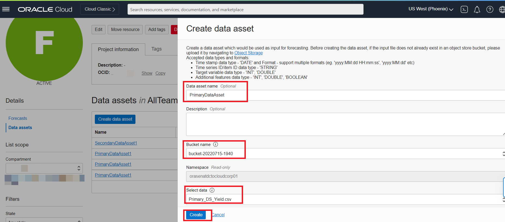
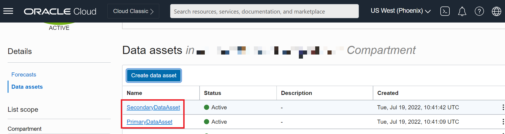
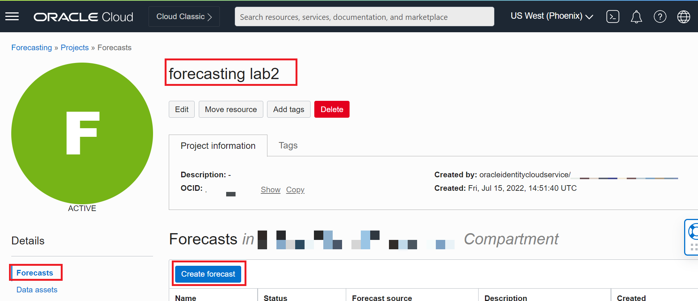
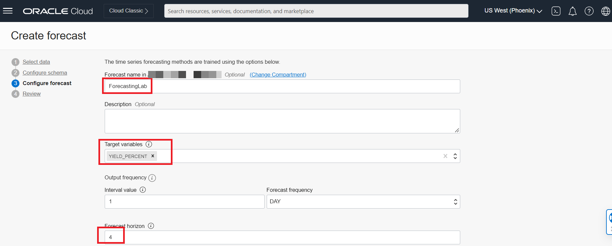

# Evaluate yield forecast using OCI forecasting service

## Introduction

Accessing the product yield and quality is one of the essential task for manufacturing industry which helps them in rapid decision making for companies. Yield Forecasting helps in accessing what and when to manufacture based on different external KPIs such as product demand, advertisement and campaign data sets .

OCI Forecasting is a fully managed AI service that uses machine learning and statistical algorithms to deliver highly accurate time-series forecasts. It is capable of handling univariate or multivariate use-cases and can forecast variety of business metrics including product demands, sales, service requests etc. The service builds multiple models and ensembles to create the best one to maximize forecast accuracy using AutoML. It delivers forecasts with confidence interval and explain ability to bring transparency and aid in appropriate business decisions.

Estimated Lab Time: 30 minutes

### Objectives

In this lab, you will Learn:
* About OCI Forecasting service
* How to upload objects in bucket
* How to create datasets for Forecasting service

### Prerequisites

This lab assumes you have:
* An Oracle Cloud Account
* Additional prerequisites (cloud services) are mentioned per lab
* Familiar with OCI Policy.
* The service is now available in OC1- Phoenix region.
* Familiar with Python programming for SDK usage is recommended.
* Request access to OCI Forecasting + review policy requirements.

## Task 1: Understand and Download AI Forecasting datasets

Download the data sets below from given link.

* prim-load-yield.csv         \-This contain around 1 year primary data for forecasting.
* additional-datasetyield.csv \-This is additional data set with 1 more dimension (down time) for forecasting
* Download the [prim-load-yield](files/prim-load-yield.csv).
* Download the [additional-datasetyield](files/additional-datasetyield.csv).

## Task 2: Upload Forecasting Datasets to Object Store
Follow these steps to upload datasets to object store.

1. In the console navigation menu, click **Storage**.

2. Under **Object Storage & Archive Storage**, click **Buckets**.

  

3. Click **Create Bucket** button. The **Create Bucket** page is displayed.

4. Provide the appropriate bucket name and leave rest as defaults and click **Create**.

  

5. Click on created bucket.

6. Click on **Edit Visibility** button and choose option **Public** and **Save Changes**.

	

	

7. Click on **Upload button** in the bottom of page and choose option **select files**.

8. Browse the forecasting datasets and after selecting click on **Upload** button.

	

## Task 3: Create Forecasting Project
Follow these steps to create Forecasting model.

1. Select region as **US West (Phoenix)**.
2. In the console navigation menu, click **Analytics & AI** .
3. Under **AI services**, click **Forecasting**.
	
4. From the Forecasting Console page, under **Forecasting**, click **Projects**.
   The **Project List** page is displayed.
5. Click **Create Project**.
   The **Create Project** panel is displayed.
6. Select a **Compartment** to create the Project.
7. Give appropriate Project **Name**.  
8. (Optional) Enter a **Description** for the Project. It should help other identify it.
9. Click **Create Project**.
	 	

## Task 4: Create Data Assets
Before we can create any forecast we need to create a data asset which is ideally telling the AI Service to use that as the training dataset to create the forecast.

Follow these steps to upload datasets to object store.

1. From the Forecasting Console page, under **Forecasting**, click **Projects**.
   The **Project List** page is displayed.
	 	
2. Select the project created in previous task.
3. Choose **Data Assets** from the left and click on **Create data asset** button.
    
4. Give appropriate **Data asset Name** , **Bucket name** and select the dataset from the bucket.  
5. (Optional) Enter a **Description** for the data asset. It should help other identify it.
6. Click **Create**.
   
7. Create dataset should appear in the list
   
8. Repeat above process for additional data set as well.

## Task 5: Create Forecast for data asset created

In this task we will learn how to create a forecast using the AI Forecasting service.

Follow these steps to upload datasets to object store.

1. From the project Console page, choose **Forecasts** and click on **Create Forecast** button.
  
2. Choose option **Choose existing data asset** and select **Data asset** & **Additional training data asset**which were created  in previous task. Click Next.
  
	
3. Fill **Column Name** & **Data type** for both data assets along with Time **stamp column format**, **Data frequency** & **Time stamp  column name**. Click **Next**.
  
	
4. Give appropriate **Forecast name** and choose a **Target variables** (should not be string) from the data asset for forecasting. Fill up the **Forecast horizon** (i.e. Number of time steps into the future for which we want the forecasts) and choose **Is data grouped**? field as Data is grouped for this lab and click **Next**.
  
	
5. Review the form and click on **Submit**.
  
6. Within few minutes the Forecast should appear with status as **Active**.
  

## Task 6: Review Forecasting Model.

Lets look at the forecasting results in this part of the Lab.

Once training and selecting the best model based on Hyperparameter tuning and ROCV error is done i.e. AUTOML has done its magic you can view the results for each time series.

From the multiple time series choose A05 from the drop down and you can the respective visualizations including the details for the type of algorithm, Preprocessing etc.

## Learn More

* [Oracle Docs](http://docs.oracle.com)

## Acknowledgements
* **Author**
    * Biswanath Nanda, Principal Cloud Architect, Cloud Engineering
    * Jyothish Busipalle, Principal Cloud Architect, Cloud Engineering
    * Pavan Upadhyay, Principal Cloud Engineer, Cloud Engineering
* **Last Updated** - September 2022
