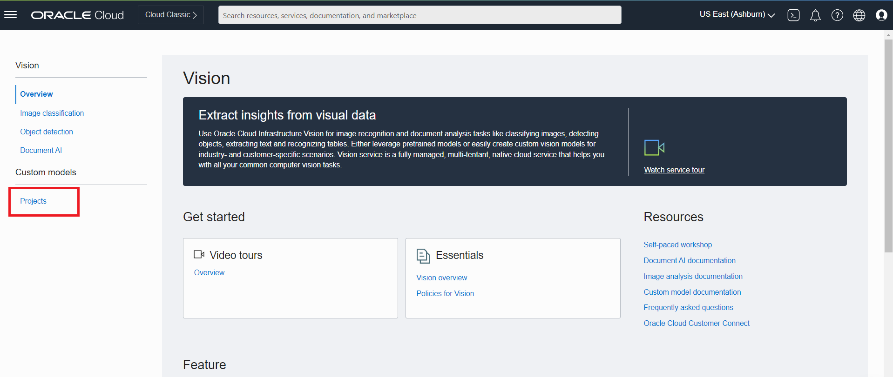
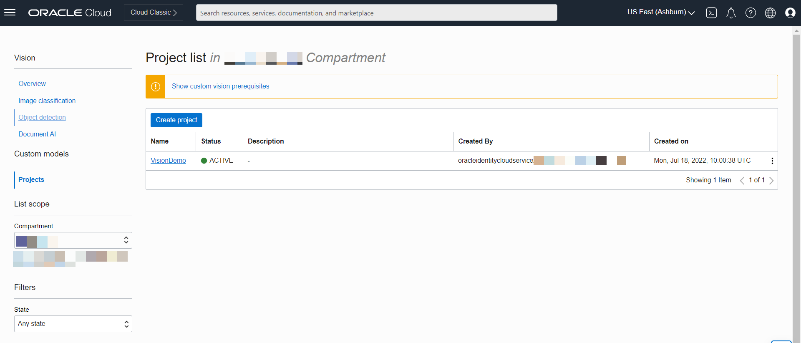

# Evaluate quality defects using OCI vision service

## Introduction

In this section of the demonstration, we will be showcasing how AI Vision Services can be used to identify visual quality defects of a chip wafer. OCI Vision Services provides you the liberty to bring your pictures or video images to the Oracle cloud and design Object Detection, Image Classification, and Documentation AI. In the manufacturing industry, we can perfectly use Vision service to automate the activities involving visual inspection and identification of Product quality and defects.

**“The global image recognition market size was USD 23.82 billion in 2019 and is projected to reach USD 86.32 billion by 2027, exhibiting a CAGR of 17.6% during the forecast period.”**

### **OCI Vision Introduction**

Oracle Cloud Infrastructure (OCI) Vision is an AI service for performing deep-learning–based image analysis at scale. Vision is a serverless, multi-tenant service, accessible using the Console, or over REST APIs. It enables you to upload images to detect and classify objects in them. If you have lots of images, you can process them in batch via asynchronous API endpoints

### **OCI Vision Features**

* **Computer vision models built for the enterprise** - Pretrained models, optimized for business
* **Robust document analysis capabilities** - Understand documents
* **Models customized to business domain** - Train models quickly
* **Efficient and simple architecture** - Integrate and deploy easily

### **Image Analysis**

* Object Detection is a fundamental image analysis feature. You can detect and locate the objects in an image. For example, the image is of a product, Manufacturing arms, and Vision locates the objects therein such as different product components/defects. It then draws bounding boxes around the objects and identifies them. You can also use it for visual anomaly detection.
* Image Classification is a fundamental image analysis feature. Upload an image to Object Storage and you can put it in pre-determined classes, based on the objects within it.

### **Pretrained Models**

* Object detection: Vision detects the location of objects in an image, such as a person, a car, a tree, or a dog. The output includes the bounding box coordinates for each object found.
* Image classification: Vision categorizes scene-based features and objects in an image.
* Optical Character Recognition (OCR): Vision can locate and digitize text in an image.

### **Custom Models**

* Build a model to detect the location of custom objects in an image. The output includes the bounding box coordinates for each object found.
* Custom image classification: Build a model to identify objects and scene-based features in an image.

Estimated Time: 30 minutes

### Objectives
In this workshop, you will:

* Learn how to use OCI Vision service for quality detection using the product output images.
* Learn how to train an image classification or object detection model through the OCI console

### Prerequisites

* An Oracle Cloud Account
* Additional prerequisites (cloud services) are mentioned per lab
* Familiar with OCI Policy.
* Familiar with Python programming for SDK usage is recommended.
* Request access to OCI Vision + review policy requirements

Note – For In-depth knowledge of AI Vision service, please refer to the below Livelabs

[https://apexapps.oracle.com/pls/apex/dbpm/r/livelabs/view-workshop?wid=931&clear=180&session=953867760403](https://apexapps.oracle.com/pls/apex/dbpm/r/livelabs/view-workshop?wid=931&clear=180&session=953867760403)

## Task 1: Create a project

Follow these steps to create a Project in Vision.

   1. In the console navigation menu, click **Analytics & AI**.
   2. Under **AI Services**, click **Vision**.
   3. From the Vision Console page, under **Custom Models**, click **Projects**.
      The **Project List** page is displayed.
   4. Click **Create Project**.
      The **Create Project** panel is displayed.
   5. Select a **Compartment** to create the Project.
   6. Give the Project a **Name**. For example Vision demo. Avoid entering confidential information.
   7. (Optional) Enter a **Description** for the Project. It should help others identify it.
   8. Click **Create Project**.

    
	
	

## Task 2: Create Custom Model

In Choose Model type to train Select **Object detection**.
| Feature              | Description                                    | Details on Console                                                                                                                                                                                                                                                                                                                                                                         |
| -------------------- | ---------------------------------------------- | ------------------------------------------------------------------------------------------------------------------------------------------------------------------------------------------------------------------------------------------------------------------------------------------------------------------------------------------------------------------------------------------ |
| Image classification | Categorizes object(s) within an image          | Select "Image Classification." Labels and confidence scores will appear under the Results pane. [Reference](https://oracle-livelabs.github.io/analytics-ai/oci-artificial-intelligence/ai-vision/analyze-vision/images/image-classification.png)                                                                                                                                           |
| Object detection     | Locates and identifies objects within an image | Select "Object Detection." Objects, confidence score, and highlighted bounding box will all appear under the Results pane. Clicking on one of the labels on the results pane will also highlight where on the image that object was detected. [Reference](https://oracle-livelabs.github.io/analytics-ai/oci-artificial-intelligence/ai-vision/analyze-vision/images/object-detection.png) |

**Select Training Data**
 Training datasets can be chosen either from an existing Object Storage bucket or create a new data set from the OCI Data Labelling Service. (which we will cover in other Live Labs)

 For this Live Lab please download the [training dataset](files/manufacturing-lakehouse.json) and upload it to Object storage.

 For training dataset **Choose existing dataset** and select the **object storage** location of the training dataset and click **Next**.

 Enter a **Name** for the custom model.

 Give the model a description (Optional)  to help you find it.

 

 **Train Custom Vision Model**

 Select the **Training duration**.

  * **Recommended training** - Vision automatically selects the training duration to create the optimal model. The training might take up to 24 hours.

  * **Quick training** - This option produces a model that is not fully optimized but is available in about an hour.

  * **Custom** - This option allows you to set your maximum training duration (in hours).

Review the information you provided in the previous steps. You can make any changes, by clicking **Previous**.

When you want to start training the custom model, click **Create and train**.

Once the model is trained you can see the different metrics of the model to understand how the model is performing.

## Task 3: Test Vision Model

Once the model completes training, let's test the model.

To test the model, you can choose an image from the local machine or an object Storage bucket.

For this lab, you can download [Images](https://c4u04.objectstorage.us-ashburn-1.oci.customer-oci.com/p/EcTjWk2IuZPZeNnD_fYMcgUhdNDIDA6rt9gaFj_WZMiL7VvxPBNMY60837hu5hga/n/c4u04/b/livelabsfiles/o/labfiles/OCE-20220913.zip) and use any of these images for testing Vision model.

As per the model, the results are obtained as seen in the image depending on the training labels as per the requirements using OCI Data Labelling Service.

**Congrats on completing this Lab**

Conclusion
From the case study, we learn the Manufacturing defects identified were false positives. The real issue was with the presence of dust particles in the Camera sensor lens which was taking images.

As seen from the analysis the AI vision service was successfully able to identify the dust particles and solve a quality issue.

## Learn More

* [Oracle Docs](http://docs.oracle.com)

Reference -

[ https://www.alliedmarketresearch.com/image-recognition-market](https://www.alliedmarketresearch.com/image-recognition-market)

[ https://www.fortunebusinessinsights.com/industry-reports/image-recognition-market-101855](https://www.fortunebusinessinsights.com/industry-reports/image-recognition-market-101855)

## Acknowledgements
* **Author**
    * Biswanath Nanda, Principal Cloud Architect, Cloud Engineering
    * Jyothish Busipalle, Principal Cloud Architect, Cloud Engineering
    * Pavan Upadhyay, Principal Cloud Engineer, Cloud Engineering
* **Last Updated** - September 2022
