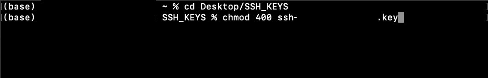
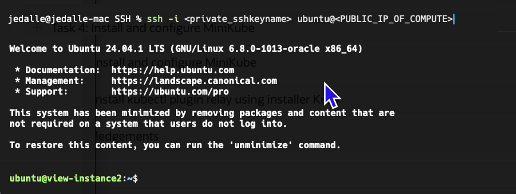

# Setting up the compute instance and installing the dependencies

## Introduction

In this lab we will use the compute instance created in the previous lab to install dependencies and software packages needed to deploy and run our application. 

Estimated Time: 25 minutes


### Objectives
In this lab, you will:
- Install all required drivers, utilities, and packages on the host
- Clone llama.cpp for inference

## Task 1: Connect to Your Instance via SSH
1. In cloud shell terminal or your machine's terminal, navigate to the directory where your SSH keys are stored. To get there, enter the command:

    ```
    <copy>cd ~/path_to_ssh_directory</copy>
    ```
2.  Enter **ls** to view the files in this directory and verify your SSH key file exists.

3. Change the permissions of private key file, enter the command:
    ```
    chmod 400 <private_sshkeyname>
    ``` 

    

4.  Now we will SSH into your compute instance, enter the command:
    ```
    ssh -i <private_sshkeyname> ubuntu@<PUBLIC_IP_OF_COMPUTE>
    ``` 

      **HINT:** If 'Permission denied error' is seen, ensure you are using '-i' in the ssh command. You MUST type the command, do NOT copy and paste ssh command.

5.  Enter 'yes' when prompted for the security message to permanently trust this host.

6.  Verify ubuntu@`<COMPUTE_INSTANCE_NAME>` appears on the prompt.
       

## Task 2: Install NVIDIA GPU Driver (535 Server)

1.   Navigate to the terminal.  
We need to install the nvidia drivers and other components, but first a few best practices.  
We first will refresh the package list with the versions available in the repos.  
Then we will upgrade all installed packages & libraries.  
Enter the follow commands:
    ```
    <copy>
    sudo apt update
    sudo apt upgrade -y
    </copy>
    ```
    Your output should be similar to this:
    ```
ubuntu@ubuntua10-1:~$ sudo apt -y update
Hit:1 http://security.ubuntu.com/ubuntu noble-security InRelease
Get:2 http://iad-ad-3.clouds.archive.ubuntu.com/ubuntu noble InRelease [256 kB]
Get:3 http://iad-ad-3.clouds.archive.ubuntu.com/ubuntu noble-updates InRelease [126 kB]
Get:4 http://iad-ad-3.clouds.archive.ubuntu.com/ubuntu noble-backports InRelease [126 kB]
Fetched 508 kB in 1s (583 kB/s)  
Reading package lists... Done
Building dependency tree... Done
Reading state information... Done
57 packages can be upgraded. Run 'apt list --upgradable' to see them.
N: Missing Signed-By in the sources.list(5) entry for 'http://iad-ad-3.clouds.archive.ubuntu.com/ubuntu'
N: Missing Signed-By in the sources.list(5) entry for 'http://iad-ad-3.clouds.archive.ubuntu.com/ubuntu'  

ubuntu@ubuntua10-1:~$ sudo apt upgrade -y
Reading package lists... Done
Building dependency tree... Done
Reading state information... Done
Calculating upgrade... Done
The following NEW packages will be installed:
  linux-headers-6.8.0-1024-oracle linux-image-6.8.0-1024-oracle linux-modules-6.8.0-1024-oracle linux-modules-extra-6.8.0-1024-oracle
  linux-oracle-headers-6.8.0-1024 linux-oracle-tools-6.8.0-1024 linux-tools-6.8.0-1024-oracle
The following upgrades have been deferred due to phasing:
  grub-common grub-efi-amd64-bin grub-efi-amd64-signed grub-pc grub-pc-bin grub2-common ubuntu-pro-client ubuntu-pro-client-l10n
The following packages will be upgraded:
  apparmor cloud-init dirmngr distro-info-data fwupd gnupg gnupg-l10n gnupg-utils gpg gpg-agent gpg-wks-client gpgconf gpgsm gpgv keyboxd libapparmor1
  libarchive13t64 libexpat1 libfwupd2 liblzma5 libnetplan1 libperl5.38t64 libxml2 linux-base linux-headers-oracle linux-image-oracle linux-oracle
  netplan-generator netplan.io openssh-client openssh-server openssh-sftp-server pci.ids perl perl-base perl-modules-5.38 python3-netplan
  python3-software-properties rsyslog software-properties-common tzdata update-notifier-common vim vim-common vim-runtime vim-tiny xxd xz-utils
48 upgraded, 7 newly installed, 0 to remove and 8 not upgraded.
32 standard LTS security updates
Need to get 221 MB of archives.
After this operation, 299 MB of additional disk space will be used.
Get:1 http://iad-ad-3.clouds.archive.ubuntu.com/ubuntu noble-updates/main amd64 libperl5.38t64 amd64 5.38.2-3.2ubuntu0.1 [4871 kB]
Get:2 http://iad-ad-3.clouds.archive.ubuntu.com/ubuntu noble-updates/main amd64 perl amd64 5.38.2-3.2ubuntu0.1 [231 kB]
Get:3 http://iad-ad-3.clouds.archive.ubuntu.com/ubuntu noble-updates/main amd64 perl-base amd64 5.38.2-3.2ubuntu0.1 [1827 kB]
(output  truncated)```
    Wait for the commands to complete.  
    Now it's time to install the Nvidia Driver package.  
    We are using the server version of the driver.  
    This has less bloat and is intended for headless operation. 
    ```
    <copy>
    sudo apt install nvidia-driver-535-server -y
    </copy>
    ```
    You should see output similar to this:
    ```
    ubuntu@ubuntua10-1:~$ sudo apt install nvidia-driver-535-server -y
Reading package lists... Done
Building dependency tree... Done
Reading state information... Done
The following additional packages will be installed:
  binutils binutils-common binutils-x86-64-linux-gnu build-essential bzip2 cpp cpp-13 cpp-13-x86-64-linux-gnu cpp-x86-64-linux-gnu dkms dpkg-dev fakeroot
  (output  truncated)
  ```
    
    nvidia-smi will not function until the system is rebooted. 
    ```
    <copy>
    sudo reboot
    </copy>
    ```
    This reboot will take some time if using a BM instance

    After reboot, run:
    ```
    <copy>
    nvidia-smi 
    </copy>
    ```
    Observe the results which should be similar to this:
    ```
    ubuntu@ubuntua10-1:~$ nvidia-smi
    Thu May  1 18:18:35 2025       
    +---------------------------------------------------------------------------------------+
    | NVIDIA-SMI 535.230.02             Driver Version: 535.230.02   CUDA Version: 12.2     |
    |-----------------------------------------+----------------------+----------------------+
    | GPU  Name                 Persistence-M | Bus-Id        Disp.A | Volatile Uncorr. ECC |
    | Fan  Temp   Perf          Pwr:Usage/Cap |         Memory-Usage | GPU-Util  Compute M. |
    |                                         |                      |               MIG M. |
    |=========================================+======================+======================|
    |   0  NVIDIA A10                     Off | 00000000:00:04.0 Off |                    0 |
    |  0%   34C    P0              53W / 150W |      0MiB / 23028MiB |     15%      Default |
    |                                         |                      |                  N/A |
    +-----------------------------------------+----------------------+----------------------+
                                                                                            
    +---------------------------------------------------------------------------------------+
    | Processes:                                                                            |
    |  GPU   GI   CI        PID   Type   Process name                            GPU Memory |
    |        ID   ID                                                             Usage      |
    |=======================================================================================|
    |  No running processes found                                                           |
    +---------------------------------------------------------------------------------------+
    ```
    


## Task 3: Install NVIDIA CUDA Toolkit v12
1. In the terminal window, run the following command:
     ```
    <copy>
    sudo apt install nvidia-cuda-toolkit -y
    </copy>
    ```
    
    Note: You can also run sudo apt show nvidia-cuda-toolkit to see version options in your configured repo (which we have not altered).  
    There are other ways to do perform this install, but this is the easiest.  
    
    After installation, you can run the following command to verify the installation succeeded and see the installed version:
    ```
    <copy>
    nvcc --version 
    </copy>
    ```
    


## Task 4: Install required packages needed to build the inference engine

1. Some steps in this lab have dependencies of specific packages. Let's install those now:
    ```
    <copy>
    sudo apt install git build-essential cmake libopenblas-dev libcurl4-openssl-dev -y
    </copy>
    ```
    Your output should be similar to this:
    ```
    ubuntu@ubuntua10-1:~$ sudo apt install git build-essential cmake libopenblas-dev libcurl4-openssl-dev -y
Reading package lists... Done
Building dependency tree... Done
Reading state information... Done
git is already the newest version (1:2.43.0-1ubuntu7.2).
git set to manually installed.
build-essential is already the newest version (12.10ubuntu1).
build-essential set to manually installed.
The following additional packages will be installed:
  cmake-data libgfortran5 libjsoncpp25 libopenblas-pthread-dev libopenblas0 libopenblas0-pthread librhash0
Suggested packages:
  cmake-doc cmake-format elpa-cmake-mode ninja-build libcurl4-doc libidn-dev libkrb5-dev libldap2-dev librtmp-dev libssh2-1-dev libssl-dev pkg-config zlib1g-dev
The following NEW packages will be installed:
  cmake cmake-data libcurl4-openssl-dev libgfortran5 libjsoncpp25 libopenblas-dev libopenblas-pthread-dev libopenblas0 libopenblas0-pthread librhash0
  (output  truncated)
  ```

## Task 5: Clone llama.cpp

1. We need to clone the inference engine (llama.cpp) from github so we can execute it locally on our instance. 
    ```
    <copy>
    git clone https://github.com/ggerganov/llama.cpp.git
    </copy>
    ```  
Now we will execute some commands that assume we are inside the llama.cpp directory structure. 
    ```
    <copy>
    cd ~/llama.cpp
    </copy>
    ``` 

Funfact: cpp stands for C++ and there are plenty of other cpp models out there like whisper.cpp that allow you to input audio files and turn them into text.  

T minus 3  

*Congratulations! You have successfully completed the lab.*<br/>
You may now **proceed to the next lab**.
## Acknowledgements
* **Author** - Jeff Allen, Distinguished Cloud Architect, AI Accounts
* **Contributors** -  Animesh Sahay, Enterprise Cloud Engineering
* **Last Updated:** - May 2025
