# Setting up the compute instance and installing the dependencies

## Introduction

In this lab we will use the compute instance created in the previous lab to install dependencies and software packages needed to deploy and run our application. 

Estimated Time: 20 minutes

## Task 1: SSH into the compute instance
1. In cloud shell terminal or your machine's terminal, navigate to the directory where your SSH keys are stored. To get there, enter the command:

    ```
    <copy>cd ~/path_to_ssh_directory</copy>
    ```
2.  Enter **ls** to view the files in this directroy and verify your SSH key file exists.

3. Change the permissions of private key file, enter the command:
    ```
    <copy>
    chmod 400 <private_sshkeyname>
    </copy>
    ``` 

    

4.  Now we will SSH into your compute instance, enter the command:
    ```
    <copy>ssh -i <private_sshkeyname> opc@<PUBLIC_IP_OF_COMPUTE></copy>
    ``` 

    Check the details of your compute instance in the OCI web console to the **```PUBLIC_IP_ADDRESS```**

    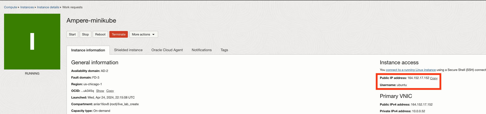

    **HINT:** If 'Permission denied error' is seen, ensure you are using '-i' in the ssh command. You MUST type the command, do NOT copy and paste ssh command.

5.  Enter 'yes' when prompted for the security message.

6.  Verify opc@`<COMPUTE_INSTANCE_NAME>` appears on the prompt.
        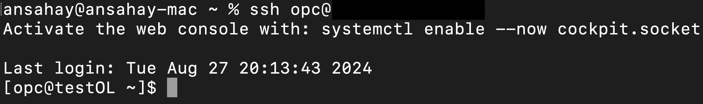   

## Task 2: Configure networking and enable ports

1. Navigate to the terminal. First we will update existing libraries. Enter the follow:
    ```
    <copy>
    sudo dnf -y update
    </copy>
    ```
    The command prints done on terminal when finished.

2. Next we will disable the firewall to allow ICMP requests. Enter the command:
    ```
    <copy>
    sudo systemctl stop firewalld
    </copy>
    ```
    ```
    <copy>
    sudo systemctl disable firewalld
    </copy>
    ```
    

    Check the status of stopped firewall:
    ```
    <copy>
    systemctl status firewalld
    </copy>
    ```
    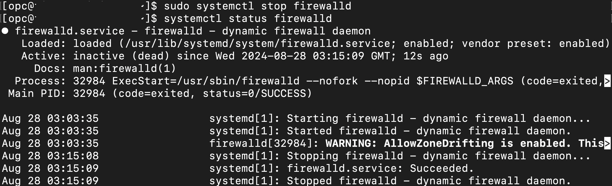 

    To exit from this screen, press `q`.

3. Install the iptables-services packages and start/enable iptables service. Enter the commands:
    ```
    <copy>
    sudo yum install -y iptables-services.aarch64
    </copy>
    ```
    ```
    <copy>
    sudo systemctl start iptables
    </copy>
    ```
    ```
    <copy>
    sudo systemctl enable iptables
    </copy>
    ```
    These commands do not return any output.

4. Update the iptables to allow traffic on the deployment ports. Enter following commands:
    ```
    <copy>
    sudo iptables -I INPUT -m state --state NEW -p tcp --dport 443 -j ACCEPT
    </copy>
    ```
    ```
    <copy>
    sudo iptables -I INPUT -m state --state NEW -p tcp --dport 80 -j ACCEPT
    </copy>
    ```
    ```
    <copy>
    sudo iptables -I INPUT -m state --state NEW -p tcp --dport 8008 -j ACCEPT
    </copy>
    ```
    ```
    <copy>
    sudo iptables -I INPUT -m state --state NEW -p tcp --dport 5005 -j ACCEPT
    </copy>
    ```
    The above commands don't return any values. Save the iptable using the following command. Enter the command: 
    ```
    <copy>
    sudo service iptables save
    </copy>
    ```
    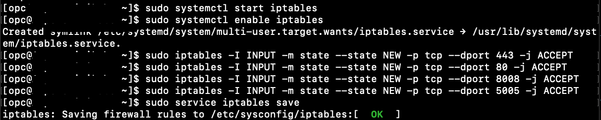

    Verify the additions to iptable. Enter the command:
    ```
    <copy>
    sudo cat /etc/sysconfig/iptables
    </copy>
    ```
    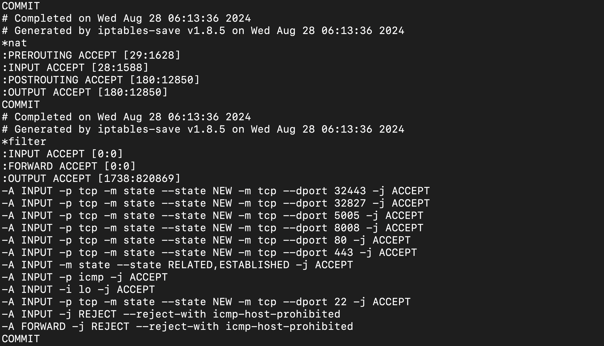

4. Now enable port forwarding at the OS level. Enter the command:
    ```
    <copy>
    sudo sysctl -w net.ipv4.ip_forward=1 
    </copy>
    ```

    This returns the value ```net.ipv4.ip_forward=1```.

    **Note**: Due to inactivity the SSH connection may break and you might get an error **```opc@a1-instance:/$ client_loop: send disconnect: Broken pipe```**, SSH back into the instance again in that case.

## Task 3: Install and configure Docker

1. Now we will navigate to the home directory of the terminal. To do so, enter:
    ```
    <copy>
    cd ~
    </copy>
    ```

2. Let's install the required dependencies:
    ```
    <copy>
    sudo dnf -y install yum-utils
    </copy>
    ```

3. Add the Docker CE repository to your system, Enter the commands:
    ```
    <copy>
    sudo dnf config-manager --add-repo=https://download.docker.com/linux/centos/docker-ce.repo
    </copy>
    ```
    
    Install docker:
    ```
    <copy>
    sudo dnf install docker-ce docker-ce-cli containerd.io
    </copy>
    ```
    Start the Docker service and enable it to start on boot. Enter the command:
    ```
    <copy>
    sudo systemctl start docker
    sudo systemctl enable docker
    </copy>
    ```

    Verify that Docker was installed correctly:
    ```
    <copy>
    sudo systemctl status docker
    </copy>
    ``` 

    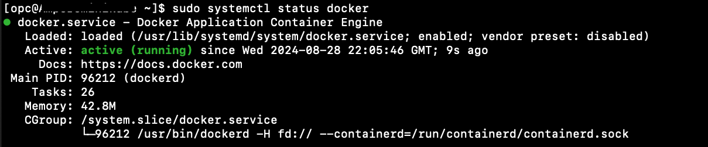


    **Hint**: For more information check [docker documentation](https://docs.docker.com/engine/install/ubuntu/).

3. Verify that the Docker Engine installation is successful by running the **hello-world** image.
     ```
    <copy>
    sudo docker run hello-world
    </copy>
    ```
    This command downloads a test image and runs it in a container. When the container runs, it prints a confirmation message and exits.

    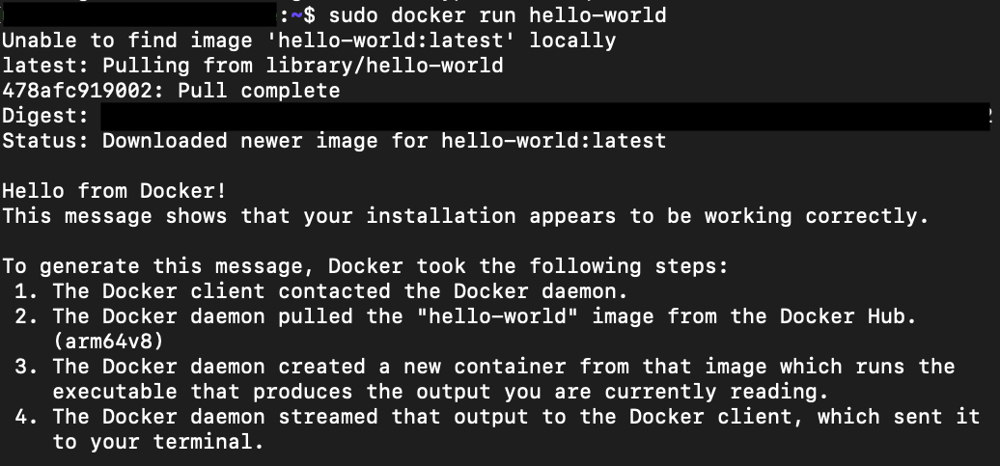

4. Now let's add docker to the user group for Oracle Linux and restart, Enter:
     ```
    <copy>
    sudo usermod -aG docker $USER && newgrp docker
    </copy>
    ```

    Now we'll restart docker. Enter:
    ```
    <copy>
    sudo systemctl restart docker
    </copy>
    ```

    **Note**: Due to inactivity the SSH connection may break and you might get an error **```opc@a1-instance:/$ client_loop: send disconnect: Broken pipe```**, SSH back into the instance again in that case.

## Task 4: Install and configure MiniKube

1. Before installing minikube, install git. Enter the command:
    ```
    <copy>
    sudo dnf install -y git
    </copy>
    ```

2.  To install the latest minikube stable release on ARM64 Linux using binary download, enter the command:
     ```
    <copy>
    curl -LO https://storage.googleapis.com/minikube/releases/latest/minikube-linux-arm64
    </copy>
    ```
    ```
    <copy>
    sudo install minikube-linux-arm64 /usr/local/bin/minikube && rm minikube-linux-arm64
    </copy>
    ```

3. Verify the minikube installation, enter the command:
    ```
    <copy>
    minikube version
    </copy>
    ``` 
    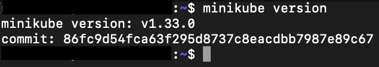

    **Note**: For more information check [minikube documentation](https://minikube.sigs.k8s.io/docs/start/).

4. Install kubectl if not already installed. Enter the command:
    ```
    <copy>
    curl -LO "https://dl.k8s.io/release/$(curl -L -s https://dl.k8s.io/release/stable.txt)/bin/linux/arm64/kubectl"
    </copy>
    ```
    ```
    <copy>
    sudo install -o root -g root -m 0755 kubectl /usr/local/bin/kubectl
    </copy>
    ``` 
    Verify kubectl installation:
    ```
    <copy>
    kubectl version --client
    </copy>
    ```  
    The output will be the latest version of kubectl, at the time of the creation of this lab that version is:

    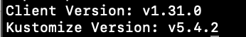

    **Note**: Due to inactivity the SSH connection may break and you might get an error **```opc@a1-instance:/$ client_loop: send disconnect: Broken pipe```**, SSH back into the instance again in that case.

## Task 5: Install kubectl plugin relay using installer Krew

1. Krew itself is a kubectl plugin that is installed and updated via Krew. To install Krew, we will enter the command:
    ```
    <copy>
    (
        set -x; cd "$(mktemp -d)" &&
        OS="$(uname | tr '[:upper:]' '[:lower:]')" &&
        ARCH="$(uname -m | sed -e 's/x86_64/amd64/' -e 's/\(arm\)\(64\)\?.*/\1\2/' -e 's/aarch64$/arm64/')" &&
        KREW="krew-${OS}_${ARCH}" &&
        curl -fsSLO "https://github.com/kubernetes-sigs/krew/releases/latest/download/${KREW}.tar.gz" &&
        tar zxvf "${KREW}.tar.gz" &&
        ./"${KREW}" install krew
    )
    </copy>
    ``` 
2. Add the **$HOME/.krew/bin** directory to your PATH environment variable. To do this, update your **.bashrc** file:
    ```
    <copy>
    nano ~/.bashrc
    </copy>
    ``` 
    Append the following line at the end of the file:
    ```
    <copy>
    export PATH="${KREW_ROOT:-$HOME/.krew}/bin:$PATH"
    </copy>
    ``` 

    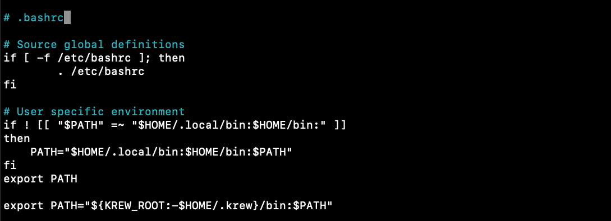

    Close the exit from editor and restart the **.bashrc** file to save, enter the command:
    ```
    <copy>
    source ~/.bashrc
    </copy>
    ``` 
3. Check the installation, enter the command:
    ```
    <copy>
    kubectl krew version
    </copy>
    ``` 
    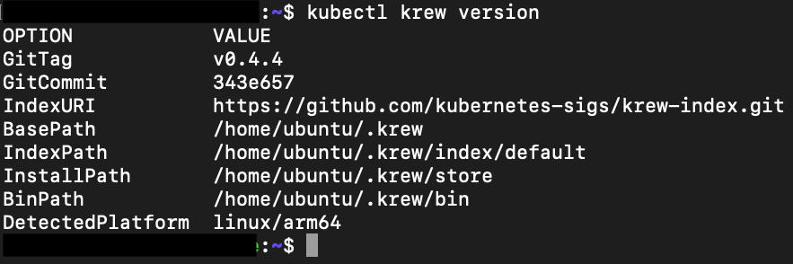

4. Install kubectl plugin **relay** using **krew**, enter the command:
    ```
    <copy>
    kubectl krew install relay
    </copy>
    ``` 
    This returns with a warning which can be ignored.

    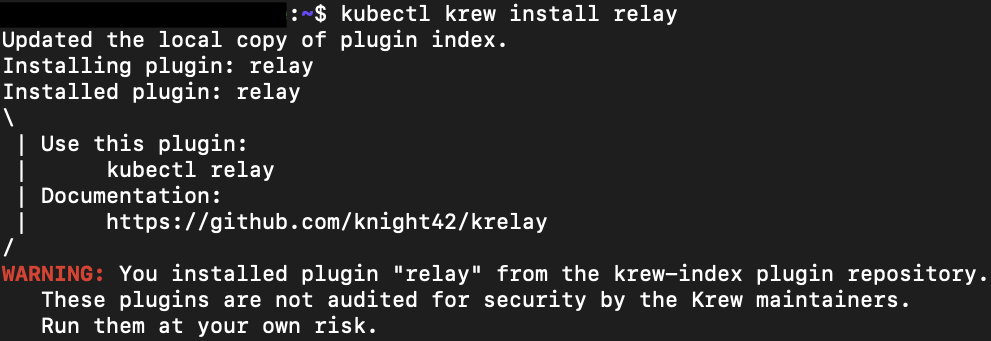

     **Note**: For more information check [krew documentation](https://krew.sigs.k8s.io/docs/user-guide/setup/install/).

*Congratulations! You have successfully completed the lab.*<br/>
You may now **proceed to the next lab**.
## Acknowledgements
* **Author** - Animesh Sahay and Francis Regalado, Enterprise Cloud Architect, OCI Cloud Venture
* **Contributors** -  Andrew Lynch, Director Cloud Engineering, OCI Cloud Venture
* **Last Updated By/Date** - Animesh Sahay, August 2024
