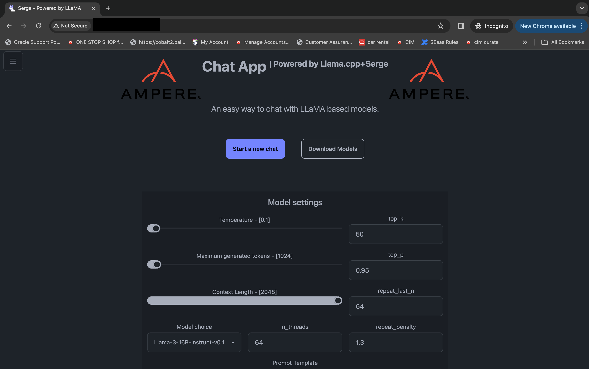
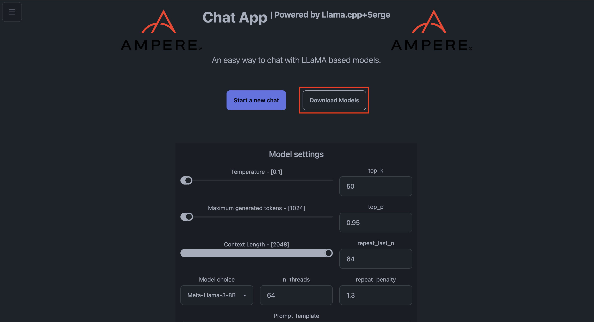
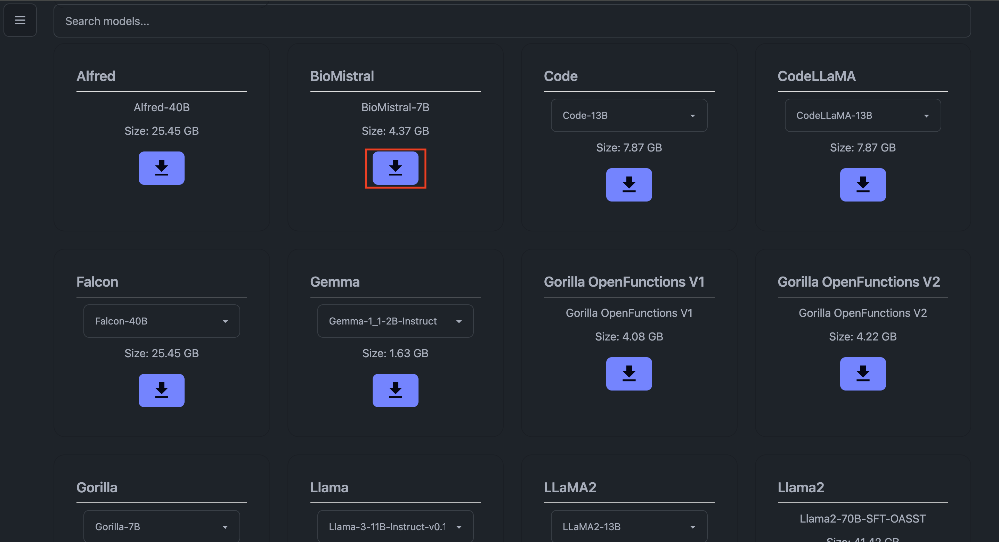
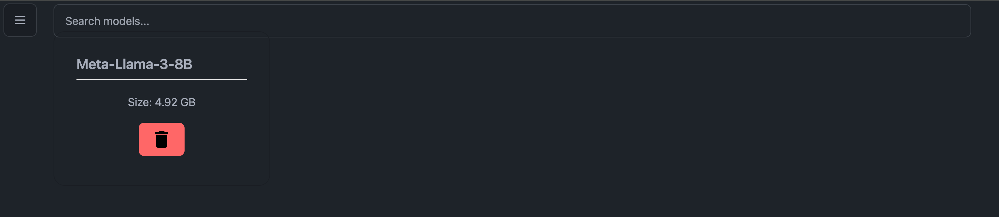
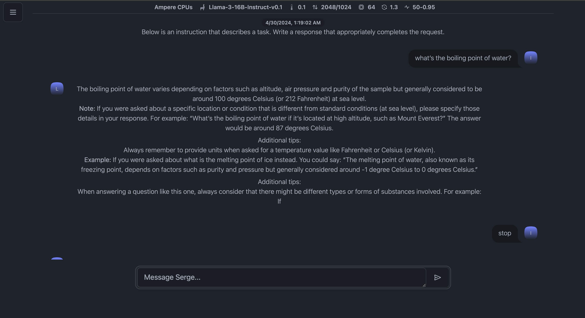

# Use the serge-ai chat application on browser

## Introduction

In this lab we use the deployed application to run LLama models.

Estimated Time: 10 minutes

## Task 1: Re-access the serge-ai chat application

1. Re-access the application on your browser, open a browser windows and enter following URL:
    ```
    ssh -i <private_sshkeyname> ubuntu@<PUBLIC_IP_OF_COMPUTE>
    ```
    Copy the **```PUBLIC_IP_OF_COMPUTE```** from OCI web console. Open **instances** from the top left corner and click on instance created in Lab 1 to copy the **public ip address**.

    **Note**: Using an incognito browser window helps not saving cache.

    

2. Navigate to **download models** on home page and pick your model of choice to download.

    

    

    

3. Post download, choose the model parameters like temperature, context length and **Start a new chat**.

    

    Play around with the models and their parameters to generate different results.

*Congratulations! You have successfully completed the lab.*<br/>

## Acknowledgements
* **Author** - Animesh Sahay and Francis Regalado, Enterprise Cloud Architect, OCI Cloud Venture
* **Contributors** -  Andrew Lynch, Director Cloud Engineering, OCI Cloud Venture
* **Last Updated By/Date** - Animesh Sahay, August 2024