# Transcode and Stream video

## Introduction


This lab gives step-by-step guidance to transcode the video to various formats, varying bitrates, different sizes. Next, we will enable the video to be streamed across multiple device types using OCI.
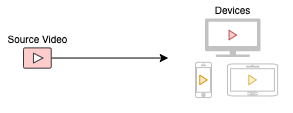

Estimated Time: 90 minutes

#### About OCI Media Services
OCI Media Services is a region-based PaaS(Platform as a Service) service for processing (transcoding) videos and streaming the content with/without CDN (Content Delivery Network), along with options of generating thumbnails and speech to text. It also integrates with OCI Speech to Text service to get the audio transcription. The workshop intends to introduce the features of OCI Media Services with a simple use case to stream the video through OCI.
#### Concepts

**Media Flows**

Media Flows a regionally deployed, fully managed service for processing video (and audio) content. One of the primary uses of the service is transcoding video into outputs suitable for streaming Video on Demand to various device types and desired resolutions. Media Flows simplifies creating streaming formats from source content, so it avoids the need to worry about managing complex video processing infrastructure.

The source video needs to be available in the OCI Object Storage. Media Flows take video from OCI Object Storage Service. Media Flows then performs specified transcoding operations to create an Adaptive Bit Rate (ABR) package in the OCI Object Storage bucket. Media Streams Service or third-party systems that one may choose will take the output from Media Flows to stream the content as video-on-demand. Media Flows can also help generate thumbnails for the video asset and work with OCI AI Speech to Text service to create transcriptions. 

* Media Workflow Task – Smallest defined work for processing at a specific point in the workflow. 
<br>
A simple Media Workflow service consists of one of the below tasks: 
    * GetFile - gets the media asset from OCI Object Storage.
    * Transcode – Creates multiple renditions for the video.
    * Thumbnail – Generates thumbnails for the media asset.
    * Output – Stores the output asset to OCI Object Storage. 
    * Streaming – Optionally, preset the streaming channels for distribution.  
    * Transcription – Optionally, generate the transcript of the media asset.
    * PutFile - Stores all generated outputs back to OCI Object Storage.
	
* Media Workflow - customer-defined workflow to process media content consisting of one or more Media Workflow Tasks that define the video processing.
* Media Workflow Job - Jobs are used to "run" content through a workflow. Typically, a customer will define a handful of Media Workflow and use them to create many jobs. 
* Media Workflow Configuration – Re-usable configurations/parameters used while creating Media Workflow via API / CLI.
* OCI Object Storage – access to the buckets required for Media Services to read/write.

**Media Streams**

Media Streams is a regionally deployed, fully managed service providing scalable distribution and origination for just-in-time packaged ABR video content. It includes packaging features for target format conversion (HLS/DASH), encryption (AES128) or using OCI KMS Service, session-based token, and video segmentation (in Seconds) for ABR streams. Additionally, it provides secure and scalable distribution of the packaged ABR content using AKAMAI CDN origination or directly from OCI edge services or other CDN providers.   Media Streams simplifies the distribution and packaging of streaming formats from source content, avoids worrying about managing complex video packaging infrastructure.

Media Streams work by ingesting HLS (m3u8 files) representing transcoded content in the OCI Object Storage bucket. OCI Media Flows or another third-party transcoding service can generate transcoded content. If using another third-party transcoding service, ensure it complies with the ingest formats supported by Media Streams and resides in OCI Object Storage buckets. 

*  Distribution Channel - a customer-defined combination of origination and packaging configurations.  
*  Packaging Configuration - customer-defined definition for HTTP Live Streaming (HLS) / DASH packaging of video content with optional Encryption.
*  CDN Config Section:  
  * No-CDN - configuration allows streaming just-in-time packaged video content directly from the OCI Edge location.
  * Akamai CDN – Integrate with Akamai account and stream through Akamai.


The complete integration will look like the below from the user's perspective. The User or business flow automation (OCI Functions) will initiate the Media Flow Job using the video content as a parameter to the job. The Media Flow Job will use pre-defined Media Workflow to create thumbnails, transcription, multiple videos with different bitrates & sizes. If the Media Streams distribution channel is preset, it will also ingest the resultant content to Media Streams. 
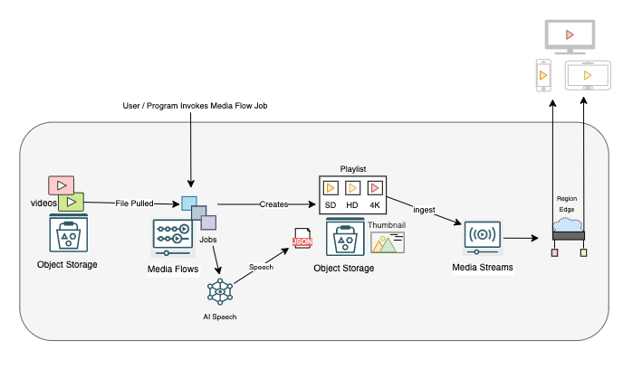

#### Objectives

In this lab, we will:
* Transcode video to HLS (HTTP live streaming) format 
* Stream the transcoded video using OCI

#### Prerequisites
* An Oracle Free Tier or Paid Cloud Account
* Able to create/update IAM policy.
* Familiar with OCI Object Storage usage.
  
## IAM Policy

The OCI Media Service requires some of the other OCI services to operate.
In OCI, Identity Policies define access and access to services. 
The syntax for a policy will be :

```
Allow "subject" to "verb" "resource-type/entity" in "location" where "conditions"
```
The supported verbs include *inspect, read, use* & *manage* in the order of hierarchy access.
For OCI Media Services below resource-type/Entity are supported.
* media-family
    * media-workflow
    * media-asset
    * media-workflow-configuration
    * media-workflow-job
    * media-stream-distribution-channel
    * media-stream-packaging-config
    * media-stream-cdn-config

Two types of policies are needed to work on the labs for media services.

* Granting access for Media Services to OCI Services
Create a create group to streamline the level of access based on the type of individual job role definition.
For simplicity, we create the below with an any-user clause.
create a new policy with the below statement
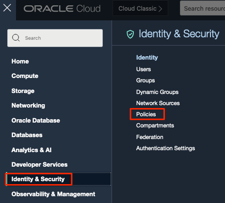

Allow any-user to *verb* *entity* in tenancy

  ```
  allow any-user to use media-family in tenancy
  ```
  

A dynamic group is needed to provide access to resources like OCI Compute or OCI Functions to run Media Flow Jobs. 
Working with the security or identity team is strongly advised for production OCI Tenancies. 


* Allow Media Services to integrate and work with other OCI services. 
Object Storage is mandatory as the files are managed from object storage.

Below policies are required for the Media Flow tasks to perform its duties. 
    ```
      Allow service mediaservices to use object-family in compartment <<videoCompartment>>
      Allow service mediaservices to use keys in compartment <<videoCompartment>>
      Allow service mediaservices to read media-family in compartment <<videoCompartment>>
      Allow service mediaservices to manage ai-service-speech-family in compartment <<videoCompartment>>
    ```
  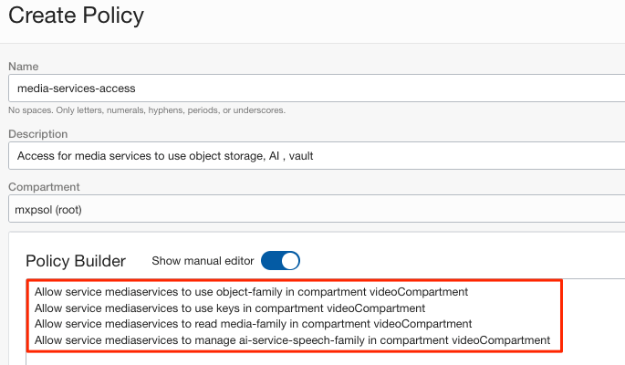

## Task 1: Create Media Flows

Now that we have taken care of the IAM policy, we are ready to create our first Media Flow.
1. Create an OCI Object storage bucket and upload a video to be used for processing.
Ensure the bucket is in the same compartment as the Media Services IAM policies defined.
An error will be faced if no buckets are available in the compartment during  Media Flow creation.
    

|**Supported Input Content**|
|---|
|**Input formats** |
|3GP,ARF,ASF,AVI,P4V,FLV,M1V,M4V,MKV,MP4,MPG,MXF,OGG,OGM,OGV,QT,RM,RMVB,WAV,WEBM,WMA,WMV|
|**Input Video Codecs**|
|H263,H264,H265,MP43,DivX,Xvid,AVC,VP6,FLV1,FLV4,VP8,MPEG-1/2,AVC/MJPG,MPEG-4,Theora,WMV2|
|**Input Audio Codecs**|
|AAC,AAC/FLAC,MP3,EAC3,MP4A,PCM,Vorbis,RAW,WMA6/7,WMA8|

 
 <br>

1. From OCI Console main menu, Select "Analytics & AI" and then "Media Flows".
   
   Above is the landing page for Media Flows.
2. Create the Media Flow. Remember to choose the correct compartment where the IAM policy is defined.
  
In this section, we can perform customization to Media Flow. 

4. Task list is generated. Select the input bucket from the list where Media Flow Job can pull the video for processing. 
   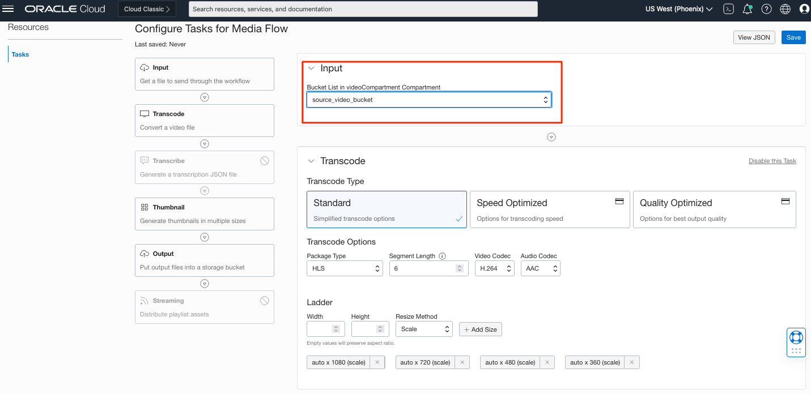 
Leave the other fields in transcode task as default for now.
5. optionally, enable the transcribe task, and it does not require additional input.
    
6. The thumbnail task can also be left in default configuration or disabled.
   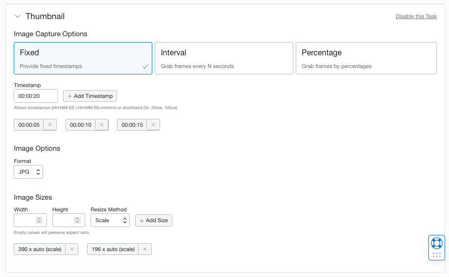 
7. Finally, select the output bucket where the transcoded video and audio files should be stored.
   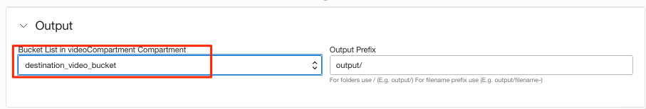 
8. Leave the last task streaming disabled for now, and we will discuss this usage in the next section.
9. Save the media flow and provide a name for the same.
    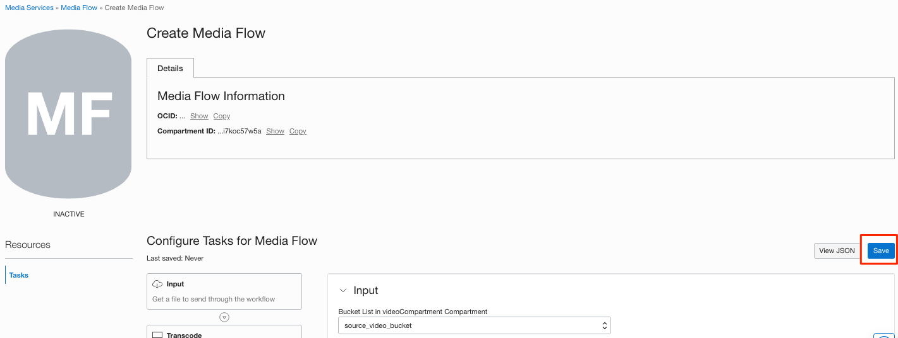 
    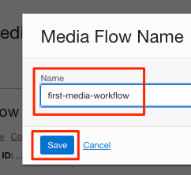 
10. Once saved, the confirmation is shown above and also prompt to run the job.
    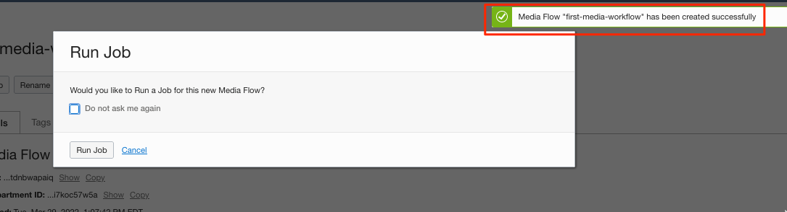 
11. Click "Run Job" and select the video you want to transcode; hit Run job.
     
12. Once the job is submitted, watch the progress and wait for it to complete. Notice that the tasks will indicate the Media Flow job's status as it progresses. 
    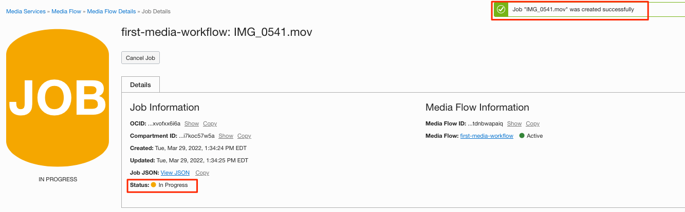 
    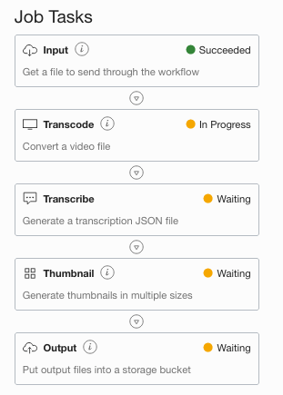 
13. After the job completes, see the output files under the destination bucket.
     

## Task 2: Create Streaming Components

The Media Flow Job completion will bring below type of files:
* Master Playlist (master.m3u8)
* Individual playlist (other m3u8)
* Thumbnail images (jpg)
* Transcription in JSON format if enabled. (folder transcription)
 

1. Navigate to Media Streams from OCI Main Menu 
    
2. Create Distribution Channel
   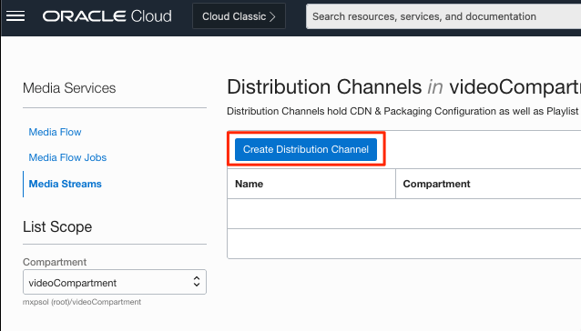
3. Choose EDGE as CDN and provide a name to create the distribution channel.
   
4. Upon creation, the distribution channel information is displayed.
   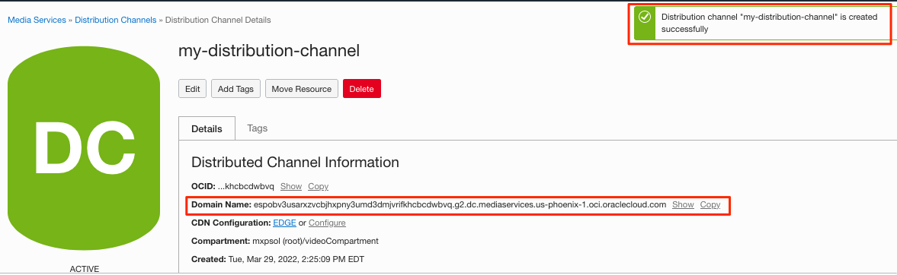
   The domain name will be the streaming hostname.
5. Ingest the Master Playlist into the distribution channel
   
6. Select the destination bucket and output folder to choose the Master Playlist.
   Note: Selecting other playlist will result in error.
   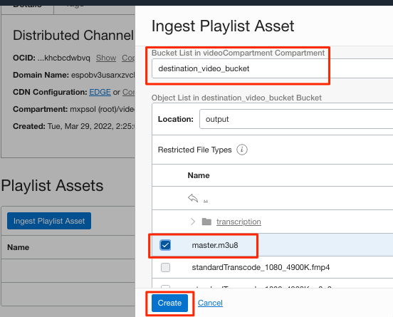
   Notice the ingest job confirmation and status. 
   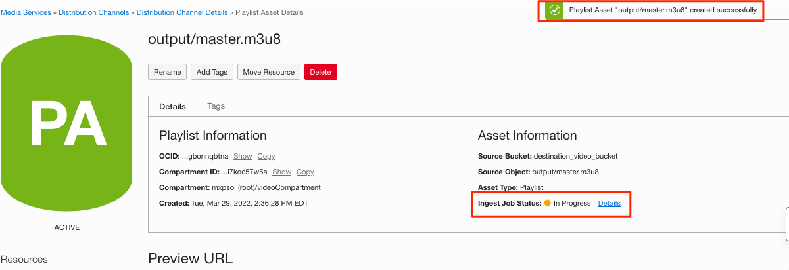
7. Now, we will work on the streaming packaging configuration
   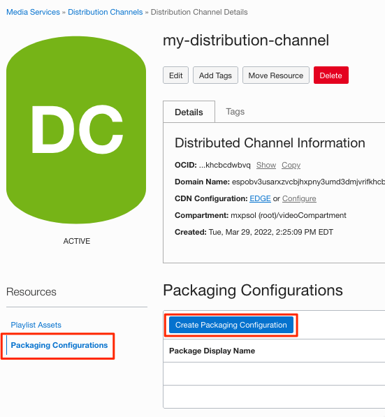
   Select HLS with 6 second as segment time and NONE for encryption. 
   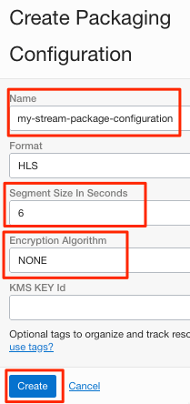

**Note:**  After creating the distribution channel, the distribution channel is available to be selected in the Media Flow streaming task.
Go back to the same Media Flow and enable the streaming task to notice the distribution channel. After selecting, save the Media Flow. 
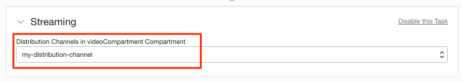

## Task 3: Stream the video

At this point, we have transcoded the source video into multiple bitrates and sizes.
Also, enabled distribution channel configurations are required to stream the video content.

1. Navigate to the ingested master playlist in the distribution channel.
   
2. Look for the ingest job status (succeeded) and select the packaging configuration in the preview URL section.
   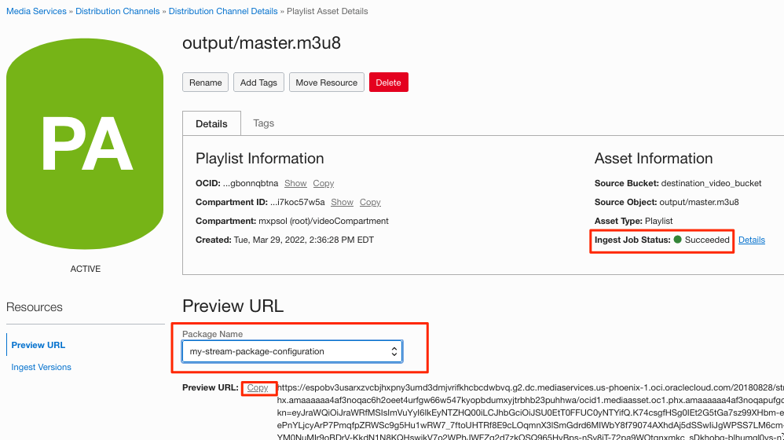
   Copy the URL containing authenticated session key information for the streaming content.
3. Paste the URL in Safari or any HLS Player. 
   

## Acknowledgements
* **Author** - Sathya Velir - Oracle OCI Media Services
* **Last Updated By/Date** - Sathya Velir, September 2022
