# Create Media Workflow using OCI Console

## Introduction

This lab will guide in setting up required IAM policies and your fist Media Workflow to transcode your video and generate thumbnails. 

Estimated Time: 30 minutes

### Objective 

In this lab, you will

* Validate and create required IAM policies for the lab execution.
* Configure Media workflow using OCI Console.
* Submit a Media workflow job to transcode your video.

### Prerequisites

This lab assumes you have:

* You have access to OCI tenancy with required privileges to use object storage and Media services.
* Create an OCI Object storage bucket and upload a video for processing.
Ensure the bucket is in the same compartment defined by the Media Services IAM policies.
An error occurs if no buckets are available in the compartment during  Media Flow creation.
    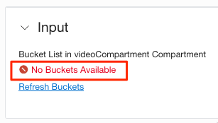


### Supported media container formats

|**Supported Input Content**|
|---|
|**Input formats** |
|3GP,ARF,ASF,AVI,P4V,FLV,M1V,M4V,MKV,MP4,MPG,MXF,OGG,OGM,OGV,QT,RM,RMVB,WAV,WEBM,WMA,WMV|
|**Input Video Codecs**|
|H263,H264,H265,MP43,DivX,Xvid,AVC,VP6,FLV1,FLV4,VP8,MPEG-1/2,AVC/MJPG,MPEG-4,Theora,WMV2|
|**Input Audio Codecs**|
|AAC,AAC/FLAC,MP3,EAC3,MP4A,PCM,Vorbis,RAW,WMA6/7,WMA8|

## Task 1: Setup IAM Policy

The OCI Media Service requires some of the other OCI services to operate.
In OCI, Identity Policies define access and access to services. 
The syntax for a policy will be :

```
<copy>Allow "subject" to "verb" "resource-type/entity" in "location" where "conditions"</copy>
```
The supported verbs include *inspect, read, use* & *manage* in the order of hierarchy access.
For OCI Media Services, the below resource types/Entities are supported.
- media-family
    - media-workflow
    - media-asset
    - media-workflow-configuration
    - media-workflow-job
    - media-stream-distribution-channel
    - media-stream-packaging-config
    - media-stream-CDN-config

Two types of policies are needed to work on the labs for media services.

- Granting access to Media Services to OCI Services
Create a create group to streamline the level of access based on the type of individual job role definition.
For simplicity, we create the below with an any-user clause.

create a new policy with the below statement
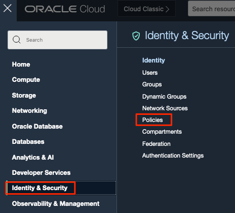

Allow any-user to *verb* *entity* in tenancy

  ```
  <copy>allow any-user to use media-family in tenancy</copy>
  ```
  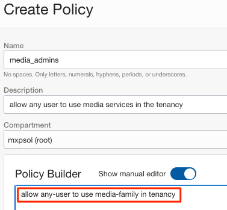

A dynamic group is needed to provide access to resources like OCI Compute or OCI Functions to run Media Flow Jobs. 
Working with the security or identity team is strongly advised for production OCI Tenancies. 

- Allow Media Services to integrate and work with other OCI services. 
Object Storage is mandatory as the files are managed from object storage.

The below policies are required for the Media Flows tasks to interact with other required services. 
    ```
      <copy>Allow service mediaservices to use object-family in compartment {videoCompartment}
      Allow service mediaservices to use keys in compartment {videoCompartment}
      Allow service mediaservices to read media-family in compartment {videoCompartment}
      Allow service mediaservices to manage ai-service-speech-family in compartment {videoCompartment}</copy>
    ```
  
  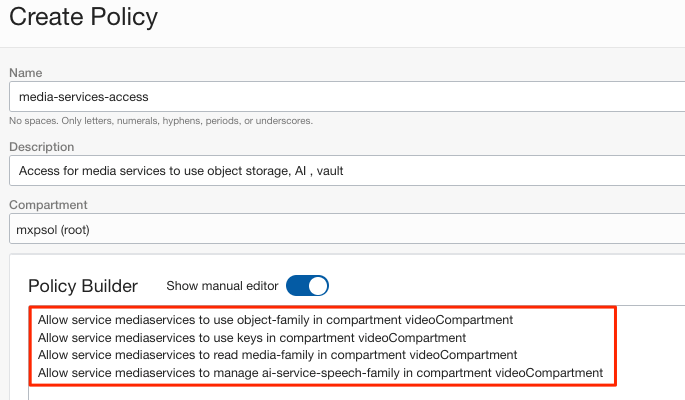
## Task 2: Create Media Workflow

1. From OCI Console main menu, Select "Analytics & AI" and then "Media Flows."
   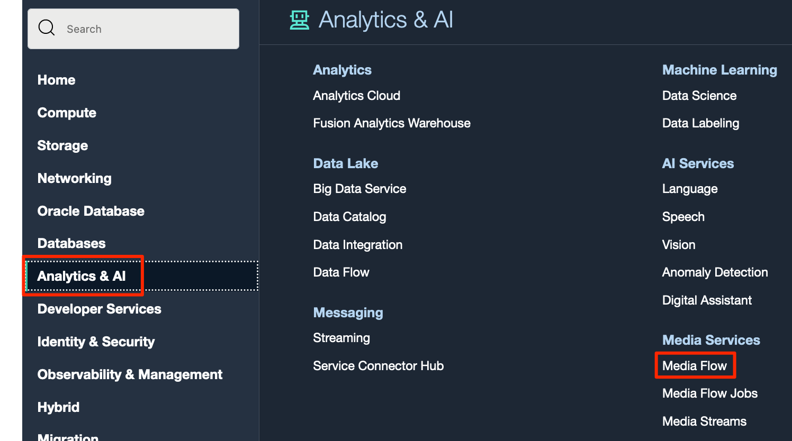
   Above is the landing page for Media Flows.
2. Create the Media workflow. Remember to choose the correct compartment where the IAM policy is defined.
  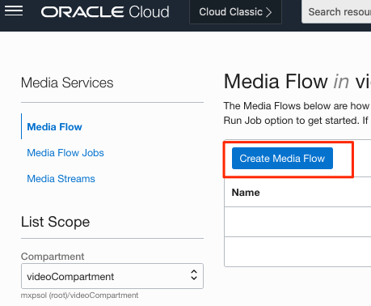
In this section, we can perform customization to Media Flow. 

3. Task list is generated. Select the input bucket from the list where Media Flow Job can pull the video for processing. 
   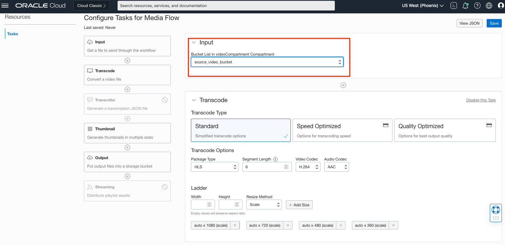 
Leave the other fields in transcode task as default for now.
4. optionally, enable the transcribe task, which does not require additional input.
   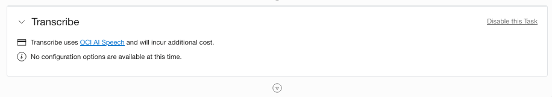 
5. The thumbnail task can also be left in the default configuration or disabled.
   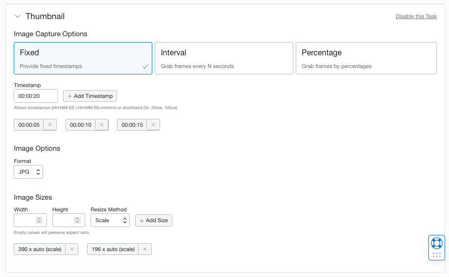 
6. Finally, select the output bucket where the transcoded video and audio files needs be stored.
   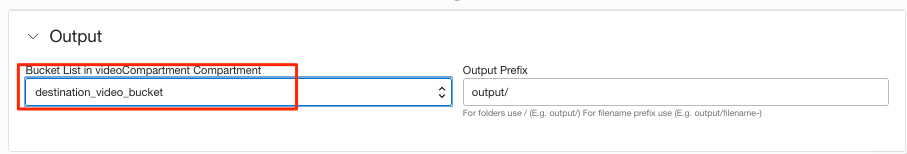 
7. Leave the last task streaming disabled for now, and we will discuss this usage in the next section.
8. Save the media flow and provide a name for the same.
    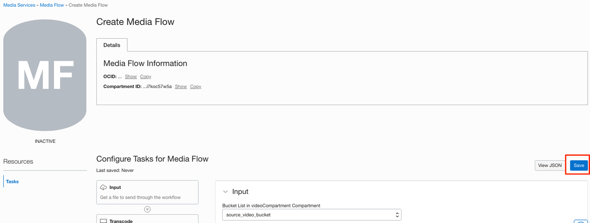 
    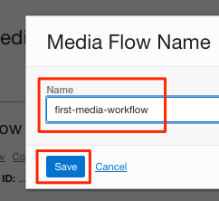 
9. Once saved, the confirmation is shown above and prompts you to run the job.
    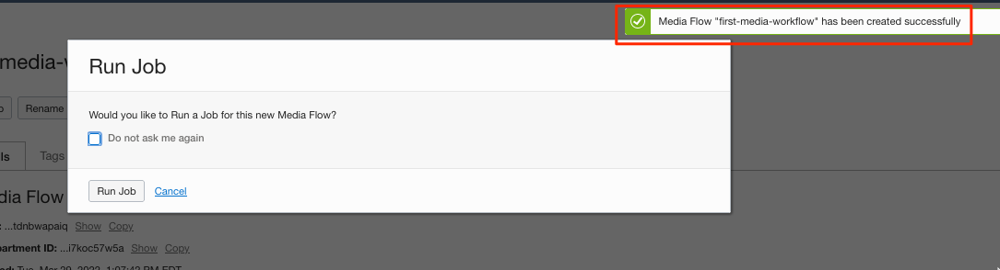 
## Task 3 : Run Media workflow Job

1. Click "Run Job" and select the video you want to transcode; hit Run job.
    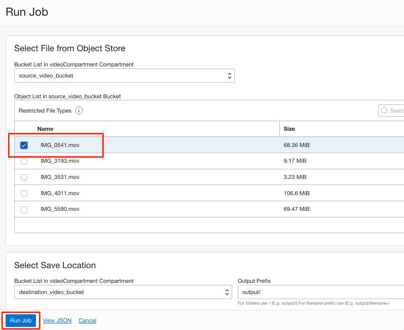 
2. Once the job is submitted, watch the progress and wait for it to be complete. Notice that the tasks will indicate the Media Flow job's status as it progresses. 
    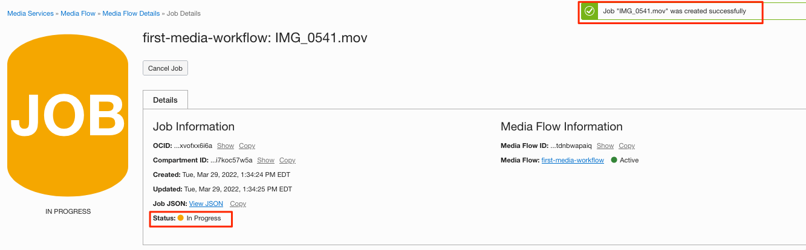 
    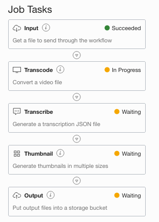 
3. After the job completes, see the output files under the destination bucket.
    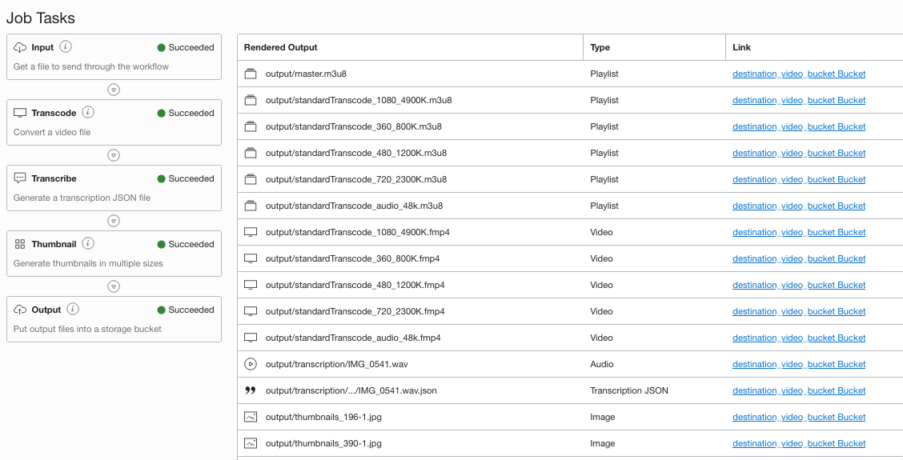 

## Acknowledgements
- **Author** - Sathya Velir - OCI Media Services
- **Last Updated By/Date** - Sathya Velir, November 2022
