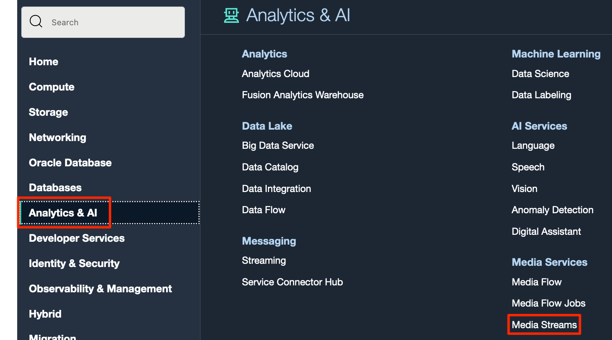
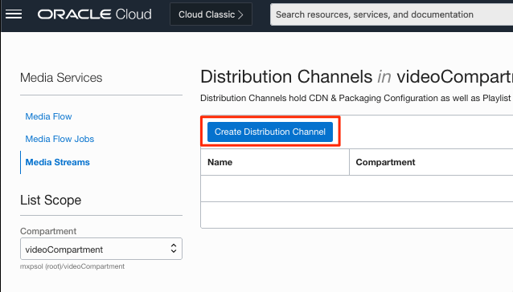
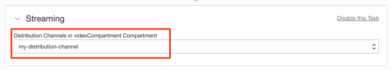

# Lab 2: Create Media Streams

The Media Flow Job completion will bring below type of files:
- Master Playlist (master.m3u8)
- Individual playlist (other m3u8)
- Thumbnail images (jpg)
- Transcription in JSON format if enabled. (folder transcription)
 

1. Navigate to Media Streams from OCI Main Menu 
    
2. Create Distribution Channel
   
3. Choose EDGE as CDN and provide a name to create the distribution channel.
   
4. Upon creation, the distribution channel information is displayed.
   
   The domain name will be the streaming hostname.
5. Ingest the Master Playlist into the distribution channel
   
6. Select the destination bucket and output folder to choose the Master Playlist.
   Note: Selecting other playlist will result in error.
   
   Notice the ingest job confirmation and status. 
   
7. Now, we will work on the streaming packaging configuration
   
   Select HLS with 6 second as segment time and NONE for encryption. 
   

**Note:**  After creating the distribution channel, the distribution channel is available to be selected in the Media Flow streaming task.
Go back to the same Media Flow and enable the streaming task to notice the distribution channel. After selecting, save the Media Flow. 

## Acknowledgements
- **Author** - Sathya Velir - OCI Media Services
- **Last Updated By/Date** - Sathya Velir, November 2022
