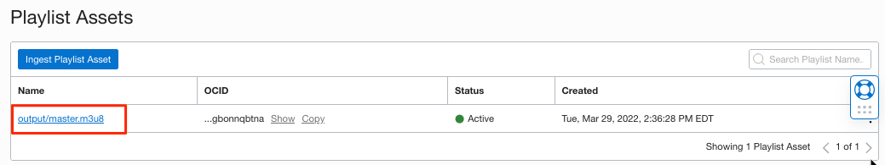
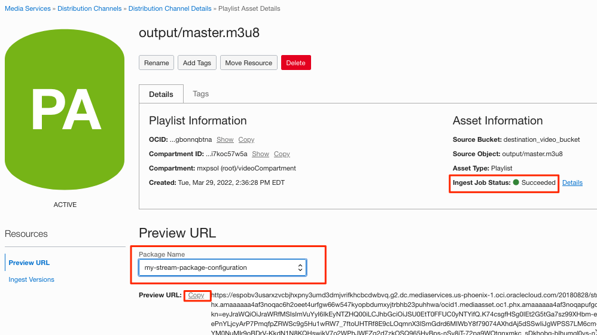

# Lab 3 : Stream your video

At this point, we have transcoded the source video into multiple bitrates and sizes.
Also, enabled distribution channel configurations are required to stream the video content.

1. Navigate to the ingested master playlist in the distribution channel.
   
2. Look for the ingest job status (succeeded) and select the packaging configuration in the preview URL section.
   
   Copy the URL containing authenticated session key information for the streaming content.
3. Paste the URL in Safari or any HLS Player. 
   

## Acknowledgements
- **Author** - Sathya Velir - OCI Media Services
- **Last Updated By/Date** - Sathya Velir, November 2022
