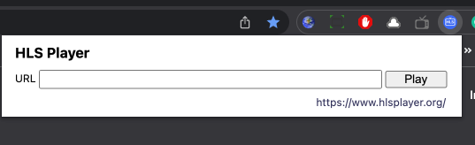

# Stream your video

## Introduction

This lab will guide you in generating an authenticated time-bound URL for HLS playback.

Estimated Time: 10 minutes

### Objective 

In this lab, you will
* Generate a preview URL using OCI Console.
* Playback your video in Safari browser or VLC or other HLS players.

### Prerequisites

* Ingest of the master playlist initiated in the previous lab completed.

## Task 1: Playback URL Generation 

1. Navigate to the ingested master playlist in the distribution channel.
   
2. Look for the ingest job status (succeeded) and select the packaging configuration in the preview URL section.
   
   
   Set the session token validity between 10 minutes to 24 hours and click "Generate"
   Copy the URL containing authenticated session key information for the streaming content.
3. Paste the URL in Safari or any HLS Player. 
   

## Acknowledgements
- **Author** - Sathya Velir - OCI Media Services
- **Last Updated By/Date** - Sathya Velir, November 2022
