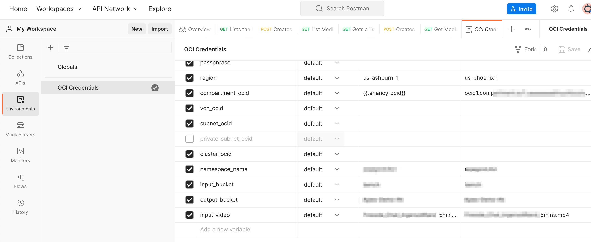
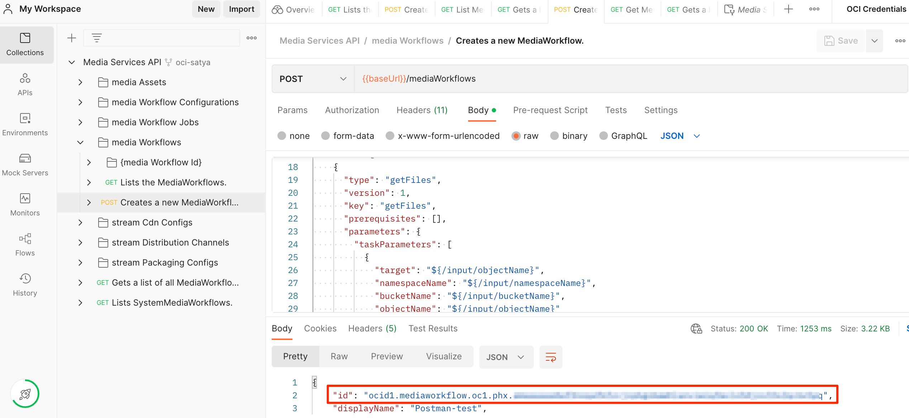
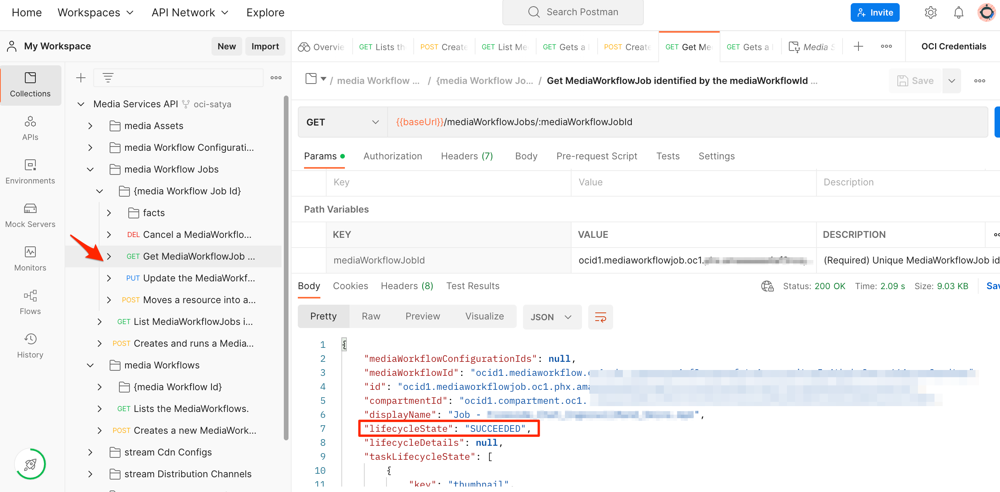
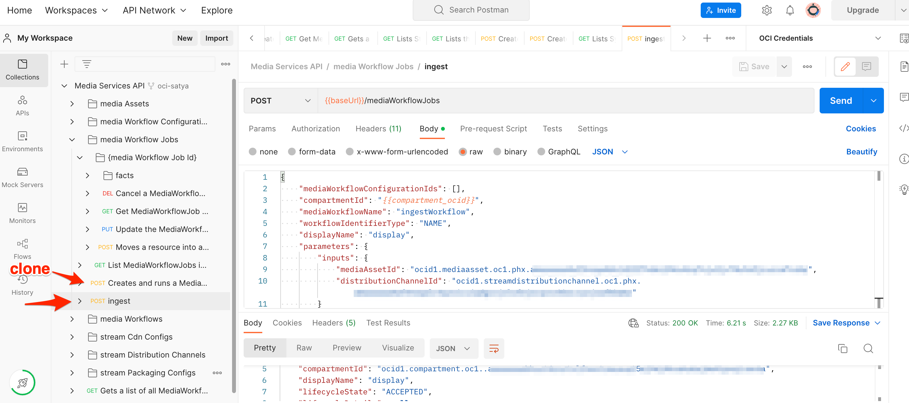
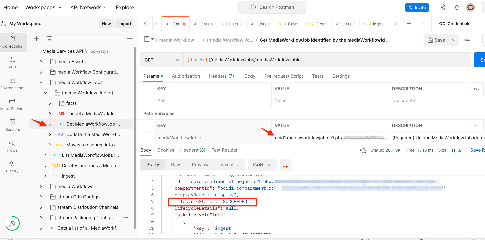

# Postman 

## Introduction

This lab will introduce API for OCI Media Services and walk-through the steps for transcoding and streaming your video using [Postman](https://www.postman.com/) tool.

OCI provides enriched API for developers to orchestrate the solutions for business needs. Postman is generally a good starting point to test the service and understand the interactions.

OCI has a [workspace](https://www.postman.com/oracledevs/workspace/oracle-cloud-infrastructure-rest-apis/overview) in the postman for developers to clone and try the API.

Estimated Time: 60 minutes

### Objective 

In this lab, you will
* Use postman tool to interact with OCI Media Services API.
* Generate a preview URL using Postman.
* Playback your video in Safari browser or VLC or other HLS players.


### Prerequisites
- Familiarity with Media Flow and Media Streams using OCI Console
- Understanding of the postman tool
- [Understanding](https://www.postman.com/oracledevs/workspace/oracle-cloud-infrastructure-rest-apis/overview) of API key generation and setting up postman workspace environment.

## Task 1: Global Setup

1. [Setup](https://www.ateam-oracle.com/post/invoking-oci-rest-apis-using-postman) OCI credentials
2. Clone the collections of Media Services to your postman workspace.
3. Update the OCI Credentials environment with the below variables and their values based on your tenancy:
  

- namespace_name - This is your [object storage namespace information](https://docs.oracle.com/en-us/iaas/Content/Object/Tasks/understandingnamespaces.htm).
- input_bucket - This is the bucket name where your input video is located.  
- output_bucket - This is the bucket name where you want your output from media flow processing to be placed.
- input_video - The input video file name that needs processing.

## Task 2: Media Flow API

1. Navigate to the new media workflow
  
2. Copy the [create-media-workflow.json](postman-json/create-media-workflow.json) to body of the request
3. Once submitted, this will create your media workflow and provide the id.
  
4. Copy this id and update the [create-media-workflow-job.json](postman-json/create-media-workflow-job.json)
5. Post the request
   
6. Once submitted, the Media Workflow Job is Accepted to be Processed.
   
7. We can monitor the job status by entering the Media Workflow Job ID in the variable below:
    
8. The job information provides output files asset id, which we will use it ingest in the Media Streams.
    
    Copy this asset ID into [ingest-asset.json](postman-json/ingest-asset.json)

## Task 3: Media Streams API

1. Create a Distribution Channel using the [payload](postman-json/create-distribution-channel.json).
    
2. Copy the Distribution channel ID and update the [create-cdn.json](postman-json/create-cdn.json)
    Copy this distribution ID into [ingest-asset.json](postman-json/ingest-asset.json)
    Copy this distribution ID into [configure-packaging.json](postman-json/configure-packaging.json)
    Copy the domain name, which will be needed when generating the session token for playback.
3. Create CDN Config (in this example, its OCI Edge) with the [create-cdn.json](postman-json/create-cdn.json) as payload.
    
4. Create packaging configuration
    Copy the packaging ID to update [generate-session-token.json](postman-json/generate-session-token.json)
5. Ingest the Master playlist to the distribution by running Media Workflow Job for the system workflow.
    In this step, I have cloned the previous mediaWorkflowJobs API and renamed it to ingest for simplicity.
    
6. Check the Ingest Job Status with Media Workflow Job ID from the previous step.
    
    Once the job is succeeded, we are ready to generate the playlist URL for playback.
    Copy the Asset ID for the master playlist to update [generate-session-token.json](postman-json/generate-session-token.json)
7. To create a session token, we need to create a new POST API on top of the Distribution channel domain name generated while creating the distribution channel.

    ``` https://{distribution channel domain name}/20211101/actions/generateSessionToken ```

    In the body use [generate-session-token.json](postman-json/generate-session-token.json)

    This will return the session token valid by default for 24 hours.
    

    Copy the token and choose your favorite HLS Player and stream the content by creating the [generate playlist url](https://docs.oracle.com/en-us/iaas/Content/dms-mediastream/media-streams-manage-dist-channels-creating-preview-url.htm#med-serv-manage-dist-channels-create-preview-url-using-cli)

    ```https://{distribution channel domain name}/20211101/actions/generatePlaylist?mediaAssetId={ASSET_ID}&streamPackagingConfigId={PKG_ID}&token={TOKEN_DATA}```

## Acknowledgements
- **Author** - Sathya Velir - OCI Media Services
- **Last Updated By/Date** - Sathya Velir, November 2022
