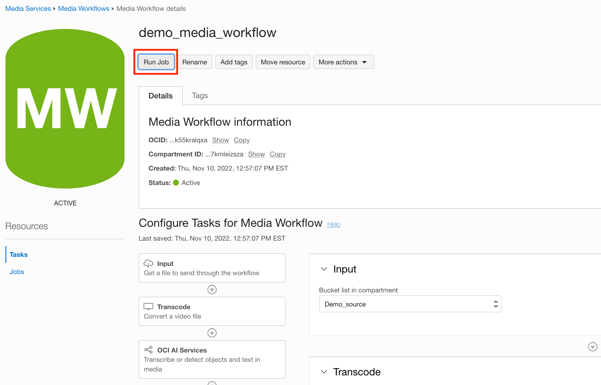
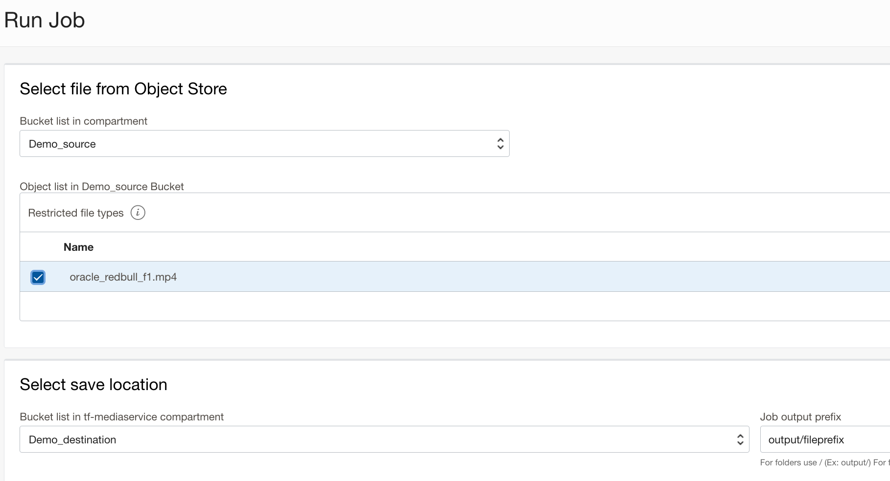

# Provisioning Media Services using Terraform

## Introduction

This lab will use the OCI command line tool Media Services APIs to transcode, stream the video.

Estimated Time: 30 minutes

### Objective 

In this lab, you will

* Deploy terraform sample code that will create required Media Workflow and Media Streams components
* Run Media workflow Job on Terraform provisioned resource.
* Playback the video with Safari or VLC or other HLS players.


### Prerequisites
-  Familiarity with Media Flow and Media Streams using OCI Console
- Working knowledge of terraform

## Task 1: Deployment Steps

1. Update the [variable](tf-json/variables.tf) file with required information for the terraform execution.
2. Make sure you have the latest terraform. These were executed in the below environment:

   ```
    <copy>Terraform v1.3.1
    provider registry.terraform.io/hashicorp/oci v4.98.0</copy>
   ```
## Task 2: Download required JSON and validate.

1. Download the files (both \*.tf and JSON/\*.json)
2. Initiate the Terraform

   ```
    <copy>$ terraform init</copy>
   ```
3. Validate the content
   ```
   <copy>$ terraform validate</copy>
   ``` 

## Task 3: Plan and Apply the configuration.

1. Make sure the Plan works with no errors.
   ```
   <copy>$ terraform plan</copy>
   ```
2. Apply the Terraform 
   ```
   <copy>$ terraform apply</copy>
   ``` 
## Task 4: Upload the video to the object storage bucket.

1. After you apply, the output should get you the direct URL to upload the video file.
   ```
   <copy>Apply complete! Resources: 8 added, 0 changed, 0 destroyed.

    Outputs:

    comment = "You can either use the PAR URL to upload your content directly or use OCI Console to upload the video object"
    media_workflow_id = "ocid1.mediaworkflow.oc1.phx.yourworkflowid"
    upload_objects_to = "https://console.us-phoenix-1.oraclecloud.com/object-storage/buckets/yournamespace/Demo_source/objects"
    using_par_document_reference = "https://docs.oracle.com/en-us/iaas/Content/Object/Tasks/usingpreauthenticatedrequests.htm"</copy>
   ```
2. Upload your video to the bucket

## Task 5: Run Media Workflow Job and Playback your video.
    
3.  Navigate to the console & Run the Media Workflow Job.
    
4.  Select the video that you uploaded and submit job.
    
5.  Once the Job is complete, you can navigate to the Distribution Channel and gather the preview URL for playback.

## Acknowledgements
- **Author** - Sathya Velir - OCI Media Services
- **Last Updated By/Date** - Sathya Velir, November 2022