# Akamai CDN Configuration with Media Streams

## Prerequisites 

- Existing Akamai CDN account
- Familiarity with setting up Property in Akamai's Adaptive Media Delivery (AMD)
- An edge hostname that you own and its SSL certificate. If you using Akamai's CPS, then you just need hostname.

## Steps to configure Distribution Channel with Akamai CDN

1. In Media Streams, create the distribution channel and select CDN as Akamai. Fill in the known contents like the edge hostname to start and leave all the fields empty to start the configuration and hit create.

   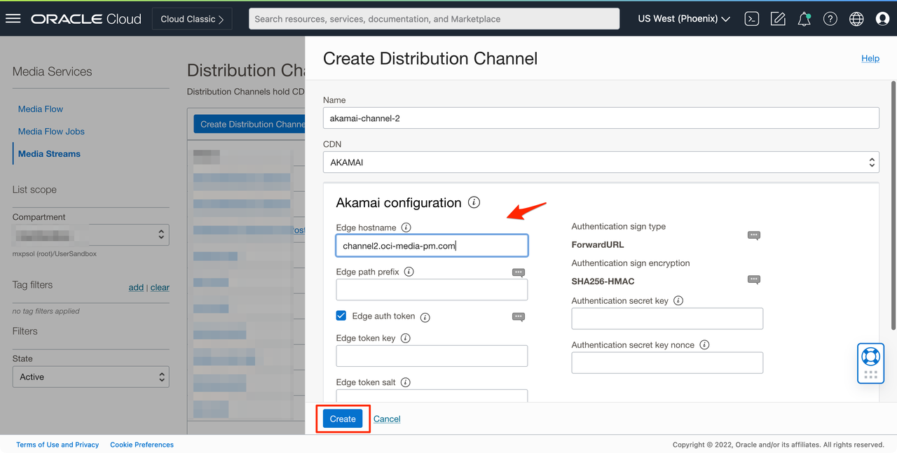

2. Now, go to Akamai's AMD and create a property for Media Streams channel.

   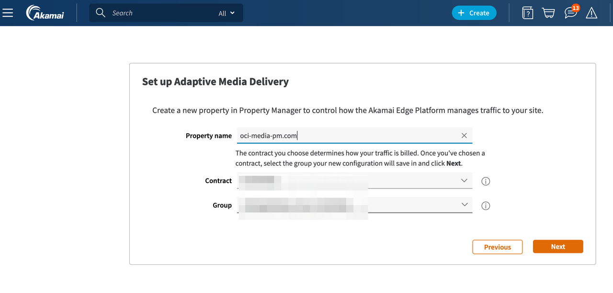

3. Upon creating the property information, you should have an templated property that needs further data to be filled.Click on the +Hostname to add new.

   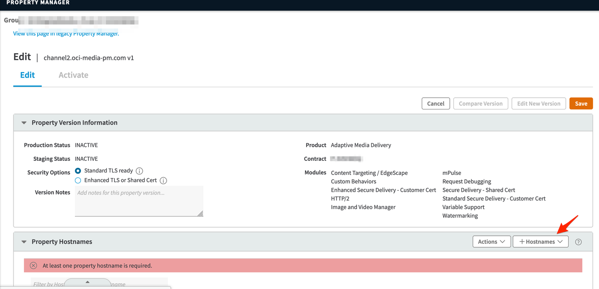

4. Add the hostname that you want to deliver the video content.

   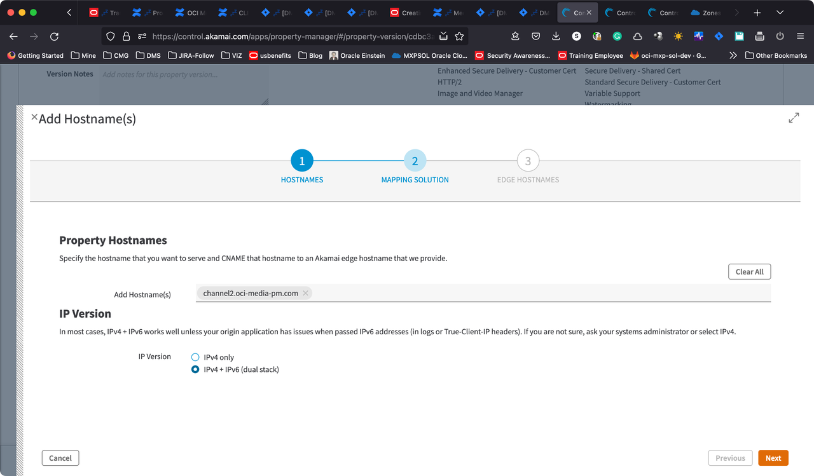

   Note: You will need to configure the certificate for the hostname. If you are not sure, talk to your Akamai team.

5. After the hostname is added, create the CNAME in the DNS to map the akamaized.net edge hostname.
   
   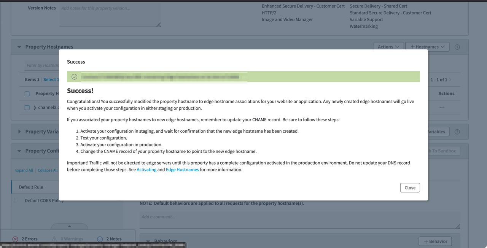

   After successful configuration, it should look like below.

   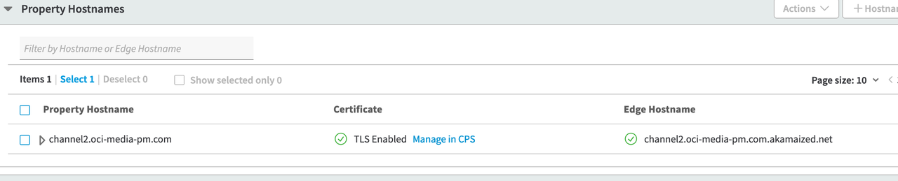

6. Configure the origin server with hostname being the distribution channel domain name. Also, ensure you import customer CA set by importing the certificates from the distribution channel domain name.

   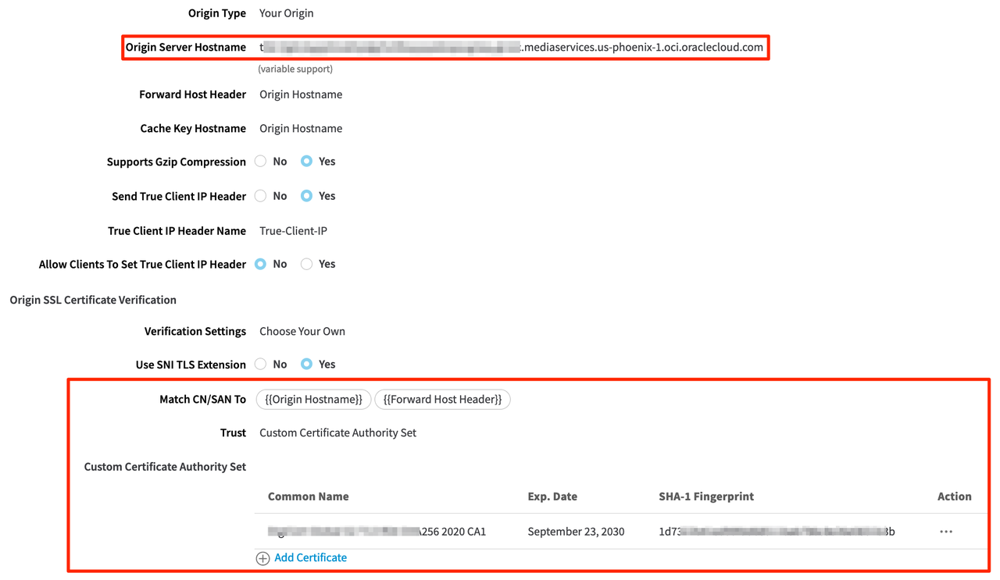

   Add the origin domain name certificates, 

   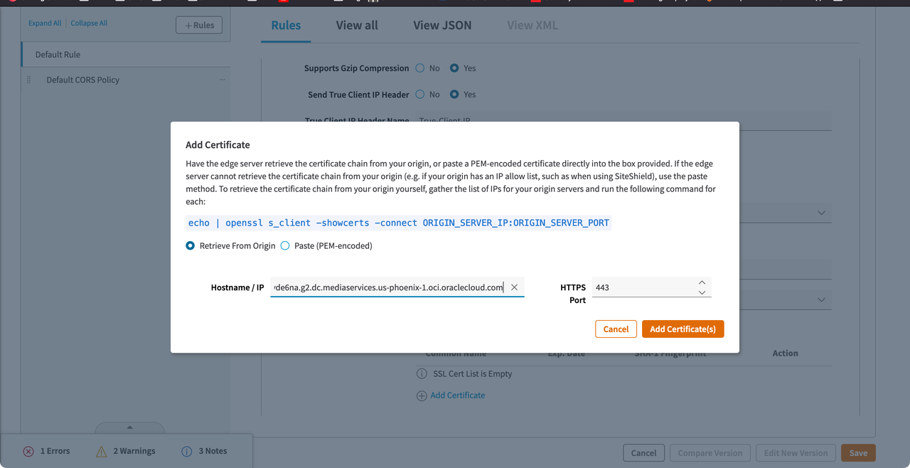

7. Enable the Token authentication on the Akamai AMD Property and generate tokenkey and salt. 
   Map the values into the Media Streams distribution channel AKAMAI CDN configuration.

   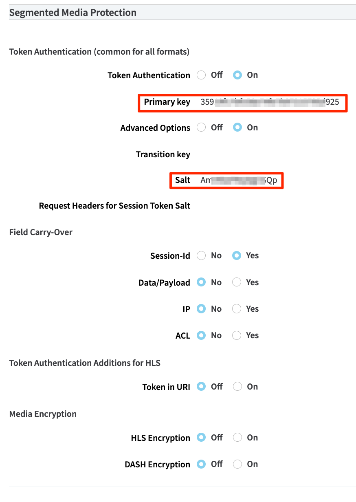

   Map the generated values into Media Streams

   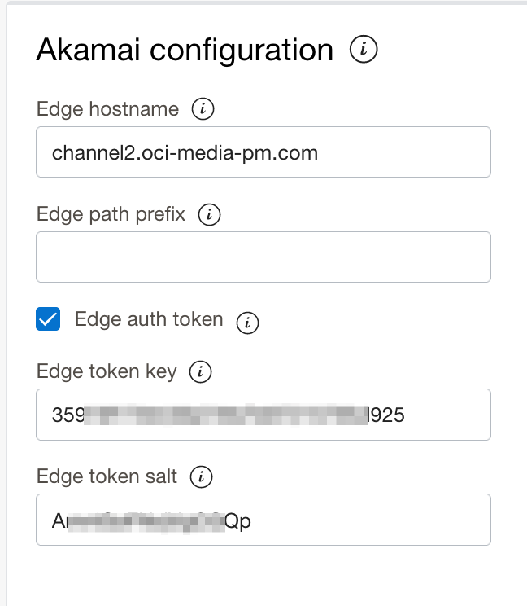

8. On the origin Characteristics, update to use Akamai Signature Header Authentication. Generate the Secret Key and update the Nonce as "NonceA"
   
   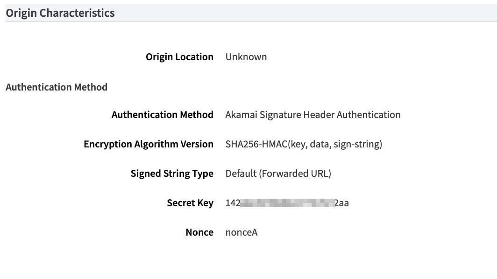

   Update the generated secret key and Nonce value to the distribution channel CDN 

   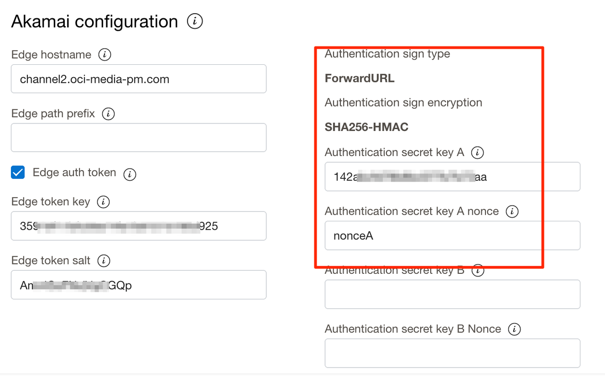

9. Save the property and activate it.

10. Once activated, you can create preview URL and playback of the stream will be delivered through your hostname configured with akamai.
    
   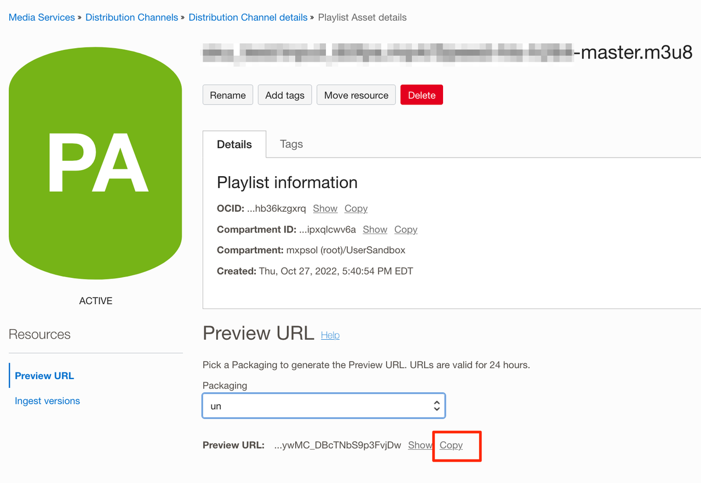

## Acknowledgements
- **Author** - Sathya Velir - OCI Media Services
- **Last Updated By/Date** - Sathya Velir, November 2022