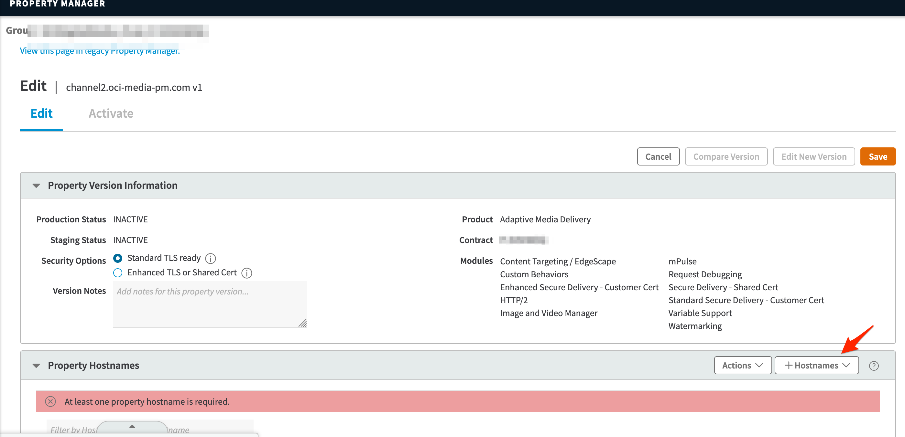
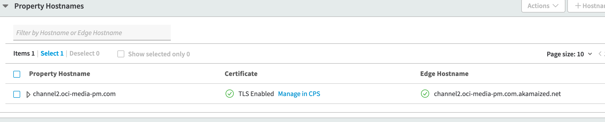
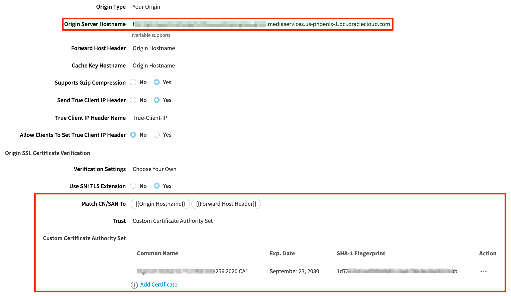
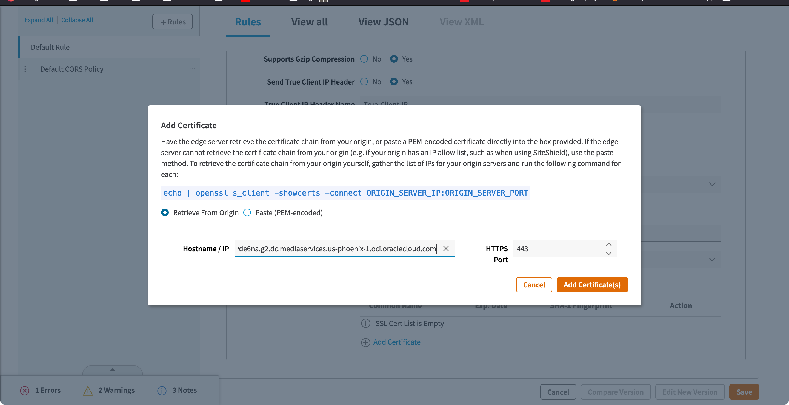

# Akamai CDN Configuration with Media Streams
## Introduction

This lab will guide in setting up the Akamai CDN integration with OCI Media Streams distribution channel.
The OCI Media Streams will be the origin and Akamai will be the edge for the streaming.

Estimated Time: 30 minutes

### Objective 

In this lab, you will

* Create & configure distribution channel in OCI Media Streams
* Create & setup property in Akamai for the integration with OCI Media Streams.

### Prerequisites

- Existing Akamai CDN account
- Familiarity with setting up Property in Akamai's Adaptive Media Delivery (AMD)
- An edge hostname that you own and its SSL certificate. If you are using Akamai's CPS, then you need a hostname.

## Task 1: Create Distribution Channel

1. In Media Streams, create the distribution channel and select CDN as Akamai. Fill in the known contents like the edge hostname to start, leave all the fields empty to start the configuration, and hit create.

   

## Task 2: Create & Configure property in Akamai

1. Go to Akamai's AMD and create a property for the Media Streams channel.

   

2. Upon creating the property information, you should have a templated property that needs further data to be filled. Click on the +Hostname to add a new.

   

3. Add the hostname that you want to deliver the video content.

   

   Note: You will need to configure the certificate for the hostname. If you are not sure, talk to your Akamai team.

4. After the hostname is added, create the CNAME in the DNS to map the akamaized.net edge hostname.
   
   

   After successful configuration, it should look like the one below.

   

## Task 3: Integrate Media Streams with Akamai Property

1. Configure the origin server with the hostname being the distribution channel domain name. Also, ensure you import customer CA set by importing the certificates from the distribution channel domain name.

   

   Add the origin domain name certificates, 

   

2. Enable the Token authentication on the Akamai AMD Property and generate the tokenkey and salt.
   Edge authentication is optional. You can skip this step if you are keeping the playback of the videos public.
   Map the values into the Media Streams distribution channel AKAMAI CDN configuration.

   

   Map the generated values into Media Streams

   

3. On the origin Characteristics, update to use Akamai Signature Header Authentication. Generate the Secret Key and update the Nonce as "NonceA"
   
   

   Update the generated secret key and Nonce value to the distribution channel CDN 

   

4. Save the property and activate it.

5. Once activated, you can create a preview URL, and playback of the stream will be delivered through your hostname configured with akamai.
    
   

## Acknowledgements
- **Author** - Sathya Velir - OCI Media Services
- **Last Updated By/Date** - Sathya Velir, November 2022