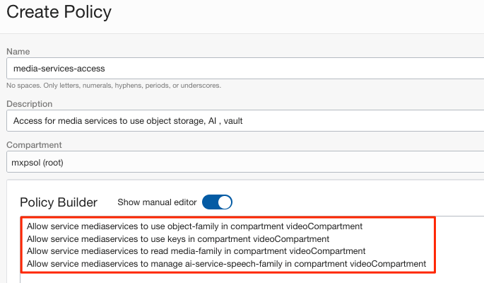

# Introduction

## About this workshop

This lab gives step-by-step guidance to transcode video to various formats, varying bit rates, different sizes & as well we will enable the video to be streamed across multiple device types using OCI. This lab provides opportunity for developers or administrators to understand the OCI Media Services components through various options like OCI Console, Python or Java SDK, Postman collection, Terraform & OCI CLI.


Estimated Time: 90 minutes

## Objectives

Users will learn

- How to transcode video & make content stream ready using OCI Media Flows
- How to Stream the transcoded video using OCI Media Streams

## Prerequisites

- An Oracle Cloud Account.
- Familiarity with Oracle Cloud Infrastructure (OCI) Services Object Storage & Identity and Access Management
- Familiarity with Python or Java or or OCI CLI or using Postman for second half of this lab.

## About OCI Media Services

OCI Media Services is a region-based PaaS(Platform as a Service) service for processing (transcoding) videos and streaming the content with/without CDN (Content Delivery Network), along with options of generating thumbnails and speech to text. It also integrates with OCI Speech to Text service to get the audio transcription. The workshop intends to introduce the features of OCI Media Services with a simple use case to stream the video through OCI.


## Media Flows

Media Flows a regionally deployed, fully managed service for processing video (and audio) content. One of the primary uses of the service is transcoding video into outputs suitable for streaming Video on Demand to various device types and desired resolutions. Media Flows simplifies creating streaming formats from source content, so it avoids the need to worry about managing complex video processing infrastructure.

The source video needs to be available in the OCI Object Storage. Media Flows take video from OCI Object Storage Service. Media Flows then performs specified transcoding operations to create an Adaptive Bit Rate (ABR) package in the OCI Object Storage bucket. Media Streams Service or third-party systems that one may choose will take the output from Media Flows to stream the content as video-on-demand. Media Flows can also help generate thumbnails for the video asset and work with OCI AI Speech to Text service to create transcriptions.

Media Workflow is a custom-defined workflow to process media content consisting of one or more Media Workflow Tasks that define the video processing.

Media Workflow Jobs are used to "run" content through a workflow. Typically, a customer will define a handful of Media Workflow and use them to create many jobs.

Media Workflow Configuration is a re-usable configurations/parameters used while creating Media Workflow via API / CLI.

### Media Workflow Task

Smallest defined work for processing at a specific point in the workflow.
  
A simple Media Workflow service consists of one of the below tasks: 
-  GetFile - gets the media asset from OCI Object Storage.
-  Transcode – Creates multiple renditions for the video.
-  Thumbnail – Generates thumbnails for the media asset.
-  Output – Stores the output asset to OCI Object Storage. 
-  Streaming – Optionally, preset the streaming channels for distribution.  
-  Transcription – Optionally, generate the transcript of the media asset.
-  VisionDetection - Optionally run object and text detection on the video.
-  PutFile - Stores all generated outputs back to OCI Object Storage.
 
## Media Streams

Media Streams is a regionally deployed, fully managed service providing scalable distribution and origination for just-in-time packaged ABR video content. It includes packaging features for target format conversion (HLS/DASH), encryption (AES128) or using OCI KMS Service, session-based token, and video segmentation (in Seconds) for ABR streams. Additionally, it provides secure and scalable distribution of the packaged ABR content using AKAMAI CDN origination or directly from OCI edge services or other CDN providers.   Media Streams simplifies the distribution and packaging of streaming formats from source content, avoids worrying about managing complex video packaging infrastructure.

Media Streams work by ingesting HLS (m3u8 files) representing transcoded content in the OCI Object Storage bucket. OCI Media Flows or another third-party transcoding service can generate transcoded content. If using another third-party transcoding service, ensure it complies with the ingest formats supported by Media Streams and resides in OCI Object Storage buckets. 

-  Distribution Channel - a customer-defined combination of origination and packaging configurations.  
-  Packaging Configuration - customer-defined definition for HTTP Live Streaming (HLS) / DASH packaging of video content with optional Encryption.
-  CDN Config Section:  
     - No-CDN - configuration allows streaming just-in-time packaged video content directly from the OCI Edge location.
  - Akamai CDN – Integrate with Akamai account and stream through Akamai.


The complete integration will look like the below from the user's perspective. The User or business flow automation (OCI Functions) will initiate the Media Flow Job using the video content as a parameter to the job. The Media Flow Job will use pre-defined Media Workflow to create thumbnails, transcription, multiple videos with different bit rates & sizes. If the Media Streams distribution channel is preset, it will also ingest the resultant content to Media Streams. 


  
## IAM Policy

The OCI Media Service requires some of the other OCI services to operate.
In OCI, Identity Policies define access and access to services. 
The syntax for a policy will be :

```
<copy>Allow "subject" to "verb" "resource-type/entity" in "location" where "conditions"</copy>
```
The supported verbs include *inspect, read, use* & *manage* in the order of hierarchy access.
For OCI Media Services below resource-type/Entity are supported.
- media-family
    - media-workflow
    - media-asset
    - media-workflow-configuration
    - media-workflow-job
    - media-stream-distribution-channel
    - media-stream-packaging-config
    - media-stream-cdn-config

Two types of policies are needed to work on the labs for media services.

- Granting access for Media Services to OCI Services
Create a create group to streamline the level of access based on the type of individual job role definition.
For simplicity, we create the below with an any-user clause.

create a new policy with the below statement


Allow any-user to *verb* *entity* in tenancy

  ```
  <copy>allow any-user to use media-family in tenancy</copy>
  ```
  

A dynamic group is needed to provide access to resources like OCI Compute or OCI Functions to run Media Flow Jobs. 
Working with the security or identity team is strongly advised for production OCI Tenancies. 

- Allow Media Services to integrate and work with other OCI services. 
Object Storage is mandatory as the files are managed from object storage.

Below policies are required for the Media Flows tasks to perform its duties. 
    ```
      <copy>Allow service mediaservices to use object-family in compartment {videoCompartment}
      Allow service mediaservices to use keys in compartment {videoCompartment}
      Allow service mediaservices to read media-family in compartment {videoCompartment}
      Allow service mediaservices to manage ai-service-speech-family in compartment {videoCompartment}</copy>
    ```
  
  

## Acknowledgements
- **Author** - Sathya Velir - OCI Media Services
- **Last Updated By/Date** - Sathya Velir, November 2022