# Lab 1: Setup Zero Trust Network Connectivity from Client to an Application Server

## Introduction

In this lab you will learn about the building blocks of configuring a NetFoundry network.

Estimated Lab Time: 90 minutes

### Objectives

In this lab, you will:

* Configure a simple network zero trust network.
* Connect a Windows client to a web application in Oracle Cloud on a private IPV4 network.

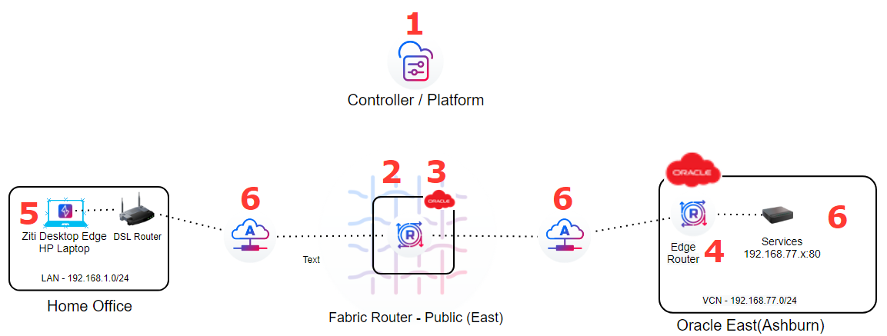
1. Create a network
2. Create a hosted edge router
3. Create an edge router policy
4. Create self hosted edge routers (Cloud Marketplace)
5. Create/Deploy endpoints
6. Create Services/AppWAN

### Prerequisites

To get started you will need:

- A NetFoundry Account/Organization. A seven day free trial is available to all who wish to demo the NetFoundry product and OCI.
	
	[NetFoundry Free Trial for Live Lab](https://nfconsole.io/signup)

- A working public cloud account with networking (such as Oracle/VCN subscription), or have the necessary privilege's to install a virtual machine and/or install software onto a machine in your on premises environment. (ESXi/Hyper-V/VirtualBox). This example will utilize Oracle Cloud Infrastructure.

	[Oracle Cloud Free Tier for Live Lab](https://www.oracle.com/cloud/free/)

	[Oracle Cloud VCN Documentation for Live Lab](https://docs.oracle.com/en-us/iaas/Content/GSG/Tasks/creatingnetwork.htm)

- An internet connection with outbound connections to TCP port 80 and 443.

	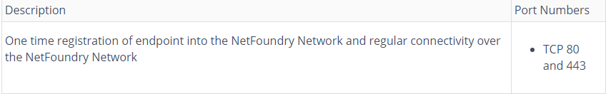

- An existing application in the cloud to connect to: [NetFoundry Prerequsites](?lab=netfoundry-prerequisites)

## Task 1: Create Network

1. Once you have created your Organization after signing up for the 7 day trial or other, you are ready to create your first network. 

	

2. You will be sent an email to accept your invitation to join the organization. Once you have created your password and upon first login, you will be prompted to create your Network. This step will build your dedicated SDN Controller which behaves as the central element of the Control plane. Once you hit Create my Network, this will deploy a NetFoundry managed Cloud based controller which will take about 5-10 minutes to finish. 

   **NOTE: you will not be able to continue until this has finished.** 

	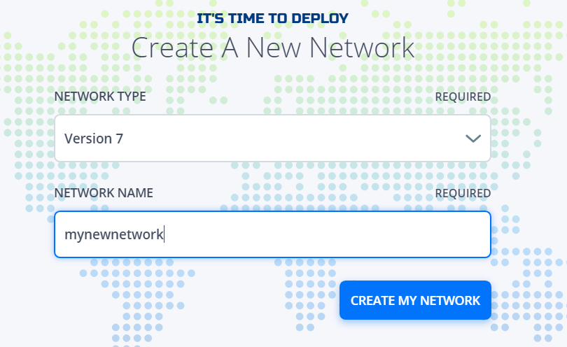

3. While the system is building the Controller, you will see a Grey spinning globe in the upper left hand corner as below. Once completed, the globe will turn Green.

	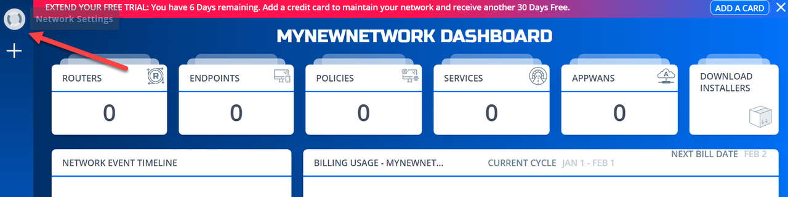

## Task 2: Create Hosted Edge Router

The next step is to create the Fabric Router which essentially builds the transport mechanism for the "middle mile". 

1. Choose a location that is Geographically in region to your resources in the cloud. Choose Routers and select the + in the upper right corner of the page.

	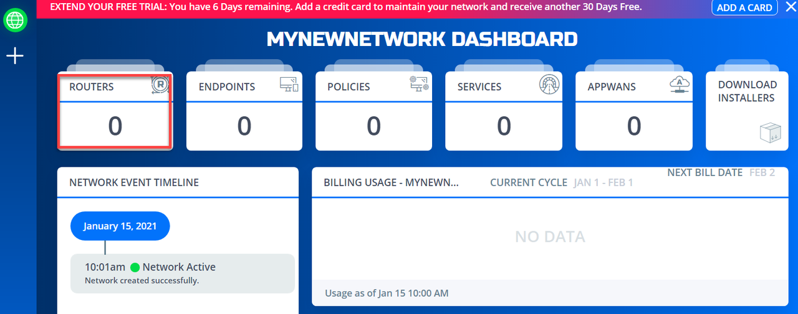

	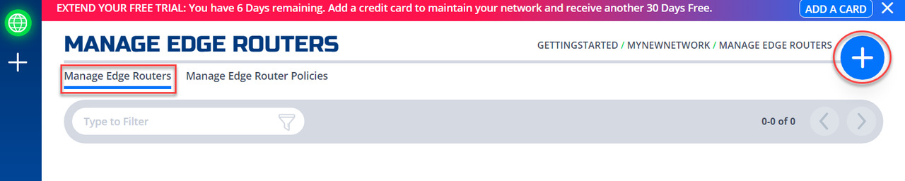

2. Select a name for your Router --- Consider using the the word "Fabric" in the name to indicate it is a NetFoundry managed transit instance. Leave the attribute blank. The default attribute will be **@thenameofthisrouter**. 

	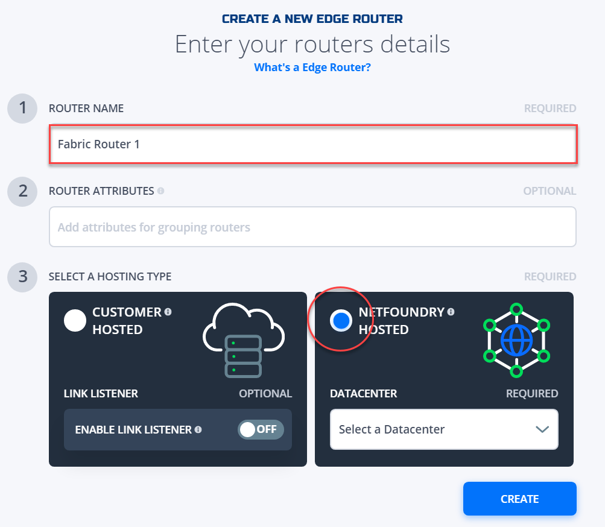

    Select NetFoundry Hosted and choose an Oracle Data Center in or nearest your desired Cloud region and hit Create.

	

## Task 3: Create Edge Router Policy

For the next step, we will create the Edge Router policy which allows Endpoints transit access to the customer edge network in the Cloud. 

1. From the Edge Routers screen, select Manage Edge Router Policies and hit the + in the upper right corner to add a policy.

	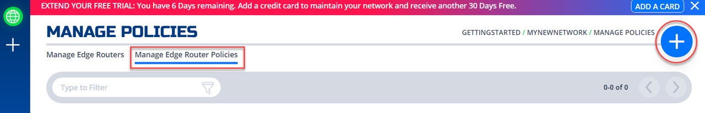

2. Name the Policy something representing Default-Policy or Base-Policy. 

   **NOTE: It can be named anything you want but this may help with logical function representation.**

3. Next click the mouse into the attributes field and select the @fabricrouter you created in the previous step. In the Endpoints Attributes field, type "#all" and hit enter. Then select Create. At this point your base network is complete. 

	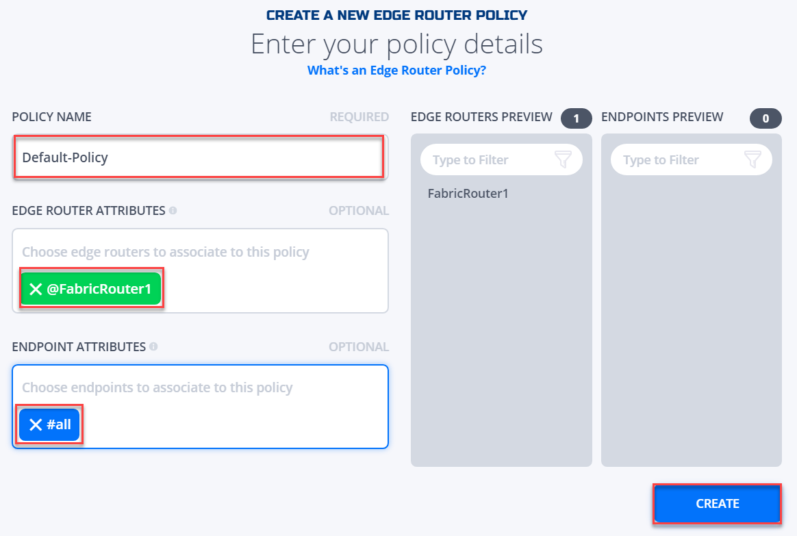

    **NOTE: by using #all in the endpoints field, you are allowing all endpoints to transit this Fabric via @FabricRouter1. For the purposes of a standard deployment and test this is a best practice. For advanced deployments you can utilize this feature to control transit for various endpoints.**

## Task 4: Create Customer Hosted Edge Router

The next element we will deploy is the Edge Router in the customer VCN containing the WebApp we created for this exercise. 

1. From the NetFoundry console, in the Manage Edge Routers tab(section), let's create a new Edge Router. Provide a name representing something like "customer-location-edge", leave the "Router Attributes" blank and finally selecting "Customer Hosted" and hit Create.

	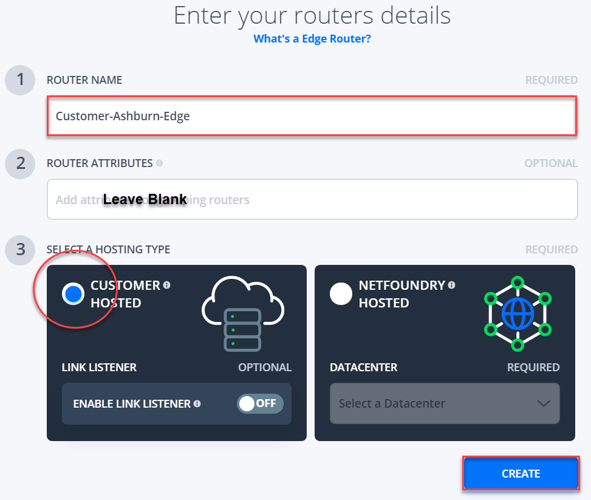

2. You will be provided a key for registration to be used in future step when creating the instance in the Cloud Marketplace.

	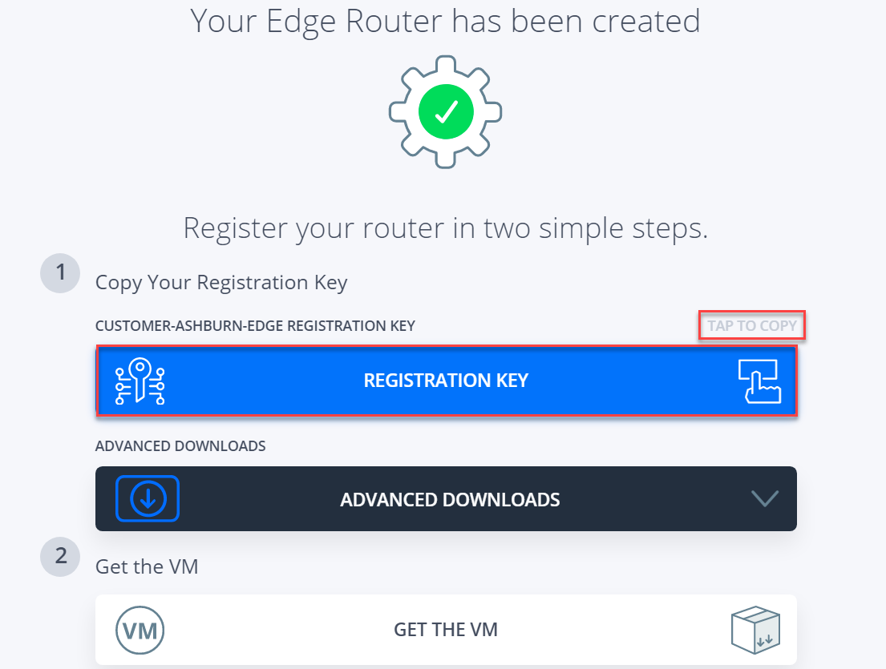

3. Now let's return to the Oracle Cloud console and create the Edge Router from the Marketplace.

	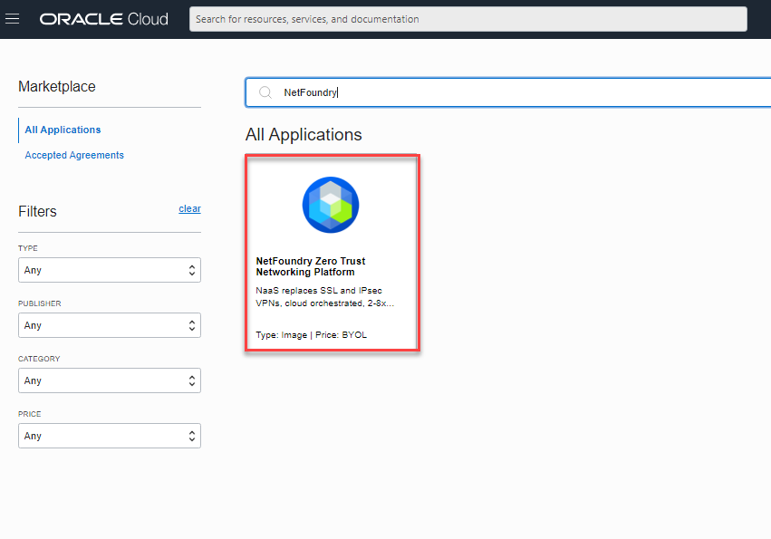

	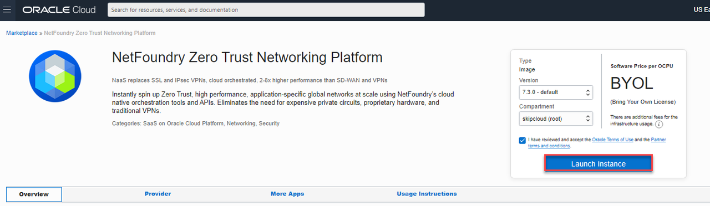

4. Again, select the compartment,  Availability Region and select a shape with1 OCPU 2 GB Memory. Select the VCN, Public Subnet, select assign public IPV4 address, SSH keys and hit Show Advanced Options. You will select cloud-init script and paste the following into the script field. 

	````
	<copy>
	#!/bin/bash
	/opt/netfoundry/router-registration {key}
	yum clean metadata && yum update -y
	</copy>
	````

    Append your registration key created in earlier step to the end of router-registration and hit Create. This will build the image in your VCN and register it for you. 
    
	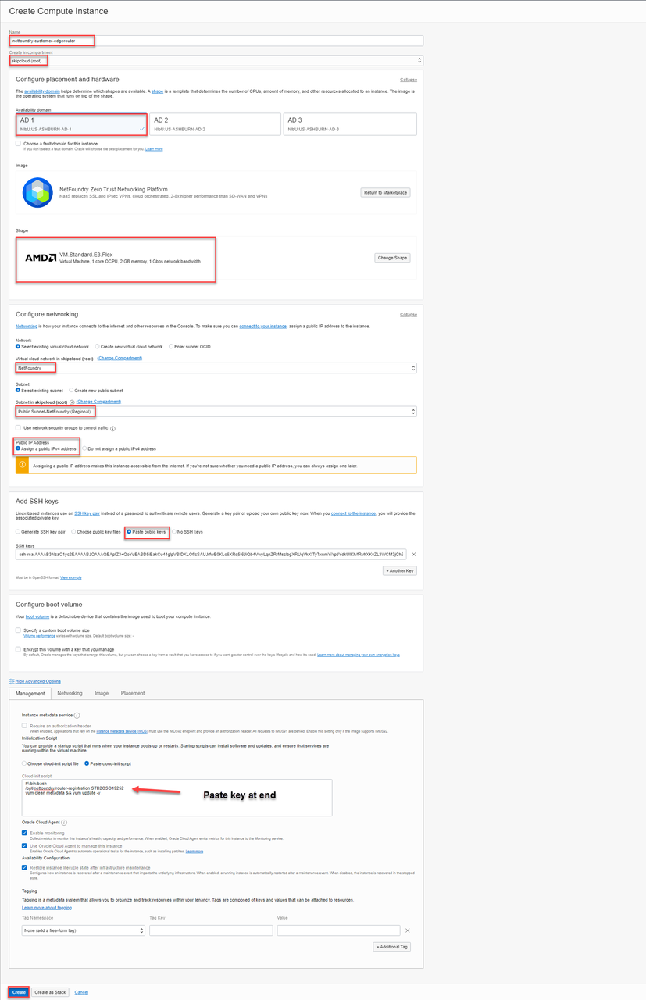

    **NOTE: If for some reason the router fails registration and does not show registered in the NetFoundry console after 10 minutes, it may be necessary to SSH to the instance and attempt registration manually with the same command. You can execute sudo systemctl status ziti-router to see if it is running afterwards.**


5. Once registered, you should now have 2 Edge Routers up and running in your Network as shown here: 

	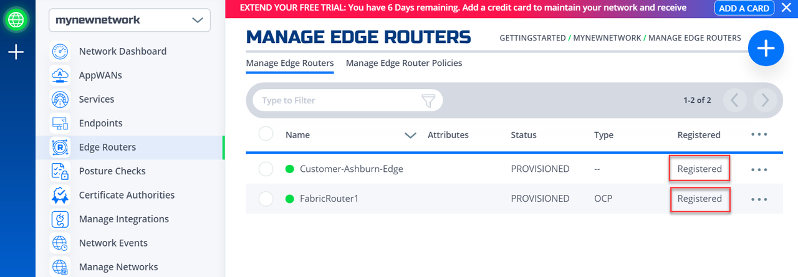

## Task 5: Create Endpoint for User Access - Windows

The next step in the process is to register your Laptop/Host as an endpoint in the Fabric. 

1. From the NetFoundry console. Select Endpoints from either location in the Network Dashboard.

	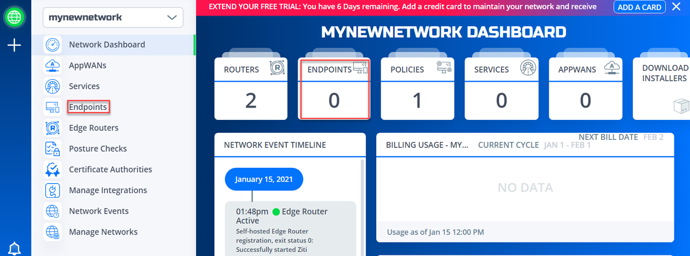

2. From the Endpoints page, select the + in the upper right corner to add Endpoint. Provide a  name for your endpoint, leave "Endpoint Attributes" blank and hit Create.

	

3. The next screen provides you the identity key and download location for the software. Save the mylaptop.jwt file somewhere you can easily find on your computer. 

	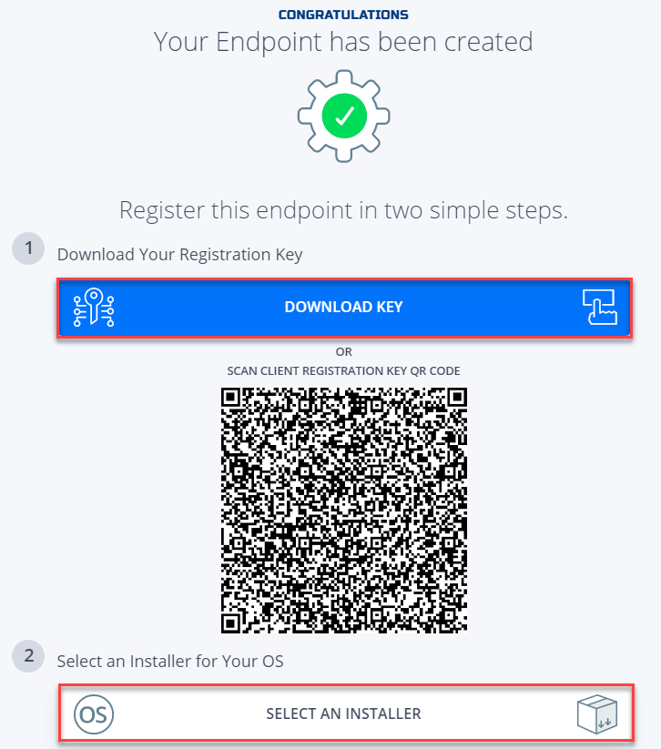

	Hit the "Select an Installer" to download the operating system specific version of the endpoint software. 

	**NOTE: The name of your file will be "what-ever-you-named-it.jwt"**.

	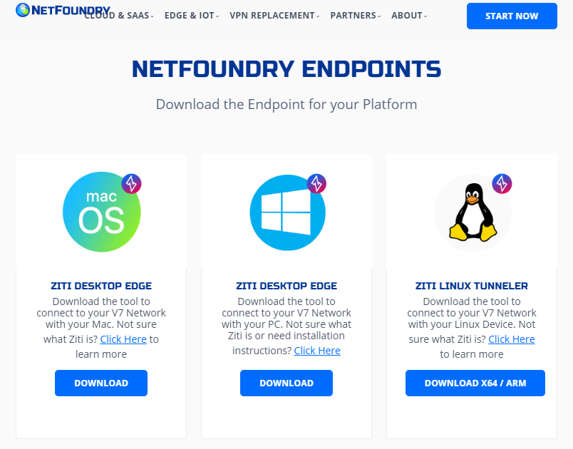

4. Once you have completed the installation of your software, it is now time to add the created identity to the software client. Open the software and select "Add Identity", then browse to the location of the mylaptop.jwt file previously downloaded and hit open. Your endpoint will now enroll and register on the network.

	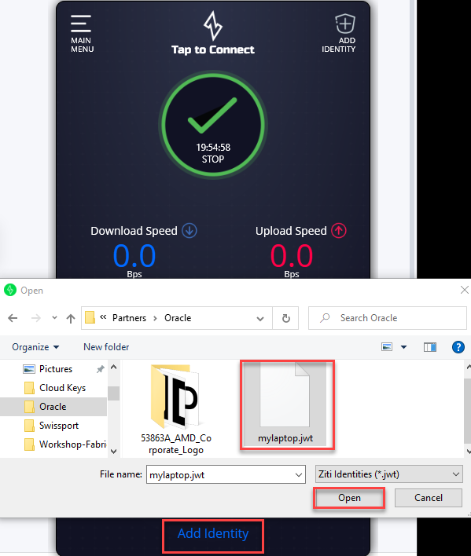

5. Now within the client application you will have your entry listed with No Services at this point.

	**NOTE: Author has several identities in different networks and should be disregarded.**

	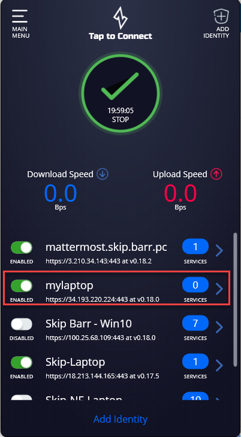

6. Returning back to the NetFoundry console and the Endpoints page. You will see your endpoint appear as registered. Allow 5 minutes.

	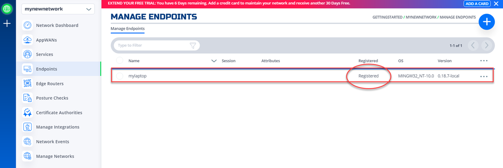

## Task 6: Create Services and AppWAN

The final step is to create a service for the web app in our VCN and to build an AppWAN to allow our endpoint (mylaptop) access to this service (port 80) on the private VCN IP address. The customer edge router will be used to terminate the service as show in this example. 

1. From the NetFoundry dashboard, select services from either location and hit the + sign in the upper right corner.

	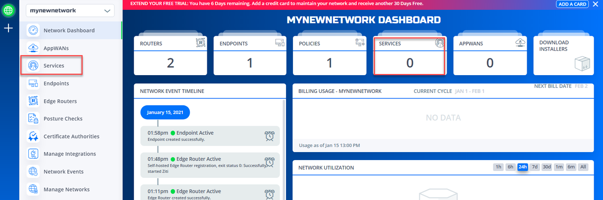

2. From within the create service context menu, provide a name for your service, deselect native application SDK based on the right side and select router Hosted. Leave "Service Attributes" blank, leave "Edge Router Attributes" blank(default is #all). Select your edge router from the drop down list(not fabric router). Insert your private ip and port for the Intercept hostname/ip. Again at the bottom, select TCP and your IP/port 80. Hit Create.

	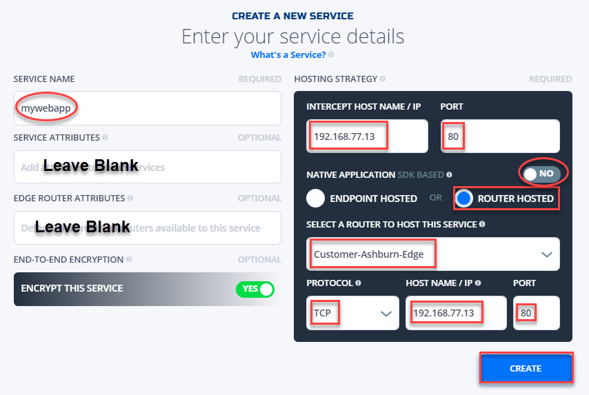

3. Next select AppWAN from the Services/AppWAN screen  and hit the + sign in the upper right corner.

	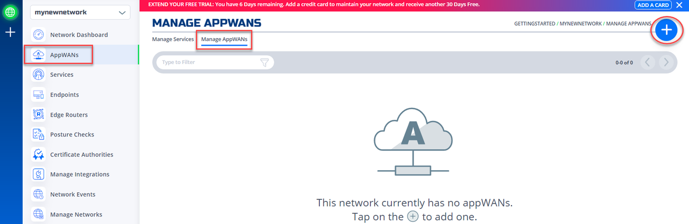

4. Within the AppWAN create page, select a name suggesting it's function/location e.g. webapp-ash-appwan. Mouse click in the service attributes and select the service created in the previous step. Mouse click in the Endpoint Attributes field and select your endpoint e.g. @mylaptop. Leave posture attributes blank. Hit Create.

	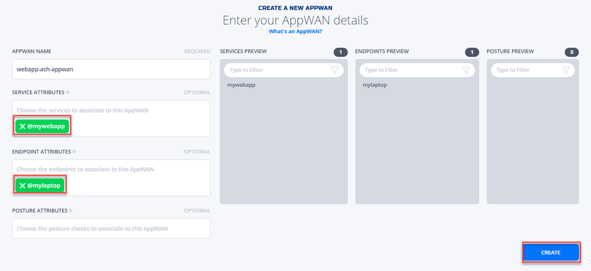

5. Now return to your endpoint client. You should see a service show up in a few minutes. Once the service has populated, you should now be able to use a browser to connect to the cloud web app by the private ip from the service you created.

	If after 5 minutes it does not show up, Stop and Start the service by clicking the connect button at the top. 

	**Note you can click the arrow next to your identity to see what the service looks like in your client.**

	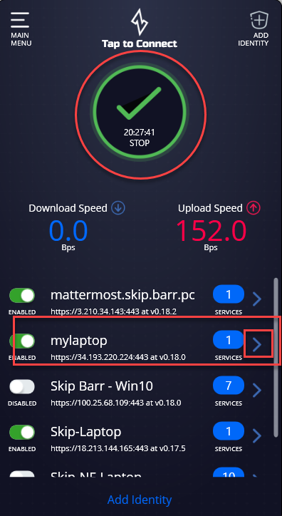

	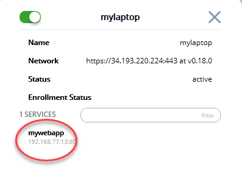

	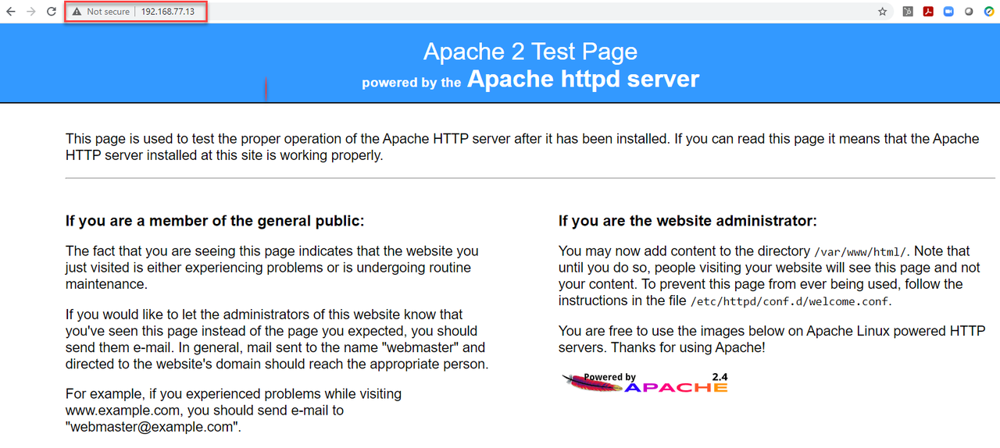

**Congratulations on spinning up your first complete network. If you no longer wish to be connected to the NetFoundry network you can disable the button to the left of your identity.**


## Acknowledgements

* **Author** - Skip Barr (Solutions Architect - NetFoundry), Raj Hindocha, Solutions Architect
* **Contributors** - Randall Spicher, Senior Cloud Engineer
* **Last Updated By/Date** - Randall Spicher, June 2021

