# OKE Apps and OCI Monitoring Service

## Introduction

In the previous section you learned how to integrate your applications with the OCI Logging Service to ensure your valuable log data can be easily collected, centralized and persisted for diagnostics. Complete visibility into your containerized application also requires real-time quantitative metrics to understand the health, performance and resource utilization. This is critical to quickly detect issues, analyze trends and monitor functional compliance in real time. How can you easily populate a dashboard with realtime metrics?

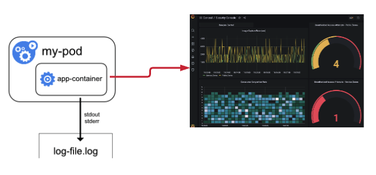

The OCI Monitoring Service is natively integrated with the underlying infrastructure resources your containerized app utilizes at runtime. Your application code can leverage this service and take advantage of all the built-in features such as realtime alerting, notifications, metric storage and metric data archival. This also provides a single unified monitoring framework for all your cloud infrastructure and custom application resources.

Unlike the logging framework, integrating your application code with the Monitoring Service will require making API calls to the regional REST service endpoints. Fortunately, OCI makes this process easy by offering SDKs, templates and examples for all popular development platforms. You can also wrap direct API calls within your code without loading SDK libraries.  

In this section you will review a simple Node.js application that generates, then posts, metric data that simulates the application latency in responding to client API calls. You will then review how these metrics are collected and made available for analysis, alarms, notifications and archival.  

Estimated Time: 15 minutes


### Objectives

* Review code options for posting custom metrics to the OCI Monitoring Service
* Deploy a Node.js application to OKE
* Examine ingested metrics via the Monitoring Service Console


### Prerequisites

* An Oracle Free Tier, Always Free, Paid or LiveLabs Cloud Account
* Access to the cloud environment and resources configured in Setup the Environment

## Task 1: Review Code Options for Posting Custom Metrics

Let's review the example application source files and observe the specific additions required to post metrics to the Monitoring Service.

**1. Review the deployment files**

In your Cloud Shell, navigate to the **oke-monitoring** subdirectory downloaded in Setup the Environment and view the contents.

```
$ cd ~/devlive-hol/oke-monitoring/
$ ls

   devlive-metric.yaml  devlive-metric.js  Dockerfile
```
Let's examine the js source file:

```
$ cat devlive-metric.js
```

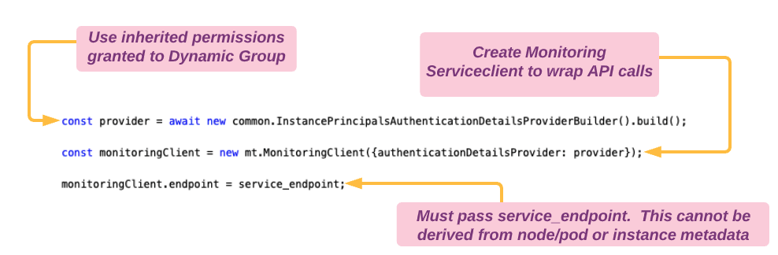

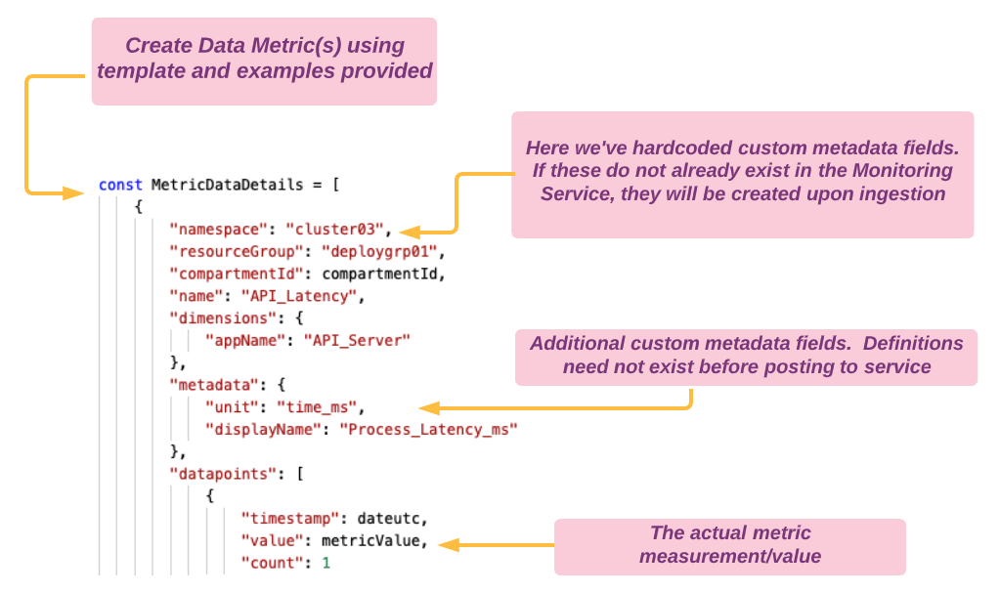

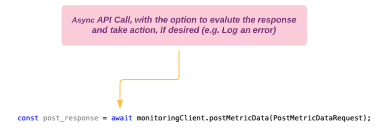


Now let's review the deployment file.  

**Note:** You are required to update the args (Compartment OCID and Service_Endpoint) in the following deployment file to match your environment.  

Your *Compartment OCID* was generated in Setup the Environment. If needed, refer to Setup the Environment Task 1.4 to collect this information.  

You also need to update the Monitoring *Service_Endpoint* for your specific region. The endpoints for this operation differ from other API operations. Ensure your endpoint includes the string 'telemetry-ingestion', as in the following example:

https://telemetry-ingestion.*eu-frankfurt-1*.oraclecloud.com

* [Obtain list of region-specific codes here](https://docs.oracle.com/en-us/iaas/Content/General/Concepts/regions.htm)

Some more examples:

Example for Ashburn:

      https://telemetry-ingestion.us-ashburn-1.oraclecloud.com

Example for Phoenix:

      https://telemetry-ingestion.us-phoenix-1.oraclecloud.com

Example for London:

      https://telemetry-ingestion.eu-london-1.oraclecloud.com

Example for Tokyo:

      https://telemetry-ingestion.ap-tokyo-1.oraclecloud.com


Now let's take a look at the deployment file format.

```
$ cat devlive-metric.yaml
```
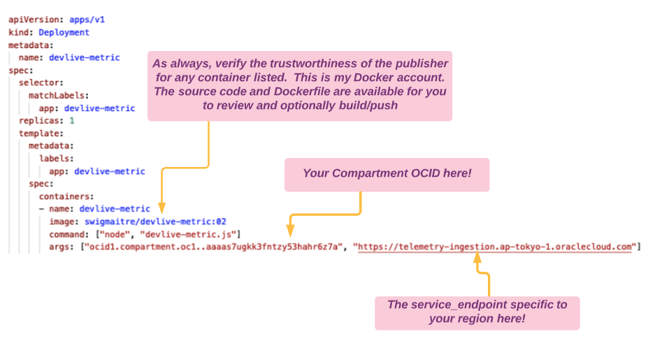

You may use the vi command to update the deployment file directly in the shell.  Or, use the menu options in the upper left corner of the shell window to download/upload this file for editing on your workstation.


## Task 2: Deploy a Node.js Application to OKE


1. After updating the devlive-metric.yaml file to match your OCID and Service_Endpoint, run the following commands to deploy the application.  

      ```
      $ kubectl apply -f devlive-metric.yaml
      ```

      You should receive a response similar to the following:

      ```
      deployment.apps/devlive-metric created
      ```

2. Verify the application container is online and healthy by executing the following command:

      ```
      $ kubectl get deployments devlive-metric
      ```

      You should receive a response similar to the following. You may need to wait a few more seconds for the **READY** status to indicate the deployment is active.  

      ```
      NAME               READY   UP-TO-DATE   AVAILABLE   AGE
      devlive-metric     1/1     1            1           44s
      ```


## Task 3: Examine Ingested Metrics

1. In the OCI Console, navigate to **Observability & Management** --> **Monitoring** --> **Metrics Explorer** to bring up the explorer page.  

      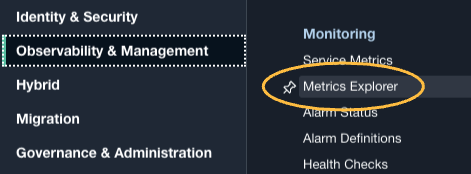

2. Below the graph, you have the ability to specify the query parameters to locate and display the metrics being published from your application. The selections are drop-down options with many only containing a single option. Select values to match the diagram below, then click on **Update Chart**.

      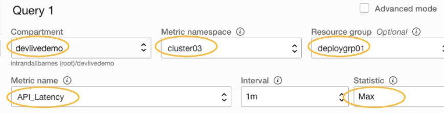

3. Above the graph, locate the **Y-Axis Label** box and enter a meaningful label.

      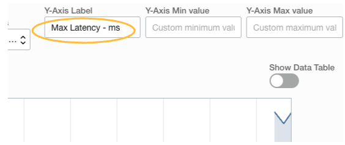

4. View your graph, which should resemble the image below. Although this is simulated data, the process is the same for your live applications.

      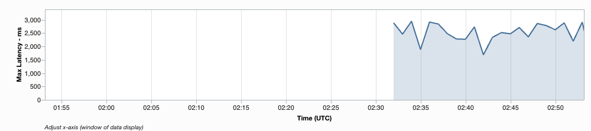

## Task 4: [Optional] Create Metric Alarm

1. While still reviewing the Metrics Explorer page, locate and select the **Create Alarm** button near the bottom.

      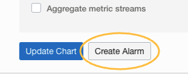

2. This will open the **Define Alarm** dialog. Give your alarm a name and message (Alarm Body).

      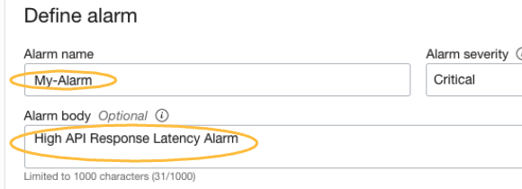

3. Continue to select the **Metric Description** boxes to match the query specified in Step 3.

      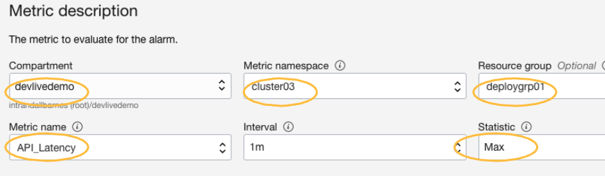

4. Define the **Trigger Rule** as follows:

      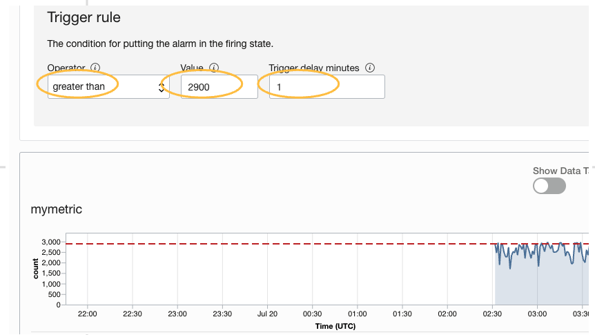

5. For **Destinations**, you probably do not yet have a Topic [Alarm Message Destination] configured. Select the **Create a Topic** link to open up the **Create a new topic and subscription** option. Enter your information (you will have to confirm an automatically generated email to enable this topic. You can cancel the topic and alarm at any time).

      

      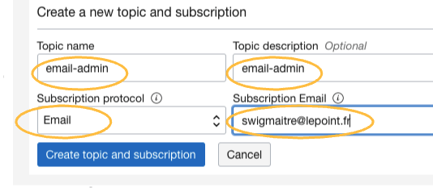

6. Finally, select **Save alarm** to complete the process.

      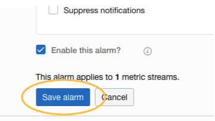

**Congratulations** You have completed this section! If your are done testing, consider terminating your OKE cluster to conserve your free credits.


## Learn More

* [OCI Monitoring Service Overview](https://docs.oracle.com/en-us/iaas/Content/Monitoring/Concepts/monitoringoverview.htm)

## Acknowledgements
* **Author** - Randall Barnes, Solution Architect, OCI Observability Team
* **Last Updated Date** - July, 2021
