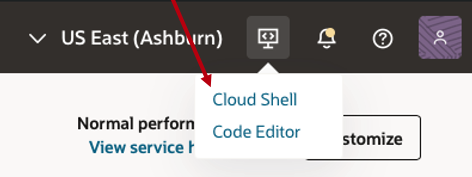
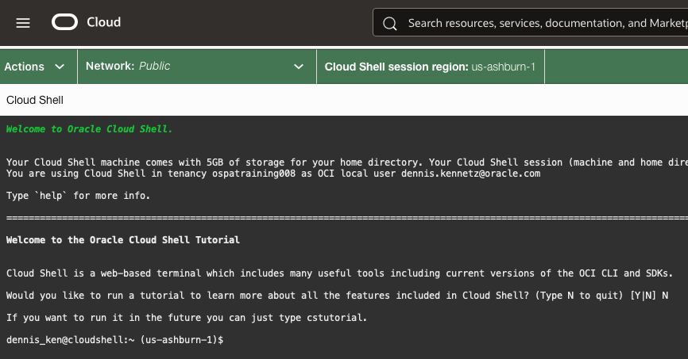
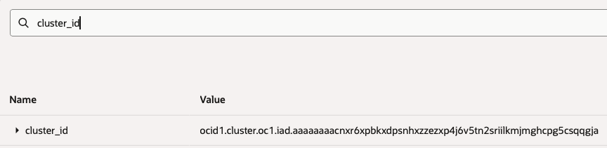

# Connect to Your OKE Cluster

## Introduction

The cuOpt pack runs on an Oracle Kubernetes Engine (OKE) cluster.
The later labs need a working `kubectl` on your laptop.
You also need an OCI CLI session that can mint cluster credentials.

In this lab you install the OCI CLI and `kubectl`.
You sign the CLI in with API key credentials.
You then build a kubeconfig from the cluster OCID.
At the end, you should list pack pods, services, and ingress hosts from your shell.

Estimated Time: 20 minutes.

### Objectives

In this lab, you will:

- Install the OCI CLI and `kubectl` locally.
- Sign the OCI CLI in to your tenancy.
- Build a kubeconfig for the pack OKE cluster.
- List pods and services in the pack namespaces.

### Prerequisites

- Deployed OKE Cluster (completed [Lab 1](../deploy-pack/deploy-pack.md)).
- For the Live track, the cluster OCID from your instructor.
- For the At Home track, the cluster OCID from the Resource Manager **Outputs** tab (`cluster_id`).

## Task 0: Launch cloud shell (live attendees can skip to Task 1)

1. Launch cloud shell

    - If you get an authorization error, you may need to add an IAM policy:
      - myawesomegroup below should be a real group provided by an admin
      - "Allow myawesomegroup to use cloud-shell in tenancy"
    - Launch cloud shell from the console home.

      
    
      

2. Confirm `oci-cli` with a version check.

    ```bash
    oci --version
    3.73.1
    ```

## Task 2: Connect to your running cluster

1. Get your OKE cluster ID.

    - Live users, get the cluster_id from the output
    - At home users, go back to the "Outputs" tab and search, "cluster_id"
    
    - Copy the value to use in the next step.

2. Connect to your running cluster

    - In cloud shell, run the following command.
    - Replace the cluster-id with the id you coped from step 1.
    ```bash
    oci ce cluster create-kubeconfig \
    --cluster-id ocid1.cluster.oc1.phx.aaaaaaaaae... \
    --file $HOME/.kube/config  \
    --region us-ashburn-1 \
    --token-version 2.0.0

    # output
    # New config written to the Kubeconfig file /home/dennis_ken/.kube/config
    ```

## Task 3: Explore the Pack Workloads

1. List nodes.

    ```bash
    kubectl get nodes

    NAME          STATUS   ROLES    AGE     VERSION
    10.0.104.34   Ready    node     3h55m   v1.34.1
    10.0.105.4    Ready    <none>   3h48m   v1.34.1
    10.0.107.38   Ready    node     3h55m   v1.34.1
    10.0.107.42   Ready    node     3h55m   v1.34.1
    ```

    The `none` node is the GPU worker node.

    ```
    kubectl describe node 10.0.105.4
    Name:               10.0.105.4
    Roles:              <none>
    Labels:             beta.kubernetes.io/arch=amd64
                        beta.kubernetes.io/instance-type=BM.GPU.T1.2
    ...
    ```

2. List ingress hosts.

    - here, you will see blueprints, grafana, and prometheus.

    ```bash
    kubectl get ingress

    kubectl get ingress -n cluster-tools
    ```
    - paste the blueprints host to your browser.
    - all apps are running in your OCI tenancy with accelerator packs.

3. Tail the cuOpt NIM logs to confirm the GPU service is up.

    ```bash
    kubectl get pods
    ...
    recipe-cuopt-7a76ed4a-2-cuopt--68548684-586ffdff88-84hkv
    ...
    ```
    - Tail the logs
    ```bash
    kubectl logs --tail=50 recipe-cuopt-7a76ed4a-2-cuopt--68548684-586ffdff88-84hkv
    ...
    2026-06-04 17:37:28.773 INFO 172.16.2.1:41414 - "GET /v2/health/ready HTTP/1.1" 200
    2026-06-04 17:37:58.774 INFO 172.16.2.1:50270 - "GET /v2/health/ready HTTP/1.1" 200
    2026-06-04 17:38:28.774 INFO 172.16.2.1:57122 - "GET /v2/health/ready HTTP/1.1" 200
    2026-06-04 17:38:58.773 INFO 172.16.2.1:47026 - "GET /v2/health/ready HTTP/1.1" 200
    ```

## Learn More

- [OCI CLI docs](https://docs.oracle.com/iaas/Content/API/SDKDocs/cliinstall.htm).
- [OKE kubeconfig setup](https://docs.oracle.com/iaas/Content/ContEng/Tasks/contengdownloadkubeconfigfile.htm).

## Acknowledgements

* **Author** - Dennis Kennetz, OCI AI Accelerator Program.
* **Last Updated By/Date** - Dennis Kennetz, May 2026.
