# Deploy the cuOpt Accelerator Pack

## Introduction

This lab applies to the **At Home** track only.
Skip it if you follow the Live track, where the pack already runs.

You launch a Resource Manager stack that builds a full cuOpt environment.
The stack adds a regional VCN, an OKE cluster, and a GPU node pool.
It also ships the cuOpt NIM, the front-end and backend, the auth service, Prometheus, and Grafana.
The stack runs `terraform apply` in your tenancy.
It prints connection URLs in the **Outputs** tab.

Estimated Time: 30 minutes plus 30 to 60 minutes of unattended apply time.

### Objectives

In this lab, you will:

- Download the livelabs zip file from the open-source repo.
- Fill in the required tenancy, NGC, and admin fields.
- Run `apply` and confirm the pack reaches a healthy state.

### Prerequisites

- An OCI tenancy with GPU room for the pack node pool.
- The poc size needs one VM.GPU.A10.2 GPU node.

## Task 1: Create the Resource Manager Stack

1. Visit the [LiveLabs Release in GitHub](https://github.com/oci-ai-incubations/ai-accelerator-starter-packs/releases/tag/LiveLabs).

    - Download the `livelabs_vrp_cuopt.zip` file by clicking it.
    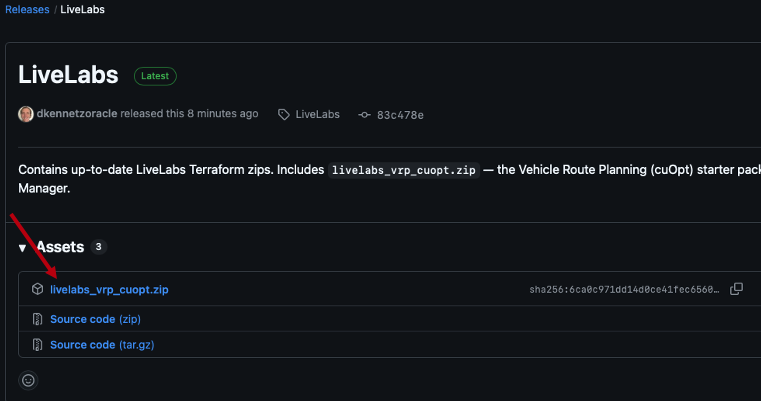

2. Navigate to **Developer Services > Resource Manager > Stacks > Create Stack**.

    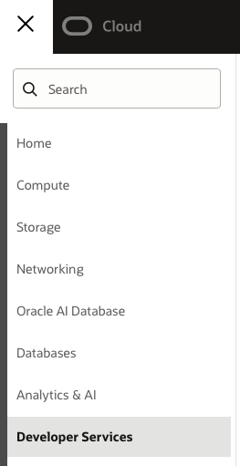
    
    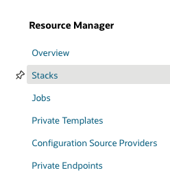
    
    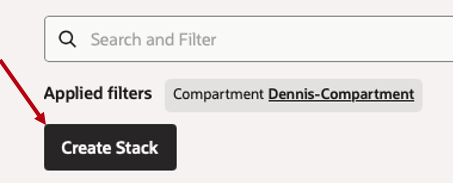

3. On the welcome form, click **".zip file" > Browse > `livelabs_vrp_cuopt.zip`**.

    - Select the zip option and click browse.

      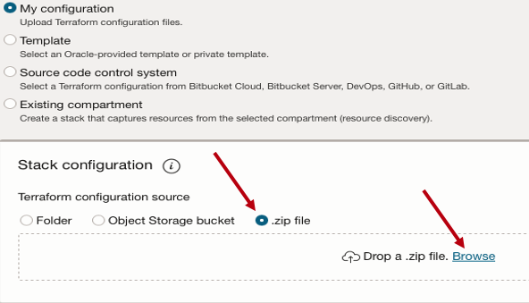

    - After you upload, the stack populates.

      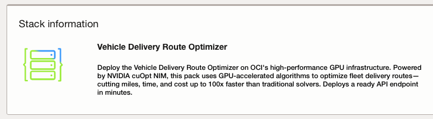

    - Click **"Next"** at the bottom of the page.

      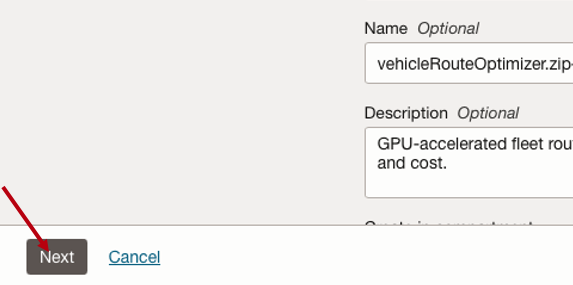

## Task 3: Fill in the Stack Inputs and Create

1. Fill in the required fields.

    - Keep the **Starter Pack Size** at poc.
    - Set the **worker node availability domain** where you have GPUs available.

      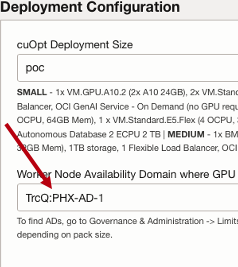

    - Select the "Oracle Interactive - Route visualization (Partner Contributed)" skin if not selected.

      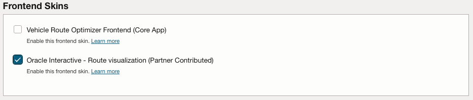
  
    - **OCI AI Blueprints admin username, password, email**: pick credentials for the Blueprints portal and the cuOpt front-end.
    - The password needs at least 8 chars with one uppercase letter and one special char.
    - Leave **Authentication** and **Advanced Options** defaults.
    - **Google Maps API Key** and **OpenWeatherMap API Key** are not required but welcomed.
    - Set your **OCI GenAI Services Region** to a region you have access to.
    - Set your database username and admin password.

2. Click **Next > Run apply > Create**.

    - Click **Next**.

      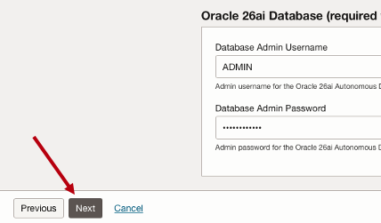

    - On the bottom of the page, click **Run apply > Create**.

      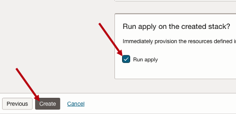

## Task 4: Monitor and Wait for Completion

1. Creating will take you to the job page.

    - Upon creation, the status will switch to **"Accepted"**.
    - After a few seconds it will transition to **"In Progress"**.

2. Wait for the apply job state to read **Succeeded**.

    - If the job fails on the GPU pre-check, edit the stack, pick a different AD, and apply again.
    - If the job fails on Helm or Kubernetes provider errors after the cluster comes up, click **Apply** again.
    - The stack is idempotent.

      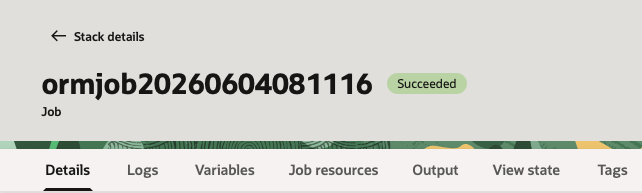
    
    - You are now ready for [Lab 2 - Explore Pack Services](../explore-services/explore-services.md).

## Learn More

- [OCI AI Accelerator Starter Packs README](https://github.com/oci-ai-incubations/ai-accelerator-starter-packs/blob/main/README.md).
- [OCI Resource Manager docs](https://docs.oracle.com/iaas/Content/ResourceManager/home.htm).

## Acknowledgements

* **Author** - Dennis Kennetz, OCI AI Accelerator Program.
* **Last Updated By/Date** - Dennis Kennetz, May 2026.
