# Explore Pack Services

## Introduction

The cuOpt pack ships with five front-door services.
You see the OCI AI Blueprints (Corrino) portal, the cuOpt front-end, the cuOpt FastAPI backend, Prometheus, and Grafana.
Each one runs behind ingress-nginx with a TLS cert at a `nip.io` host.
You may also use a custom domain.

In this lab you collect each URL from the stack outputs.
You sign in to the Blueprints portal.
You then view the Prometheus targets and the Grafana dashboards that ship with the pack.
You will use these consoles in every later lab.

Estimated Time: 15 minutes.

### Objectives

In this lab, you will:

- Find each pack URL and credential.
- Sign in to the Blueprints portal and find the cuOpt deployment.
- Confirm Prometheus is scraping the cluster.
- Confirm Grafana renders the default dashboards.

### Prerequisites

- Completed [Lab 1 - Deploy the cuOpt Accelerator Pack](../deploy-pack/deploy-pack.md).
- The stack output values from Resource Manager (At Home).
- The URL list shared by your instructor (Live).

## Task 1: Collect the Pack URLs

1. Open the **Outputs** tab of the Resource Manager stack (At Home).
   Or open the URL list your instructor shared (Live).

    - outputs:

      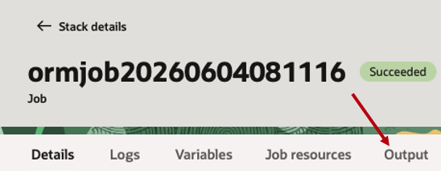

    - Search and filter for the following:
      - `starter_pack_url` for the cuOpt front-end.
      - `blueprints_portal_url` for the Blueprints portal.
      - `corrino_api_url` for the Blueprints REST API.
      - `prometheus_url` for Prometheus.
      - `grafana_url` for Grafana.
      - `corrino_admin_username` and `corrino_admin_password` for the shared admin.
      - `grafana_admin_username` and `grafana_admin_password` for Grafana.

## Task 2: Sign In to the Blueprints Portal

1. Open `blueprints_portal_url` in your browser.

    - Sign in with `corrino_admin_username` and `corrino_admin_password`.

      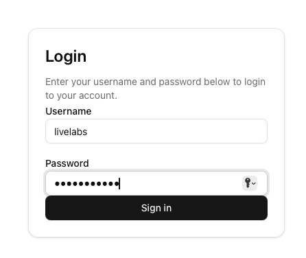
    
      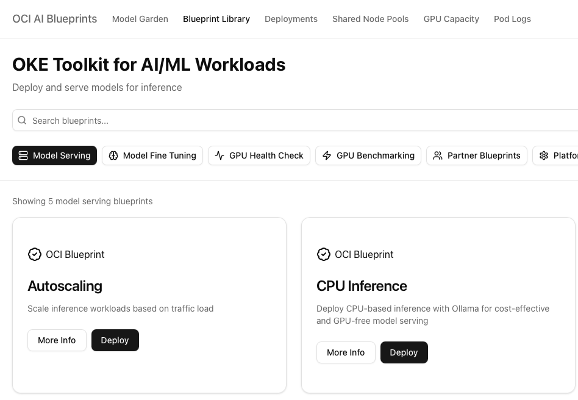

2. On the header, locate **Deployments**.

    - Go to **Deployments**.

      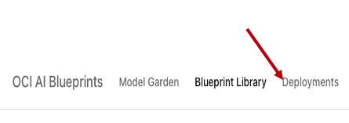

    - Click the **Deployment Group** to expand the deployments.

      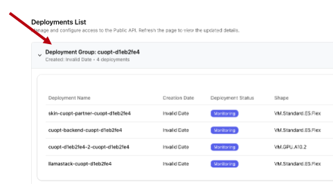

    - Click the **skin-cuopt-partner-** to see the deployment and url.

      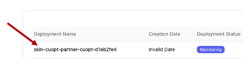

    - Click the URL to visit the deployed app, then proceed to next step.

      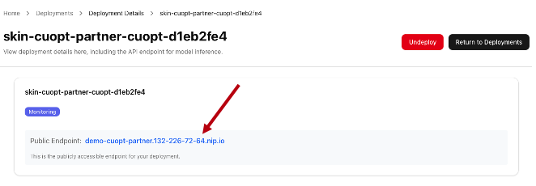

      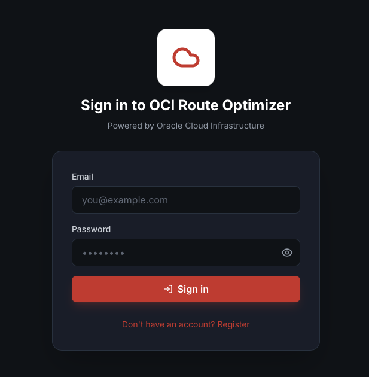

3. Visit the pod logs and investigate the logs of a running service.

    - Go to **Pod Logs > Default > recipe-cuopt-*** and view logs.

      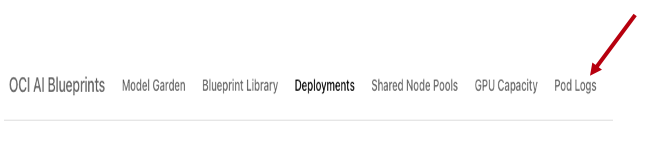

      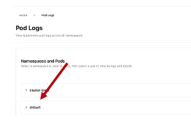

## Task 3: Inspect Prometheus

1. Open `prometheus_url` in a new tab by going back to the stack outputs.

    - The Prometheus UI loads without a sign-in prompt inside the workshop network.
    You should see the search bar at the top.

      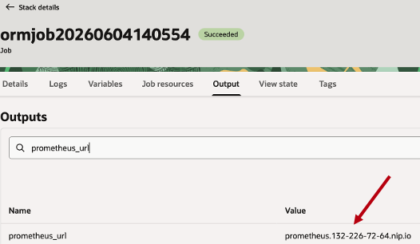
    

2. Click **Status > Target Health**.

    - Scroll through the services to identify what Prometheus has metrics for.

      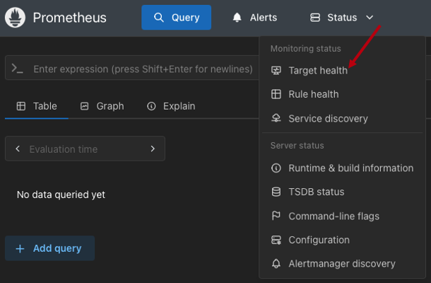

3. Run a sanity query.

    Paste this query into the search bar and click **Execute**.

    ```promql
    DCGM_FI_DEV_GPU_UTIL
    ```
    - This will give show you information about the A10s that are deployed.

      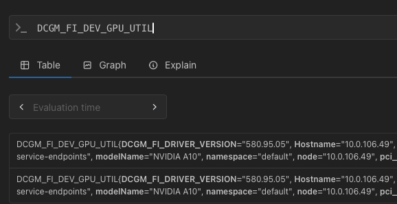

## Task 4: Inspect Grafana

1. Open `grafana_url` in a new tab by going back to the stack outputs.

    - Search "grafana" and you will get the url, username, and password.

      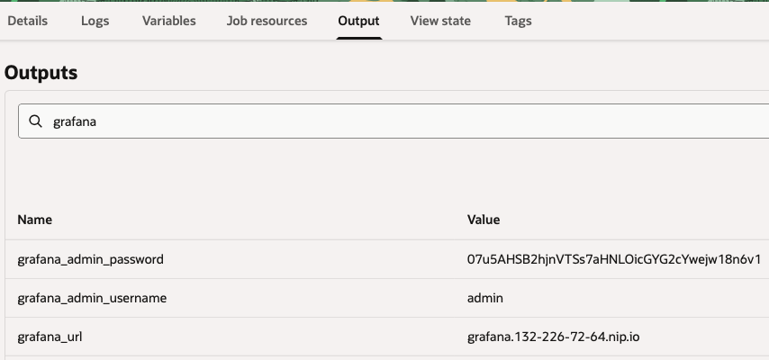

    - Use these to sign in on the url homepage.

2. Click **Dashboards > NVIDIA DCGM Exporter Dashboard**.

    - Click Dashboards to see the list of available dashboards.

      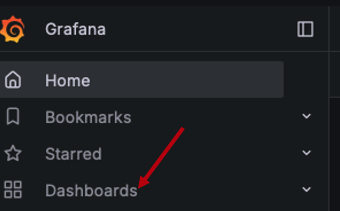

    - Click the "NVIDIA DCGM Exporter Dashboard" to see GPU metrics.

      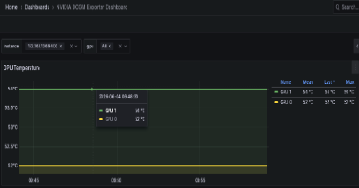

3. Click **Connections > Data sources** in the left nav.

    - You should see a Prometheus data source already there.

      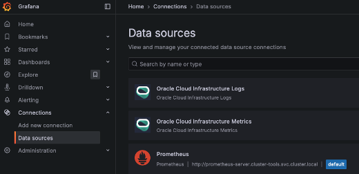

You are now ready for [Lab 3 - Connect to your OKE Cluster](../connect-cluster/connect-cluster.md).

## Learn More

- [OCI AI Blueprints docs](https://github.com/oracle-quickstart/oci-ai-blueprints/blob/main/docs/about.md).
- [Prometheus query basics](https://prometheus.io/docs/prometheus/latest/querying/basics/).
- [Grafana docs](https://grafana.com/docs/grafana/latest/).

## Acknowledgements

* **Author** - Dennis Kennetz, OCI AI Accelerator Program.
* **Last Updated By/Date** - Dennis Kennetz, May 2026.
