# Submit an Optimization Job from the UI

## Introduction

The cuOpt front-end is a React app on Nginx.
It loads a fleet plan.
It sends stops and vehicles to the backend.
The backend forwards the request to the NVIDIA cuOpt NIM.
The front-end then renders the routes on Google Maps or Leaflet.

In this lab you sign in to the front-end.
You pick a benchmark, configure a fleet, and run one cuOpt solve.
You will reuse the route output as the baseline for the dataset swap in Lab 5.

Estimated Time: 20 minutes.

### Objectives

In this lab, you will:

- Sign in to the cuOpt front-end.
- Pick a benchmark and set a fleet.
- Run a cuOpt solve.
- Review the routes, map, and impact panels.

### Prerequisites

- Completed [Lab 2 - Explore Pack Services](../explore-services/explore-services.md).
- The `starter_pack_url` from the stack outputs.
- The Blueprints admin credentials.

## Task 1: Sign In to VRP front-end

1. Open the **Outputs** tab of the Resource Manager stack (At Home).
    Or open the URL list your instructor shared (Live).

    - Search `starter_pack_url` and visit the output.

      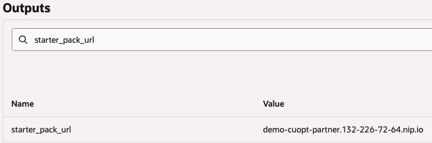

    - **IMPORTANT**: The credentials here will be used in the next lab, please store them somewhere!
    - Register an account via the UI:

      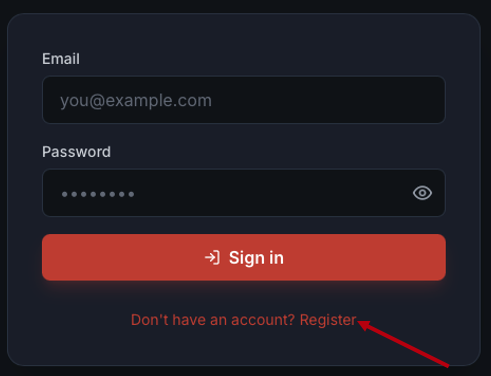

      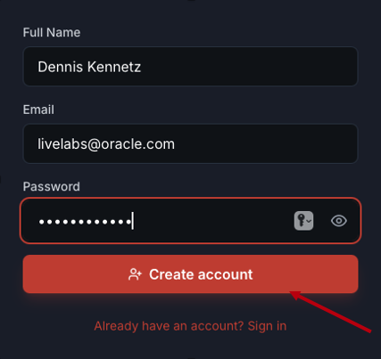

2. Select "Leaflet" as the "Maps" API:
    - Google is selected by default, switch to "Leaflet".

      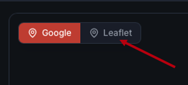

      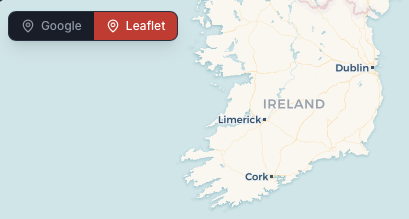

## Task 2: Configure Your Region

1. Click the **Configuration** tab on the left nav.

    - Click Configuration and view modifiable fields.

      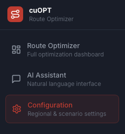

    - Change the Country to the **United States > Save**.

      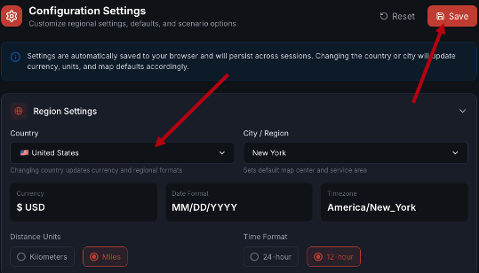

    - After this, feel free to investigate some of the other options.

## Task 3: Load a Benchmark Scenario

1. Return to the **Dashboard** tab.

    - The map should now show New York.

2. Set the fleet constraints.

    - Set **Vehicles** to `10`.
    - Set **Capacity per vehicle** to `50`.
    - Leave the job type mix at the defaults.

      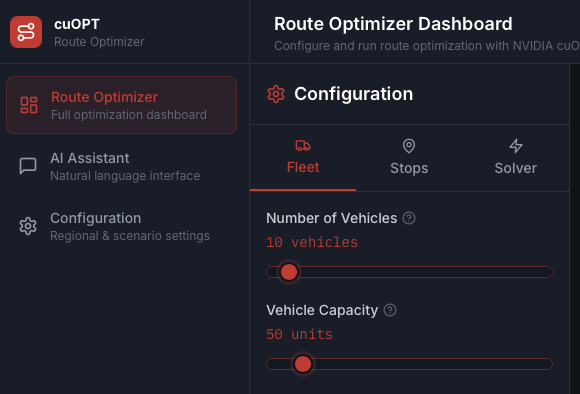

3. Generate random stops.

    - Go to the **Stops** tab and click "Generate Random Stops".

      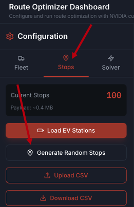

    - You will see them show up on the map.
    
      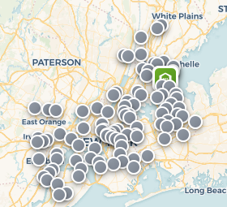

## Task 4: Run the Solve

1. Click **Run Optimization**.

    - Scroll down to the bottom of the "Stops" and click "Run Optimization."

      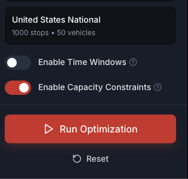

    - The front-end POSTs the payload to `/api/cuopt/request`.
    - The backend forwards it to the cuOpt NIM with the `cuopt.solve` scope on your JWT.
    - The request returns a request id.
    - The front-end polls `/api/cuopt/solution/{req_id}` until the answer arrives.
    - The solution can take 30 seconds.

2. Review the result.

    - The map updates with one color-coded polyline per vehicle.

      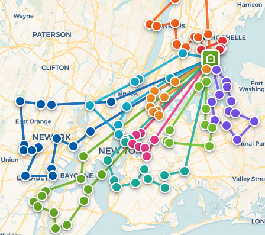

    - The **Routes** panel lists each vehicle stop sequence, distance, and duration.

      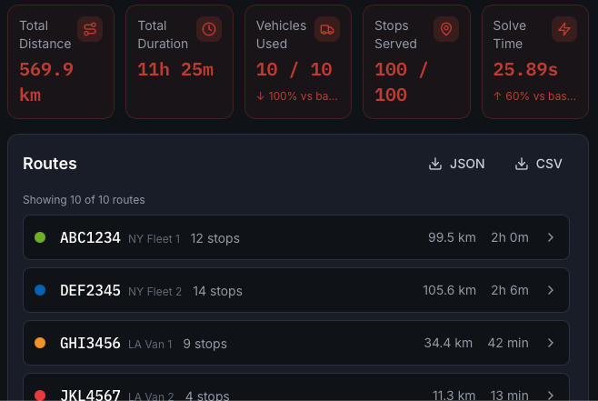

    - The **Impact** tab shows projected daily savings and jobs-per-tech metrics.

      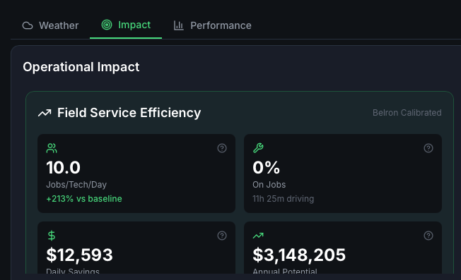

## Task 5: Confirm the Job Hit the cuOpt NIM

1. View the pod logs in the Blueprints portal.

    - As a refresher from Lab 2, go back to the blueprints portal.
    - Go to pod logs.
    - Select the "default" namespace.
    - identify the "recipe-cuopt-**-2-cuopt" pod and **View Logs & Details**
    - Scroll to the bottom and see the log polling.

      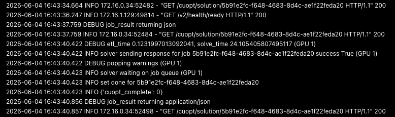

2. Run a second solve from the UI.

    - Run a second solve with both UIs open and refresh the logs.

## Task 6: Download the generated dataset, modify, and rerun

1. Go back to the "Stops" tab in the VRP portal.

    - Go back to **Stops > Download CSV**

      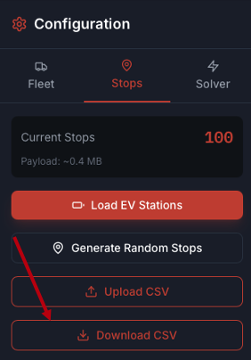

    - Change the "demand" for stops 1,10,20,30,40,50.
    - Re-upload the CSV:
    
      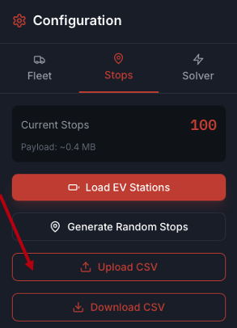
    - Run optimize, explore results.

You have now completed the required part of the Lab! Congratulations.

Proceed to [Lab 5 - Submit Jobs Directly to the cuOpt API](../python-api/python-api.md).

## Learn More

- [NVIDIA cuOpt docs](https://docs.nvidia.com/cuopt/index.html).
- [Vehicle Routing Problem overview](https://en.wikipedia.org/wiki/Vehicle_routing_problem).

## Acknowledgements

* **Author** - Dennis Kennetz, OCI AI Accelerator Program.
* **Last Updated By/Date** - Dennis Kennetz, May 2026.
