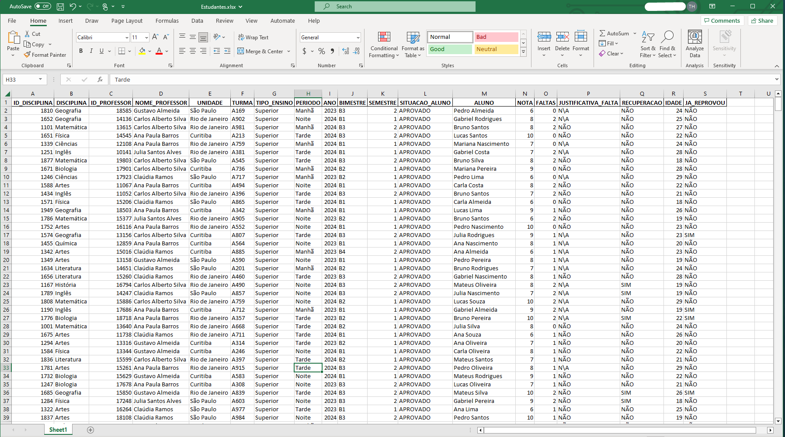
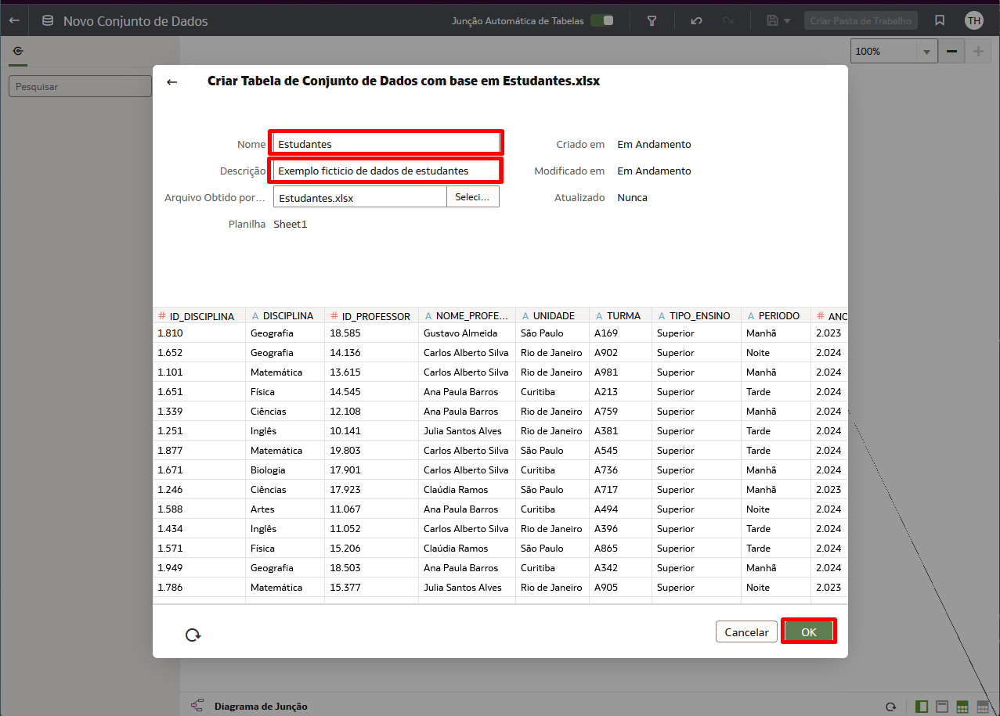

# Criar um Conjunto de Dados

## Introdução

Neste Lab você vai aprender a criar um Conjunto de Dados (Dataset) no Oracle Analytics Cloud.

**Conjuntos de Dados** podem ser criados usando uma ou mais tabelas, que podem ser de uma mesma conexão ou de conexões diferentes (inclusive podemos usar arquivos CSV ou XLSX). Você pode unir todas essa tabelas dentro do "Diagrama de Junções" (Join).

*Tempo estimado para o Lab:* 10 Minutos

### Objetivos

* Baixar o arquivo do excel que vamos usar
* Salvar o Conjunto de Dados

## Tarefa 1: Baixe o arquivo excel

Criamos um arquivo excel com dados fictício que vão ser muito úteis para ilustrar o uso do Oracle Analytics Cloud para analise de dados de alunos em uma escola para ajudar na criação de um relatório que mostra a jornadas dos alunos e das turmas.

1. O primeiro passo é fazer o download do arquivo excel [clicando nesse link](https://iddyniho7ykf.objectstorage.us-ashburn-1.oci.customer-oci.com/p/XOajAKu9_u-b2425jClFChdbapdzGskkMNfRuze4AbBEwIcS7vGLKQ0wCdDHGtxW/n/iddyniho7ykf/b/DadosFastTrack/o/Estudantes.xlsx).

2. Abra o arquivo excel e dê uma olhada nos dados e verifique se o arquivo está funcionando corretamente.

    

## Tarefa 2: Criar o conjunto de dados no OAC

Agora vamos fazer o upload no Oracle Analytics Cloud do arquivo excel que você baixou.

1. Na área Home do Analytics clique no botão criar e em seguida selecione *'Conjunto de dados'*.

    

2. Clique no botão indicado na imagem.
   
    

3. Selecione o arquivo no seu computador e clique em abrir.

    

4. Preencha o Nome e a Descrição com indicado na imagem e clique em *'OK'*.

    

5. Na parte inferior da tela selecione a aba do arquivo 'Estudantes' e clique no botão metadados na barra superior.

    

6. Clique no ícone de Hashtag (*#*) ao lado do campo 'ID_DISCIPLINA' e mude para Atributo.

    

7. Faça essa mudança de *Medida* para *Atributo* em todos os campos, exceto em 'NOTA' E 'FALTAS'.

    

8. Mude o modo de visualização de metadados, clique nos três pontinho da coluna 'UNIDADE' e em seguida selecione 'Detalhes do Local'

    

9. Após validar as localizações clique em 'OK'.

    

10.  Agora vamos salvar o conjunto de dados, clique no ícone de disquete, dê um nome e uma descrição e em seguida clique em OK.

    

11. Após ver a mensagem de confirmação basta clicar no botão de voltar na parte superior esquerda.

    

Você pode **seguir para o próximo Lab**.

## Conclusão

Nesta sessão você aprendeu criar um Conjunto de Dados no Oracle Analytics Cloud a partir de um arquivo excel e aplicou algumas transformações básicas nos dados".

## Autoria

- **Autores** - Thais Henrique, Gabriela Miyazima
- **Último Update Por/Date** - Thais Henrique, Julho/2024