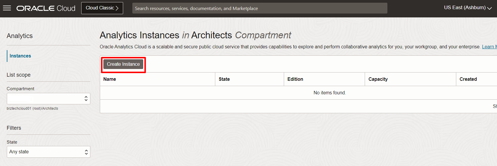

# Criar o Oracle Analytics Cloud (OAC)

## Introdução
A Oracle Cloud é o provedor de nuvem mais amplo e integrado do setor, com opções de implantação que vão desde a nuvem pública até o seu data center. A Oracle Cloud oferece serviços de alta qualidade em Software como Serviço (SaaS), Plataforma como Serviço (PaaS) e Infraestrutura como Serviço (IaaS).
Nesse Lab você vai aprender a provisionar o *Oracle Analytics Cloud*, a ferramenta para visualização e BI da Oracle Cloud.

*Tempo estimado para o Lab:* 10 Minutos

### Objetivos

Neste Laboratório você vai:
* Aprender como fazer login na sua conta Oracle Cloud
* Provisionar um Oracle Analytics Cloud

## Task 1: Fazer Login na Oracle Cloud

  1. Abra seu navegador da Web e acesse [a Oracle Cloud](https://cloud.oracle.com).
Insira o nome da sua conta na nuvem se estiver entrando em uma conta com o Identity Cloud Service.

    

   Quando a nova página carregar, apenas clique em **Continue**.

    

2.  Na página de login de **Cloud Infrastructure**, insira suas credenciais de login e, em seguida, clique em **Acessar**.

    

3. Agora você está conectado à Oracle Cloud!

   

## Task 2: Processo de criação do Oracle Analytics Cloud

Nesse tutorial criaremos uma instância da ferramenta Oracle Analytics Cloud.

1. Criar o OAC

   

- Clicar no Menu Hambúrguer no lado esquerdo superior;
- Clicar em **Analytics & AI**;
- Clicar em **Analytics Cloud**.

   

- Verificar se está no compartimento correto;
- Clicar em **Create Instance**.

   

2. Preencher as informações:

* Name: nome dado à instância;
* Description: descrição dada à instância – opcional;
* Create in Compartment: Compartimento onde a instância será criada;
* Feature Set: Escolher **Professional Edition**;
* Capacity: Escolher **OCPUs** e digitar **1**;
* License Type: Escolher **License Included**;

- Clicar em **Create** .

3. Acessar o Oracle Analytics Cloud

   Nesse passo mostraremos como acessamos a instância do Oracle Analytics Cloud.
- Clicar no nome da instância criada “Nome Escolhido”;
   

- Clicar em **Analytics Home Page**.
   

Você pode **seguir para o próximo Lab**.

## Conclusão

Nesta sessão você provisionou um Oracle Analytics Cloud, ele será utilizado durante todo o laboratório.

## Autoria

- **Autores** - Breno Comin, Thais Henrique, Gabriela Miyazima
- **Último Update Por/Data** - Thais Henrique, Julho/2024
