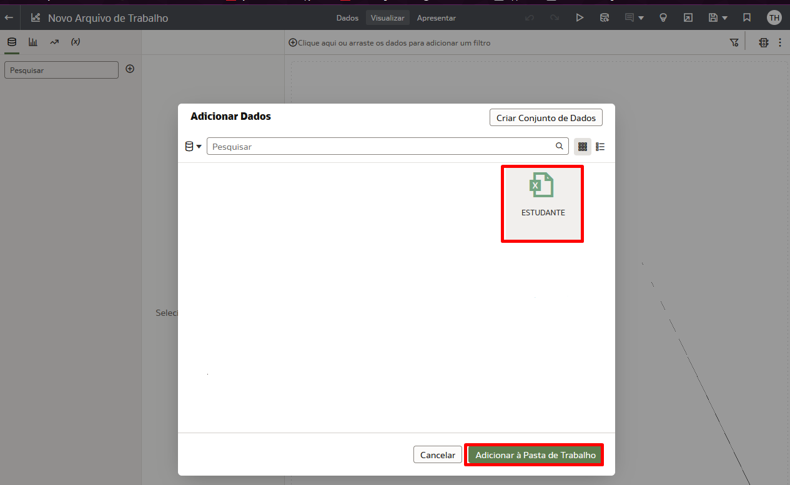
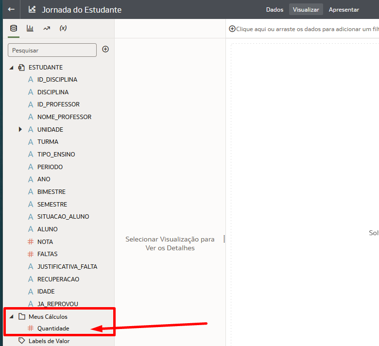
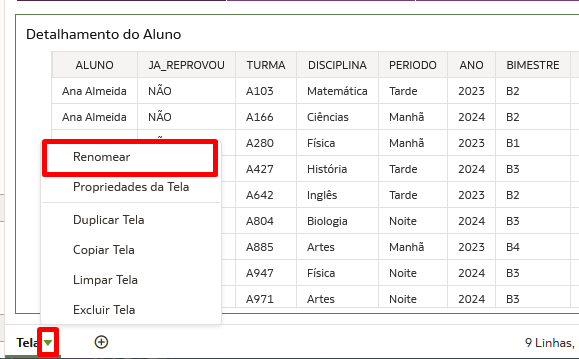
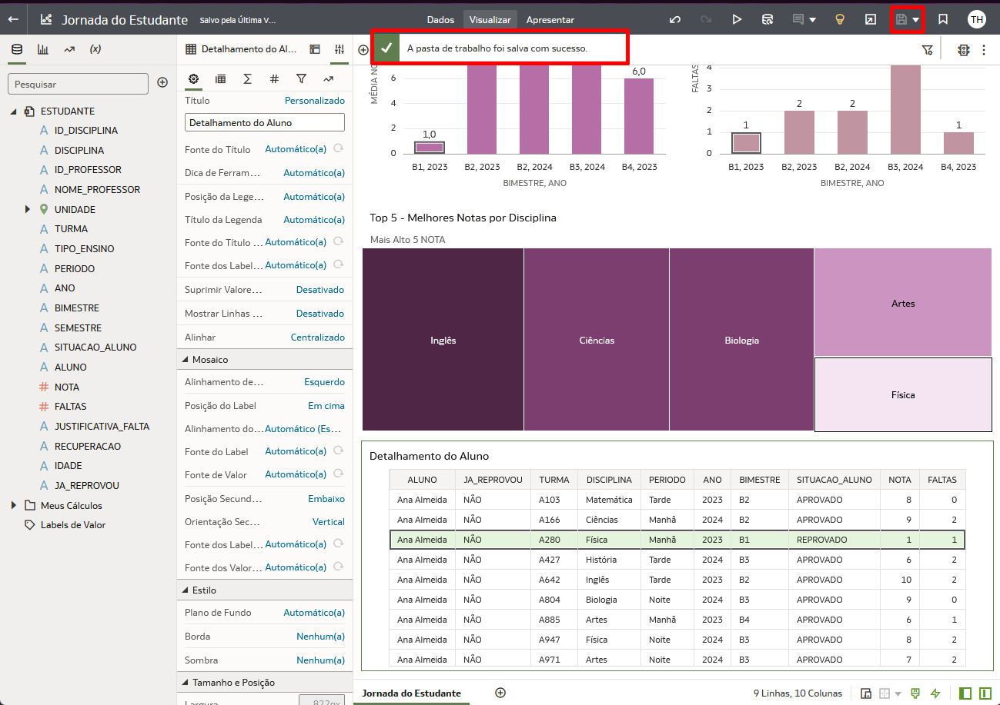
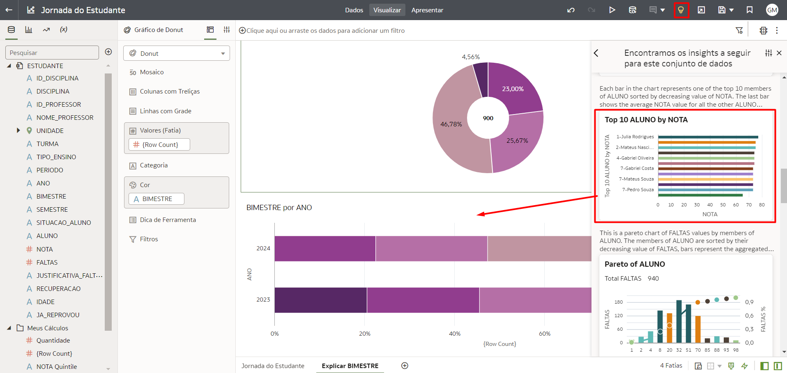
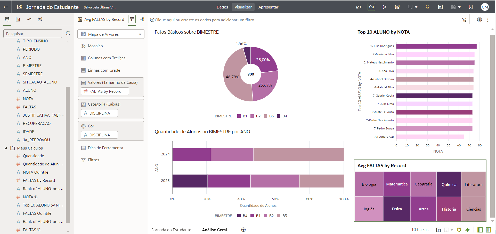

# Criar Visualizações

## Introdução

Neste Lab você vai aprender a criar visualizações no Oracle Analytics Cloud.

*Tempo estimado para o Lab:* 15 Minutos

### Objetivos

* Conhecer a interface de criação de visualizações do OAC
* Criar campos calculados
* Construir um dashboard com gráficos de diferentes tipos
* Alterar propriedades dos gráficos e fazer uso de funcionalidades complementares para personalizar o dashboard

## Tarefa 1: Criar a Pasta de Trabalho

O Oracle Analytics Cloud (OAC) possuí uma interface simples, o que permite navegar rapidamente por suas diversas opções e funcionalidades.

1. Na área Home do Analytics clique no botão criar e em seguida selecione *'Pasta de Trabalho'*.

    

2. Selecione o conjunto de dados 'ESTUDANTES' que você criou no Lab anterior e clique em adicionar a pasta de trabalho.

    

3. Mude o nome da Pasta de Trabalho para 'Jornada do Estudante' e salve.

    

## Tarefa 2: Criar um Campo Calculado

O Oracle Analytics Cloud também permite a criação de campos calculados dentro do próprio projeto de visualização para trazer informações complementares àquelas já presentes.

Para explorar essa funcionalidade iremos criar um campo calculado que será utilizado ao longo deste laboratório.

1.  Na barra lateral de opções, clique no simbolo indicado por um **+** e em seguida clique na opção **Adicionar Cálculo...**.

    

2.  Na janela que se abrir, coloque o nome do campo como **Quantidade**, digite o código a seguir e clique em **Validar** e posteriormente em **Salvar**.

```
COUNT(1)
```

  

3.  O campo calculado criado ficará disponível na parte inferior dentro da pasta **Meus Cálculos**.

    

## Tarefa 3: Criar um Dashboard com Visualizações Básicas

Agora vamos começar a criar nossos gráficos com alguma analises interessantes

1. Selecione o campo 'NOTA', pressione a tecla CTRL (mantenha pressionada) e selecione o campo 'BIMESTRE', em seguida arraste os dois campos para o centro da tela. Agora adicione o campo 'ANO' logo abaixo do campo 'BIMESTRE' como indicado abaixo. Você verá que o Analytics vai gerar um gráfico automaticamente.

    

É simples assim! O Analytics gera um gráfico que seja mais apropriado para os campos analisados, mas não precisamos mantê-los necessariamente. Agora vamos mudar algumas propriedades do gráfico

2. Vamos renomear o gráfico, exibir o totais na parte superior e configura a nota para trazer a média em vez da soma:

    

3. Agora vamos mudar a paleta de cores da pasta de trabalho. você pode escolher a que você preferir, basta seguir o exemplo abaixo:

    

4. Agora vamos criar um gráfico para as faltas, muito parecido com o primeiro:

    

Continuando nossa criação vamos criar mais alguns gráficos

5. Acesse a aba de gráfico e selecione o gráfico do tipo 'Mapa', arraste e solte acima do gráficos de barras que acabamos de criar.

    

6. Selecione o campo 'UNIDADE' e arraste para a área 'Categoria(Localização)'

    

7. No painel de propriedades selecione a segunda opção com indicado na imagem abaixo e na opção 'Mapa de Plano de Fundo' escolha *'Oracle Maps'*.

    

É fácil assim trabalhar com Mapas no Oracle Analytics Cloud.

Vamos adicionar alguns Filtros no dashboard para ficar mais fácil a visualização da jornada de cada estudante individualmente.

8. Acesse a aba de gráfico e selecione o gráfico do tipo 'Filtro do Painel', arraste e solte acima do gráficos de Mapa.

    

9. Selecione e arraste os campos indicados na imagem e solte na área 'Controles de Filtro'

    

10. Acesse o painel de propriedades do gráfico e na segunda aba clique em 'ALUNO', logo abaixo você verá a opção 'Seleção Múltipla', mude para 'Desativado'

    

11. Agora no gráfico de filtro selecione um aluno da lista e veja o filtro refletindo em todos os gráficos do Dashboard atual.

    

12. Acesse a aba de gráfico e selecione o gráfico do tipo 'Mapa de Árvore', arraste e solte na parte inferior da tela

    

13. Selecione os campos 'NOTA', 'ALUNO' e 'DISCIPLINA'  e organize-os como na imagem abaixo:

    

14. Em seguida vamos mudar o campo 'NOTA' para a agregação de Média, adicionar o 'NOTA' na parte de cor, adicionar o 'NOTA' novamente só que na parte de filtro do gráfico e mudar o título do gráfico para *'Top 5 - Melhores Notas por Disciplina'*

    

Para finalizar vamos criar uma tabela com informações detalhadas.

15.  Acesse a aba de gráfico e selecione o gráfico do tipo 'Tabela', arraste e solte na parte inferior da tela.
    

16. Selecione todos os campos indicados na imagem abaixo e coloque-os na área de  'Linhas' da tabela.

    

17. Acesse o painel de propriedades do gráfico e mudo o título da tabela para 'Detalhamento do Aluno'.

    

Antes de salvarmos o resultado, vamos renomear a tela de trabalho atual.

18. Na parte inferir da tela você verá a aba com nome 'Tela 1', basta clicar no pequeno triangulo em frente ao nome e em seguida selecione 'Renomear'.

    

19. Agora mude o nome para 'Jornada do Estudante' e confirme.

    

20. Agora basta salvar o dashboard clicando no ícone de salva na parte superior direita e aguardar a mensagem de confirmação.

    

## Tarefa 4: Explorando as Funcionalidades de Auto Insight e Explicar

O Oracle Analytics Cloud possui diversos mecanismos de Machine Learning nativo da ferramenta, esses recursos nos ajudam de várias formas diferentes durante o processo de criação dos nossos dashboards. Vamos ver duas funcionalidades muito úteis para entendimento dos dados e sugestões de gráficos: *Auto Insights e Explain (Explicar)*.

O ***Explain*** usa Machine Learning para encontrar informações úteis sobre seus dados.

1.  Para começar a explorar a funcionalidade de Explicar, clique com o botão direito do mouse sobre o campo **"BIMESTRE"** na tabela Vendas e em seguida selecione a opção **"Explicar BIMESTRE"**

    

Uma nova janela será aberta com todas as explicações sobre o campo que você selecionou, incluindo: Fatos Básicos, Drivers Chave, Segmentos que Explicam. Em cada aba dessas você vai encontrar gráficos e descrições em forma de texto sobre o campo que você está analisando. Uma vez que você olhou todas as abas você pode escolher os gráficos que você acha relevantes para seu dashboard.

2. Na aba "Fatos Básicos sobre BIMESTRE" role a página até você encontrar um gráfico que explica os Fatores Básicos sobre o BIMESTRE, descanse o mouse sobre o gráfico até aparecer um sinal de check no canto superior direito do gráfico e clique nesse sinal de check.

    

3. Vá para a aba Divers de Chave de BIMESTRE e selecione o check no ANO por {Row Count} em seguida clique em **"Adicionar Selecionado"** no campo superior da página.

    

4. Agora renomeie os gráficos com "Fatos Básicos sobre BIMESTRE" e "Quantidade de Alunos no BIMESTRE por ANO" como demonstrado abaixo.

    

5. Renomeie também o campo de cálculo {Row Count} por "Quantidade de Alunos" e a segunda tela com "Análise Geral".

    
    


Agora vamos usar o ***Auto Insights*** para criar visualizações poderosas usando sugestões geradas pelo Oracle Analytics Cloud (OAC).

1.  Vamos começar criando uma nova página chamada ***Auto Insights***.

2.  Clique no ícone de uma lâmpada amarela na parte superior direita da tela. Role até encontrar o gráfico chamado ***Top 10 ALUNOS by NOTA*** e arraste para o centro da página.

    

3.  Personalize as propriedades do Autoinsights, selecione o campo 'Disciplina' e clique no botão 'Aplicar'. 

    

4.  Espere carregar os novos gráficos e encontre o gráfico chamado ***Avg FALTAS by Record*** e o arraste para a tela. de modo a ter o resultado disposto na imagem a seguir.

    

No seu Arquivo de trabalho você terá a seguinte tela, como indicado na imagem abaixo.

   


Parabéns, você terminou esse laboratório!

## Conclusão

Nesta sessão você aprendeu a criar um dashboard com visualizações básicas de diversos tipos.

## Autoria

- **Autores** - Thais Henrique, Gabriela Miyazima
- **Último Updated Por/Data** - Thais Henrique, Julho/2024