# Crear paneles - Avanzado

## Introducción

En este laboratorio, dará un paso más en el desarrollo de sus análisis utilizando funciones avanzadas que Oracle Analytics Cloud (OAC) le ofrece para enriquecer aún más sus conocimientos.

*Tiempo estimado de laboratorio:* 25 minutos

### Objetivos
* Aprenda a agregar estadísticas a sus gráficos
* Aprenda a crear reglas de formato condicional
* Aprenda a agregar filtros a su tablero
* Aprende a crear "Acciones de datos"
* Aprenda a usar imágenes como filtros para sus datos

## Tarea 1: Agregar estadísticas al tablero

Oracle Analytics Cloud (OAC) le ofrece una forma muy sencilla de agregar estadísticas a sus gráficos. Los tipos disponibles son: *Clusters, Outliers, Reference Line, Trend Line, Forecast (Forecast)*

1. Cree una nueva pantalla en su archivo de trabajo haciendo clic en el signo *** en la parte inferior de la pantalla.

2. Luego cambiemos el nombre de esta pantalla, haga clic en el triángulo al lado del nombre de la pantalla y haga clic en cambiar el nombre.

3. Ingrese el nombre **"Avanzados"** y haga clic en el signo de verificación para confirmar.

4. Mantenga presionada la tecla Control (CTRL) y seleccione los campos **Ventas** y **Fecha de pedido (mes)** dentro de la tabla "Ventas", arrástrelos y suéltelos en el centro de la pantalla.

Notará que se creará automáticamente un gráfico de líneas. Aquí crearemos un pronóstico de ventas para los próximos 3 meses.

5. Haga clic derecho en el gráfico, luego seleccione **"Agregar estadísticas"** y seleccione **"Pronóstico"**.

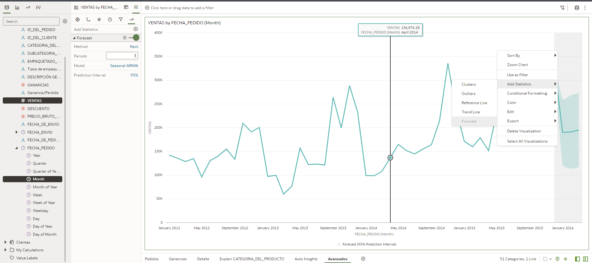

Después de unos segundos, tiene el pronóstico de ventas para los próximos 3 meses agregado a su gráfico. El pronóstico es el área en gris claro.

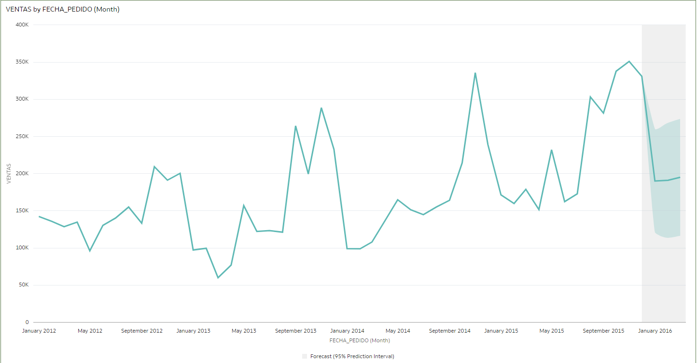

Ahora vamos a agregar una línea de referencia en el mismo gráfico en el que creamos el pronóstico.

6. Haga clic derecho en el gráfico, luego seleccione **"Agregar estadísticas"** y seleccione **"Línea de referencia"**.

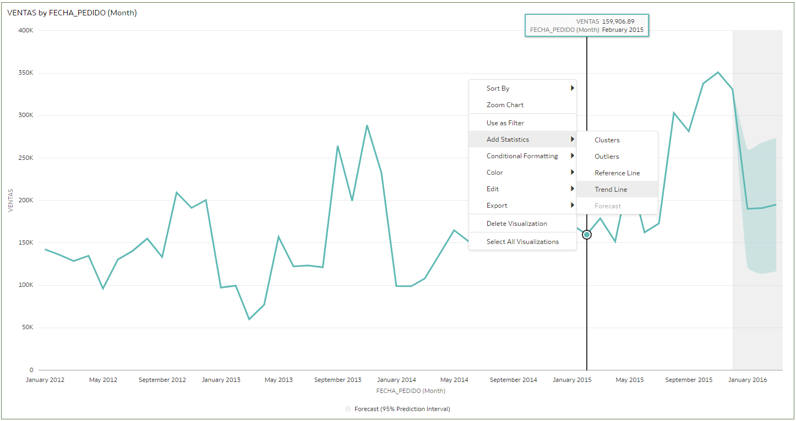

Después de unos segundos, verá la línea de referencia en su gráfico

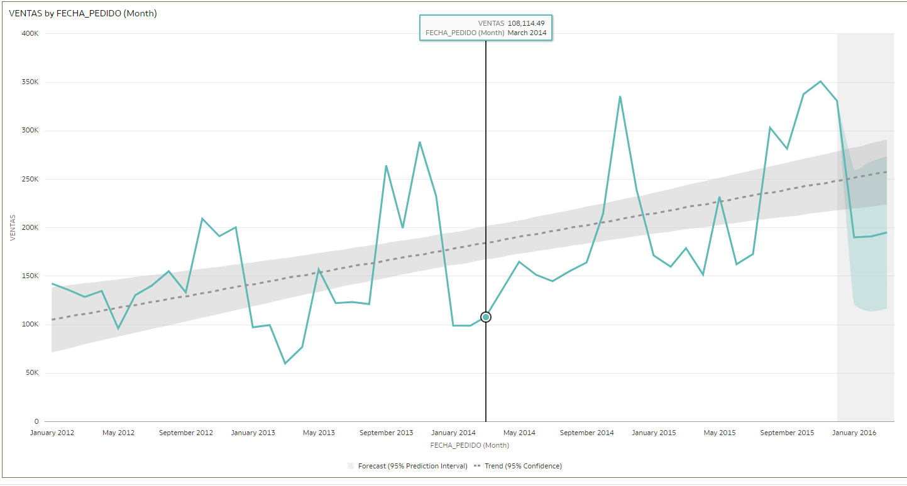

> **Nota:** Como se muestra en los pasos anteriores, podemos combinar más de un tipo de estadísticas en el mismo gráfico.

*RETO:* Crear un gráfico más con información de Ventas por Fecha de Pedido (Mes) y agregar la estadística **"Outliers"** a este gráfico para que puedas identificar los valores que están fuera del patrón de ventas

Este debería ser tu resultado final:

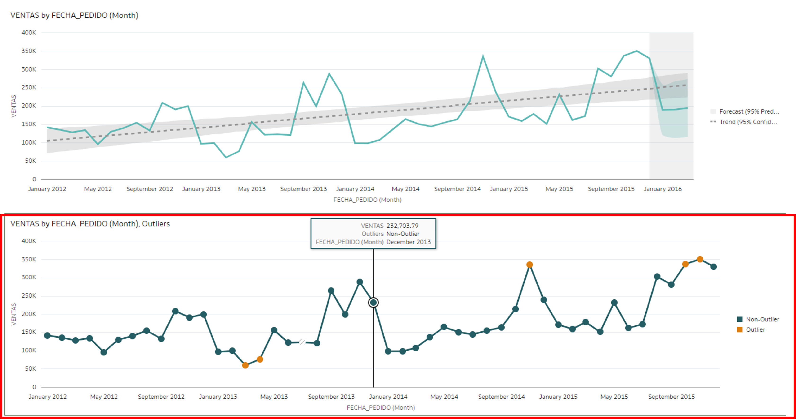

## Tarea 2: Formato condicional

Utilice el formato condicional para resaltar datos importantes en sus visualizaciones para que pueda tomar mejores decisiones.

1. En la pestaña Tipos de gráficos, haga clic y arrastre el tipo "Tabla dinámica" y suéltelo en la parte inferior de la pantalla cuando aparezca una barra verde. Sosteniendo Control (CTRL), seleccione los campos: **Ventas**, **Fecha de pedido (mes)** y **Categoría de producto**, luego arrastre los 3 campos al gráfico de tabla dinámica que agregó al tablero en el paso anterior.

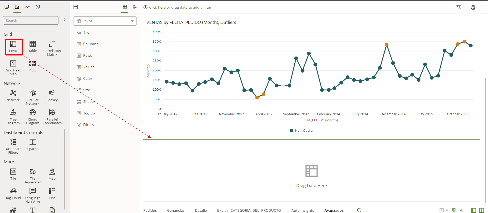

2. Asegúrese de que el campo "Categoría de producto" esté debajo del campo "Fecha de pedido (mes)" en el área de filas de la tabla dinámica.

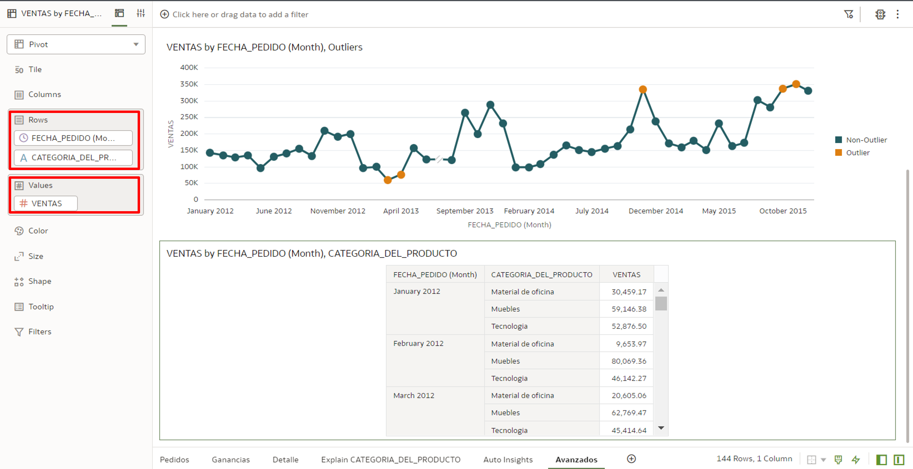

3. Haga clic derecho en la tabla dinámica, seleccione "Formato condicional" y haga clic en "Administrar reglas".

4. Nombre la nueva regla *"Ventas por período"* y luego seleccione "Ventas" en el campo Medida.

Ahora agreguemos colores específicos según la variación del valor de venta:

5. Complete los campos de acuerdo con la información a continuación y haga clic en guardar

* ***VENTAS > 60,000 - Color: Verde Oscuro***
* ***VENTAS <= 60,000 - Color: Verde Claro***
* ***VENTAS < 40,000 - Color: Amarillo***
* ***VENTAS < 30,000 - Color: Rojo***

Notarás que cada valor de venta tiene un color asociado y así podrás visualizar la información de una forma más amena e identificar fácilmente información como por ejemplo, los valores en rojo que indican valores de venta por debajo de lo esperado.

## Tarea 3: Añadir filtros

Tenemos algunas formas de agregar filtros en Oracle Analytics Cloud. En esta tarea vamos Agregue filtros a través de la barra de filtros y aprendamos cómo hacer que este filtro esté disponible en todas las pantallas de nuestro Tablero.

La barra de filtros está en la parte superior de la pantalla, todos los filtros creados estaban disponibles allí.

1. Haga clic en el signo + en la barra de filtro y seleccione el campo "FECHA PEDIDO" en la tabla Ventas.

2. Vuelva a hacer clic en el signo + y ahora seleccione el campo "EMPAQUETADO DEL PRODUCTO" en la tabla Ventas.

Puede agregar filtros según sus necesidades para analizar la información en esta pantalla.

Ahora hagamos que el filtro sea visible y aplicado en todas las pantallas de su archivo de trabajo.

3. Pase el cursor del mouse sobre el filtro "FECHA PEDIDO" hasta que vea resaltado el ícono "pin" y haga clic en él.

Puede navegar a cualquier pestaña en su Tablero y el filtro "FECHA DE PEDIDO" se arreglará.

## Tarea 4: Acciones de datos

Puede usar Acciones de datos para conectarse a otras pantallas en el OAC y aplicar datos seleccionados como un filtro, direcciones URL externas, informes de Oracle Analytics Publisher y uso en contenedores externos.

Usemos Acciones de datos para profundizar en los datos de ventas donde la ubicación es "Bahia".

1. Haga clic en los 3 puntos en la parte superior derecha de la pantalla y seleccione "Acciones de datos"

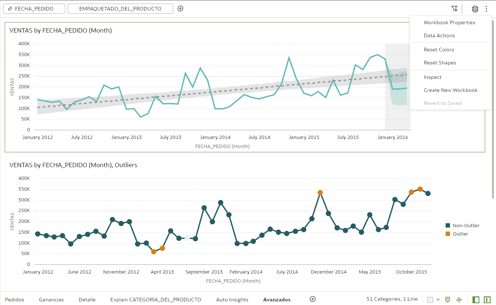

2. Luego haga clic en el signo + para crear una nueva Acción de datos

3. Complete los campos con la información a continuación y luego haga clic en **Aceptar**:

**Nombre:** *Detalles pedido*
**Tipo:** *Enlace de análisis*
**Destino:** *Este cuaderno*
**Enlace a pantalla:** *Detalle*
**Informar valores:** *Todo*
**Admite selecciones múltiples:** *Habilitado*

Ahora, cada vez que haga clic con el botón derecho en algunos datos que le gustaría explorar más a fondo (en su Tablero actual), verá las Acciones de datos que acabamos de crear listas para usar.

5. Haga clic con el botón derecho en el punto correspondiente a **noviembre de 2014** en el gráfico "Ventas por fecha de pedido (mes), valores atípicos", busque la acción de datos "Detalles" que acabamos de crear y haga clic en ella.

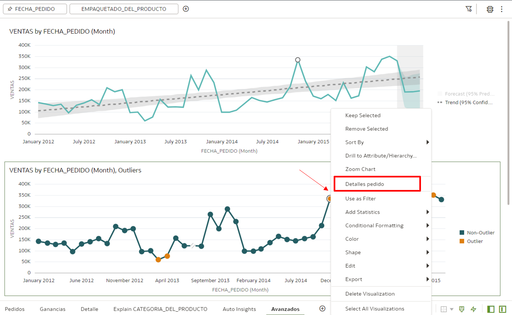

Será dirigido a la pantalla de **Pedidos** donde podrá explorar fácilmente otra información asociada con el punto "Noviembre de 2014" que habíamos seleccionado previamente. Todo esto porque "Data Actions" además de redirigirte a esta nueva pantalla también creó un filtro con el parámetro "Noviembre 2014" ya seleccionado

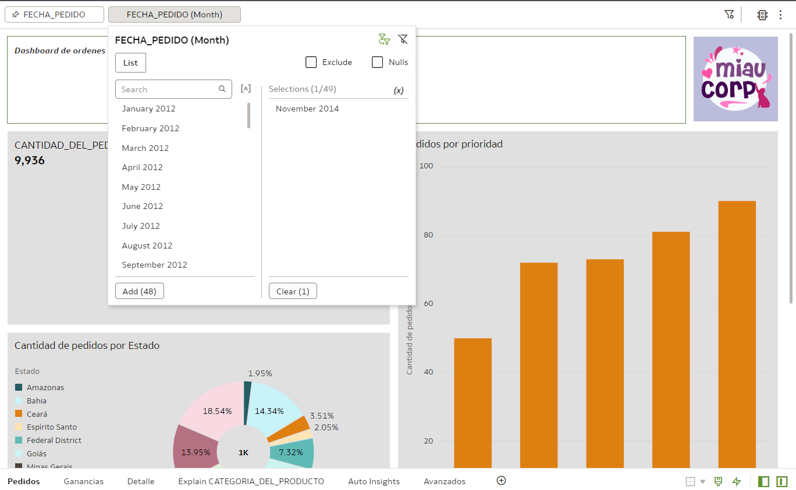

## Tarea 5: Usar imágenes como filtro (opcional)

Hay otra forma de crear filtros en Oracle Analytics Cloud (OAC): ***Crear filtros a través de imágenes***

> **Nota:** Debe tener el permiso: Administrador de servicios de BI para realizar esta tarea.

1. Descarga esta imagen: [Imagen para crear el Filtro](https://objectstorage.us-ashburn-1.oraclecloud.com/p/k4myBTiFdp22kJ_7rJw6kbZa7YLfqrh8nKVzPnrnn-dOAZuxKIB8RKDWTYAmt8eU/n/id3kyspkytmr/b/bucket-fast-track/o/ModoEnviocomTexto.png).

2. Haga clic en el Menú en la parte superior izquierda y acceda a **"Consola"**.

3. Accede a la opción "Mapas".

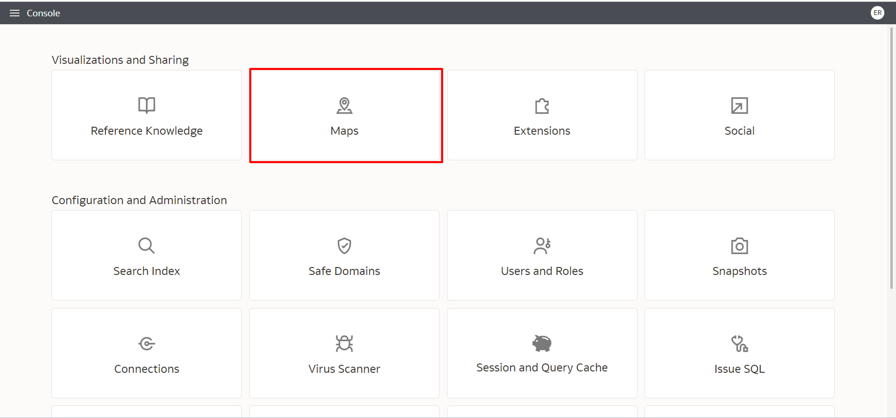

4. Haga clic en la pestaña "Fondos", expanda la opción "Fondos de imagen" y haga clic en **"Agregar imagen"**.

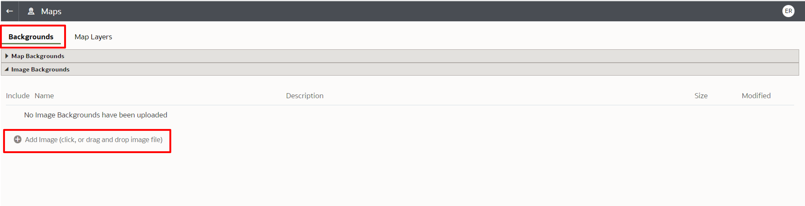

5. Complete los campos con la información a continuación y haga clic en **Guardar**:

**Nombre:** *Métodos de envío*
**Descripción:** *Imagen que representa los modos de envío disponibles*

6. Ubique la imagen que acaba de cargar, haga clic en los 3 puntos en el lado izquierdo de la línea y haga clic en **"Crear capa de mapa"**

Ahora será necesario mapear las áreas de la imagen y vincular cada mapeo a cada término utilizado para los modos de envío disponibles en nuestros datos.

7. Seleccione el tipo de dibujo a "Rectángulo". Haz 1 cuadrado alrededor de la imagen.del Avión (Vuelo Regular) y escriba el término "Vuelo Regular"

8. Haz 1 cuadrado alrededor de la imagen del camión (Camión de reparto) y escribe el término "Camión de reparto".

9. Haz 1 cuadrado alrededor de la imagen del Avión (Vuelo Regular) y escribe el término "Vuelo Express"

10. Cuando todas las imágenes estén mapeadas, haga clic en guardar (icono de disquete en la esquina superior derecha de la pantalla).

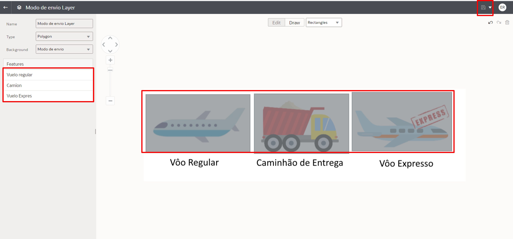

Regrese a su "Archivo de trabajo" para agregar la imagen asignada para que actúe como filtro. En nuestro ejemplo, vamos a agregar la imagen a una de las pantallas del proyecto actual de Miau Corp.

11. Navegue a la pestaña Tipos de gráficos, localice el gráfico Mapa y arrástrelo a la parte superior de su lienzo. (Debajo del campo de texto)

12. Luego agregue el campo "MODO DE ENVÍO" que se encuentra en la tabla "Pedidos".

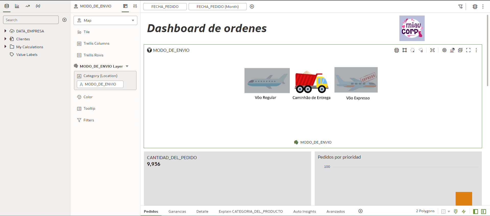

Verá la imagen que mapeamos anteriormente. Ahora usemos la imagen con un filtro dentro de esta pantalla de nuestro tablero.

13. Coloque el cursor del mouse sobre el nombre del gráfico hasta que aparezca un icono de embudo en la pantalla y haga clic en él.

¡Listo! Cada vez que desee ver sus datos de ventas según el método de envío, simplemente haga clic en el área correspondiente de la imagen.

¡Felicitaciones, ha terminado este laboratorio!
Puede **pasar al siguiente laboratorio**.

## Conclusión

En esta sesión, aprendió a usar funciones avanzadas para crear paneles en Oracle Analytics Cloud (OAC)

## Autoría

- **Autores** - Guilherme Galhardo, Thais Henrique, Isabella Alvarez, Breno Comin, Isabelle Dias
- **Traducción** - Eliana Romero 
- **Última actualización por/fecha** - Eliana Romero, Agosto/2023