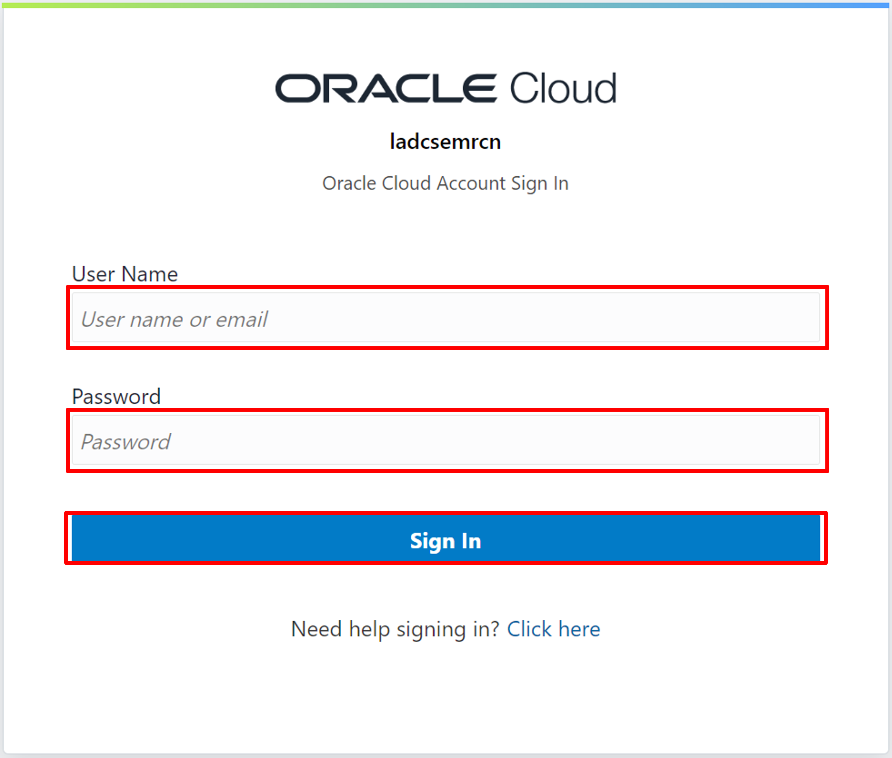
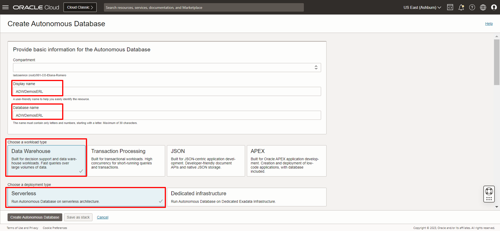

# Crear los recursos necesarios para el Laboratorio

## Introducción
Oracle Cloud es el proveedor de nube más amplio e integrado de la industria, con opciones de implementación que van desde la nube pública hasta su centro de datos. Oracle Cloud ofrece servicios de alta calidad en Software como Servicio (SaaS), Plataforma como Servicio (PaaS) e Infraestructura como Servicio (IaaS).
En este laboratorio, aprenderá cómo aprovisionar una base de datos autónoma en Oracle Cloud Infrastructure.

***Descripción general***

Oracle Cloud Infrastructure Autonomous Database es un entorno de base de datos totalmente administrado y preconfigurado con tres tipos de cargas de trabajo disponibles, procesamiento de transacciones autónomo, almacén de datos autónomo y JSON autónomo. No necesita configurar ni administrar ningún hardware ni instalar ningún software. Después del aprovisionamiento, puede escalar la cantidad de núcleos de CPU o la capacidad de almacenamiento de la base de datos en cualquier momento, sin afectar la disponibilidad o el rendimiento. La base de datos autónoma se encarga de la creación de la base de datos, así como de las siguientes tareas de mantenimiento:
* Copia de seguridad de la base de datos
* Parcheo de base de datos
* Actualización de base de datos
* Ajuste de base de datos

*Tiempo estimado de laboratorio:* 25 minutos

### Objetivos

En este laboratorio usted:
* Aprenda a iniciar sesión en su cuenta de Oracle Cloud
* Aprovisionar un almacén de datos autónomo de Oracle
* Aprovisionar una nube de Oracle Analytics

## Tarea 1: Iniciar sesión en Oracle Cloud

1. Abra su navegador web y vaya a [Oracle Cloud](https://cloud.oracle.com).
Ingrese el nombre de su cuenta en la nube si inicia sesión en una cuenta con Identity Cloud Service.

Cuando cargue la nueva página, simplemente haga clic en **Continuar**.

2. En la página de inicio de sesión de **Cloud Infrastructure**, ingrese sus credenciales de inicio de sesión y luego haga clic en **Iniciar sesión**.

3. ¡Ahora está conectado a Oracle Cloud!

## Tarea 2: Proceso de creación de la base de datos autónoma

Para iniciar el proceso de creación de la Base de Datos Autónoma:

1. Haga clic en el menú en el lado izquierdo de la pantalla principal, seleccione Base de datos Oracle, luego "Base de datos autónoma"

2. Haga clic en "Crear una base de datos autónoma" y será redirigido para crear una base de datos autónoma.

3. Complete los campos requeridos para crear su Base de datos autónoma como se muestra a continuación:

* Nombre para mostrar: **Elija un nombre para mostrar para su banco**
* Nombre de la base de datos: **Elija un nombre de base de datos para su base de datos**
* Elija un tipo de carga de trabajo: para este taller, seleccione **Almacén de datos**
* Elija un tipo de implementación: **Infraestructura compartida**

* Elija la versión de la base de datos: **19c**
* Recuento de OCPU: **1**
* Almacenamiento (TB): **1**

* Crear credenciales de administrador: **Crear una contraseña para el usuario ADMIN**
* Elija el acceso a la red: **Acceso seguro desde cualquier lugar**

* Elija la licencia y la edición de la base de datos de Oracle: **Licencia incluida**
* Ahora finalice la creación haciendo clic en el botón **"Crear base de datos autónoma"**

*¡Su base de datos autónoma se ha aprovisionado con éxito!*

## Tarea 3: Proceso de creación de Oracle Analytics Cloud

En este tutorial, crearemos una instancia de la herramienta Oracle Analytics Cloud.

1. Crear el OAC

- Haga clic en el Menú Hamburguesa en la parte superior izquierda;
- Haga clic en **Análisis e IA**;
- Haga clic en **Analytics Cloud**.

- Comprobar si está en el compartimento correcto;
- Haga clic en **Crear instancia**.

2. Complete la información:

* Nombre: nombre dado a la instancia;
* Descripción: descripción dada a la instancia – opcional;
* Crear en Compartimento: Compartimento donde se creará la instancia;
* Conjunto de funciones: elija **Edición profesional**;
* Capacidad: elija **OCPU** y escriba **1**;
* Tipo de licencia: Elija **Licencia incluida**;

- Haz clic en **Crear** .

3. Acceda a Oracle Analytics Cloud

En este paso mostraremos como accedemos a la instancia de Oracle Analytics Cloud.
- Haga clic en el nombre de la instancia creada "Nombre elegido";

- Haga clic en **Página de inicio de Analytics**.

## Tarea 4: Carga de datos de laboratorio en Autonomous

Para el desarrollo del laboratorio es necesario descargar los 2 archivos haciendo click aqui. 

(Pedidos [aquí](https://objectstorage.us-ashburn-1.oraclecloud.com/p/U8tA6PQvsaL8jSlP9NlWMnkzWsQ29-bs8q6rEjwo0cY_-7w0nd9DOqWf94fsok4g/n/idy4hyfbs31o/b/Bucket-Fast-Track/o/Pedidos.xlsx))

(Ventas [aquí](https://objectstorage.us-ashburn-1.oraclecloud.com/p/n_Jkw7RfTdkvE45pVR9bS2FT2_spcZnmZwOZWE0gIa2VgBvjHjM22k1YIlfpnRTZ/n/idy4hyfbs31o/b/Bucket-Fast-Track/o/Ventas.xlsx))

1. Accede a tu Base de Datos Autónoma y haz clic en el botón **Database actions**.

2. Seleccionar las opciones de **Load Data** y **Local File**, dar click en continuar.

3. Dar click en **Select Files** y seleccionar los archivos descargados anteriormente.

4. Para finalizar el proceso de carga, debe dar click en **start**.

5. Confirmar la carga dando click en **run**.

6. Los archivos se encuentran en la base de datos autonoma.

## Conclusión

En esta sesión, ha aprovisionado Oracle Autonomous Data Warehouse y Oracle Analytics Cloud, que se utilizarán en todo el laboratorio. También se cargaron los datos para llenar las tablas en la base de datos.

## Autoría
- **Autores** - Thais Henrique, Isabela Alvarez, Breno Comin, Isabelle Dias e Guilherme Galhardo
- **Traducción** - Eliana Romero
- **Última actualización por/fecha** - Eliana Romero, Agosto/2023