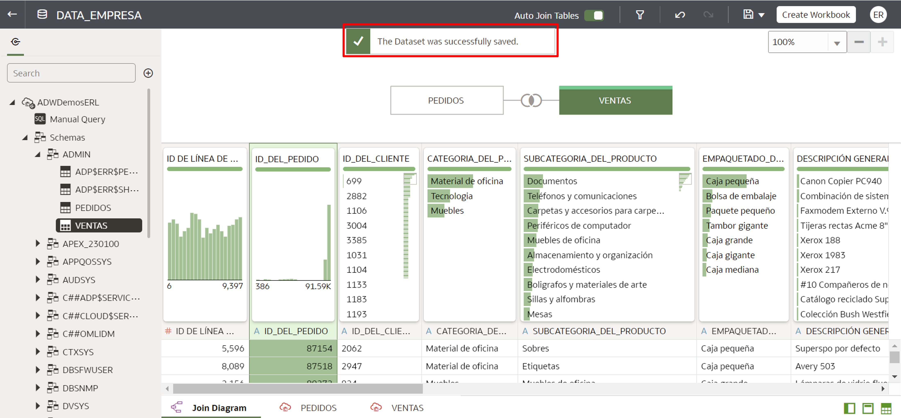

# Crear un conjunto de datos

## Introducción

**Los conjuntos de datos** se pueden crear usando una o más tablas, que pueden ser de la misma conexión o de diferentes conexiones (incluso podemos usar archivos CSV o XLSX). Puede unir todas estas tablas dentro del "Diagrama de unión" (Join).

*Tiempo estimado de laboratorio:* 15 minutos

### Objetivos

* Seleccione las tablas a utilizar
* Hacer el Join entre las tablas
* Guardar el conjunto de datos

## Tarea 1: Localizar las tablas

1. Haga clic en el botón **Crear** en la parte superior derecha y luego seleccione **Conjunto de datos**.

2. Seleccione la conexión que creó anteriormente:

3. Expanda la lista de esquemas de almacén de datos autónomos (ADW), localice el esquema ADMIN y localice las dos tablas que usaremos en este taller: **Ventas** y **Pedidos**.

## Tarea 2: Unión entre tablas

1. Seleccione la tabla **Pedidos** y arrástrela al centro de la pantalla Unir diagramas.

2. A continuación, arrastre la tabla **Ventas** y suéltela junto a la tabla de pedidos.

Oracle Analytics Cloud (OAC) creará automáticamente la Unión para usted, siempre que las dos tablas tengan el mismo nombre de columna y las dos columnas sean del mismo **"Tipo"**.

> **Nota:** Hay dos tipos de columnas en Oracle Analytics Cloud: Atributo o Medida

Las columnas de tipo ***Medida*** aceptan valores numéricos y podremos realizar operaciones matemáticas y agregaciones con los datos de esa columna.

**Ejemplo: valor de venta, cantidad de productos, beneficio, costo, descuento, etc.**

Las columnas de tipo ***Atributo*** aceptan cualquier tipo de dato descriptivo, que no se utilizará para ningún tipo de cálculo. Podemos tener campos con texto, números, ubicaciones, fechas, entre otros.

**Ejemplo: ID del producto, ID del cliente, número de factura, nombre del cliente, edad, dirección, fecha de venta, ciudad, país, etc.**

3. Haga clic con el botón derecho en la tabla **"Ventas"** dentro del Diagrama de unión y seleccione la opción **Preservar granularidad**.

4. Después verá una barra verde en la parte superior del cuadro que representa la tabla **"Ventas"** que indica que se conserva la granularidad de la tabla.

## Tarea 3: Guardar el conjunto de datos

1. Asegúrese de estar en la pestaña Unir diagrama y haga clic en el botón Guardar en la parte superior derecha de la pantalla.

2. Asigne un nombre y una descripción al conjunto de datos:

*Nombre:* DATA_\EMPRESA
*Descripción:* Conjunto de datos de análisis de datos de ventas de la empresa.

3. Verifique que recibió el mensaje **El conjunto de datos se guardó correctamente** y luego haga clic en Atrás.

4. Verá su nuevo conjunto de datos enumerado como se indica en la imagen a continuación.

Puede **pasar al siguiente laboratorio**.

## Tarea 4: crear unión manualmente (opcional)

Oracle Analytics Cloud (OAC) permite la creación de conjuntos de datos utilizando varias tablas e incluso ofrece un área especial llamada "Diagrama de unión" para crear las uniones de estas tablas. OAC generalmente crea el Join automáticamente entre las tablas, pero en escenarios donde no identifica columnas para este Join, podemos hacerlo manualmente.

Imagine que Oracle Analytics Cloud no creó el Join entre la tabla "Pedidos" y la tabla "Ventas", el procedimiento para crear manualmente el Join sería este:

1. Haga clic con el botón derecho en una de las dos mesas en la pantalla "Unirse al diagrama", seleccione la opción "Unirse a" y seleccione la mesa a la que desea unirse usando Unirse. Aquí, en nuestro ejemplo, será la tabla "Ventas".

2. Seleccione la columna que utilizará para el Join en la primera tabla, en este caso utilizaremos la columna "ORDER ID". Y en la segunda tabla seleccione la columna correspondiente, en nuestro caso las columnas tienen el mismo nombre "ORDER ID". (No es necesario que las dos columnas tengan el mismo nombre)

¡Felicitaciones, ha terminado este laboratorio!
Puede **pasar al siguiente laboratorio**.

## Conclusión

En esta sesión, aprendió cómo crear un conjunto de datos en Oracle Analytics Cloud usando más de una tabla y cómo usar el "Diagrama de unión".

## Autoría

- **Autores** - Thais Henrique, Isabella Alvarez, Breno Comin, Isabelle Dias, Guilherme Galhardo
-**Traducción** - Eliana Romero
- **Última actualización por/fecha** - Eliana Romero, agosto 2023