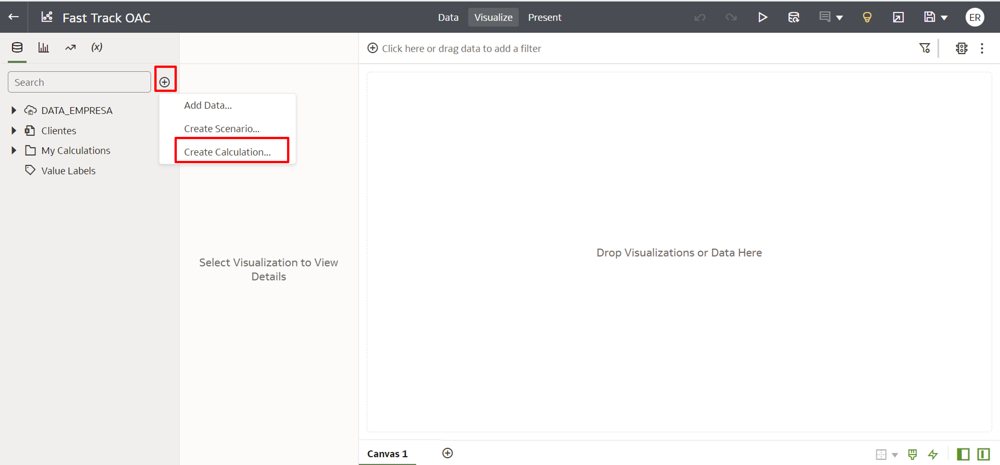
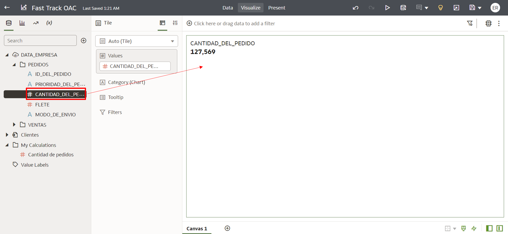
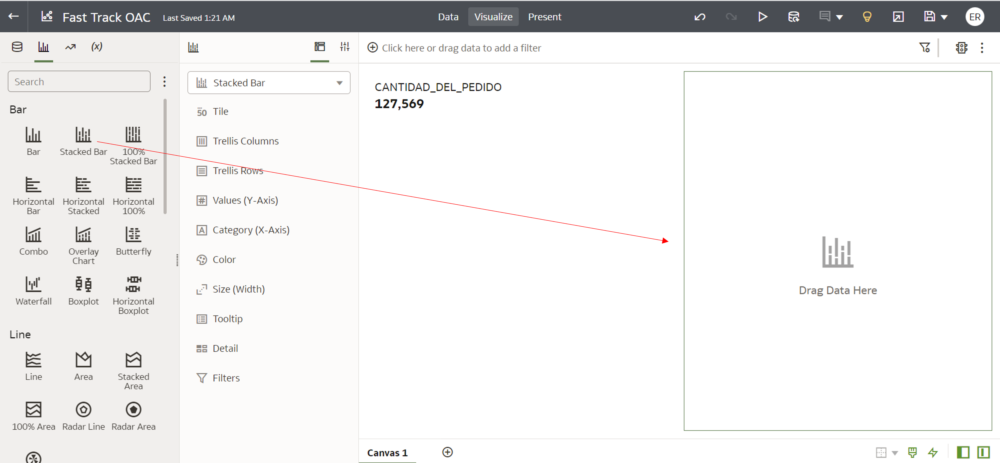
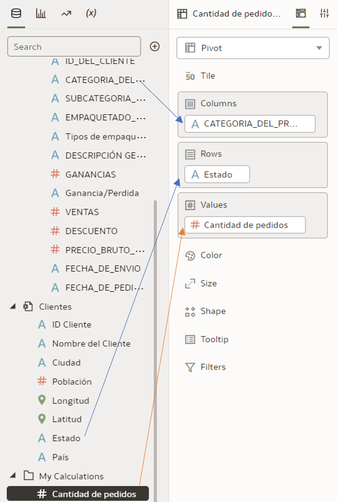
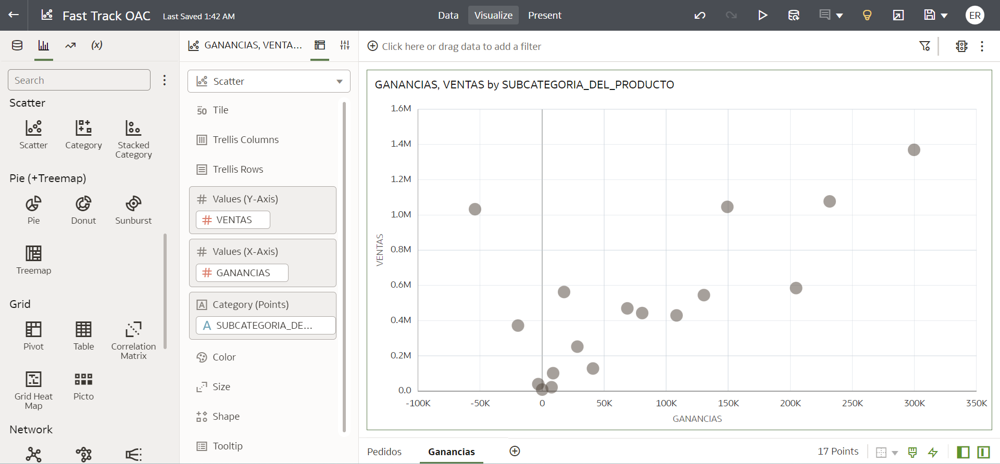
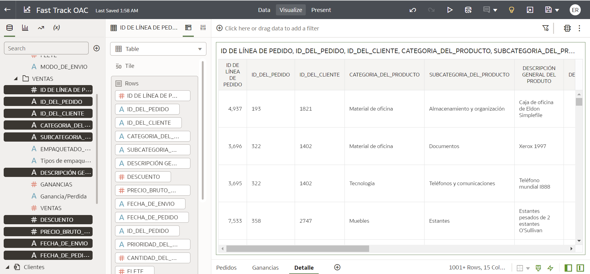
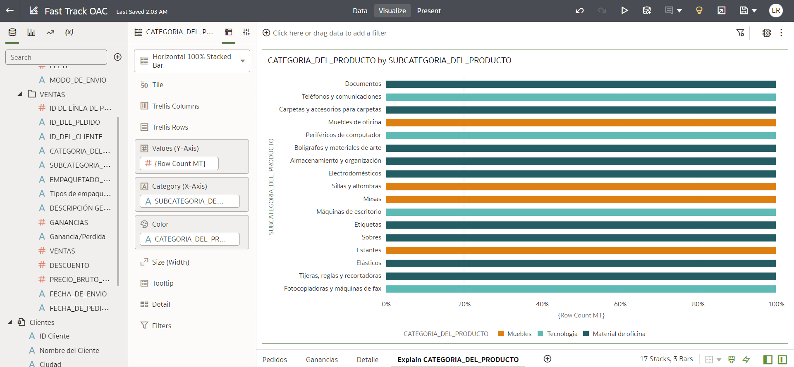
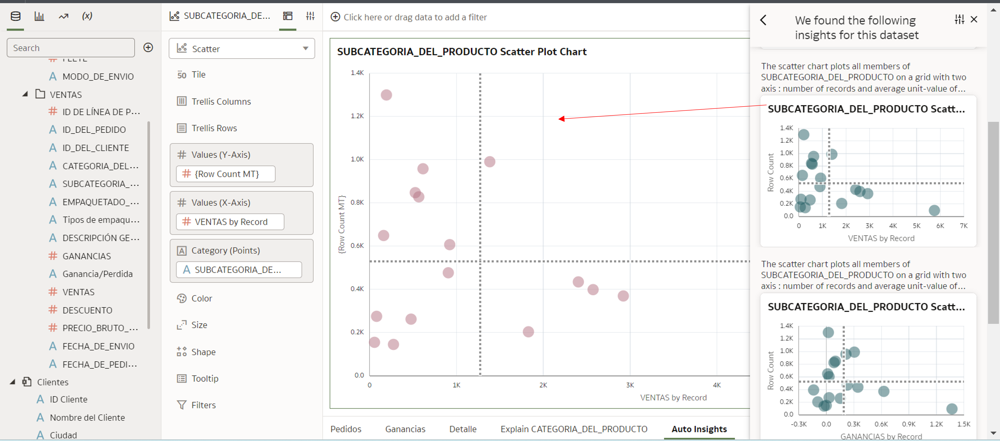
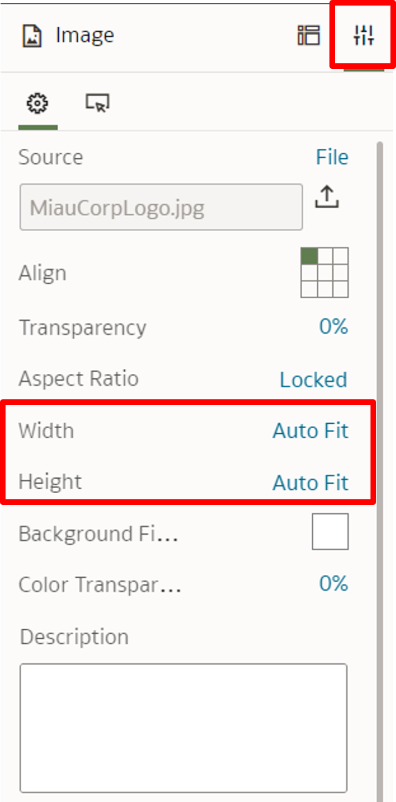
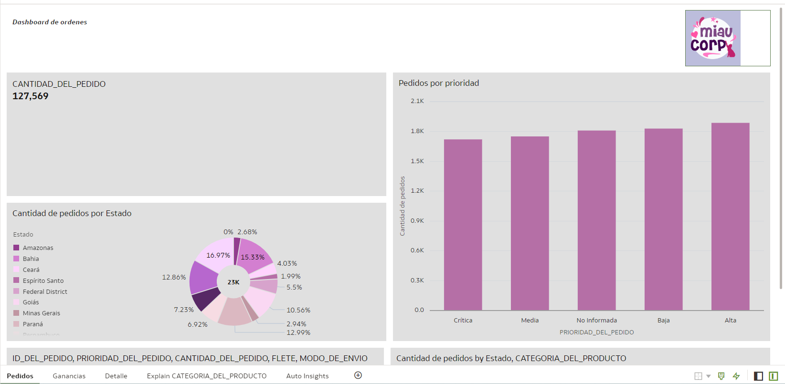

# Crear Vistas

## Introducción

En este laboratorio, aprenderá a crear visualizaciones en Oracle Analytics Cloud.

*Tiempo estimado para el Laboratorio:* 30 Minutos

### Objetivos

* Conozca la interfaz de creación de vistas OAC
* Crear campos calculados
* Cree un tablero con gráficos de diferentes tipos
* Cambie las propiedades del gráfico y utilice funciones complementarias para personalizar el tablero

## Tarea 1: Explorar la interfaz

Oracle Analytics Cloud (OAC) tiene una interfaz simple que le permite navegar rápidamente a través de sus diversas opciones y características. En nuestra primera tarea, exploraremos la interfaz de Oracle Analytics Cloud dentro de un libro de trabajo.

Siempre que abra o cree un libro de trabajo, de forma predeterminada verá la siguiente pantalla en modo de vista previa:


Para explorar las otras opciones de navegación en la interfaz:

1. Haga clic en el icono correspondiente a **Editar** en el menú superior derecho de la pantalla.


Después de habilitar el modo de edición, la interfaz de la pantalla debe tener la siguiente configuración:


2. En el menú superior derecho de la pantalla, busque la opción correspondiente a los comandos **Deshacer/Rehacer última edición**.


3. En el menú superior derecho de la pantalla, busque la opción correspondiente al comando **Visualización**.


4. En el menú superior derecho de la pantalla, busque la opción correspondiente al comando **Actualizar datos**.


5. En el menú superior derecho de la pantalla, busque la opción correspondiente al comando **Agregar Observación**.


6. En el menú superior derecho de la pantalla, busque la opción correspondiente al comando **Auto Insights**.


7. En el menú superior derecho de la pantalla, busque la opción correspondiente al comando **Exportar**.


8. En el menú superior derecho de la pantalla, busque la opción correspondiente al comando **Guardar**.


En la región central del menú superior de la pantalla, es posible cambiar entre páginas que brindan acceso a diferentes funcionalidades.

9. En la región central del menú superior de la pantalla, busque la opción **Ver**, que se refiere a la página actual.


10. En la región central del menú superior de la pantalla, busque y seleccione la opción **Datos** para acceder a la página que le permite agregar nuevos conjuntos de datos al libro de trabajo y editar las condiciones de unión entre ellos.


11. En la región central del menú superior de la pantalla, busque y seleccione la opción **Presente** para acceder a la página que le permite agregar pantallas a una presentación.


Otras opciones de navegación se encuentran en la parte inferior de la página.

12. En la región inferior derecha de la página, encuentre las opciones para **Pautas de cuadrícula**, **Cepillado**, **Aplicar datos automáticamente**, **Panel de datos de alternancia** y **Panel de gramática de alternar* * .


13. En la región inferior izquierda de la página, busque la opción **Agregar pantalla**, representada por el símbolo ****.


## Tarea 2: Crear un campo calculado

Oracle Analytics Cloud también permite la creación de campos calculados dentro del propio proyecto de visualización para aportar información adicional a los ya presentes.

Para explorar esta funcionalidad, crearemos un campo calculado que se usará a lo largo de este laboratorio.

1. En la barra lateral de opciones, haga clic en el símbolo indicado por **+** y luego haga clic en la opción **Agregar cálculo...**.



2. En la ventana que se abre, nombre el campo como **Cantidad de pedido**, escriba el siguiente código y haga clic en **Validar** y luego en **Guardar**.

```
COUNT (ID DE LÍNEA DE PEDIDO)
```


3. El campo calculado creado estará disponible en la pestaña **Datos** en la carpeta **Mis cálculos**.


## Tarea 3: Crear un tablero con vistas básicas

En nuestra segunda tarea, crearemos algunas visualizaciones básicas para componer nuestro tablero.

1. Comenzaremos a construir nuestro tablero agregando una vista de Mosaico (Métrica) a la pantalla. Para hacerlo, seleccione el campo **Cantidad pedida** dentro de la tabla "Pedidos", arrástrelo y suéltelo en el centro de la pantalla.



2. Ahora agregaremos un gráfico de barras apiladas. Para hacer esto, navegue a la pestaña de visualizaciones, ubique y arrastre la opción Stacked Bar al lado derecho de la visualización de Mosaico.



3. Notará que el espacio para este gráfico está vacío. Para completar el gráfico con datos, seleccione el campo **Prioridad de pedido** dentro de la tabla "Pedidos", arrástrelo y suéltelo en el espacio de **Categoría**. Haga lo mismo con el campo **Cantidad de pedidos** dentro de la tabla "Mis cálculos", pero colóquelo en el espacio **Valores**.


4. Para ordenar las barras del gráfico creado, ubique y seleccione la opción **Ordenar**, que está representada por un par de flechas.


5. En la ventana que se abrirá, seleccione la métrica por la que desea ordenar el gráfico, el modo de ordenación y haga clic en Aceptar.


6. A continuación, crearemos un gráfico de anillos. Para hacer esto, navegue a la pestaña de visualizaciones, ubique y arrastre la opción Donut a la región debajo de la visualización de Mosaico.


7. Para completar el gráfico con datos, seleccione el campo **Estado** dentro de la tabla "Clientes", arrástrelo y suéltelo en el espacio de **Categoría**. Haga lo mismo con el campo **Cantidad de pedidos** dentro de la tabla "Mis cálculos", pero colóquelo en el espacio **Valores**.


8. Agregaremos una tabla con valores y atributos a nuestro tablero. Para hacerlo, navegue a la pestaña de visualizaciones, ubique y arrastre la opción Tabla a la región inferior de la página.


9. Para completar la tabla con datos, mantenga presionada la tecla Control (CTRL) y seleccione los campos **ID de pedido**, **Prioridad de pedido**, **Cantidad de pedido**, **Envío** y * * Modo de envío** dentro de la tabla "Pedidos", arrastre y suelte en el espacio **Líneas**.


10. Para finalizar el primer conjunto de vistas, crearemos una tabla dinámica. Para hacerlo, navegue a la pestaña de visualizaciones, ubique y arrastre la opción de tabla dinámica a la región en el lado derecho de la tabla.


11. Para completar la tabla dinámica con datos, seleccione el campo **Categoría de producto** dentro de la tabla "Ventas", arrástrelo y suéltelo en el espacio **Columnas**. Seleccione el campo **Estados** dentro de la tabla "Clientes", arrástrelo y suéltelo en el espacio **Líneas**. Haga lo mismo con el campo **Cantidad de pedidos** dentro de la tabla "Mis cálculos", pero colóquelo en el campo **Valores**.



12. Para identificar mejor esta primera página del tablero, cambiemos el nombre de esta pantalla. Haga clic en el triángulo junto al nombre de la pantalla y haga clic en cambiar el nombre.


13. Escriba el nombre **Pedidos** y haga clic en el signo de verificación para confirmar.


14. A continuación, creemos una nueva pantalla. Para hacer esto, haga clic en el signo *** en la parte inferior de la pantalla.

15. Escriba el nombre **Beneficio** y haga clic en el signo de verificación para confirmar.

16. Comenzaremos a construir esta nueva pantalla con un gráfico de dispersión. Para ello seguiremos el mismo proceso realizado para los demás gráficos, pero seleccionando la opción Dispersión y arrastrándola al centro de la página. Para completar el gráfico con datos, seleccione el campo **Ventas** dentro de la tabla "Ventas", arrástrelo y suéltelo en el espacio **Valores (eje Y)**. Haz lo mismo para el campo **Beneficio** dentro de la tabla "Ventas" y para el campo **Subcategoría de producto** de la tabla "Ventas", pero colocándolos en **Valores (Eje ​​X)** y **Categoría** respectivamente.



17. A continuación, crearemos una vista de nube de etiquetas. Para ello, seguiremos el mismo proceso realizado para los demás gráficos, pero seleccionando la opción Nube de etiquetas y arrastrándola a la derecha del gráfico de dispersión. Para completar la nube, seleccione el campo **Subcategoría de producto** dentro de la tabla "Ventas", arrastre y suelte en el espacio **Categoría**. Haz lo mismo para el campo **Cantidad de pedidos** dentro de la tabla "Ventas", pero suéltalo en el campo **Valores (Tamaño)**.


18. Una de las posibilidades más interesantes para visualizar datos geográficos en OAC es la visualización tipo Mapa. Para crear una vista de tipo Mapa, seleccione la opción Mapa y arrastre a la región superior de las vistas existentes en la página. Para completar el gráfico con los datos de interés, seleccione los campos **País** y **Estado** dentro de la tabla "Clientes", arrástrelos y suéltelos en el campo **Categoría**. Arrastra el campo **Beneficio**, de la tabla "Ventas", al campo **Color** de la vista de Mapa.


19. Finalmente, para finalizar este segundo conjunto de vistas para su tablero, cree una vista Narrativa de idioma. Esta funcionalidad explica, en forma de texto, los datos seleccionados. Para crear esta visualización, seleccione la opción Lenguaje narrativo y arrástrela a la región superior izquierda de la pantalla. Para la narración de datos, seleccione el campo **Subcategoría de producto** de la tabla "Ventas" y arrástrelo al campo **Atributos**. Haga lo mismo con el campo **Cantidad de pedidos** de la tabla "Ventas", pero arrástrelo al campo **Valores**.


20. Para prepararnos para el uso de opciones más avanzadas que se presentarán en los laboratorios que siguen, crearemos una nueva página, de la misma manera que creamos las otras páginas, con el nombre **Detalle** .

21. Regrese a la página **Pedidos** y haga clic con el botón derecho en la región de la tabla en esta página y seleccione la opción **Editar** y luego la opción **Copiar vista**.


22. En la página **Detalle**, haga clic con el botón derecho y seleccione la opción **Pegar vista**.


23. Agregue los siguientes datos a la tabla para aumentar su nivel de detalle:

* **ID de línea de pedido**
* **ID del pedido**
* **ID del cliente**
* **Categoria de producto**
* **Subcategoría de producto**
* **Nombre del producto**
* **Descuento**
* **Precio bruto por unidad**
* **Fecha de envío**
* **Fecha de pedido**



## Tarea 4: Exploración de Auto Insight y funcionalidad de explicación

Oracle Analytics Cloud cuenta con varios mecanismos de Machine Learning nativos de la herramienta, estas características nos ayudan de muchas maneras diferentes durante el proceso de creación de nuestros cuadros de mando. Veamos dos características muy útiles para comprender los datos y sugerir gráficos: *Auto Insights and Explain (Explicar)*.

***Explicar*** utiliza el aprendizaje automático para encontrar información útil sobre sus datos.

1. Para comenzar a explorar la funcionalidad Explicar, haga clic con el botón derecho en el campo **"Categoría de producto"** en la tabla Ventas y luego seleccione la opción **"Explicar CATEGORÍA DE PRODUCTO"**


Se abrirá una nueva ventana con todas las explicaciones sobre el campo que seleccionó, incluyendo: Datos básicos, Factores clave, Segmentos que explican, Anomalías. En cada una de estas pestañas encontrará gráficos y descripciones de texto del campo que está analizando. Una vez que haya mirado todas las pestañas, puede elegir los gráficos que crea que son relevantes para su tablero.

2. En la pestaña "Datos básicos de CATEGORÍA DE PRODUCTO", desplácese hacia abajo en la página hasta que encuentre un gráfico que explique las ganancias por categoría de producto, desplace el mouse sobre el gráfico hasta que aparezca una marca de verificación en la esquina superior derecha del gráfico y haga clic en ese marca de verificación, luego haga clic en **"Agregar seleccionado"**.


Este gráfico se agregará en un nuevo lienzo en su archivo de trabajo, como se indica en la imagen a continuación.



Ahora usemos ***Auto Insights*** para crear visualizaciones poderosas usando sugerencias generadas por Oracle Analytics Cloud (OAC).

1. Comencemos por crear una nueva página llamada ***Auto Insights***.

2. Haga clic en el ícono de la bombilla amarilla en la parte superior derecha de la pantalla y asegúrese de que la tabla "FT_EXTRA" esté seleccionada. Desplácese hasta encontrar el gráfico llamado ***Gráfico de diagrama de dispersión de subcategorías de productos*** y arrástrelo al centro de la página.



3. Busque los gráficos llamados ***Subcategoría de productos de los 10 principales por descuento*** y ***Puente de contribución al crecimiento*** y arrástrelos al lienzo para que el resultado se muestre en la imagen a continuación.


## Tarea 5: Cambiar las propiedades del gráfico

Oracle Analytics Cloud le permite cambiar las propiedades de los gráficos en su tablero. Esta es una funcionalidad esencial para garantizar que sus visualizaciones sean claras y que los usuarios finales del tablero puedan entenderlas fácilmente.

Comencemos por cambiar los títulos de las vistas de página de **Pedidos**.

1. Seleccione la vista **Número de pedidos por PRIORIDAD DE PEDIDO** y en la barra de propiedades, en la opción Título, haga clic en la opción **Automático** y cámbielo a **Personalizado**.


2. Establezca el título de la vista en **# Pedidos por prioridad**.


3. Repita el proceso para los otros gráficos con títulos de su elección.

Ahora vamos a cambiar el Fondo de los gráficos.

1. En las opciones generales de la vista **# Pedidos por Prioridad**, bUtilice la opción Fondo. Haz clic en la opción **Automático** y cámbiala a **Personalizado**. En el campo Color de relleno, utilice el color ***#e0e0e0***.


2. Repita el proceso con vistas desde la página de **Pedidos** hasta obtener el siguiente resultado.


Una de las propiedades más importantes de una buena visualización es su leyenda. A continuación exploraremos la opción de leyenda de Oracle Analytics Cloud.

1. En el gráfico de anillos creado anteriormente, cambie los datos **Estado** del campo **Categoría** al campo **Color**. Esto habilitará los subtítulos en la visualización.


2. En el panel de propiedades de visualización, busque la opción llamada **Posición de leyenda** y cámbiela de **Automático** a **Derecha**.


## Tarea 6: Agregar texto, colores e imágenes al tablero

Oracle Analytics Cloud le permite agregar fácilmente texto e imágenes a su tablero, lo que le brinda un mayor nivel de personalización. También puede cambiar fácilmente la paleta de colores del tablero para que todos los gráficos sigan el mismo patrón de color.

Comencemos agregando un título a la página de **Pedidos**.

1. En las opciones de tipo de gráfico, seleccione la opción Cuadro de texto, arrástrelo y suéltelo en la región superior de la página.


2. Haga clic en la opción Editar texto y seleccione el tamaño de fuente 22 y active negrita y cursiva para insertar el texto **Dashboard Meow Corp Orders**.


3. Haga lo mismo para la página de **Ganancias** con el texto **Análisis de ganancias**.

Ahora agregaremos el logotipo de la empresa al tablero.

1. Descarga el logo de MIAU CORP [aquí](https://objectstorage.us-ashburn-1.oraclecloud.com/n/id3kyspkytmr/b/ArquivosPublicos/o/MiauCorpLogo.jpg).

2. En las opciones de tipo de gráficos, seleccione la opción Imagen, arrástrela y suéltela en la región superior de la página indicada en la siguiente imagen.


3. Al hacer clic en la opción Seleccionar imagen, se abrirá la siguiente ventana. En él, haga clic en Cargar y seleccione el logotipo de la empresa y haga clic en Aceptar.


4. En la pestaña de opciones de visualización, cambie el ancho y el alto de **Original** a **Autoajustar**.



Después de estas instrucciones, la imagen debe estar en el formato indicado en la imagen de abajo.


Para finalizar este paso de personalización del tablero, modificaremos la paleta de colores para estandarizar todas las visualizaciones.

1. En la región superior derecha de la página, haga clic en el icono indicado por los **tres puntos** y seleccione la opción **Propiedades del archivo de trabajo**.


2. En la ventana que se abrirá, en la opción **Secuencia de colores**, haga clic en la opción **Estándar (Redwood)** y cámbiela a la opción **Lila** y haga clic en Aceptar.


Si ha cambiado correctamente la paleta, su página de **Pedidos** debería verse como la siguiente imagen.



¡Felicitaciones, ha terminado este laboratorio!
Puede **pasar al siguiente laboratorio**.

## Conclusión

En esta sesión aprendió a crear un tablero con vistas básicas de diferentes tipos.

## Autoría

- **Autores** - Guilherme Galhardo, Thais Henrique, Isabella Alvarez, Breno Comin, Isabelle Dias
- **Traducción** - Eliana Romero 
- **Última actualización por/fecha** - Eliana Romero, Agosto/2023