# Primeros pasos en OAC

## Introducción

En este laboratorio, aprenderá a navegar por la interfaz de Oracle Analytics Cloud y a conectar el OAC a los datos.

***Descripción general***

Oracle Analytics Cloud es un servicio de nube pública seguro y escalable que proporciona un conjunto completo de capacidades para explorar y realizar análisis colaborativos para usted, su grupo de trabajo y su empresa. Con Oracle Analytics Cloud, también obtiene capacidades de gestión de servicios flexibles, que incluyen configuración rápida, escalado y aplicación de parches sencilla.
Como usuario de Oracle Analytics con acceso de DV Content Author, podrá conectarse a las fuentes de datos utilizadas por su organización. Por ejemplo, puede crear un conjunto de datos que incluya tablas de una conexión de Autonomous Data Warehouse, tablas de una conexión Spark y tablas de un área temática local.

*Tiempo estimado para el Laboratorio:* 10 Minutos

### Objetivos

En este laboratorio usted:
* Explore los recursos disponibles de forma nativa dentro de OAC (Oracle Analytics Cloud)
* Pruebe su conexión.

## Tarea 1: Acceder a la instancia de Oracle Analytics Cloud

Oracle Analytics Cloud es uno de los servicios disponibles dentro de OCI (Oracle Cloud Infrastructure). Puede acceder a él directamente a través de su URL. Sin embargo, en esta tarea aprenderá cómo acceder al OAC usando la consola OCI y navegando a través del menú de servicios a la instancia de Oracle Analytics Cloud que vamos a usar en este taller.

Después de iniciar sesión en el entorno con sus credenciales únicas (consulte los "Requisitos previos" del laboratorio)

1. Verá la consola OCI. Asegúrese de estar en la región correcta *US East (Ashburn)*, luego haga clic en el menú de hamburguesas en la parte superior izquierda.

2. Seleccione **Analytics & AI** y haga clic en **Analytics Cloud**.

3. Asegúrese de estar en el compartimento deseado y haga clic en el nombre de la instancia, en este ejemplo **DemosElianaRomero** es la instancia.

4. Ahora simplemente haga clic en el botón **Analytics Home Page**.

Se abrirá una nueva pestaña y se le llevará a la página de inicio de OAC.

## Tarea 2: Página de inicio

Toda la navegación se realiza a través del **Menú Hamburguesa**. Siempre que desee volver a la página de inicio, debe:

1. Haga clic en el menú Hamburguer en la parte superior izquierda de la pantalla principal,

Analytics permite el trabajo colaborativo, usted y todos los demás usuarios tienen sus propias carpetas personales. Solo el usuario que creó y guardó el contenido en la carpeta puede acceder a las carpetas personales (mis carpetas). También puede guardar proyectos en carpetas compartidas donde otros usuarios o grupos pueden acceder a ellos.

2. Para explorar, haga clic en **Menú de hamburguesas** y elija **Catalogo**. Se le dirigirá a la siguiente pantalla:

Los conjuntos de datos son modelos de datos de autoservicio que usted crea específicamente para sus requisitos de análisis y visualización de datos.

3. Siguiendo el mismo paso de hacer clic en el **Menú Hamburguesa**, al hacer clic en **Datos**, los datos disponibles para usar se mostrarán en **Conjunto de datos**, cuando cargue una tabla, hoja de trabajo o archivo , se guardarán para ser consumidos inmediatamente o reutilizados en otras ocasiones.

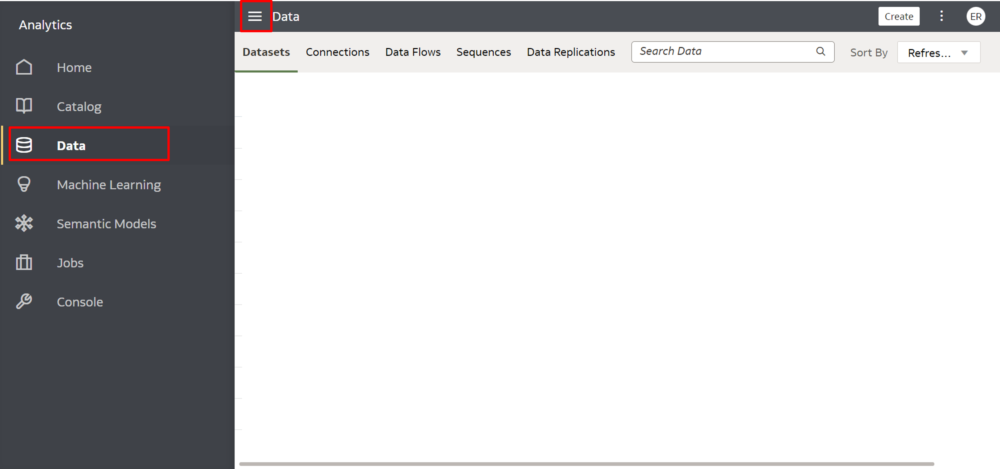

Todavía en esta pestaña, puede verificar **Conexiones**, como usuario de Oracle Analytics con permiso de autor de contenido de DV, puede conectarse a las fuentes de datos utilizadas por su organización:

Los flujos de datos le permiten organizar e integrar sus datos para producir conjuntos de datos que sus usuarios puedan visualizar.

Por ejemplo, puede usar un flujo de datos para:

* Crear un conjunto de datos.
* Combinar datos de diferentes fuentes.
* Entrene modelos de aprendizaje automático o aplique un modelo de aprendizaje automático a sus datos.
A la derecha de **Conexiones**, puede acceder a **Flujos de datos** haciendo clic en él.

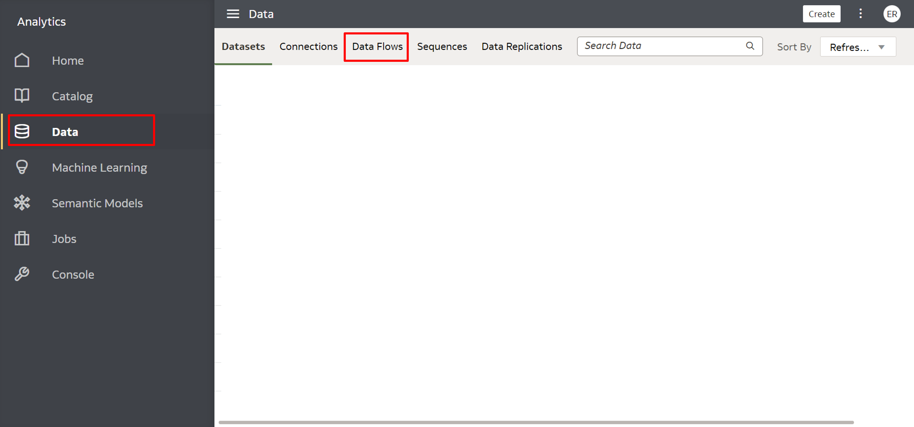

A continuación, tendremos **Secuencias**.
Una secuencia se define como una colección de flujos de datos que se ejecutan juntos. Son útiles cuando desea ejecutar varios flujos de datos como una sola transacción.

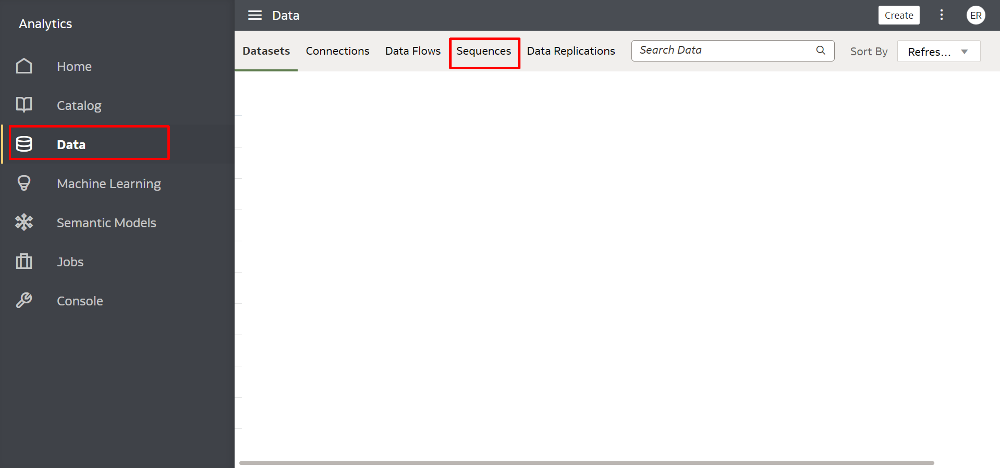

Finalmente, **Replicaciones de datos**.
Úselo para copiar datos de una fuente para análisis en Oracle Analytics Cloud.

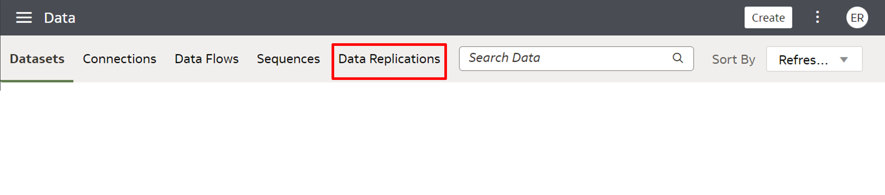

4. Oracle Analytics le permite registrar y utilizar modelos de aprendizaje automático de Oracle desde Oracle Database u Oracle Autonomous Data Warehouse, vuelva una vez más al **Menú de hamburguesas** y haga clic en **Aprendizaje automático** para acceder a una lista de usuarios registrados. plantillas y guiones:

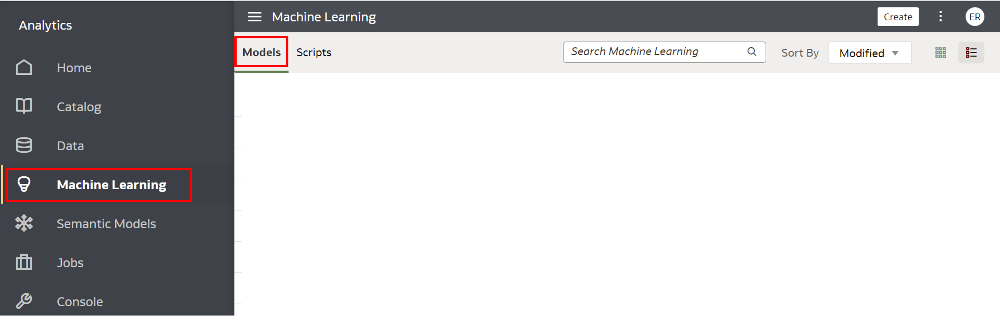

El modelo de datos semánticos es un enfoque que se basa en principios semánticos que dan como resultado un conjunto de datos con estructuras de datos inherentemente especificadas.

5. Nuevamente, haga clic en **Menú Hambuger**, en **Aprendizaje automático**, haga clic en **Modelos semánticos** para acceder a una lista de modelos y scripts registrados:

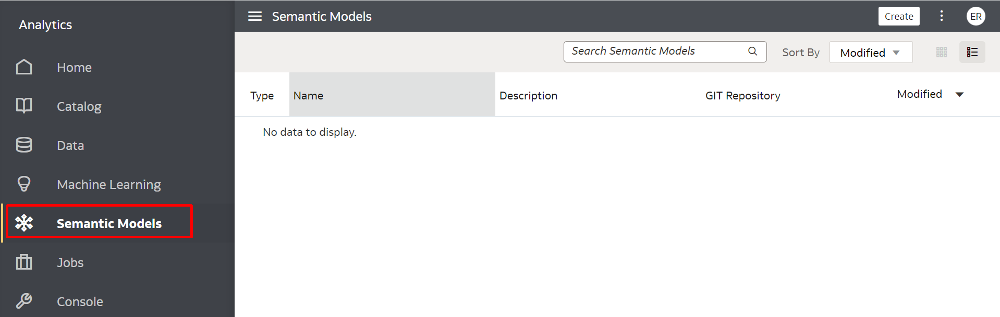

6. Para realizar un seguimiento del estado de sus trabajos y administrarlos, siga navegando por el **Menú de hamburguesas** y haga clic en **Empleos**. Puede monitorear la cantidad de trabajos filtrados por **Tipo de objeto** y su **Estado**.

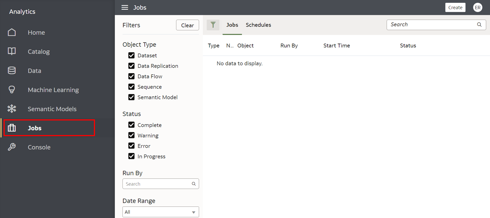

7. Cuando haga clic en **Consola**, a través del **Menú Hamburguesa**, encontrará opciones para administrar los permisos de usuario, configurar varios aspectos de Oracle Analytics Cloud y realizar otras tareas administrativas.

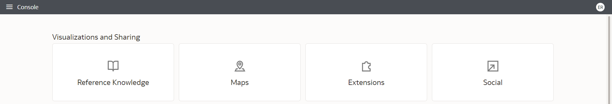
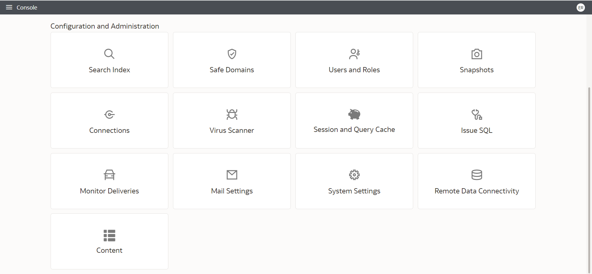

## Tarea 3: Opciones de identificación

1. Para acceder al Centro de Ayuda, edite su perfil, cambie su contraseña o inicie sesión, verifique la versión actual de OAC o cierre sesión en su cuenta, simplemente haga clic en el círculo con las iniciales de su credencial.

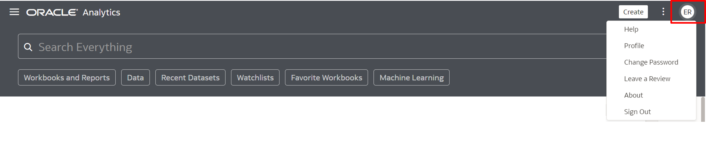

## Tarea 4: Barra de búsqueda

1. A través de la **Barra de Búsqueda** en tu Página de Inicio, puedes buscar todos los temas aquí presentados y todas las funcionalidades que existen dentro de OAC, desde las opciones dentro del **Menú Hamburguesa** hasta funciones de **Crear **.

## Tarea 5: Prueba tu conexión
Para este Taller, creó una conexión en el laboratorio **Requisitos previos: Aprovisionamiento de los recursos necesarios para el laboratorio**.
Para asegurarse de que su conexión esté activa y funcionando, visualícela a través de la lista de conexiones.
Esta lista contiene las conexiones que ha creado y las conexiones a las que puede acceder y usar para crear conjuntos de datos.
Hay algunas maneras de verificar esto:

1. Desde el Menú Hamburguesa en la página de inicio, haga clic en **Datos** y luego en la pestaña **Conexiones** para acceder a la lista. Si la conexión se realizó correctamente, podrá visualizarla, así como sus detalles.

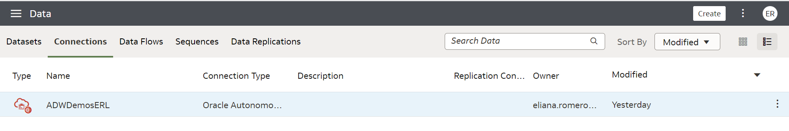

Al colocar el mouse sobre la conexión, al final de esta línea, verá tres pequeños puntos a su derecha. Haz clic en él y luego en **Inspeccionar**.

Verá todos los detalles de su conexión.

¡Listo!

Puede **pasar al siguiente laboratorio**.

## Autoría

- **Autores** - Guilherme Galhardo, Thais Henrique, Isabella Alvarez, Breno Comin, Isabelle Dias
- **Traducción** - Eliana Romero
- **Última actualización por/fecha** - Eliana Romero, Agosto/2023