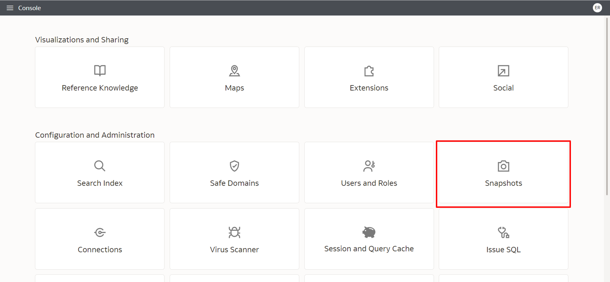
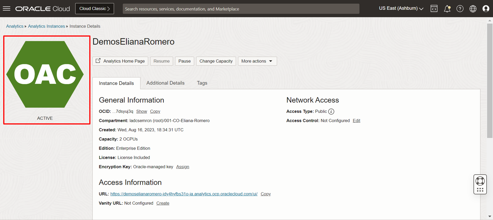

# Actividades administrativas

## Introducción

En este laboratorio aprenderá cómo administrar la solución Oracle Analytics Cloud.

*Esta Lab solo puede ser realizada por usuarios que tengan el perfil de Administrador dentro de Oracle Analytics Cloud. Este no es el caso para los usuarios de Fast Track, por lo tanto, es un Lab opcional para los usuarios que tienen la solución.*

*Tiempo estimado para el Laboratorio:* 30 Minutos

### Objetivos

* Crear copias de seguridad del entorno.
* Definir tipo de acceso de usuario
* Personalizar una URL de acceso a la solución personalizada

## Tarea 1: Copia de seguridad del entorno con instantáneas

1. En la página de inicio, haga clic en la hamburguesa en el lado izquierdo, luego haga clic en **"Consola"**.

2. Busque el botón **"Instantáneas"** y haga clic en él.

3. Haga clic en **"Crear instantánea"**, agregue el nombre del archivo de copia de seguridad de su elección, en este tutorial estamos usando **"Backup"**, en el contenido elija la opción **"Todo"** y haga clic en **"Crear"**.

4. Espere unos segundos hasta que finalice el procesamiento, luego haga clic en los 3 puntos y haga clic en **"Exportar"**.

5. Elija la opción **"Sistema de archivos local"**, agregue una contraseña y confirme esta contraseña, haga clic en **"Exportar"**.

El archivo se descargará a la máquina local, pero si es necesario, se podría descargar a un entorno Data Lake (Object Storage), para eso, en el paso 5, simplemente elija la opción **"Oracle Cloud Storage"** en lugar de **"Sistema de archivos local"** y agregue los detalles de acceso al almacenamiento de objetos.

## Tarea 2: Administración de usuarios a través de roles de aplicación

En esta tarea, gestionaremos el tipo de acceso de los usuarios dentro de Oracle Analytics Cloud.

1. En la página de inicio, haga clic en la hamburguesa en el lado izquierdo, luego haga clic en **"Consola"**.

2. Busque el botón **"Usuarios y Roles"** y haga clic en él.

3. Haga clic en **"Roles de aplicación"**, elija en qué rol agregará usuarios, en este ejemplo, agregaremos la opción **"DVConsumer"**, luego simplemente haga clic en la opción.

4. Para agregar usuarios al grupo deseado, simplemente haga clic en la opción **"Usuarios"** y luego en **"Agregar Usuarios"**.

5. En el campo de búsqueda, escriba el nombre del usuario deseado seguido de un asterisco (*), presione Enter en el teclado, seleccione el usuario elegido y haga clic en **"Agregar"**.

Para entender con más detalle cuáles son los roles y sus permisos, basta con consultar la documentación: https://docs.oracle.com/en/cloud/paas/analytics-cloud/acabi/application-roles.html

## Tarea 3: Personalizar la URL para acceder a Oracle Analytics Cloud (Opcional)

En esta Tarea personalizaremos la URL de acceso a Oracle Analytics Cloud. Sin embargo, en este caso es necesario disponer de un certificado X.509 con extensión .pem, .cer o .crt para que sea posible utilizar el dominio deseado en la url.

1. En la consola inicial de Oracle Cloud Infrastructure, dentro de la pantalla de Oracle Analytics Cloud, después de URL personalizada, haga clic en **"Crear"**.

2. En la nueva pantalla, ingrese el nombre de host deseado para la URL, incluya el certificado X.509 con el dominio que se utilizará, incluya una clave privada en formato .pem o .key y haga clic en **"Criar"**.

3. La instancia se actualizará, por lo que no estará disponible durante unos minutos y luego volverá a estar disponible cuando el símbolo OAC vuelva a ponerse verde.

¡Felicitaciones, ha terminado este laboratorio!
Puede **pasar al siguiente laboratorio**.

## Conclusión

En esta sesión, aprendió cómo realizar tareas de administración de Oracle Analytics Cloud, desde definir permisos de usuario, realizar copias de seguridad, personalizar la URL de acceso a la solución y verificar el rendimiento del uso de la solución.

## Autoría

- **Autores** - Guilherme Galhardo, Thais Henrique, Isabella Alvarez, Breno Comin, Isabelle Dias
- **Traducción** - Eliana Romero 
- **Última actualización por/fecha** - Eliana Romero, Agosto/2023