# Preparar un conjunto de datos

## Introducción

Después de conectarse a la base de datos y seleccionar las tablas, en este laboratorio aprenderá cómo preparar su conjunto de datos en Oracle Analytics Cloud, trayendo datos externos, enriqueciendo el análisis y realizando transformaciones preliminares para crear gráficos y visualizaciones.


*Tiempo estimado para el Laboratorio:* 45 Minutos

### Objetivos
* Complementar los datos con archivos externos
* Configurar geolocalizaciones en datos
* Ajustar columnas para nuestros análisis
* Crear nuevos campos a partir de cálculos

## Tarea 1: Traer un archivo .xlsx externo

1. Descargue el archivo de Excel requerido para este laboratorio desde [este enlace](https://objectstorage.us-ashburn-1.oraclecloud.com/p/FJncZNPkxolcQm8cSIBG3_BAK_XkDnnGBS3ok7ifwDUPBtbYn7C4BTtyu_JpptuW/n/idy4hyfbs31o/b/Bucket-Fast-Track/o/Tabla_Clientes.xlsx)

2. Abra el conjunto de datos **DATA_EMPRESA**, que acaba de crear. Se puede encontrar en la página de inicio de Analytics, como se muestra en la imagen a continuación.

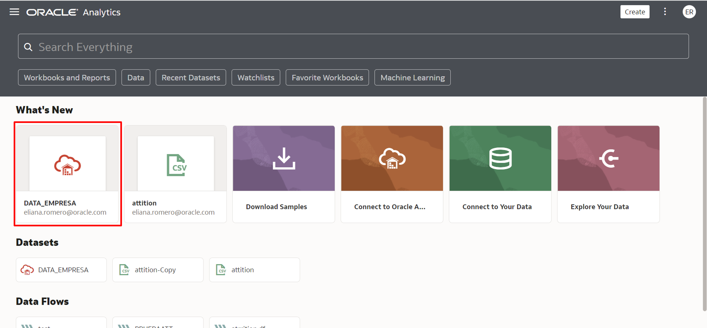

3. Una vez en el lienzo de creación de la visualización, haga clic en el botón **'+'** (que se encuentra en el lado derecho de la pantalla, junto a las fuentes de datos) y seleccione **Agregar datos...**

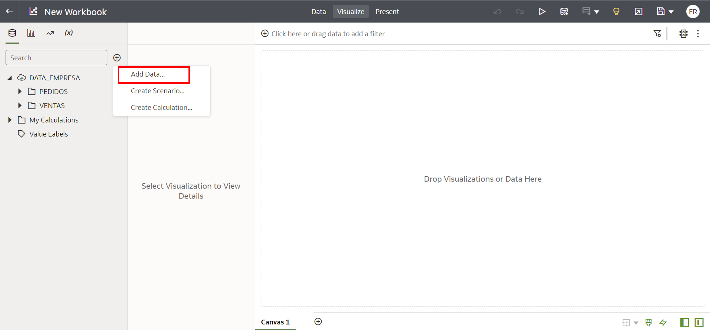

3. Haga clic en **Crear conjunto de datos**. Tenga en cuenta que al hacerlo se creará una nueva pestaña en su navegador. Realizaremos los pasos 4 a 7 en él y luego volveremos a la pestaña original en la que estábamos trabajando.


4. Arrastre el archivo **Tabla de Clientes.xlsx** a la ventana que se abrió o haga clic en el icono indicado e indique la ubicación del archivo en su computadora.

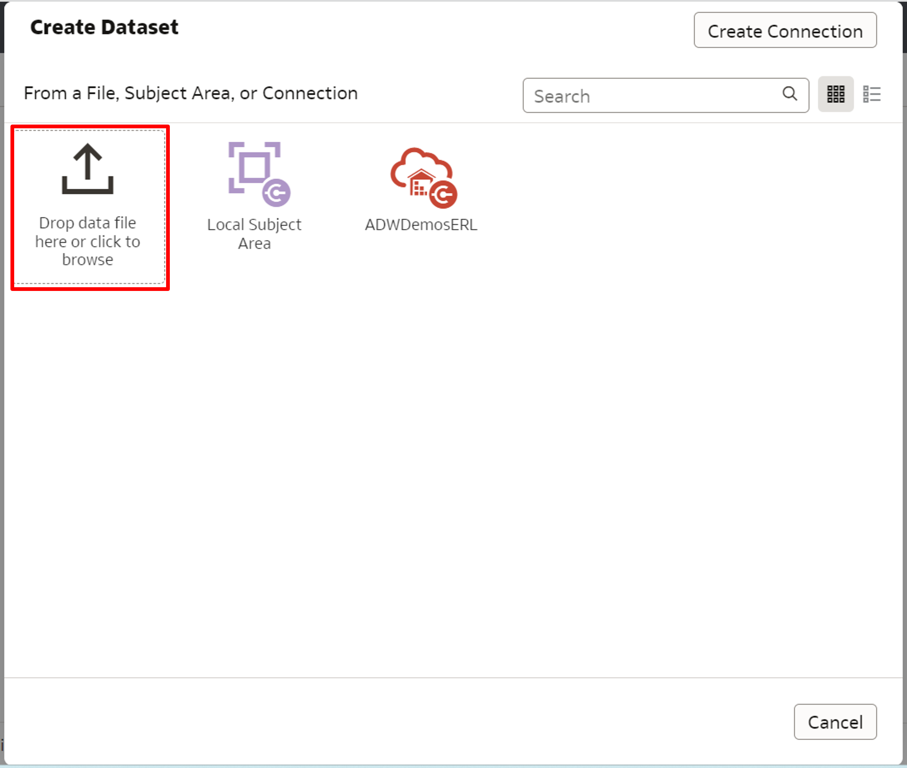

5. Analytics cargará y procesará su archivo, brindando una vista previa de qué columnas están presentes en él. En este paso no es necesario realizar ningún cambio. Haga clic en Aceptar**.


6. **Guarde** su progreso a través del icono del disquete y **nombre** su nuevo conjunto de datos.
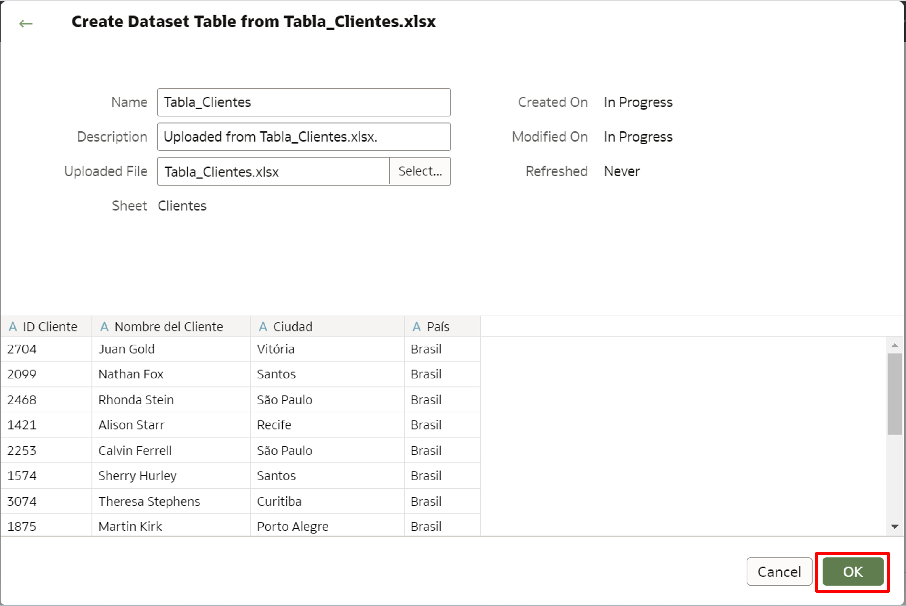


7. Asegúrese de guardar el nuevo conjunto de datos y **cierre la pestaña en la que estamos trabajando** (que se creó en el paso 3). Regrese a la pestaña anterior y verá que el conjunto de datos recién creado ya está en evidencia. Selecciónelo y haga clic en **Agregar al libro de trabajo**


8. Ahora tenemos los datos de Excel disponibles en nuestro proyecto, pero la barra horizontal entre los conjuntos de datos indica que no hay unión entre la base de datos y los datos de Excel, lo que nos impide cruzarlos. Para resolver esto, vaya a la pestaña **Datos**.


9. Mueva el mouse sobre la región entre las dos fuentes de datos y verá una línea discontinua que conecta las dos, con el valor 0. **Haga clic en esta conexión**.


10. Seleccione **Agregar otra coincidencia**.


11. Relacionar los dos archivos usando la clave común entre ellos (Client ID & CLIENT ID). Después de hacerlo, haga clic en el botón **Aceptar**.


12. Ahora debería ver que el número 1 ha aparecido entre las bases. Esto indica que se unen mediante un Join que tiene en cuenta una columna en cada base.


13. Vuelve a la pestaña **Ver** y valida que la barra horizontal entre conjuntos de datos haya desaparecido. Si es así, entonces esta tarea está lista. No olvides guardar tu proyecto para no perder tu progreso.


## Tarea 2: Configurar ubicaciones en el conjunto de datos

En nuestra segunda tarea, configuraremos las columnas que hacen referencia a ubicaciones geográficas para que traigan información más detallada y puedan ser utilizadas en la construcción de nuestros mapas más adelante.

1. Navegue a la pestaña **Datos** y seleccione el botón para **Editar** el archivo de **Clientes**, que acabamos de cargar.

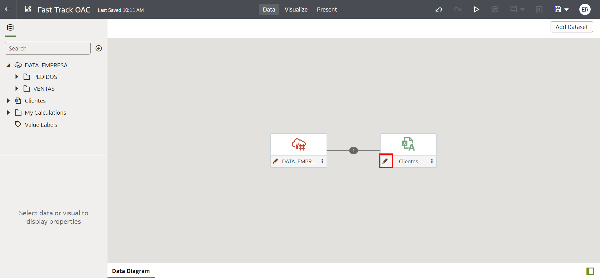

2. Todas las columnas están correctamente identificadas como Atributos, por lo que no es necesario ningún cambio al respecto. Seleccione la columna **Ciudad** y observe que en el lado derecho hay una serie de sugerencias para mejorarla. Haga clic en la opción **Enriquecer ciudad con provincia**.


3. Analytics usará sus bibliotecas internas para traer el estado de cada una de las ciudades indicadas, creando una nueva columna llamada Ciudad_Province.En la columna Ciudad_Provincia, haga clic en los tres puntos y selige la opción **Renombrar...**
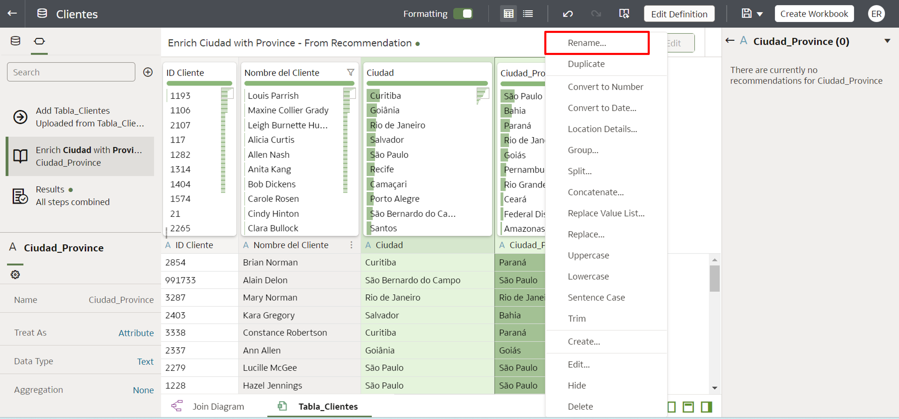


5. Nombre esta columna **Estado** y guarde este cambio. También es posible cambiar el nombre de una columna **haciendo doble clic** en su nombre y escribiendo el nuevo nombre deseado para ella.
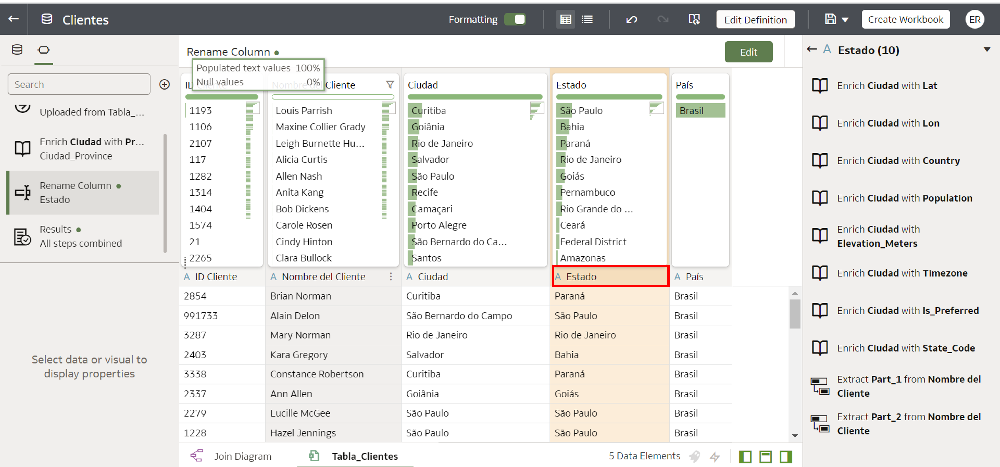


6. Seleccione la columna **Ciudad** una vez más y ahora haga clic en las recomendaciones **Enriquecer ciudad con latitud y longitud**. Cámbieles el nombre a **Latitud y Longitud**.
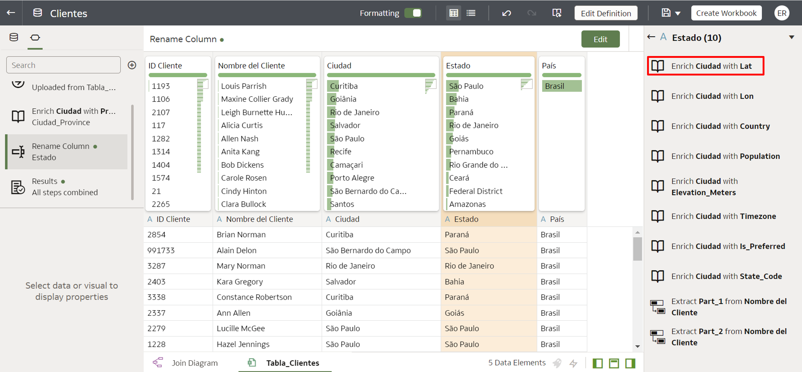


7. Haga clic en los tres puntos en las nuevas columnas (Latitud y Longitud) y seleccione **Detalles de ubicación...**
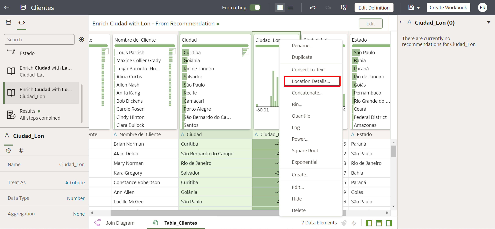


8. Elija el **Tipo de ubicación** adecuado y haga clic en **Aceptar**


9. Valide que las nuevas columnas estén identificadas como ubicaciones.


10. Seleccione la columna **Ciudad** una vez más y ahora haga clic en la recomendación **Enriquecer ciudad con población**.


11. Valide que se haya creado la columna **Población de la ciudad**. Si esto sucedió correctamente, la segunda tarea se completó con éxito.
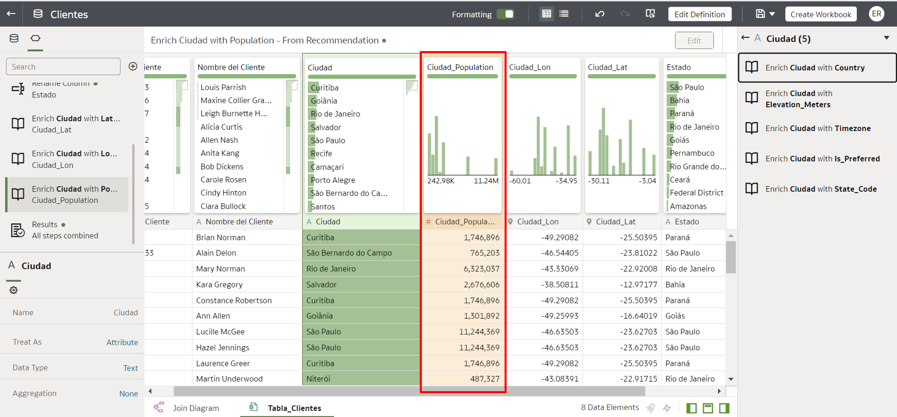

## Tarea 3: Realizar cambios en las columnas

Ahora haremos algunos ajustes más que simplificarán la forma en que vamos a interactuar con los datos al crear nuestro tablero.

1. En la pestaña **Datos**, haga clic en el botón para editar los datos de conexión de la base de datos.

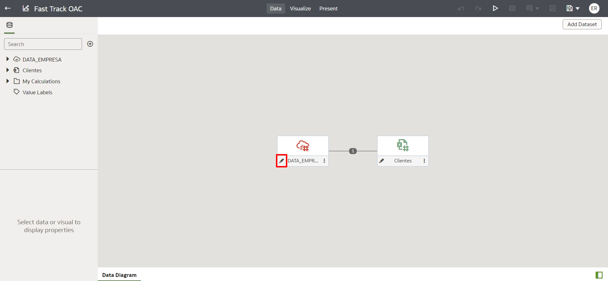

2. Realizaremos una agrupación utilizando la interfaz de Analytics. Cambie la pestaña inferior a la tabla **VENTAS**, seleccione la columna **EMBALAJE DEL PRODUCTO**, haga clic en los tres puntos y elija la opción **Grupo**.

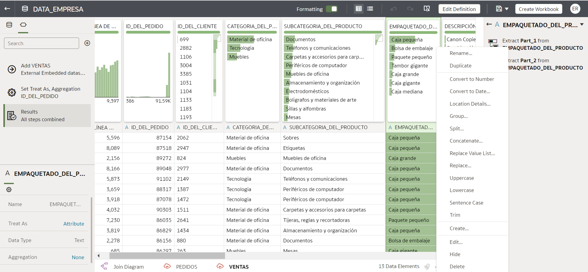

6. Crea dos categorías:
   - Empaque Grande: tendrá en su interior los valores Big Box, Jumbo Box y Jumbo Value;
   - Empaque Pequeño: contendrá los valores Caja Mediana, Caja Pequeña, Paquete Pequeño y Bolsa Empaque.
   Después de crear los grupos, asegúrese de nombrar **Tipos de empaque** para la nueva columna que se creará y haga clic en **Agregar paso**.

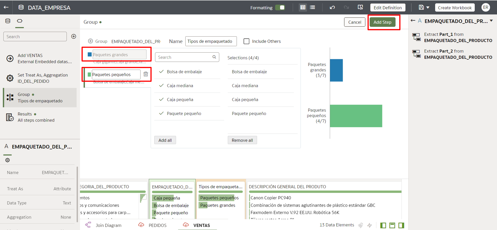

7. Para el próximo cambio, crearemos un campo que se originará a partir de una regla escrita en la capa de preparación del OAC. Todavía en la pestaña VENTAS, seleccione la columna GANANCIAS, haga clic en los tres puntos y seleccione **Crear**. Esto hará que creemos una nueva columna a partir de la columna Beneficio.


8. Nombre la nueva columna **Ganancias/Pérdidas** y escriba el código a continuación:
```
CASO CUANDO GANANCIA >= 0 ENTONCES 'Ganancia' DE LO CONTRARIO 'Pérdida' FIN
```
No olvide asignar la columna Beneficio (solo el texto no se referirá a ella).
Haga clic en **Agregar paso** para guardar este paso. Reproduzca el proceso en el GIF a continuación para asegurarse de que el proceso sea un éxito.


¡Felicitaciones, ha terminado este laboratorio!
Puede **pasar al siguiente laboratorio**.

## Conclusión

En esta sesión aprendiste a preparar un Dataset en Oracle Analytics Cloud, realizando una serie de transformaciones de datos y complementándolas con información externa disponible en un archivo excel.

## Autoría

- **Autores** - Thais Henrique, Isabela Alvarez, Breno Comin, Isabelle Dias e Guilherme Galhardo
- **Traducción** - Eliana Romero
- **Última actualización por/fecha** - Eliana Romero, Agosto/2023