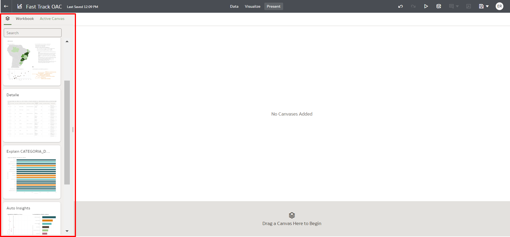
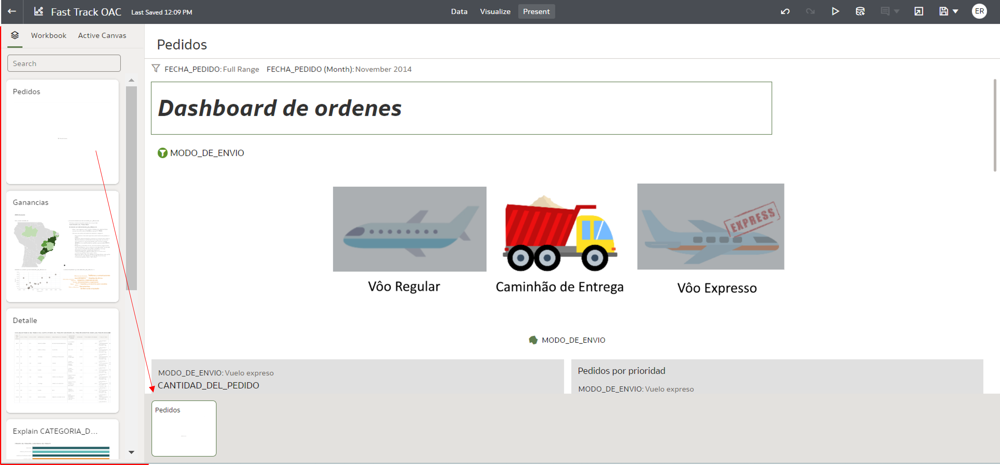
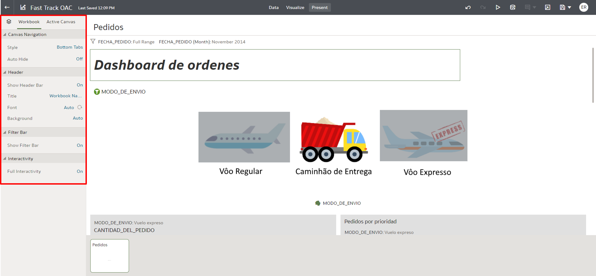
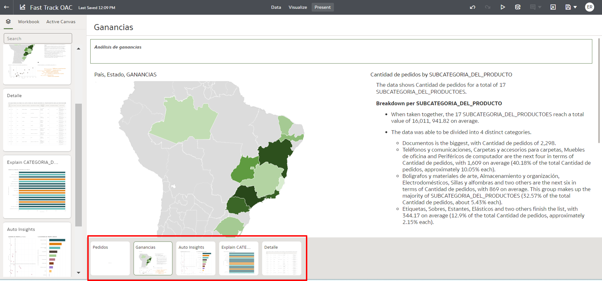
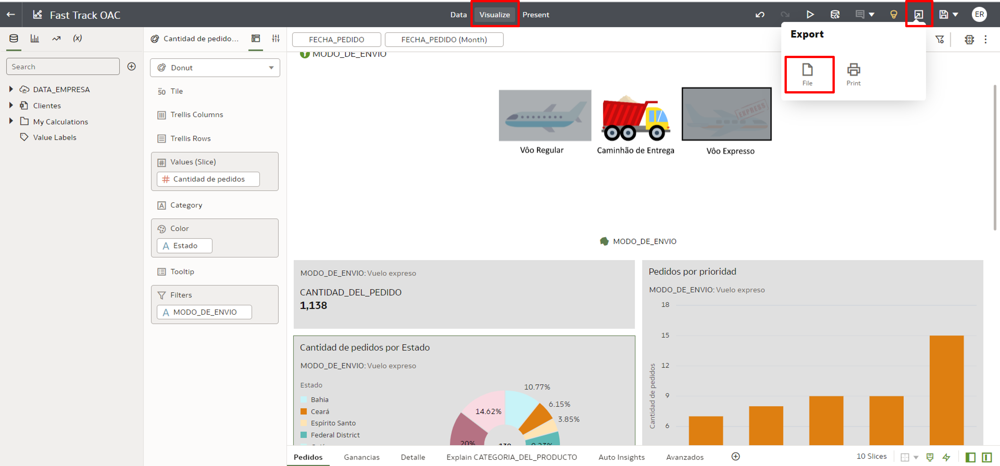

# Mostrar y exportar paneles

## Introducción

En este Lab aprenderás a utilizar el modo de presentación de Oracle Analytics Cloud y aprenderás a exportar tus tableros, eligiendo entre los formatos que ofrece la herramienta.

*Tiempo estimado de laboratorio:* 15 minutos

### Objetivos
* Configurar el modo de presentación
* Ocultar gráfico en modo presentación
* Exportar el tablero en PDF y DVA (formato nativo OAC)

## Tarea 1: Presentar paneles

El último paso en la construcción de nuestras visualizaciones es configurar el modo de presentación, definiendo cómo cada Pantalla estará disponible para el usuario que solo consumirá los paneles y no realizará ningún cambio.

Oracle Analytics Cloud proporciona un área dedicada para este paso, en la pestaña Presentar:

En esta pestaña verás todas las pantallas creadas en modo edición (en la pestaña Visualizar) y podrás elegir cuáles presentarás e incluso definir el orden.

Comencemos a crear nuestra presentación.

1. Seleccione la pantalla Órdenes y arrastre hasta la parte inferior de la pantalla.

Verás la vista previa de la pantalla elegida y verás que ahora estarán disponibles las opciones de configuración de presentación para esa pantalla.

Tendremos diferentes opciones en cada pestaña, desde definir cuáles de los gráficos serán visibles hasta el estilo de navegación entre pantallas

2. Explora todas las pestañas y familiarízate con ellas.

Ahora que está familiarizado con las opciones de configuración de la presentación, agreguemos más pantallas a nuestra presentación.

3. Agregue las pantallas: **Beneficio, Auto Insights, Avanzado y Detalle**

Una de las opciones que tenemos a la hora de editar la presentación es la posibilidad de elegir cuál de los gráficos presentes en una pantalla permanecerá visible. En nuestra pantalla de "Beneficio" tenemos un gráfico en Lenguaje Natural que no tendrá sentido en nuestra presentación porque el formato del texto no es el más adecuado durante una presentación ya que el propio presentador puede hablar de estos detalles más descriptivos.

Eliminemos el cuadro "Descripción # Pedidos por subcategoría de producto" de nuestra presentación.

> **Nota:** Ocultar un gráfico en la pestaña "Presente" no afecta el gráfico original. Puedes verlo normalmente en la pestaña "Ver".

4. Seleccione la pantalla "Beneficio" y haga clic en la pestaña Configuración. Ubique la sección "Imágenes", luego haga clic en el gráfico que queremos ocultar de nuestra presentación: **"Descripción # Pedidos por subcategoría de producto"**.

Listo, el gráfico ya no será visible en nuestra presentación.

Ahora cambiemos la forma en que se mostrarán las pantallas durante nuestra presentación. Podemos cambiar el estilo del Story Browser y elegir entre estas 4 opciones: **Pestañas inferiores (predeterminado)**, **Barra de navegación**, **Tira de película** o **Ninguna**

5. En la parte inferior derecha, accederemos a la pestaña “Presentación”. Localice la opción "Navegador de historias", haga clic en la opción actual "Pestañas inferiores" y cámbiela a "Barra de navegación".

La opción "Barra de navegación" agrega puntos que representan cada una de sus pantallas. Es muy discreto y muy útil para mantener la presentación enfocada en la pantalla actual.

Guardemos nuestras modificaciones y visualicemos cómo quedó nuestra presentación.

6. Haga clic en el ícono del disquete en la esquina superior derecha para guardar y después del mensaje de confirmación haga clic en el ícono **Reproducir**.

Mirar:
*La Barra de Navegación indicada abajo en la imagen
* El gráfico del lenguaje natural permaneció oculto

Ahora explore las otras pantallas a través de la barra de navegación.

## Tarea 2: Exportar paneles

Oracle Analytics Cloud (OAC) ofrece algunas opciones para exportar nuestros Dashboards o un gráfico específico. Tenemos la posibilidad de exportar el archivo, imprimirlo e incluso [enviarlo por correo electrónico*](https://docs.oracle.com/en/cloud/paas/analytics-cloud/acabi/send-email-reports-and-track-deliveries.html#GUID-C5815E71-9348-4C13-BAB6-B5B0C887B3D6).

Para exportar el archivo tenemos diferentes formatos disponibles: PowerPoint(pptx), Acrobat(pdf), Imagen(png) y Paquete(dva) formato nativo OAC.

Exportemos nuestro panel en PDF para compartirlo más fácilmente con usuarios que no tienen acceso a OAC.

1. En la pestaña Ver, haga clic en el botón "Exportar" en la esquina superior derecha de la pantalla y seleccione la opción "Archivo".

2. Complete los campos con la información a continuación y luego haga clic en **Guardar**.

*Nombre:* Análisis empresa
*Moldea:* Acrobat (pdf)
*Incluye:* Todas las pantallas
*Tamaño:* A4 (210 mm x 297 mm)
*Orientación:* Paisaje

Aparecerá una ventana mostrando el procesamiento de gráficos y podrás seguir el proceso a través de ella.

Cuando finalice el procesamiento, se iniciará la descarga automática del archivo, simplemente verifique las opciones de descarga de su navegador.

El resultado final debería ser similar al siguiente:

Ahora exportemos nuestro panel en formato .DVA, que es el formato nativo de Oracle Analytics Cloud (OAC). Como este tipo de archivo, puede importar el panel en otras instancias de OAc o mantener este archivo guardado como copia de seguridad.

3. Vaya a "Exportar" y seleccione "Archivo".

4. Esta vez cambiaremos el formato de exportación a Paquete (dva) y será necesario agregar una contraseña para la exportación. (Esta contraseña será necesaria si va a importar el archivo)

*Nombre:* OAC de vía rápida
*Formato:* Paquete (dva)
*Incluir datos* - MANTENER HABILITADO
*Incluir credenciales de conexión* - DESACTIVAR
*Proteger Contraseña:* Ingrese una contraseña

Aparecerá una ventana mostrando el proceso de exportación.

Cuando finalice el procesamiento, se iniciará la descarga automática del archivo, simplemente verifique las opciones de descarga de su navegador y busque un archivo con la extensión **.dva**.

Puede usar el archivo que acaba de descargar con todos los gráficos y configuraciones que realizó en los datos para importarlos a cualquier instancia de OAC sin tener que rehacer todo el proceso.

¡Felicitaciones, ha terminado este laboratorio!
Puede **pasar al siguiente laboratorio**.

## Sepa mas

[Configurar la entrega de paneles por correo electrónico](https://docs.oracle.com/en/cloud/paas/analytics-cloud/acabi/set-email-server-deliver-reports.html).

[Programar el envío automático de paneles por correo electrónico](https://docs.oracle.com/en/cloud/paas/analytics-cloud/acabi/send-email-reports-and-track-deliveries.html#GUID-49732584-010B-444F-84C6-37FABF533642).

[Importar un archivo DVA](https://docs.oracle.com/en/middleware/bi/analytics-desktop/bidvd/import-workbook-file.html).

## Conclusión

En esta sesión, aprendió a configurar el modo de presentación y a exportar sus paneles en dos formatos de archivo diferentes, PDF y DVA.

## Autoría

- **Autores** - Guilherme Galhardo, Thais Henrique, Isabella Alvarez, Breno Comin, Isabelle Dias
- **Traducción** - Eliana Romero 
- **Última actualización por/fecha** - Eliana Romero, Agosto/2023