# Criar Dashboards - Avançado

## Introdução

Neste Lab você vai dar um passo a mais no desenvolvimento de suas análises utilizando funcionalidades avançadas que o Oracle Analytics Cloud (OAC) oferece para você para enriquecer ainda mais seus insights.

[Oracle Video Hub video scaled to Large size](videohub:1_6oeev9ax:large)

*Tempo estimado para o Lab:* 25 Minutos

### Objetivos
* Aprender a adicionar estatísticas em seu gráficos
* Aprender a criar regras de formatação condicional
* Aprender a adicionar filtros no seu dashboard
* Aprender a criar "Ações de dados"
* Aprender a utilizar imagens como filtros para seu dados

## Tarefa 1: Adicionar Estatísticas no Dashboard

O Oracle Analytics Cloud (OAC) te oferece uma forma muito simples de adicionar estatísticas em seus gráficos. Os tipos disponíveis são: *Clusters, Outliers, Linha de Referência, Linha de Tendência, Previsão (Forecast)*

1. Crie uma nova tela no seu arquivo de trabalho clicando no sinal de **+** na parte inferior da tela.

2. Em seguida vamos renomear essa tela, clique no triangulo ao lado do nome da tela e clique em renomear.

3. Digite o nome **"Avançado"** e clique no sinal de check para confirmar.

4. Segure a tecla Control (CTRL) e selecione os campos **Vendas** e **Data do pedido (Mês)** dentro da tabela "Vendas", arraste e solte no centro da tela.

Você vai notar que um gráfico de Linha será criado automaticamente. Aqui nós iremos criar uma previsão de vendas para os próximos 3 meses.

5. Clique com o botão direito do mouse no gráfico, em seguida selecione **"Adicionar Estatísticas"** e selecione **"Previsão"**.

Após alguns segundo você a previsão de vendas para os próximos 3 meses adicionada ao seu gráfico. A previsão é a área em cinza claro.

Agora nos vamos adicionar um a Linha de Referência no mesmo gráfico que criamos a previsão.

6. Clique com o botão direito do mouse no gráfico, em seguida selecione **"Adicionar Estatísticas"** e selecione **"Linha de Referência"**.

Após alguns segundo você verá a Linha de Referência em seu gráfico

> **Note:** Como mostrado nos passos anteriores podemos combinar mais de um tipo de estatística em um mesmo gráfico.

*DESAFIO:* Crie mais um gráfico com as informações de Vendas por Data do Pedido (Mês) e adicione a estatística de **"Outliers"** nesse gráfico para você identificar os valores que estão fora do padrão de vendas

Esse deve ser seu resultado final:

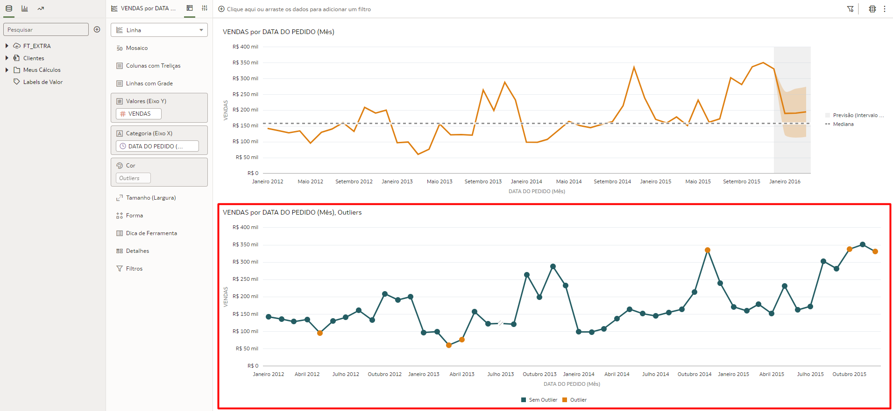

## Tarefa 2: Formatação Condicional

Use a Formatação Condicional para destacar dados importantes em suas visualizações para que você possa tomar melhores decisões.

1. Na aba de Tipos de Gráfico, clique a arraste o tipo "Tabela Dinâmica" e solte na parte inferior da tela quando uma barra verde aparecer.

2. Segurando o Control (CTRL) selecione os campos: **Vendas**, **Data do Pedido (Mês)** e **Categoria do Produto**, em seguida arraste os 3 campos para o gráfico de tabela dinâmica que você adicionou no dashboard no passo anterior.

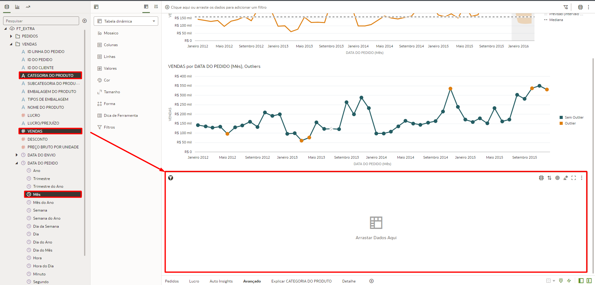

3. Verifique se o campo "Categoria do Produto" está em baixo do campo "Data do Pedido (Mês)" na área de linhas da Tabela Dinâmica.

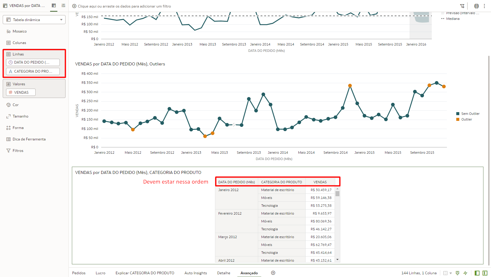

4. Clique com o botão direito do mouse sobre a tabela dinâmica, selecione "Formatação Condicional" e clique em "Manage Rules".

5. Dê o nome *"Vendas por Periodo"* para a nova regra e em seguida selecione "Vendas" no campo Medida.

Agora vamos adicionar cores especificas de acordo com a variação do valor de vendas:

6. Preencha os campos de acordo com as informações abaixo e clique em salvar

* ***VENDAS >  60.000 - Cor: Verde Escuro***
* ***VENDAS <= 60.000 - Cor: Verde Claro***
* ***VENDAS <  40.000 - Cor: Amarelo***
* ***VENDAS <  35.000 - Cor: Vermelho***

Você vai notar que cada valor de venda possui uma cor associada e dessa forma você consegue visualizar as informações de forma mais agradável e facilmente identificar informações como, por exemplo, os valores em vermelho que indicam valores de vendas abaixo do esperado.

## Tarefa 3: Adicionar Filtros

Temos algumas formas de adicionar filtros no Oracle Analytics Cloud. Nessa tarefa vamos adicionar filtros através da barra de filtros e vamos aprender a tornar esse filtro disponível em todas as telas do nosso Dashboard.

A barra de filtro fica na parte superior da tela, todos os filtros criados ficaram disponíveis nesse local.

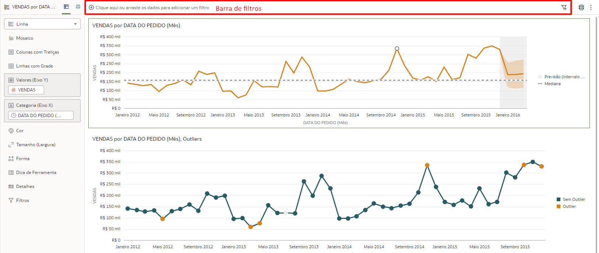

1. Clique no sinal de + na barra de filtro e selecione o campo "DATA DO PEDIDO" na tabela de Vendas.

2. Clique novamente no sinal de + e agora selecione o campo "EMBALAGEM DO PRODUTO" na tabela de Vendas.

Você pode adicionar os filtros de acordo com suas necessidade de analisar as informações nessa tela.

Agora vamos tornar o filtro visível e aplicado em todas as Telas do seu Arquivo de Trabalho.

3. Descanse o cursor do mouse sobre o filtro "DATA DO PEDIDO" até que você veja o ícone de "fixar" ser destacado e clique sobre ele.

Você pode navegar para qualquer aba do seu Dashboard e o filtro "DATA DO PEDIDO" estará fixado.

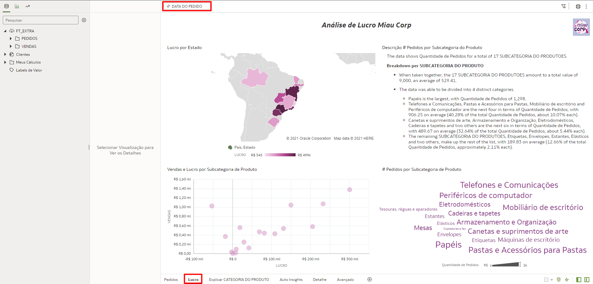

## Tarefa 4: Ações de Dados (Data Actions)

Você pode usar Ações de Dados (Data Actions) para se conectar a outras telas no OAC e aplicar o dado selecionado como filtro, URLs externas, relatórios do Oracle Analytics Publisher e usar em contêineres externos.

Vamos utilizar as Ações de Dados para analisar mais profundamente os dados de vendas onde a localização é "Bahia".

1. Clique nos 3 pontinho na parte superior direita da tela e selecione "Ações de Dados"

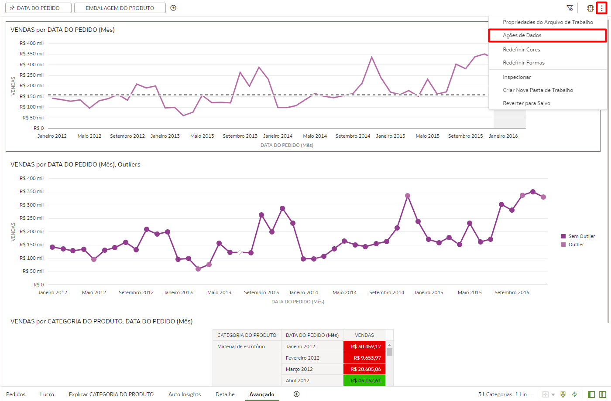

2. Em seguida clique no sinal de + para criar uma nova Ações de Dados

3. Preencha os campos com as informações abaixo e depois clique em **OK**:

**Nome:** *Detalhes*
**Tipo:** *Link de Análise*
**Destino:** *Esta Pasta de Trabalho*
**Link para Tela:** *Detalhe*
**Informar valores:** *Tudo*
**Suportar Várias Seleções:** *Ativado*

Agora toda vez que você clicar com o botão direito do mouse sobre algum dado que você queria explorar mais (em seu Dashboard atual) você verá a Ações de Dados que acabamos de criar pronta para ser usada.

5. Clique com o botão direito sobre o ponto referente a **Novembro de 2014** no gráfico "Vendas por Data do Pedido (Mês), Outliers", localize a Ações de Dados "Detalhes" que acabamos de criar e clique nela.

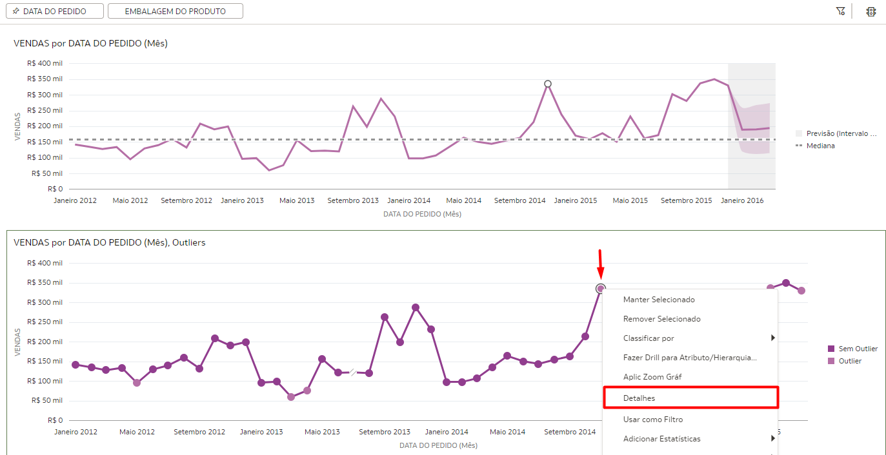

Você será direcionado para a Tela **Detalhe** onde você poderá facilmente explorar outras informações associadas ao ponto "Novembro de 2014" que havíamos selecionado anteriormente. Tudo isso porque a "Ações de Dados" além de ter te redirecionado para essa nova tela também criou um filtro com o parâmetro "Novembro 2014" já selecionado

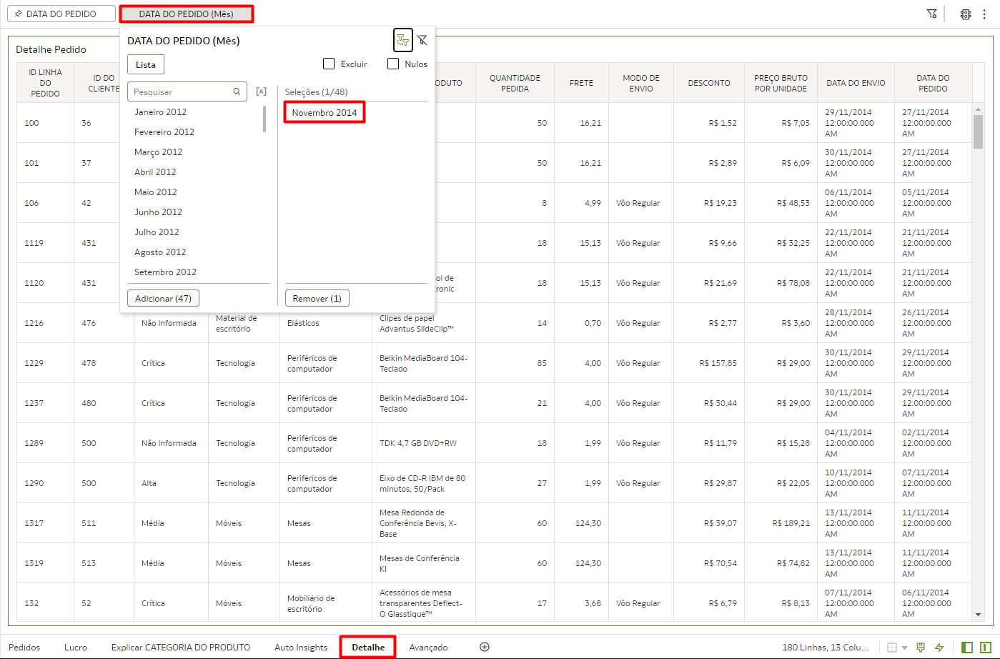

Esse deve ser o seu resultado final:

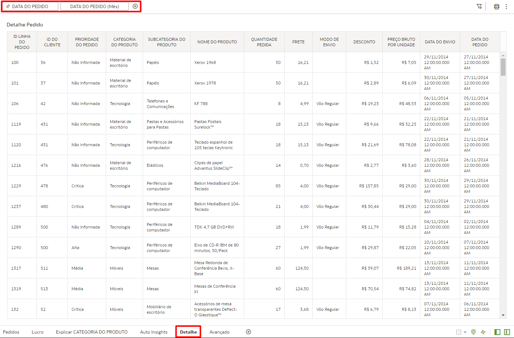

## Tarefa 5: Utilizar Imagens como Filtro (Opcional)

Existe um outra maneira de se criar filtros no Oracle Analytics Cloud (OAC): ***Criar Filtros através de Imagens***

> **Nota:** É necessário ter a permissão: BI Service Administrator para executar essa tarefa.

1. Faça download desse imagem: [Imagem para criar o Filtro](https://objectstorage.us-ashburn-1.oraclecloud.com/p/k4myBTiFdp22kJ_7rJw6kbZa7YLfqrh8nKVzPnrnn-dOAZuxKIB8RKDWTYAmt8eU/n/id3kyspkytmr/b/bucket-fast-track/o/ModoEnviocomTexto.png).

2. Clique no Menu do lateral superior esquerda e acesse **"Console"**.

3. Acesse a opção "Mapas".

4. Clique na aba "Planos de Fundo", expanda a opção "Planos de Fundo de Imagem" e clique em **"Adicionar Imagem"**.

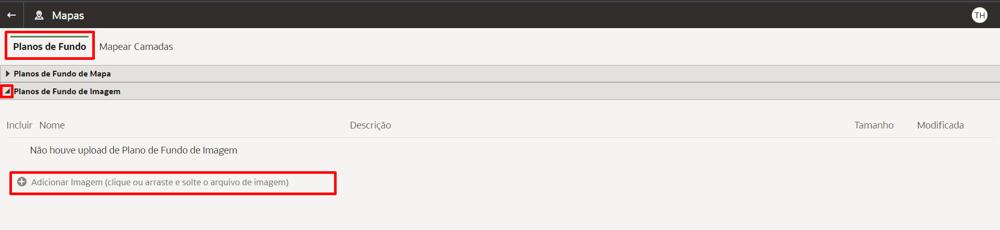

5. Localize a imagem que você acabou de fazer o upload, clique nos 3 pontinhos do lado esquerdo da linha e clique em **"Inspecionar"**

6. Preencha os campos com as informações abaixo e clique em **Salvar**:

**Nome:** *Modos de Envio*
**Descrição:** *Imagem representando os modos de envio disponíveis*

6. Localize a imagem que você acabou de fazer o upload, clique nos 3 pontinhos do lado esquerdo da linha e clique em **"Criar Camada de Mapas"**

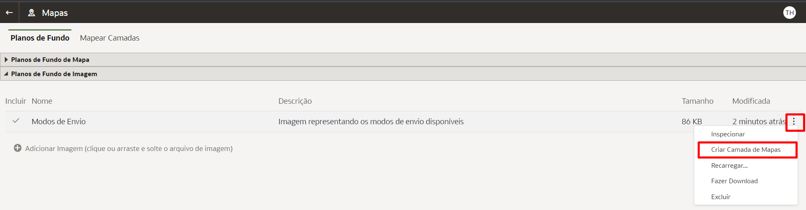

Agora será necessário mapear as áreas de imagem e vincular cada mapeamento a cada termos usado para os modos de envio disponíveis em nossos dados.

7. Selecione o tipo de desenho para "Retângulo". Faça 1 quadrado em volta da imagem do Avião (Voô Regular) e escreva o termo "Vôo Regular"

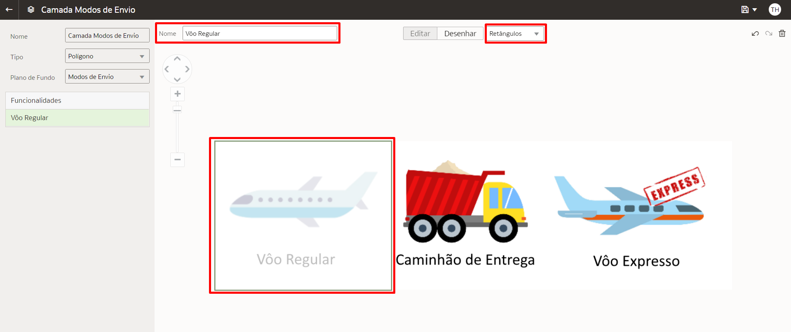

8. Faça 1 quadrado em volta da imagem do caminhão (Caminhão de Entrega) e escreva o termo "Caminhão de Entrega"

9. Faça 1 quadrado em volta da imagem do Avião (Voô Regular) e escreva o termo "Vôo Expresso"

10.  Quando toda imagem estiver mapeada clique em salvar (Ícone de disquete no canto superior direito da tela).

Volte para seu "Arquivo de Trabalho" para adicionar o imagem mapeada para ela atuar como filtro. No nosso exemplo vamos adicionar a imagem a uma das tela do projeto atual da Miau Corp.

11. Navegue até a aba de Tipos de Gráficos, localize o gráfico de Mapa e arraste ele até a parte superior do seu canvas. (Abaixo do Campo de Texto)

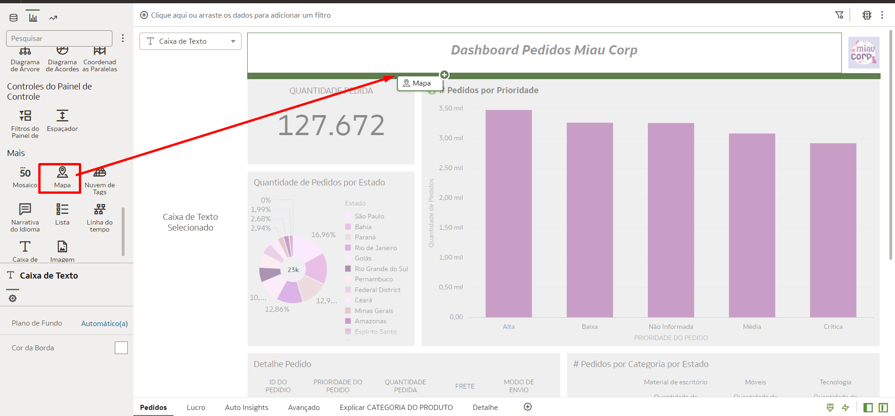

12. Em seguida adicione o campo "MODO DE ENVIO" que está na tabela "Pedidos".

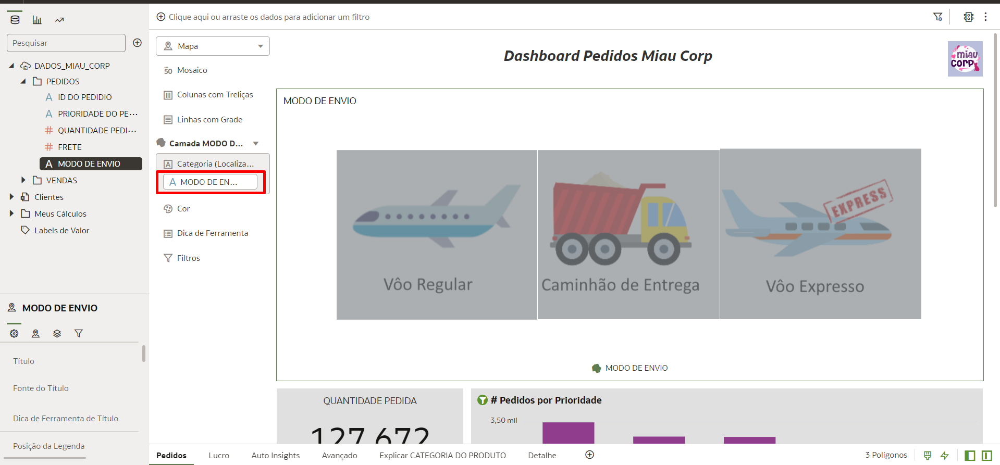

Você verá a imagem que mapeamos anteriormente. Agora vamos utilizar a imagem com um filtro dentro dessa tela do nosso dashboard.

13. Descanse o cursor do mouse sobre o nome do gráfica até um ícone de funil aparecer na tela e clique sobre ele.

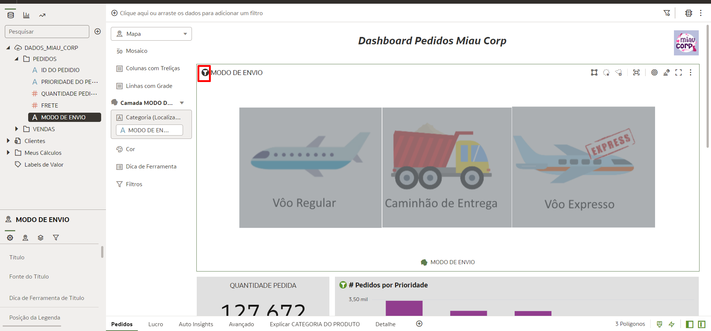

Pronto! Toda vez que você quiser ver seus dados de vendas com base no método de envio basta clicar sobre a área correspondente na imagem.

Parabéns, você terminou esse laboratório!
Você pode **seguir para o próximo Lab**.

## Conclusão

Nesta sessão você aprendeu a utilizar recursos avançados para criação de Dashboards no Oracle Analytics Cloud (OAC)

## Autoria

- **Autores** - Thais Henrique, Isabella Alvarez, Breno Comin, Isabelle Dias, Guilherme Galhardo
- **Último Update Por/Date** - Guilherme Galhardo, Mar/2023